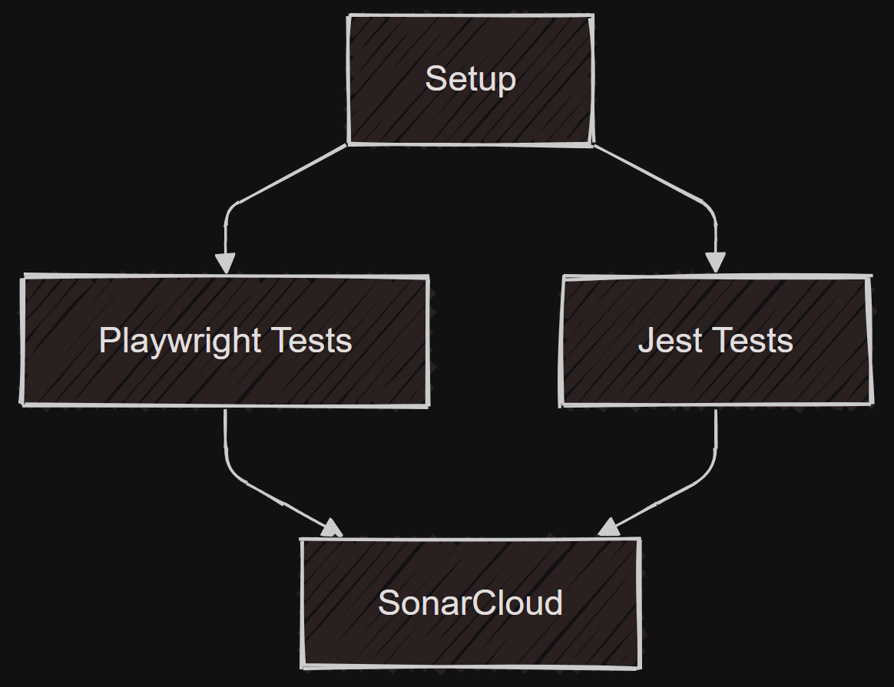

# Continuous Integration Tests Documentation

This document provides detailed information about our CI testing pipeline implemented in GitHub Actions.

## Overview

Our testing pipeline consists of four main jobs that run in parallel where possible:
1. Setup Environment
2. Playwright Tests (E2E)
   - Creates "🎭 E2E Test Results" comment
3. Jest Tests (Unit/Integration)
   - Creates "🃏 Unit Test Results" comment
4. SonarCloud Analysis

## Job Dependencies

The diagram above shows how our CI jobs depend on each other:
- Both test jobs (Playwright and Jest) depend on the Setup job
- Each test job creates its own results comment
- SonarCloud analysis runs only after both test jobs complete
- Test jobs run in parallel to optimize pipeline execution time

## Detailed Job Descriptions

### 1. Setup Environment
- **Purpose**: Prepares the environment for all subsequent jobs
- **Key Actions**:
  - Checks out code
  - Sets up Node.js
  - Installs dependencies
  - Caches dependencies for faster subsequent runs
- **Outputs**: Cached `node_modules` and Playwright browser binaries

### 2. Playwright Tests (E2E)
- **Purpose**: Runs end-to-end tests using Playwright
- **Dependencies**: Setup job
- **Environment**:
  - PostgreSQL service container
  - Node.js runtime
- **Key Actions**:
  - Sets up test database
  - Runs migrations
  - Executes E2E tests
  - Generates test reports
- **Artifacts**:
  - Test results in `playwright-report/`
  - Test traces (on failure) in `test-results/`

### 3. Jest Tests
- **Purpose**: Runs unit and integration tests
- **Dependencies**: Setup job
- **Key Actions**:
  - Executes Jest test suite
  - Generates coverage reports
  - Reports results to PR
- **Artifacts**:
  - Coverage reports in `coverage/`
  - Test results in `jest-results.json`

### 4. SonarCloud Analysis
- **Purpose**: Code quality and security analysis
- **Dependencies**: Both test jobs must complete
- **Key Actions**:
  - Analyzes code quality
  - Processes test coverage
  - Reports results to SonarCloud dashboard

## Environment Variables

The pipeline uses several environment variables and secrets:
- **Authentication**: `NEXTAUTH_SECRET`, `AUTHJS_*` tokens
- **Database**: `POSTGRES_*` configuration
- **CI/CD**: `GITHUB_TOKEN`, `SONAR_TOKEN`

## Test Results and Reporting

### Automated PR Comments
The CI pipeline automatically generates test result comments on pull requests. These comments include:

- A single, consolidated comment containing:
  - Playwright E2E test results
  - Jest unit/integration test results
- Each test type shows:
  - Number of passed/failed/skipped tests
  - Test duration
  - Detailed failure messages in collapsible sections
- The comment is recreated (not updated) on each test run to stay visible
- Failed tests show the full test path and detailed error messages

### Test Results Location
Test results are stored in:
- Playwright: `playwright-report/` or `test-results/`
- Jest: `jest-results.json`

### Viewing Results
1. **In Pull Requests**:
   - Look for the most recent "🚀 Test Results" comment
   - Each test type has its own section
   - Failed tests include expandable details

2. **In GitHub Actions**:
   - Navigate to the workflow run
   - Check the "Artifacts" section for detailed reports

## Troubleshooting

### Common Issues

1. **Database Connection Failures**
   - Check PostgreSQL service configuration
   - Verify database credentials in secrets

2. **Test Timeouts**
   - Review test logs for slow operations
   - Check for resource constraints

3. **Cache Misses**
   - Verify yarn.lock hasn't changed
   - Check cache key construction

### Debug Steps

1. **For Playwright Issues**:
   - Check test traces in artifacts
   - Review browser console logs
   - Verify database migrations

2. **For Jest Issues**:
   - Review test output JSON
   - Check coverage reports
   - Verify test environment

## Best Practices

1. **Writing Tests**:
   - Keep E2E tests focused on critical paths
   - Maintain unit test coverage
   - Use appropriate test selectors

2. **Pipeline Maintenance**:
   - Regularly update action versions
   - Monitor test execution times
   - Review and clean up artifacts

## Contributing

When modifying the CI pipeline:
1. Test changes in a feature branch
2. Review workflow run times
3. Verify all artifacts are generated
4. Update this documentation

## Additional Resources

- [GitHub Actions Documentation](https://docs.github.com/en/actions)
- [Playwright Documentation](https://playwright.dev)
- [Jest Documentation](https://jestjs.io)
- [SonarCloud Documentation](https://sonarcloud.io/documentation)