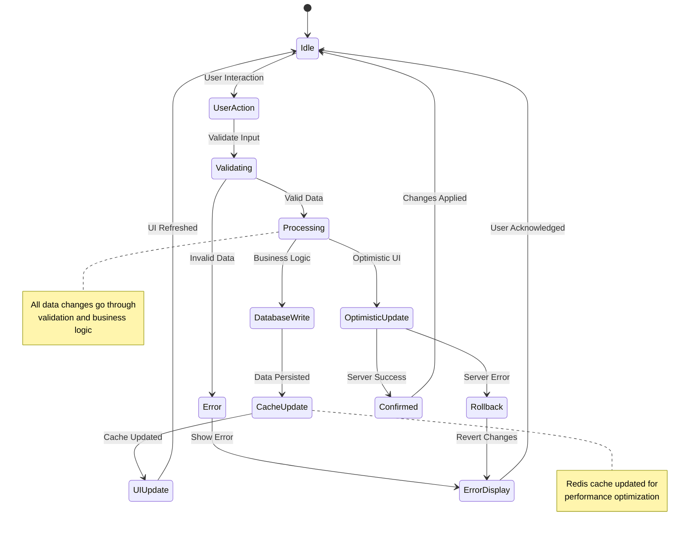
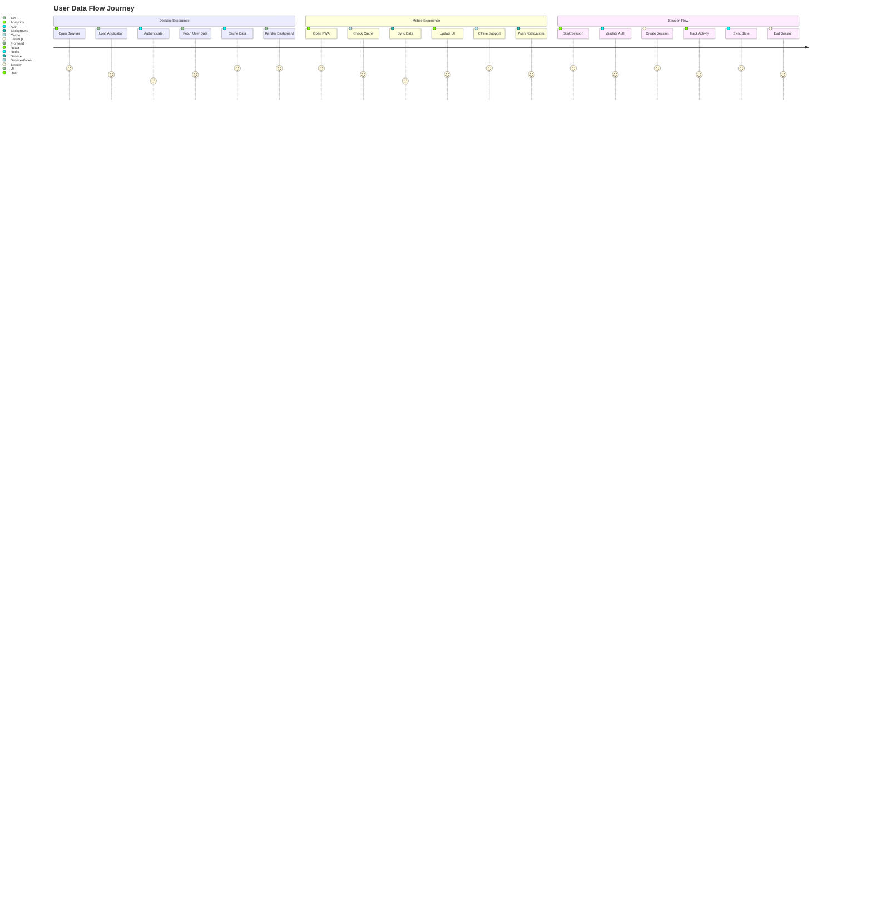

# 🌊 Data Flow Architecture

This diagram shows the comprehensive data flow patterns in Idling.app, illustrating how data moves through the application layers from user interactions to database storage and back.

## 🔄 **Complete Application Data Flow**

```mermaid
flowchart TD
    subgraph "👤 User Layer"
        U1[🖥️ Desktop Browser]
        U2[📱 Mobile Browser]
        U3[🔄 PWA Client]
    end

    subgraph "🌐 Frontend Layer"
        F1[⚛️ React Components]
        F2[🎣 Custom Hooks]
        F3[🔄 State Management]
        F4[📡 API Client]
    end

    subgraph "🔗 API Layer"
        A1[🌐 Next.js API Routes]
        A2[🛡️ Middleware Chain]
        A3[🔑 Authentication]
        A4[📊 Request Validation]
    end

    subgraph "🏢 Business Logic"
        B1[👤 User Service]
        B2[🎮 Session Service]
        B3[😊 Emoji Service]
        B4[🔔 Notification Service]
    end

    subgraph "💾 Data Layer"
        D1[🐘 PostgreSQL]
        D2[⚡ Redis Cache]
        D3[📁 File Storage]
        D4[📊 Analytics Store]
    end

    U1 --> F1
    U2 --> F1
    U3 --> F1

    F1 --> F2
    F2 --> F3
    F3 --> F4
    F4 --> A1

    A1 --> A2
    A2 --> A3
    A3 --> A4
    A4 --> B1
    A4 --> B2
    A4 --> B3
    A4 --> B4

    B1 --> D1
    B2 --> D1
    B3 --> D1
    B4 --> D1

    B1 --> D2
    B2 --> D2
    B3 --> D2

    B3 --> D3
    B4 --> D4

    D1 --> B1
    D2 --> B1
    D3 --> B3
    D4 --> B4

    B1 --> A4
    B2 --> A4
    B3 --> A4
    B4 --> A4

    A4 --> F4
    F4 --> F3
    F3 --> F2
    F2 --> F1

    style U1 fill:#e3f2fd
    style F1 fill:#c8e6c9
    style A1 fill:#fff3e0
    style B1 fill:#f3e5f5
    style D1 fill:#ffcdd2
```

## 🎮 **Session Management Data Flow**

```mermaid
sequenceDiagram
    participant User as 👤 User
    participant UI as 🖥️ Frontend
    participant API as 🌐 API Route
    participant Auth as 🔑 Auth Service
    participant Session as 🎮 Session Service
    participant DB as 🗄️ Database
    participant Cache as ⚡ Redis

    User->>UI: Start Session
    UI->>API: POST /api/sessions/create
    API->>Auth: Validate Token
    Auth->>Cache: Check Session
    Cache->>Auth: Session Data
    Auth->>API: User Validated

    API->>Session: Create Session
    Session->>DB: INSERT session
    DB->>Session: Session ID
    Session->>Cache: Cache Session
    Session->>API: Session Created

    API->>UI: 201 Created
    UI->>User: Session Started

    Note over User,Cache: Session Active Loop
    loop Every 30 seconds
        UI->>API: POST /api/sessions/heartbeat
        API->>Session: Update Activity
        Session->>Cache: Update Timestamp
        Cache->>Session: Confirmed
        Session->>API: Heartbeat OK
        API->>UI: 200 OK
    end

    User->>UI: End Session
    UI->>API: POST /api/sessions/end
    API->>Session: End Session
    Session->>DB: UPDATE session
    Session->>Cache: Clear Cache
    Session->>API: Session Ended
    API->>UI: 200 OK
    UI->>User: Session Ended
```

## 😊 **Emoji System Data Flow**

```mermaid
flowchart TB
    subgraph "🎯 User Interaction"
        U1[👤 User Selects Emoji]
        U2[⭐ Add to Favorites]
        U3[🔍 Search Emojis]
        U4[📂 Browse Categories]
    end

    subgraph "🖥️ Frontend Processing"
        F1[🎨 Emoji Picker Component]
        F2[🔍 Search Hook]
        F3[⭐ Favorites Hook]
        F4[📂 Categories Hook]
    end

    subgraph "📡 API Layer"
        A1[📍 /api/emojis/categories]
        A2[📍 /api/emojis/search]
        A3[📍 /api/emojis/favorites]
        A4[📍 /api/emojis/usage]
    end

    subgraph "🏢 Business Logic"
        B1[😊 Emoji Service]
        B2[🔍 Search Service]
        B3[⭐ Favorites Service]
        B4[📊 Usage Analytics]
    end

    subgraph "💾 Data Storage"
        D1[🗄️ emoji_categories]
        D2[🗄️ emojis]
        D3[🗄️ user_emoji_favorites]
        D4[🗄️ emoji_usage_stats]
        D5[⚡ Redis Cache]
    end

    U1 --> F1
    U2 --> F3
    U3 --> F2
    U4 --> F4

    F1 --> A4
    F2 --> A2
    F3 --> A3
    F4 --> A1

    A1 --> B1
    A2 --> B2
    A3 --> B3
    A4 --> B4

    B1 --> D1
    B1 --> D2
    B1 --> D5

    B2 --> D2
    B2 --> D5

    B3 --> D3
    B3 --> D5

    B4 --> D4

    D1 --> B1
    D2 --> B1
    D3 --> B3
    D4 --> B4
    D5 --> B1
    D5 --> B2
    D5 --> B3

    B1 --> A1
    B2 --> A2
    B3 --> A3
    B4 --> A4

    A1 --> F4
    A2 --> F2
    A3 --> F3
    A4 --> F1

    style U1 fill:#e3f2fd
    style F1 fill:#c8e6c9
    style A1 fill:#fff3e0
    style B1 fill:#f3e5f5
    style D1 fill:#ffcdd2
```

## 🔑 **Authentication Data Flow**

```mermaid
flowchart LR
    subgraph "🌐 OAuth Providers"
        O1[🎮 Twitch OAuth]
        O2[🔍 Google OAuth]
    end

    subgraph "🔐 Authentication Flow"
        A1[🚀 OAuth Redirect]
        A2[🔑 Token Exchange]
        A3[👤 User Profile Fetch]
        A4[🎫 JWT Generation]
    end

    subgraph "🏢 User Management"
        U1[👤 User Creation/Update]
        U2[📋 Profile Validation]
        U3[🔄 Session Creation]
        U4[⚙️ Preferences Setup]
    end

    subgraph "💾 Data Persistence"
        D1[🗄️ users table]
        D2[🗄️ accounts table]
        D3[🗄️ sessions table]
        D4[🗄️ user_preferences]
        D5[⚡ Redis Session Cache]
    end

    O1 --> A1
    O2 --> A1

    A1 --> A2
    A2 --> A3
    A3 --> A4

    A4 --> U1
    U1 --> U2
    U2 --> U3
    U3 --> U4

    U1 --> D1
    U1 --> D2
    U3 --> D3
    U4 --> D4
    U3 --> D5

    D1 --> U1
    D2 --> U1
    D3 --> U3
    D4 --> U4
    D5 --> U3

    style O1 fill:#e3f2fd
    style A1 fill:#c8e6c9
    style U1 fill:#fff3e0
    style D1 fill:#f3e5f5
```

## 📊 **Real-time Data Synchronization**

## 🔄 **Data Caching Strategy**

```mermaid
flowchart TB
    subgraph "📡 Request Flow"
        R1[📥 Incoming Request]
        R2[🔍 Cache Check]
        R3[💾 Database Query]
        R4[📤 Response]
    end

    subgraph "⚡ Cache Layers"
        C1[🌐 Browser Cache]
        C2[🔄 Next.js Cache]
        C3[⚡ Redis Cache]
        C4[🗄️ Database Cache]
    end

    subgraph "📊 Cache Strategies"
        S1[🎯 Cache-First]
        S2[🔄 Stale-While-Revalidate]
        S3[⏰ Time-based Expiry]
        S4[🔄 Manual Invalidation]
    end

    subgraph "🗄️ Data Types"
        T1[👤 User Data]
        T2[😊 Emoji Data]
        T3[🎮 Session Data]
        T4[📊 Analytics Data]
    end

    R1 --> R2
    R2 --> C1
    R2 --> C2
    R2 --> C3
    R2 --> C4

    C1 --> S1
    C2 --> S2
    C3 --> S3
    C4 --> S4

    S1 --> T1
    S2 --> T2
    S3 --> T3
    S4 --> T4

    R2 --> R3
    R3 --> R4

    T1 --> R4
    T2 --> R4
    T3 --> R4
    T4 --> R4

    style R1 fill:#e3f2fd
    style C1 fill:#c8e6c9
    style S1 fill:#fff3e0
    style T1 fill:#f3e5f5
```

## 🚨 **Error Handling Data Flow**

```mermaid
flowchart TD
    subgraph "⚠️ Error Sources"
        E1[🌐 Network Errors]
        E2[🔑 Auth Errors]
        E3[📝 Validation Errors]
        E4[🗄️ Database Errors]
        E5[🏢 Business Logic Errors]
    end

    subgraph "🔍 Error Detection"
        D1[📡 API Layer]
        D2[🖥️ Frontend Layer]
        D3[🏢 Service Layer]
        D4[💾 Data Layer]
    end

    subgraph "📊 Error Processing"
        P1[🏷️ Error Classification]
        P2[📝 Error Logging]
        P3[📊 Error Analytics]
        P4[🔔 Error Notification]
    end

    subgraph "🎯 Error Resolution"
        R1[🔄 Retry Logic]
        R2[🔄 Fallback Strategies]
        R3[👤 User Notification]
        R4[🛠️ Recovery Actions]
    end

    E1 --> D1
    E2 --> D1
    E3 --> D2
    E4 --> D4
    E5 --> D3

    D1 --> P1
    D2 --> P1
    D3 --> P1
    D4 --> P1

    P1 --> P2
    P2 --> P3
    P3 --> P4

    P1 --> R1
    P1 --> R2
    P1 --> R3
    P1 --> R4

    R1 --> D1
    R2 --> D2
    R3 --> D2
    R4 --> D3

    style E1 fill:#ffcdd2
    style D1 fill:#fff3e0
    style P1 fill:#e3f2fd
    style R1 fill:#c8e6c9
```

## 📱 **Mobile vs Desktop Data Flow**

## 🔍 **Data Flow Analysis**

### **Data Movement Patterns**

- **Request/Response Cycle**: Standard HTTP request/response pattern with caching optimization
- **Real-time Updates**: WebSocket-like behavior through polling for session heartbeats
- **Optimistic Updates**: UI updates immediately with server confirmation
- **Cache Invalidation**: Strategic cache clearing on data mutations

### **Performance Optimizations**

- **Multi-layer Caching**: Browser → Next.js → Redis → Database
- **Data Prefetching**: Anticipatory loading of frequently accessed data
- **Lazy Loading**: Components and data loaded on demand
- **Connection Pooling**: Efficient database connection management

### **Data Consistency**

- **ACID Transactions**: Database operations maintain consistency
- **Cache Coherence**: Redis cache synchronized with database state
- **Eventual Consistency**: Some operations allow temporary inconsistency for performance
- **Conflict Resolution**: Last-write-wins strategy for concurrent updates

### **Security Considerations**

- **Data Validation**: All inputs validated at multiple layers
- **Access Control**: User permissions checked at service layer
- **Data Sanitization**: XSS and injection attack prevention
- **Audit Trail**: Complete logging of data modifications

### **Scalability Patterns**

- **Horizontal Scaling**: Database read replicas for query distribution
- **Vertical Scaling**: Resource scaling based on load patterns
- **Data Partitioning**: Logical separation of user data
- **Load Balancing**: Request distribution across multiple instances

This data flow architecture ensures efficient, secure, and scalable data movement throughout the Idling.app ecosystem with proper error handling and performance optimization.
