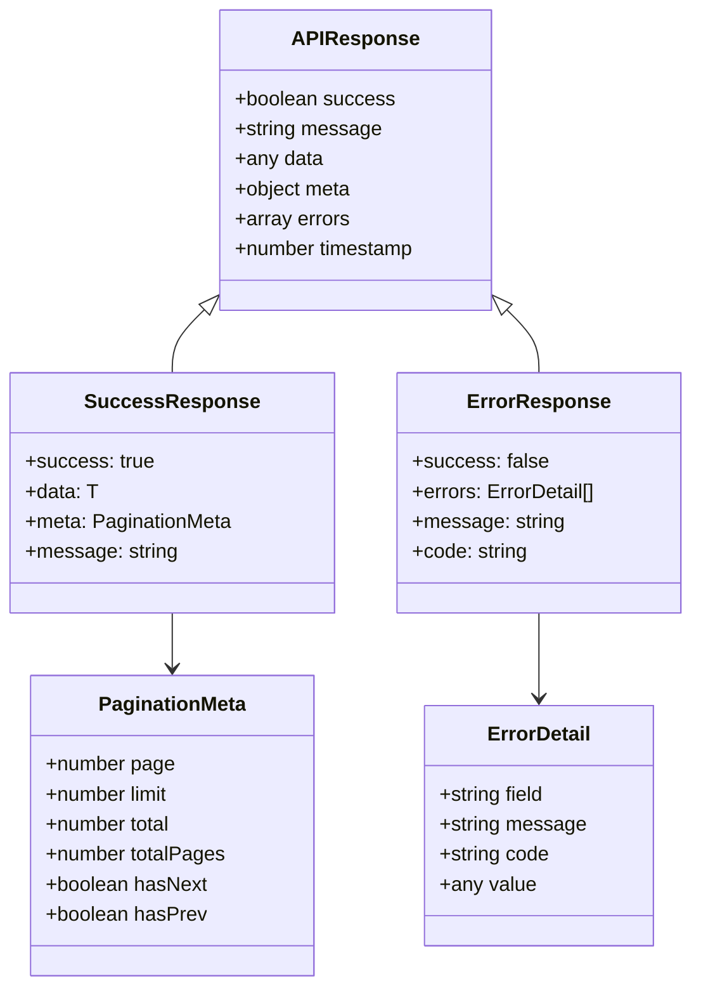

# 🌐 API Routes Architecture

This diagram shows the complete API architecture for Idling.app, including all REST endpoints, middleware layers, authentication, and data flow patterns.

## 🏗️ **API Architecture Overview**

```mermaid
flowchart TB
    subgraph "🌐 Client Layer"
        C1[🖥️ Web Browser]
        C2[📱 Mobile App]
        C3[🔧 Admin Dashboard]
        C4[🤖 External APIs]
    end

    subgraph "🛡️ Security Layer"
        S1[🔥 Rate Limiting]
        S2[🔑 Authentication]
        S3[🎭 Authorization]
        S4[🛡️ Input Validation]
        S5[📝 Audit Logging]
    end

    subgraph "🚀 API Gateway (Next.js)"
        G1[📍 Route Handler]
        G2[🔄 Middleware Chain]
        G3[📊 Request Processing]
        G4[🎯 Response Formatting]
    end

    subgraph "🏢 Business Logic Layer"
        B1[👤 User Service]
        B2[🎮 Session Service]
        B3[😊 Emoji Service]
        B4[📊 Analytics Service]
        B5[🔔 Notification Service]
    end

    subgraph "🗄️ Data Layer"
        D1[🐘 PostgreSQL]
        D2[⚡ Redis Cache]
        D3[📁 File Storage]
        D4[📈 Analytics DB]
    end

    C1 --> S1
    C2 --> S1
    C3 --> S1
    C4 --> S1

    S1 --> S2
    S2 --> S3
    S3 --> S4
    S4 --> S5
    S5 --> G1

    G1 --> G2
    G2 --> G3
    G3 --> G4
    G4 --> B1
    G4 --> B2
    G4 --> B3
    G4 --> B4
    G4 --> B5

    B1 --> D1
    B2 --> D1
    B3 --> D1
    B4 --> D4
    B5 --> D1

    B1 --> D2
    B2 --> D2
    B3 --> D2

    style C1 fill:#e3f2fd
    style S1 fill:#fff3e0
    style G1 fill:#c8e6c9
    style B1 fill:#f3e5f5
    style D1 fill:#e8f5e8
```

## 🗺️ **API Route Structure**

```mermaid
graph TB
    subgraph "🌐 /api Root"
        API["/api"]
    end

    subgraph "🔑 Authentication Routes"
        AUTH["/api/auth/*"]
        AUTH1["/api/auth/signin"]
        AUTH2["/api/auth/signout"]
        AUTH3["/api/auth/callback"]
        AUTH4["/api/auth/session"]
    end

    subgraph "👤 User Management"
        USER["/api/users"]
        USER1["/api/users/profile"]
        USER2["/api/users/preferences"]
        USER3["/api/users/[id]"]
        USER4["/api/users/[id]/sessions"]
        USER5["/api/users/[id]/activities"]
    end

    subgraph "🎮 Session Management"
        SESS["/api/sessions"]
        SESS1["/api/sessions/create"]
        SESS2["/api/sessions/[id]"]
        SESS3["/api/sessions/[id]/pause"]
        SESS4["/api/sessions/[id]/resume"]
        SESS5["/api/sessions/[id]/stop"]
        SESS6["/api/sessions/active"]
    end

    subgraph "😊 Emoji System"
        EMOJI["/api/emojis"]
        EMOJI1["/api/emojis/categories"]
        EMOJI2["/api/emojis/search"]
        EMOJI3["/api/emojis/favorites"]
        EMOJI4["/api/emojis/popular"]
        EMOJI5["/api/emojis/custom"]
    end

    subgraph "📊 Analytics & Reporting"
        ANALYTICS["/api/analytics"]
        ANALYTICS1["/api/analytics/dashboard"]
        ANALYTICS2["/api/analytics/usage"]
        ANALYTICS3["/api/analytics/reports"]
        ANALYTICS4["/api/analytics/export"]
    end

    subgraph "🔔 Notifications"
        NOTIF["/api/notifications"]
        NOTIF1["/api/notifications/list"]
        NOTIF2["/api/notifications/[id]/read"]
        NOTIF3["/api/notifications/mark-all-read"]
        NOTIF4["/api/notifications/settings"]
    end

    subgraph "🛠️ Admin Routes"
        ADMIN["/api/admin"]
        ADMIN1["/api/admin/users"]
        ADMIN2["/api/admin/system"]
        ADMIN3["/api/admin/analytics"]
        ADMIN4["/api/admin/settings"]
    end

    API --> AUTH
    API --> USER
    API --> SESS
    API --> EMOJI
    API --> ANALYTICS
    API --> NOTIF
    API --> ADMIN

    AUTH --> AUTH1
    AUTH --> AUTH2
    AUTH --> AUTH3
    AUTH --> AUTH4

    USER --> USER1
    USER --> USER2
    USER --> USER3
    USER --> USER4
    USER --> USER5

    SESS --> SESS1
    SESS --> SESS2
    SESS --> SESS3
    SESS --> SESS4
    SESS --> SESS5
    SESS --> SESS6

    EMOJI --> EMOJI1
    EMOJI --> EMOJI2
    EMOJI --> EMOJI3
    EMOJI --> EMOJI4
    EMOJI --> EMOJI5

    ANALYTICS --> ANALYTICS1
    ANALYTICS --> ANALYTICS2
    ANALYTICS --> ANALYTICS3
    ANALYTICS --> ANALYTICS4

    NOTIF --> NOTIF1
    NOTIF --> NOTIF2
    NOTIF --> NOTIF3
    NOTIF --> NOTIF4

    ADMIN --> ADMIN1
    ADMIN --> ADMIN2
    ADMIN --> ADMIN3
    ADMIN --> ADMIN4
```

## 🔄 **Request/Response Flow**

```mermaid
sequenceDiagram
    participant Client as 🖥️ Client
    participant Middleware as 🛡️ Middleware
    participant Handler as 🎯 Route Handler
    participant Service as 🏢 Business Service
    participant Cache as ⚡ Redis
    participant DB as 🗄️ Database

    Client->>Middleware: HTTP Request

    Note over Middleware: Security Checks
    Middleware->>Middleware: Rate Limiting
    Middleware->>Middleware: Authentication
    Middleware->>Middleware: Authorization
    Middleware->>Middleware: Input Validation

    Middleware->>Handler: Validated Request
    Handler->>Service: Business Logic Call

    Service->>Cache: Check Cache
    alt Cache Hit
        Cache->>Service: Cached Data
    else Cache Miss
        Service->>DB: Database Query
        DB->>Service: Query Result
        Service->>Cache: Store in Cache
    end

    Service->>Handler: Processed Data
    Handler->>Client: JSON Response

    Note over Handler: Response Processing
    Handler->>Handler: Format Response
    Handler->>Handler: Add Headers
    Handler->>Handler: Log Request
```

## 🛡️ **Middleware Chain**

```mermaid
flowchart LR
    A[📥 Incoming Request] --> B[🔥 Rate Limiter]
    B --> C[🔍 CORS Handler]
    C --> D[🔑 Auth Validator]
    D --> E[🎭 Permission Check]
    E --> F[🛡️ Input Sanitizer]
    F --> G[📝 Request Logger]
    G --> H[🎯 Route Handler]
    H --> I[📊 Response Formatter]
    I --> J[🔒 Security Headers]
    J --> K[📈 Metrics Collector]
    K --> L[📤 Response Sent]

    style A fill:#e3f2fd
    style B fill:#fff3e0
    style C fill:#fff3e0
    style D fill:#ffebee
    style E fill:#ffebee
    style F fill:#e8f5e8
    style G fill:#f3e5f5
    style H fill:#c8e6c9
    style I fill:#e1f5fe
    style J fill:#fff3e0
    style K fill:#f3e5f5
    style L fill:#c8e6c9
```

## 📊 **API Response Patterns**

## 🔐 **Authentication & Authorization Matrix**

```mermaid
graph TB
    subgraph "🔑 Authentication Levels"
        A1[🔓 Public]
        A2[🔒 Authenticated]
        A3[🔐 Admin Only]
        A4[🛡️ System Only]
    end

    subgraph "📍 Route Categories"
        R1[🏠 Public Routes]
        R2[👤 User Routes]
        R3[🎮 Session Routes]
        R4[😊 Emoji Routes]
        R5[📊 Analytics Routes]
        R6[🔔 Notification Routes]
        R7[🛠️ Admin Routes]
    end

    subgraph "🎭 HTTP Methods"
        M1[GET - Read]
        M2[POST - Create]
        M3[PUT - Update]
        M4[DELETE - Remove]
        M5[PATCH - Modify]
    end

    A1 --> R1
    A1 --> R4

    A2 --> R2
    A2 --> R3
    A2 --> R4
    A2 --> R6

    A3 --> R5
    A3 --> R7

    A4 --> R7

    R1 --> M1
    R2 --> M1
    R2 --> M2
    R2 --> M3
    R2 --> M5
    R3 --> M1
    R3 --> M2
    R3 --> M3
    R3 --> M4
    R4 --> M1
    R4 --> M2
    R4 --> M4
    R5 --> M1
    R6 --> M1
    R6 --> M3
    R7 --> M1
    R7 --> M2
    R7 --> M3
    R7 --> M4
    R7 --> M5

    style A1 fill:#c8e6c9
    style A2 fill:#fff3e0
    style A3 fill:#ffcdd2
    style A4 fill:#f3e5f5
```

## ⚡ **Performance & Caching Strategy**

```mermaid
flowchart TB
    subgraph "🚀 Performance Layers"
        P1[🌍 CDN Edge Cache]
        P2[🔄 API Gateway Cache]
        P3[⚡ Redis Application Cache]
        P4[🗄️ Database Query Cache]
    end

    subgraph "📊 Cache Strategies"
        S1[🕐 Time-based Expiry]
        S2[🔄 Cache Invalidation]
        S3[📈 Cache Warming]
        S4[🎯 Selective Caching]
    end

    subgraph "🎯 Cached Data Types"
        D1[👤 User Profiles]
        D2[😊 Emoji Categories]
        D3[📊 Analytics Data]
        D4[⚙️ System Settings]
        D5[🔔 Notification Templates]
    end

    P1 --> S1
    P2 --> S2
    P3 --> S3
    P4 --> S4

    S1 --> D1
    S2 --> D2
    S3 --> D3
    S4 --> D4
    S1 --> D5

    style P1 fill:#e3f2fd
    style P2 fill:#c8e6c9
    style P3 fill:#fff3e0
    style P4 fill:#f3e5f5
```

## 🔍 **API Architecture Analysis**

### **Route Organization**

- **RESTful Design**: Consistent REST patterns across all endpoints
- **Hierarchical Structure**: Logical grouping by feature domain
- **Version Management**: API versioning strategy for backward compatibility
- **Documentation**: OpenAPI/Swagger documentation for all endpoints

### **Security Implementation**

- **Authentication**: JWT-based authentication with refresh tokens
- **Authorization**: Role-based access control (RBAC)
- **Rate Limiting**: Configurable rate limits per endpoint and user
- **Input Validation**: Comprehensive request validation and sanitization

### **Performance Optimization**

- **Caching Strategy**: Multi-layer caching with Redis and CDN
- **Database Optimization**: Query optimization and connection pooling
- **Response Compression**: Gzip compression for all responses
- **Pagination**: Efficient pagination for large datasets

### **Error Handling**

- **Consistent Format**: Standardized error response format
- **Error Codes**: Meaningful HTTP status codes and custom error codes
- **Logging**: Comprehensive error logging and monitoring
- **Graceful Degradation**: Fallback mechanisms for service failures

### **Monitoring & Observability**

- **Request Metrics**: Response time, throughput, and error rates
- **Health Checks**: Endpoint health monitoring
- **Audit Logging**: Complete audit trail for all API operations
- **Performance Monitoring**: Real-time performance metrics and alerting

This API architecture provides a scalable, secure, and maintainable foundation for the Idling.app platform with comprehensive feature coverage and enterprise-grade reliability.
