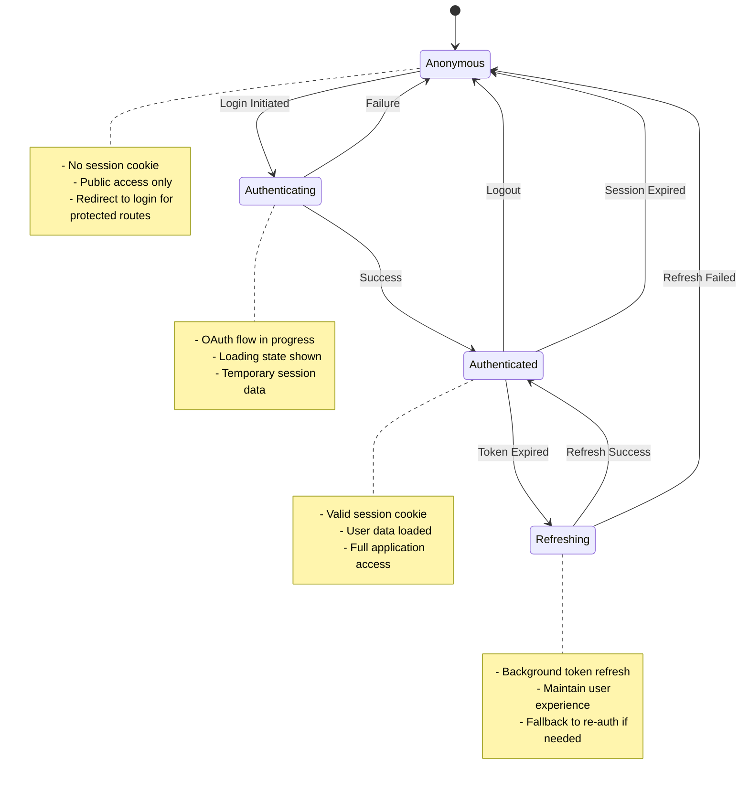

# 🔐 Authentication & Authorization Flow

This diagram shows the complete authentication and authorization system for Idling.app, including OAuth integration, session management, and security boundaries.

## 🌊 **OAuth Authentication Flow**

```mermaid
sequenceDiagram
    participant User as 👤 User
    participant Browser as 🌐 Browser
    participant App as 🚀 Next.js App
    participant AuthJS as 🔑 Auth.js
    participant Provider as 🎮 OAuth Provider<br/>(Twitch/Google)
    participant DB as 🗄️ Database
    participant Session as 🍪 Session Store

    User->>Browser: Click "Sign In"
    Browser->>App: GET /auth/signin
    App->>AuthJS: Initialize OAuth flow
    AuthJS->>Provider: Redirect to OAuth consent

    Note over Provider: User grants permissions
    Provider->>AuthJS: Redirect with auth code
    AuthJS->>Provider: Exchange code for tokens
    Provider->>AuthJS: Return access/refresh tokens

    AuthJS->>DB: Check/Create user record
    DB->>AuthJS: User data
    AuthJS->>Session: Create session
    Session->>AuthJS: Session token
    AuthJS->>Browser: Set session cookie
    Browser->>User: Redirect to dashboard
```

## 🛡️ **Session Management Flow**

```mermaid
flowchart TD
    A[🌐 User Request] --> B{🍪 Session Cookie?}
    B -->|No| C[🔓 Anonymous Access]
    B -->|Yes| D[🔍 Validate Session]

    D --> E{📅 Session Valid?}
    E -->|No| F[🗑️ Clear Cookie]
    E -->|Yes| G[📊 Update Last Activity]

    F --> C
    G --> H[🔑 Load User Data]
    H --> I[✅ Authenticated Request]

    C --> J{🚫 Protected Route?}
    J -->|Yes| K[🔄 Redirect to Login]
    J -->|No| L[📄 Serve Public Content]

    I --> M[🎯 Route to Handler]

    style A fill:#e1f5fe
    style I fill:#c8e6c9
    style C fill:#fff3e0
    style K fill:#ffcdd2
```

## 🔒 **Authorization & Role-Based Access**

```mermaid
flowchart LR
    subgraph "🎭 User Roles"
        A[👤 Anonymous]
        B[🆔 Authenticated]
        C[👑 Admin]
        D[🔧 Moderator]
    end

    subgraph "📋 Permissions"
        E[👀 View Public]
        F[📊 View Dashboard]
        G[✏️ Edit Profile]
        H[🎮 Create Sessions]
        I[🛠️ Manage Users]
        J[⚙️ System Settings]
    end

    subgraph "🛡️ Protected Resources"
        K[🏠 Public Pages]
        L[📊 Dashboard]
        M[⚙️ Settings]
        N[🔧 Admin Panel]
        O[📈 Analytics]
    end

    A --> E
    A --> K

    B --> E
    B --> F
    B --> G
    B --> H
    B --> L
    B --> M

    C --> E
    C --> F
    C --> G
    C --> H
    C --> I
    C --> J
    C --> L
    C --> M
    C --> N
    C --> O

    D --> E
    D --> F
    D --> G
    D --> H
    D --> I
    D --> L
    D --> M

    style A fill:#ffcdd2
    style B fill:#c8e6c9
    style C fill:#ffd54f
    style D fill:#ce93d8
```

## 🔄 **Token Refresh & Security**

```mermaid
sequenceDiagram
    participant App as 🚀 App
    participant AuthJS as 🔑 Auth.js
    participant Provider as 🎮 OAuth Provider
    participant DB as 🗄️ Database

    Note over App,DB: Token Refresh Flow

    App->>AuthJS: API Request with expired token
    AuthJS->>DB: Check refresh token
    DB->>AuthJS: Refresh token data

    alt Refresh token valid
        AuthJS->>Provider: Request new access token
        Provider->>AuthJS: New access token
        AuthJS->>DB: Update stored tokens
        AuthJS->>App: Continue with new token
    else Refresh token expired
        AuthJS->>DB: Clear user session
        AuthJS->>App: Redirect to login
    end

    Note over App,DB: Security Measures

    rect rgb(255, 240, 240)
        Note over App,DB: Token Rotation
        AuthJS->>Provider: Rotate refresh token
        Provider->>AuthJS: New refresh token
        AuthJS->>DB: Store new refresh token
    end

    rect rgb(240, 255, 240)
        Note over App,DB: Session Security
        AuthJS->>DB: Log security event
        AuthJS->>App: Rate limit check
        App->>AuthJS: IP validation
    end
```

## 🚨 **Security Boundaries & Threat Model**

```mermaid
flowchart TB
    subgraph "🌐 External Threats"
        T1[🦹 Malicious Actors]
        T2[🤖 Automated Bots]
        T3[🕷️ Web Scrapers]
        T4[⚡ DDoS Attacks]
    end

    subgraph "🛡️ Security Layer 1: Network"
        S1[🔥 Firewall]
        S2[🌍 CDN/WAF]
        S3[📊 Rate Limiting]
        S4[🔒 HTTPS/TLS]
    end

    subgraph "🛡️ Security Layer 2: Application"
        S5[🔑 Authentication]
        S6[🎭 Authorization]
        S7[🍪 Session Management]
        S8[🔐 CSRF Protection]
        S9[🛡️ Input Validation]
    end

    subgraph "🛡️ Security Layer 3: Data"
        S10[🔒 Encryption at Rest]
        S11[🔐 Encryption in Transit]
        S12[🗄️ Database Security]
        S13[📝 Audit Logging]
    end

    subgraph "🎯 Protected Assets"
        A1[👤 User Data]
        A2[🔑 Authentication Tokens]
        A3[📊 Session Data]
        A4[⚙️ System Configuration]
    end

    T1 --> S1
    T2 --> S2
    T3 --> S3
    T4 --> S2

    S1 --> S5
    S2 --> S6
    S3 --> S7
    S4 --> S8

    S5 --> S10
    S6 --> S11
    S7 --> S12
    S8 --> S13
    S9 --> S13

    S10 --> A1
    S11 --> A2
    S12 --> A3
    S13 --> A4

    style T1 fill:#ffcdd2
    style T2 fill:#ffcdd2
    style T3 fill:#ffcdd2
    style T4 fill:#ffcdd2
    style A1 fill:#c8e6c9
    style A2 fill:#c8e6c9
    style A3 fill:#c8e6c9
    style A4 fill:#c8e6c9
```

## 📊 **Authentication State Management**

## 🔍 **Security Analysis Summary**

### **Authentication Methods**

- **OAuth 2.0**: Secure third-party authentication with Twitch and Google
- **Session-based**: Secure session management with HTTP-only cookies
- **Token Rotation**: Automatic refresh token rotation for enhanced security

### **Authorization Levels**

- **Anonymous**: Public content access only
- **Authenticated**: Full application features
- **Moderator**: User management capabilities
- **Admin**: System configuration and analytics

### **Security Measures**

- **HTTPS Enforcement**: All communications encrypted
- **CSRF Protection**: Cross-site request forgery prevention
- **Rate Limiting**: Brute force attack prevention
- **Input Validation**: SQL injection and XSS prevention
- **Audit Logging**: Complete security event tracking

### **Session Security**

- **HTTP-only Cookies**: Prevents XSS access to session tokens
- **Secure Flag**: Cookies only sent over HTTPS
- **SameSite Protection**: CSRF attack prevention
- **Session Expiration**: Automatic cleanup of expired sessions

### **Threat Mitigation**

- **DDoS Protection**: CDN and rate limiting
- **Bot Detection**: Automated threat detection
- **IP Validation**: Suspicious activity monitoring
- **Audit Trail**: Complete security event logging

This authentication system provides enterprise-grade security while maintaining excellent user experience through seamless OAuth integration and robust session management.
