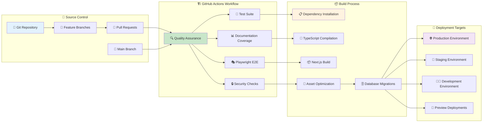
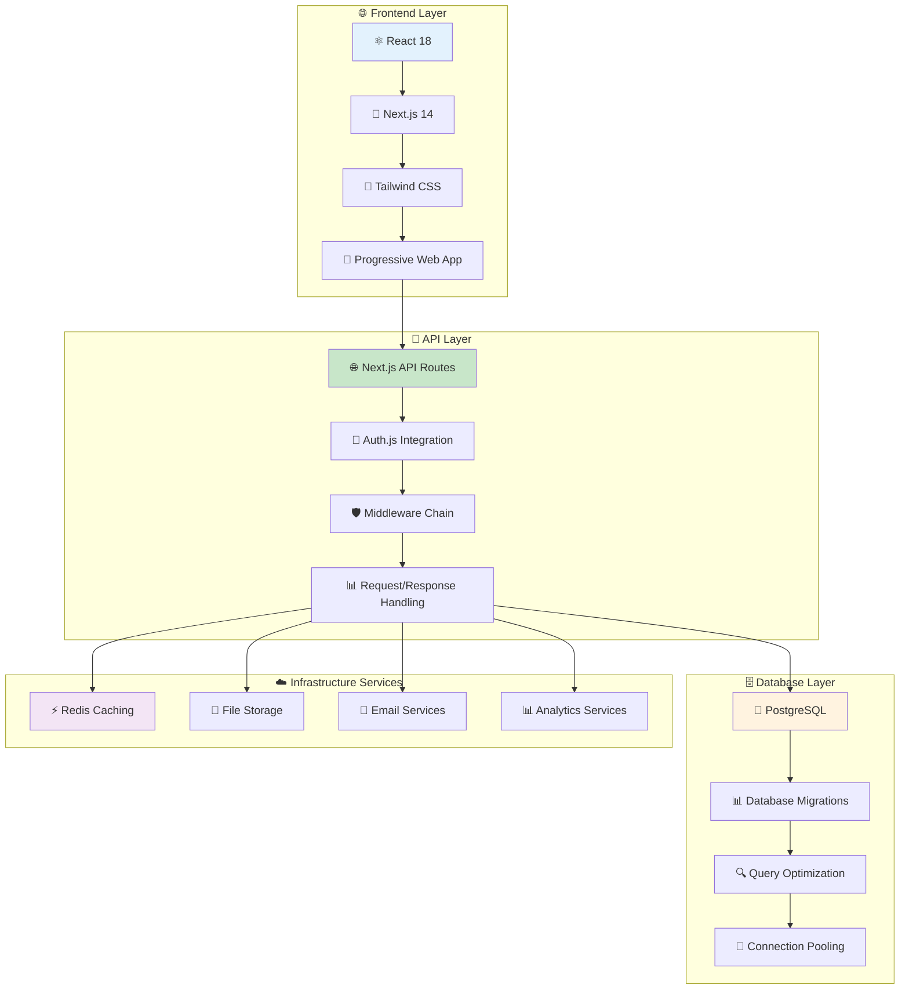
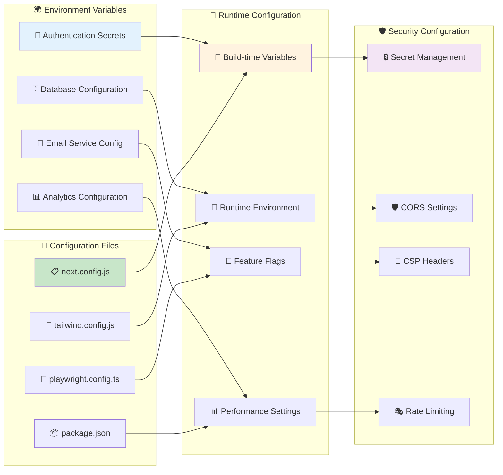
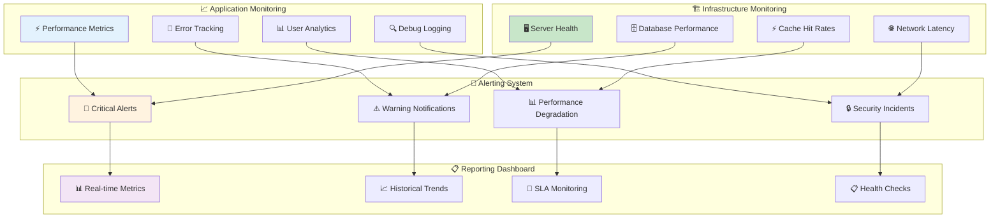
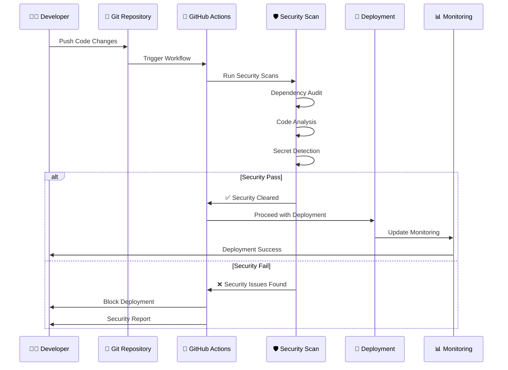
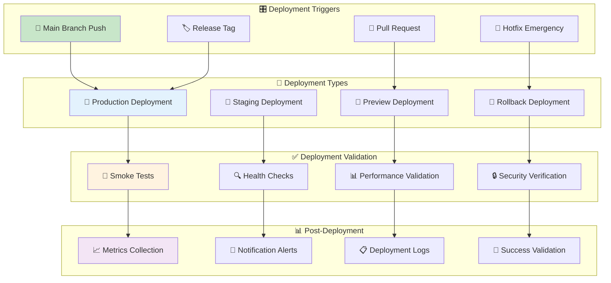

# 🚀 Deployment & Infrastructure Architecture

This diagram shows the actual deployment and infrastructure architecture for Idling.app based on the existing CI/CD configuration, GitHub Actions workflows, and deployment patterns.

## 🔄 **CI/CD Pipeline Architecture**



## 🧪 **Testing Pipeline Structure**

```mermaid
flowchart TD
    subgraph "🔍 Code Quality Checks"
        Q1[📝 ESLint Analysis]
        Q2[🎨 Prettier Formatting]
        Q3[📊 TypeScript Validation]
        Q4[🔒 Security Scanning]
    end

    subgraph "🧪 Test Execution"
        T1[⚡ Unit Tests (Jest)]
        T2[🔗 Integration Tests]
        T3[🎭 E2E Tests (Playwright)]
        T4[📸 Visual Regression Tests]
    end

    subgraph "📊 Coverage Analysis"
        C1[📈 Code Coverage]
        C2[📚 Documentation Coverage]
        C3[🎯 Test Coverage Reports]
        C4[📋 Quality Gates]
    end

    subgraph "🚀 Deployment Readiness"
        R1[✅ All Tests Pass]
        R2[📊 Coverage Thresholds Met]
        R3[🔒 Security Cleared]
        R4[🎯 Quality Standards Met]
    end

    Q1 --> T1
    Q2 --> T1
    Q3 --> T2
    Q4 --> T3

    T1 --> C1
    T2 --> C2
    T3 --> C3
    T4 --> C4

    C1 --> R1
    C2 --> R2
    C3 --> R3
    C4 --> R4

    style Q1 fill:#e3f2fd
    style T1 fill:#c8e6c9
    style C1 fill:#fff3e0
    style R1 fill:#f3e5f5
```

## 🏗️ **Application Architecture Stack**



## 🔄 **Environment Configuration**



## 📊 **Monitoring & Observability**



## 🔒 **Security & Compliance Pipeline**



## 🎯 **Deployment Strategy Patterns**



## 🔍 **Infrastructure Analysis**

### **CI/CD Implementation**

- **GitHub Actions**: Automated workflow execution on code changes
- **Quality Gates**: Comprehensive testing and validation before deployment
- **Parallel Execution**: Matrix testing across multiple environments
- **Artifact Management**: Build artifacts cached and reused across jobs

### **Testing Strategy**

- **Multi-layer Testing**: Unit, integration, and E2E test coverage
- **Playwright E2E**: Cross-browser testing with parallel execution
- **Documentation Coverage**: Automated documentation quality validation
- **Visual Regression**: UI consistency verification

### **Deployment Architecture**

- **Next.js SSR/SSG**: Server-side rendering with static generation
- **Progressive Web App**: PWA capabilities for mobile experience
- **Database Migrations**: Automated schema updates with version control
- **Environment Isolation**: Separate configurations for different environments

### **Security Implementation**

- **Secret Management**: Secure handling of sensitive configuration
- **Dependency Scanning**: Automated vulnerability detection
- **Code Analysis**: Static security analysis in CI pipeline
- **Access Control**: Role-based permissions for deployment operations

### **Monitoring & Observability**

- **Performance Tracking**: Real-time application performance monitoring
- **Error Tracking**: Comprehensive error logging and alerting
- **Health Checks**: Automated system health validation
- **Audit Logging**: Complete audit trail of deployment activities

### **Operational Excellence**

- **Infrastructure as Code**: Configuration managed through version control
- **Automated Rollbacks**: Quick recovery from deployment issues
- **Blue-Green Deployment**: Zero-downtime deployment strategy
- **Disaster Recovery**: Backup and recovery procedures

This infrastructure architecture provides a robust, scalable, and secure foundation for the Idling.app deployment pipeline with comprehensive automation and monitoring capabilities.
