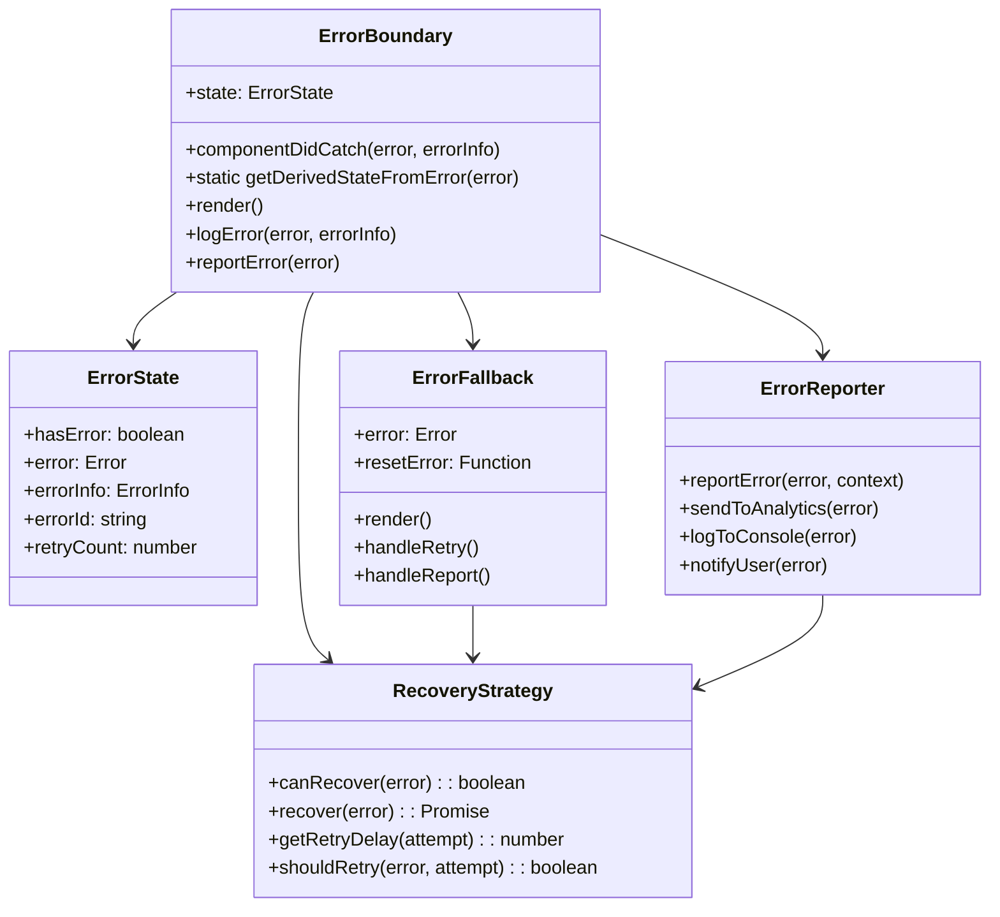
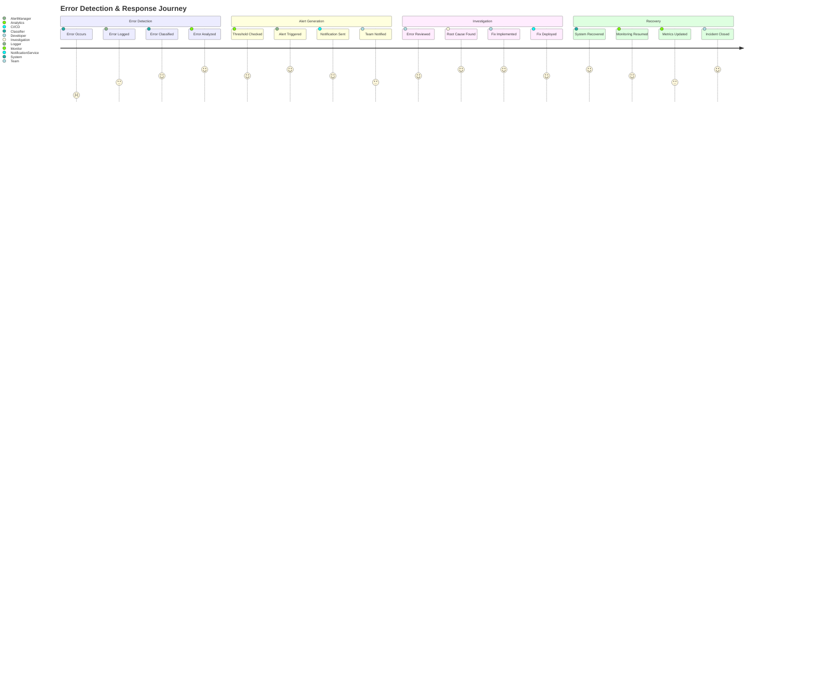

# 🚨 Error Handling & Recovery Patterns

This diagram shows the comprehensive error handling and recovery patterns in Idling.app, including error propagation, recovery strategies, and resilience patterns based on the actual implementation.

## 🔄 **Error Classification & Handling Flow**

```mermaid
flowchart TD
    subgraph "⚠️ Error Sources"
        E1[🌐 Network Errors]
        E2[🔑 Authentication Errors]
        E3[📝 Validation Errors]
        E4[🗄️ Database Errors]
        E5[🏢 Business Logic Errors]
        E6[🎨 UI/Component Errors]
        E7[🔧 Configuration Errors]
        E8[🚀 Deployment Errors]
    end

    subgraph "🎯 Error Classification"
        C1{🔍 Error Type?}
        C2[🚨 Critical]
        C3[⚠️ Warning]
        C4[📝 Info]
        C5[🐛 Debug]
    end

    subgraph "📊 Error Processing"
        P1[📝 Error Logging]
        P2[📊 Error Analytics]
        P3[🔔 Alert Generation]
        P4[📋 Error Reporting]
    end

    subgraph "🛠️ Recovery Actions"
        R1[🔄 Automatic Retry]
        R2[🔄 Fallback Strategy]
        R3[👤 User Notification]
        R4[🛠️ Manual Recovery]
        R5[🚨 Emergency Response]
    end

    E1 --> C1
    E2 --> C1
    E3 --> C1
    E4 --> C1
    E5 --> C1
    E6 --> C1
    E7 --> C1
    E8 --> C1

    C1 -->|Severity: High| C2
    C1 -->|Severity: Medium| C3
    C1 -->|Severity: Low| C4
    C1 -->|Severity: Trace| C5

    C2 --> P1
    C3 --> P1
    C4 --> P1
    C5 --> P1

    P1 --> P2
    P2 --> P3
    P3 --> P4

    C2 --> R5
    C3 --> R1
    C3 --> R2
    C4 --> R3
    C5 --> R4

    R1 --> P2
    R2 --> P2
    R3 --> P2
    R4 --> P2
    R5 --> P2

    style E1 fill:#ffcdd2
    style C2 fill:#ff9800
    style P1 fill:#e3f2fd
    style R1 fill:#c8e6c9
```



## 🔄 **Retry Logic & Circuit Breaker Pattern**

```mermaid
stateDiagram-v2
    [*] --> Closed

    state "🟢 Circuit Closed" as Closed {
        [*] --> Normal
        Normal --> Retry : Failure
        Retry --> Normal : Success
        Retry --> FailureCount : Failure
        FailureCount --> Open : Threshold Exceeded
    }

    state "🔴 Circuit Open" as Open {
        [*] --> Blocking
        Blocking --> HalfOpen : Timeout Elapsed
    }

    state "🟡 Circuit Half-Open" as HalfOpen {
        [*] --> Testing
        Testing --> Closed : Success
        Testing --> Open : Failure
    }

    Closed --> Open : Too Many Failures
    Open --> HalfOpen : Recovery Timer
    HalfOpen --> Closed : Health Check Pass
    HalfOpen --> Open : Health Check Fail

    note right of Closed
        Normal operation
        Failures trigger retries
        Track failure count
    end note

    note right of Open
        Block all requests
        Return cached/fallback data
        Start recovery timer
    end note

    note right of HalfOpen
        Allow limited requests
        Test system health
        Quick fail or recover
    end note
```

## 🌐 **Network Error Recovery Strategies**

```mermaid
sequenceDiagram
    participant Client as 🖥️ Client
    participant Retry as 🔄 Retry Logic
    participant Cache as ⚡ Cache
    participant API as 🌐 API Server
    participant Fallback as 🔄 Fallback Service
    participant UI as 🎨 User Interface

    Client->>API: Initial Request

    alt Network Success
        API->>Client: 200 OK Response
        Client->>Cache: Update Cache
        Client->>UI: Update UI
    else Network Failure
        API->>Client: Network Error
        Client->>Retry: Trigger Retry Logic

        loop Exponential Backoff
            Retry->>API: Retry Request
            alt Retry Success
                API->>Retry: 200 OK
                Retry->>Client: Success Response
                Client->>Cache: Update Cache
                Client->>UI: Update UI
            else Retry Failure
                API->>Retry: Error
                Note over Retry: Wait (2^attempt * base_delay)
            end
        end

        alt Max Retries Exceeded
            Retry->>Cache: Check Cache
            alt Cache Hit
                Cache->>Client: Cached Data
                Client->>UI: Show Cached Data + Warning
            else Cache Miss
                Retry->>Fallback: Use Fallback
                Fallback->>Client: Fallback Response
                Client->>UI: Show Fallback + Error
            end
        end
    end
```



## 🔑 **Authentication Error Handling**

```mermaid
flowchart LR
    subgraph "🔐 Auth Error Types"
        A1[🚫 Invalid Token]
        A2[⏰ Expired Token]
        A3[🔒 Insufficient Permissions]
        A4[🌐 OAuth Provider Error]
        A5[🗄️ Session Not Found]
    end

    subgraph "🎯 Detection & Classification"
        D1[📡 API Middleware]
        D2[🔍 Token Validation]
        D3[⏰ Expiry Check]
        D4[🛡️ Permission Check]
    end

    subgraph "🛠️ Recovery Strategies"
        R1[🔄 Silent Token Refresh]
        R2[🔐 Re-authentication Flow]
        R3[🚪 Redirect to Login]
        R4[📝 Permission Request]
        R5[⚡ Cached Fallback]
    end

    subgraph "👤 User Experience"
        U1[🔄 Seamless Refresh]
        U2[📝 Login Prompt]
        U3[⚠️ Permission Denied]
        U4[📱 Offline Mode]
    end

    A1 --> D1
    A2 --> D2
    A3 --> D4
    A4 --> D1
    A5 --> D3

    D1 --> R2
    D2 --> R1
    D3 --> R3
    D4 --> R4

    R1 --> U1
    R2 --> U2
    R3 --> U2
    R4 --> U3
    R5 --> U4

    style A1 fill:#ffcdd2
    style D1 fill:#fff3e0
    style R1 fill:#c8e6c9
    style U1 fill:#e3f2fd
```



## 🗄️ **Database Error Recovery Patterns**

```mermaid
flowchart TD
    subgraph "💾 Database Errors"
        DB1[🔌 Connection Lost]
        DB2[⏰ Query Timeout]
        DB3[🔒 Lock Timeout]
        DB4[📊 Constraint Violation]
        DB5[💾 Storage Full]
        DB6[🔄 Deadlock Detected]
    end

    subgraph "🔍 Error Detection"
        E1[📡 Connection Monitor]
        E2[⏰ Query Timer]
        E3[🔒 Lock Manager]
        E4[📋 Validation Layer]
    end

    subgraph "🛠️ Recovery Actions"
        R1[🔄 Connection Retry]
        R2[⚡ Connection Pool Reset]
        R3[🔄 Query Retry]
        R4[📊 Transaction Rollback]
        R5[⚡ Cache Fallback]
        R6[📝 Graceful Degradation]
    end

    subgraph "📊 Monitoring & Alerts"
        M1[📈 Health Metrics]
        M2[🔔 Alert System]
        M3[📋 Error Dashboard]
        M4[📊 Performance Tracking]
    end

    DB1 --> E1
    DB2 --> E2
    DB3 --> E3
    DB4 --> E4
    DB5 --> E1
    DB6 --> E3

    E1 --> R1
    E1 --> R2
    E2 --> R3
    E3 --> R4
    E4 --> R6

    R1 --> M1
    R2 --> M2
    R3 --> M3
    R4 --> M4
    R5 --> M1
    R6 --> M2

    M1 --> M2
    M2 --> M3
    M3 --> M4

    style DB1 fill:#ffcdd2
    style E1 fill:#fff3e0
    style R1 fill:#c8e6c9
    style M1 fill:#e3f2fd
```



## 🎨 **Frontend Error Boundaries**



## 📝 **Validation Error Handling**

```mermaid
flowchart LR
    subgraph "📝 Input Sources"
        I1[👤 User Forms]
        I2[📡 API Requests]
        I3[📄 File Uploads]
        I4[🔗 URL Parameters]
    end

    subgraph "🔍 Validation Layers"
        V1[🎨 Frontend Validation]
        V2[📡 API Validation]
        V3[🏢 Business Logic Validation]
        V4[🗄️ Database Constraints]
    end

    subgraph "⚠️ Error Types"
        E1[📝 Format Errors]
        E2[📏 Length Errors]
        E3[🔢 Type Errors]
        E4[📋 Required Field Errors]
        E5[🔒 Security Violations]
    end

    subgraph "🛠️ Error Handling"
        H1[🎨 Inline Field Errors]
        H2[📋 Form Summary Errors]
        H3[🔔 Toast Notifications]
        H4[📊 Error Analytics]
    end

    I1 --> V1
    I2 --> V2
    I3 --> V2
    I4 --> V2

    V1 --> E1
    V2 --> E2
    V3 --> E3
    V4 --> E4
    V2 --> E5

    E1 --> H1
    E2 --> H2
    E3 --> H3
    E4 --> H1
    E5 --> H4

    H1 --> H4
    H2 --> H4
    H3 --> H4

    style I1 fill:#e3f2fd
    style V1 fill:#c8e6c9
    style E1 fill:#ffcdd2
    style H1 fill:#fff3e0
```



## 🔔 **Error Monitoring & Alerting**



## 🚨 **Critical Error Response Flow**

```mermaid
flowchart TD
    A[🚨 Critical Error Detected] --> B{🔍 Error Severity?}

    B -->|🔴 Critical| C[🚨 Immediate Alert]
    B -->|🟡 High| D[⚠️ Priority Alert]
    B -->|🟢 Medium| E[📝 Standard Log]

    C --> F[📞 On-Call Engineer]
    C --> G[🔔 Slack Alert]
    C --> H[📧 Email Alert]

    D --> I[🔔 Team Notification]
    D --> J[📊 Dashboard Update]

    E --> K[📋 Error Log]
    E --> L[📊 Metrics Update]

    F --> M{🛠️ Can Auto-Recover?}
    I --> M

    M -->|✅ Yes| N[🔄 Execute Recovery]
    M -->|❌ No| O[👤 Manual Intervention]

    N --> P[✅ Recovery Successful?]
    O --> Q[🛠️ Manual Fix Applied]

    P -->|✅ Yes| R[📈 System Restored]
    P -->|❌ No| S[🚨 Escalate Alert]

    Q --> T[🔍 Verify Fix]
    S --> U[👥 Senior Engineer]

    T --> R
    U --> V[🛠️ Emergency Response]
    V --> R

    R --> W[📊 Post-Incident Review]
    W --> X[📝 Documentation Update]
    X --> Y[🔄 Process Improvement]

    style A fill:#ffcdd2
    style C fill:#ff9800
    style F fill:#f44336
    style R fill:#4caf50
```



## 🔄 **Graceful Degradation Strategies**

```mermaid
graph TB
    subgraph "🎯 Service Availability"
        S1[🟢 Full Service]
        S2[🟡 Partial Service]
        S3[🟠 Limited Service]
        S4[🔴 Emergency Mode]
    end

    subgraph "🛠️ Degradation Levels"
        D1[📊 Disable Analytics]
        D2[⚡ Use Cache Only]
        D3[🔒 Read-Only Mode]
        D4[📱 Offline Mode]
    end

    subgraph "👤 User Experience"
        U1[✨ Full Features]
        U2[⚠️ Feature Warnings]
        U3[📝 Limited Features]
        U4[💾 Cached Content]
    end

    subgraph "🔄 Recovery Actions"
        R1[🔍 Health Checks]
        R2[⚡ Service Restart]
        R3[🔄 Gradual Recovery]
        R4[📊 Full Restoration]
    end

    S1 --> S2
    S2 --> S3
    S3 --> S4

    S2 --> D1
    S3 --> D2
    S3 --> D3
    S4 --> D4

    D1 --> U2
    D2 --> U3
    D3 --> U3
    D4 --> U4

    S4 --> R1
    R1 --> R2
    R2 --> R3
    R3 --> R4
    R4 --> S1

    style S1 fill:#4caf50
    style S2 fill:#ffeb3b
    style S3 fill:#ff9800
    style S4 fill:#f44336
    style R4 fill:#4caf50
```



## 🔍 **Error Handling Analysis**

### **Error Prevention Strategies**

- **Input Validation**: Multi-layer validation at frontend, API, and database levels
- **Type Safety**: TypeScript for compile-time error prevention
- **Code Reviews**: Peer review process to catch potential issues
- **Automated Testing**: Comprehensive test coverage to prevent regressions

### **Error Detection Mechanisms**

- **Error Boundaries**: React error boundaries for component-level error handling
- **Global Error Handlers**: Window error handlers for unhandled exceptions
- **API Monitoring**: Health checks and response monitoring
- **Performance Monitoring**: Real-time performance and error rate tracking

### **Recovery Patterns**

- **Circuit Breaker**: Prevent cascading failures with circuit breaker pattern
- **Retry Logic**: Exponential backoff with jitter for transient failures
- **Fallback Strategies**: Cached data and alternative service endpoints
- **Graceful Degradation**: Progressive feature disabling under stress

### **User Experience Considerations**

- **Progressive Enhancement**: Core functionality works even with errors
- **Informative Messages**: Clear, actionable error messages for users
- **Offline Support**: PWA capabilities for offline error handling
- **Recovery Guidance**: Help users understand and resolve issues

### **Monitoring & Observability**

- **Error Aggregation**: Centralized error collection and analysis
- **Real-time Alerts**: Immediate notification of critical issues
- **Error Analytics**: Trend analysis and pattern recognition
- **Performance Impact**: Correlation between errors and performance metrics

This error handling architecture ensures robust, resilient operation of Idling.app with comprehensive error prevention, detection, and recovery capabilities.
