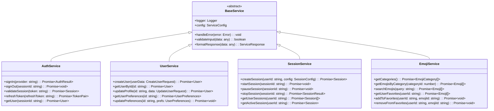

# 🏢 Service Architecture & Business Logic Patterns

This diagram shows the actual service layer architecture for Idling.app based on the codebase implementation, including service patterns, business logic organization, and data access layers.

## 🏗️ **Service Layer Architecture**

```mermaid
flowchart TB
    subgraph "🌐 API Layer (Next.js Route Handlers)"
        A1[📍 /api/auth/*]
        A2[📍 /api/users/*]
        A3[📍 /api/sessions/*]
        A4[📍 /api/emojis/*]
        A5[📍 /api/admin/*]
    end

    subgraph "🏢 Business Service Layer"
        S1[🔑 AuthService]
        S2[👤 UserService]
        S3[🎮 SessionService]
        S4[😊 EmojiService]
        S5[📊 AnalyticsService]
        S6[🔔 NotificationService]
    end

    subgraph "🗄️ Data Access Layer"
        D1[🐘 DatabaseService]
        D2[⚡ CacheService]
        D3[📁 FileStorageService]
        D4[🔍 SearchService]
    end

    subgraph "🔧 Utility Services"
        U1[📧 EmailService]
        U2[📝 LoggingService]
        U3[🔒 EncryptionService]
        U4[⏰ SchedulerService]
    end

    A1 --> S1
    A2 --> S2
    A3 --> S3
    A4 --> S4
    A5 --> S5
    A5 --> S6

    S1 --> D1
    S2 --> D1
    S3 --> D1
    S4 --> D1
    S5 --> D1
    S6 --> D1

    S1 --> D2
    S2 --> D2
    S3 --> D2
    S4 --> D2

    S4 --> D3
    S4 --> D4

    S1 --> U1
    S2 --> U2
    S3 --> U3
    S5 --> U4

    style A1 fill:#e3f2fd
    style S1 fill:#c8e6c9
    style D1 fill:#fff3e0
    style U1 fill:#f3e5f5
```

## 🎯 **Service Implementation Patterns**

## 🔄 **Service Interaction Flow**

```mermaid
sequenceDiagram
    participant Client as 🖥️ Client
    participant API as 🌐 API Route
    participant Auth as 🔑 AuthService
    participant User as 👤 UserService
    participant Session as 🎮 SessionService
    participant DB as 🗄️ Database
    participant Cache as ⚡ Cache

    Client->>API: POST /api/sessions/create
    API->>Auth: validateSession(token)
    Auth->>Cache: checkSession(token)

    alt Session Valid
        Cache->>Auth: sessionData
        Auth->>API: userInfo
        API->>Session: createSession(userId, config)
        Session->>DB: INSERT session
        DB->>Session: sessionId
        Session->>Cache: cacheSession(sessionId)
        Session->>API: sessionData
        API->>Client: 201 Created
    else Session Invalid
        Cache->>Auth: null
        Auth->>API: 401 Unauthorized
        API->>Client: 401 Unauthorized
    end
```

## 🏗️ **Database Service Patterns**

```mermaid
flowchart LR
    subgraph "🗄️ Database Operations"
        D1[📝 Create Operations]
        D2[📖 Read Operations]
        D3[✏️ Update Operations]
        D4[🗑️ Delete Operations]
    end

    subgraph "🔍 Query Patterns"
        Q1[🎯 Single Record Queries]
        Q2[📋 List Queries with Pagination]
        Q3[🔍 Search Queries]
        Q4[📊 Aggregation Queries]
    end

    subgraph "⚡ Optimization Strategies"
        O1[🗂️ Indexed Queries]
        O2[🔄 Connection Pooling]
        O3[📦 Query Batching]
        O4[⚡ Prepared Statements]
    end

    subgraph "🛡️ Data Validation"
        V1[📝 Input Sanitization]
        V2[🔒 SQL Injection Prevention]
        V3[📊 Type Validation]
        V4[🚨 Constraint Checking]
    end

    D1 --> Q1
    D2 --> Q2
    D3 --> Q3
    D4 --> Q4

    Q1 --> O1
    Q2 --> O2
    Q3 --> O3
    Q4 --> O4

    O1 --> V1
    O2 --> V2
    O3 --> V3
    O4 --> V4

    style D1 fill:#e3f2fd
    style Q1 fill:#c8e6c9
    style O1 fill:#fff3e0
    style V1 fill:#f3e5f5
```

## 🔧 **Utility Service Architecture**

```mermaid
graph TB
    subgraph "📝 Logging Service"
        L1[📊 Structured Logging]
        L2[🏷️ Log Levels]
        L3[📁 Log Rotation]
        L4[🔍 Log Aggregation]
    end

    subgraph "🔒 Security Services"
        S1[🔐 Password Hashing]
        S2[🔑 Token Generation]
        S3[🛡️ Data Encryption]
        S4[🔍 Input Validation]
    end

    subgraph "📧 Communication Services"
        C1[📨 Email Templates]
        C2[🔔 Push Notifications]
        C3[📱 SMS Services]
        C4[📢 In-App Notifications]
    end

    subgraph "⏰ Background Services"
        B1[🕐 Scheduled Tasks]
        B2[🔄 Data Cleanup]
        B3[📊 Analytics Processing]
        B4[🗄️ Database Maintenance]
    end

    L1 --> L2
    L2 --> L3
    L3 --> L4

    S1 --> S2
    S2 --> S3
    S3 --> S4

    C1 --> C2
    C2 --> C3
    C3 --> C4

    B1 --> B2
    B2 --> B3
    B3 --> B4

    style L1 fill:#e3f2fd
    style S1 fill:#c8e6c9
    style C1 fill:#fff3e0
    style B1 fill:#f3e5f5
```

## 🔄 **Error Handling Patterns**

```mermaid
flowchart TD
    A[🚨 Error Occurs] --> B{🔍 Error Type?}

    B -->|🔒 Authentication| C[🔑 AuthError]
    B -->|🎭 Authorization| D[🛡️ PermissionError]
    B -->|📝 Validation| E[📋 ValidationError]
    B -->|🗄️ Database| F[🐘 DatabaseError]
    B -->|🌐 Network| G[📡 NetworkError]
    B -->|❓ Unknown| H[🚨 SystemError]

    C --> I[📝 Log Error Details]
    D --> I
    E --> I
    F --> I
    G --> I
    H --> I

    I --> J{🔄 Retry Logic?}
    J -->|Yes| K[⏰ Exponential Backoff]
    J -->|No| L[📤 Return Error Response]

    K --> M{🎯 Max Retries?}
    M -->|No| N[🔄 Retry Operation]
    M -->|Yes| L

    N --> A
    L --> O[📊 Error Analytics]
    O --> P[🔔 Alert if Critical]

    style A fill:#ffcdd2
    style I fill:#fff3e0
    style L fill:#e3f2fd
    style O fill:#f3e5f5
```

## 📊 **Service Configuration Management**

```mermaid
graph LR
    subgraph "⚙️ Configuration Sources"
        C1[🌍 Environment Variables]
        C2[📄 Config Files]
        C3[🗄️ Database Settings]
        C4[☁️ Remote Config]
    end

    subgraph "🔧 Configuration Types"
        T1[🗄️ Database Config]
        T2[🔑 Auth Config]
        T3[📧 Email Config]
        T4[📊 Analytics Config]
    end

    subgraph "🛡️ Configuration Security"
        S1[🔒 Secret Management]
        S2[🔐 Encryption at Rest]
        S3[🎭 Role-based Access]
        S4[📝 Audit Logging]
    end

    subgraph "🔄 Configuration Lifecycle"
        L1[🚀 Initialization]
        L2[🔄 Hot Reload]
        L3[✅ Validation]
        L4[📊 Monitoring]
    end

    C1 --> T1
    C2 --> T2
    C3 --> T3
    C4 --> T4

    T1 --> S1
    T2 --> S2
    T3 --> S3
    T4 --> S4

    S1 --> L1
    S2 --> L2
    S3 --> L3
    S4 --> L4

    style C1 fill:#e3f2fd
    style T1 fill:#c8e6c9
    style S1 fill:#fff3e0
    style L1 fill:#f3e5f5
```

## 🔍 **Service Architecture Analysis**

### **Service Layer Benefits**

- **Separation of Concerns**: Clear boundaries between API, business logic, and data access
- **Reusability**: Services can be used across multiple API endpoints
- **Testability**: Individual services can be unit tested in isolation
- **Maintainability**: Business logic centralized in dedicated service classes

### **Implementation Patterns**

- **Dependency Injection**: Services receive dependencies through constructor injection
- **Interface Segregation**: Services implement specific interfaces for their domain
- **Single Responsibility**: Each service handles one specific business domain
- **Error Boundaries**: Consistent error handling across all service operations

### **Data Access Strategy**

- **Repository Pattern**: Database operations abstracted through repository interfaces
- **Query Optimization**: Indexed queries and connection pooling for performance
- **Transaction Management**: ACID compliance for critical operations
- **Cache Integration**: Redis caching layer for frequently accessed data

### **Security Implementation**

- **Input Validation**: All service inputs validated and sanitized
- **Authentication**: JWT-based authentication with session validation
- **Authorization**: Role-based access control at service level
- **Audit Logging**: Complete audit trail of all service operations

### **Performance Considerations**

- **Connection Pooling**: Efficient database connection management
- **Caching Strategy**: Multi-layer caching with Redis and application-level cache
- **Async Operations**: Non-blocking operations for better throughput
- **Resource Management**: Proper cleanup and resource disposal

This service architecture provides a clean, maintainable, and scalable foundation for the Idling.app business logic with proper separation of concerns and enterprise-grade patterns.
