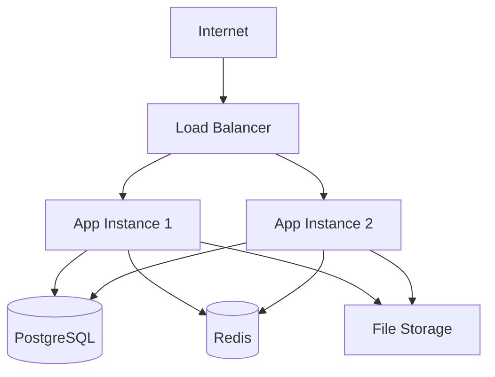
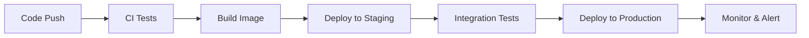

# 🚀 Deployment Guide

Comprehensive deployment documentation covering production setup, documentation site deployment, and release management.

## 🌐 Production Setup

**[Production Setup](production/)** - Server deployment guide:

- Production environment configuration
- Docker containerization and orchestration
- Database setup and migrations
- SSL/TLS certificate configuration
- Load balancing and reverse proxy setup
- Environment variables and secrets management
- Monitoring and logging setup
- Backup and disaster recovery procedures

## 📄 Documentation Site

**[Documentation Site](docs/)** - Deploy this documentation:

- Jekyll setup and configuration
- GitHub Pages deployment
- Custom domain configuration
- Continuous deployment with GitHub Actions
- Theme customization and branding
- Search functionality setup
- Analytics and monitoring integration

## 📦 Release Process

**[Release Process](releases/)** - Version management and releases:

- Semantic versioning strategy
- Release branching and tagging
- Automated release pipeline
- Changelog generation
- Database migration deployment
- Rollback procedures
- Release communication and documentation

## 🔧 Infrastructure Overview

### Production Architecture



### Deployment Pipeline



## 🛠️ Deployment Tools

### Container Orchestration

- **Docker** - Application containerization
- **Docker Compose** - Multi-container orchestration
- **Kubernetes** - Production orchestration (optional)

### CI/CD Pipeline

- **GitHub Actions** - Automated testing and deployment
- **Docker Hub** - Container image registry
- **Staging Environment** - Pre-production testing

### Monitoring & Observability

- **Application Logs** - Structured logging with rotation
- **Performance Metrics** - Response times and throughput
- **Error Tracking** - Exception monitoring and alerting
- **Uptime Monitoring** - Service availability checks

## 🔐 Security Considerations

### Production Security

- **HTTPS/TLS** - Encrypted communication
- **Firewall Rules** - Network access control
- **Security Headers** - Browser security policies
- **Rate Limiting** - API protection
- **Input Validation** - Data sanitization
- **Secrets Management** - Secure credential storage

### Database Security

- **Connection Encryption** - SSL/TLS for database connections
- **Access Control** - Role-based permissions
- **Backup Encryption** - Secure backup storage
- **Audit Logging** - Database activity monitoring

## 📊 Performance Optimization

### Application Performance

- **Code Splitting** - Lazy loading and bundle optimization
- **Image Optimization** - Responsive images and formats
- **Caching Strategy** - Multiple layers of caching
- **Database Indexing** - Query optimization
- **CDN Integration** - Global content delivery

### Infrastructure Performance

- **Load Balancing** - Traffic distribution
- **Connection Pooling** - Database connection management
- **Resource Scaling** - Auto-scaling based on demand
- **Monitoring Alerts** - Proactive issue detection

## 🔄 Deployment Strategies

### Blue-Green Deployment

- **Zero Downtime** - Seamless production updates
- **Instant Rollback** - Quick recovery from issues
- **Environment Parity** - Identical staging and production

### Rolling Updates

- **Gradual Deployment** - Incremental instance updates
- **Health Checks** - Automated deployment validation
- **Automatic Rollback** - Failure detection and recovery

## 📋 Deployment Checklist

### Pre-Deployment

- [ ] All tests passing
- [ ] Database migrations tested
- [ ] Environment variables configured
- [ ] SSL certificates valid
- [ ] Backup procedures verified
- [ ] Monitoring alerts configured

### During Deployment

- [ ] Application health checks
- [ ] Database connectivity verified
- [ ] Cache warming completed
- [ ] Performance metrics normal
- [ ] Error rates acceptable

### Post-Deployment

- [ ] Smoke tests completed
- [ ] User acceptance testing
- [ ] Performance benchmarks met
- [ ] Monitoring dashboards updated
- [ ] Documentation updated
- [ ] Team notified

## 🚨 Troubleshooting

### Common Issues

1. **Database Connection Failures**

   - Check connection strings and credentials
   - Verify network connectivity
   - Review firewall rules

2. **Application Startup Errors**

   - Check environment variables
   - Verify file permissions
   - Review application logs

3. **Performance Degradation**
   - Monitor resource usage
   - Check database query performance
   - Review caching effectiveness

## 🔗 Environment Configuration

### Development

```bash
NODE_ENV=development
DATABASE_URL=postgresql://localhost:5432/idling_dev
REDIS_URL=redis://localhost:6379
```

### Production

```bash
NODE_ENV=production
DATABASE_URL=postgresql://prod-db:5432/idling_prod
REDIS_URL=redis://prod-cache:6379
SSL_CERT_PATH=/etc/ssl/certs/idling.crt
SSL_KEY_PATH=/etc/ssl/private/idling.key
```

## 🚀 Getting Started

1. **[Production Setup](production/)** - Configure production environment
2. **[Documentation Site](docs/)** - Deploy documentation
3. **[Release Process](releases/)** - Set up release pipeline

## 🔗 Related Sections

- **[Architecture](../architecture/)** - System design and infrastructure
- **[API Documentation](../api/)** - API deployment considerations
- **[Development](../../dev/)** - Development environment setup

---

_Deployment documentation is continuously updated. Last updated: {{ site.time | date: "%B %d, %Y" }}_
