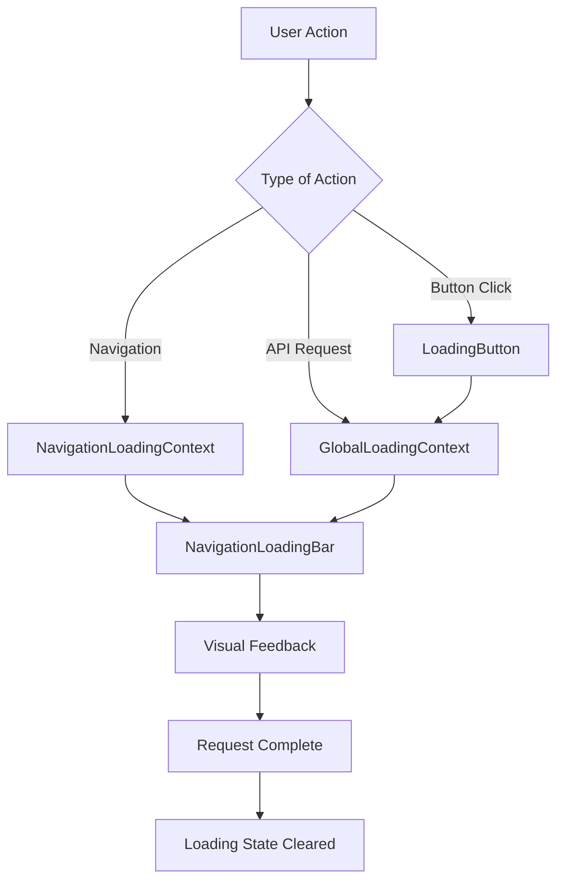

# Global Loading System 🔄

## Overview

The Global Loading System provides site-wide visual feedback for all network requests, ensuring users always know when the application is working on their behalf. This system automatically intercepts `fetch` requests and displays loading indicators in the top navigation bar.

## Architecture

### Core Components

1. **GlobalLoadingContext** - Intercepts all fetch requests and manages loading state
2. **NavigationLoadingBar** - Enhanced to show both navigation and API loading states
3. **LoadingButton** - Drop-in replacement for buttons with async operations
4. **useManualLoading** - Hook for manual loading control

### How It Works



## Features ✨

### Automatic Request Interception

- Intercepts all `fetch` requests automatically
- Provides contextual loading messages based on URL patterns
- Handles timeouts and error states gracefully
- Skips certain requests (auth, static assets, etc.)

### Smart Loading Messages

- **User Actions**: "Loading user details...", "Updating user..."
- **Posts**: "Loading posts...", "Saving changes..."
- **Uploads**: "Uploading file..."
- **Admin Actions**: "Processing admin action..."

### Visual Feedback

- Top-bar progress indicator with animated shimmer
- Contextual loading messages
- Smooth animations and transitions
- Accessibility support (aria-busy, screen reader friendly)

## Usage Guide

### Automatic Loading (No Code Changes Required)

Most network requests will automatically show loading feedback:

```typescript
// This will automatically show loading feedback
const response = await fetch('/api/admin/users/123');
```

### LoadingButton Component

Replace regular buttons with `LoadingButton` for enhanced UX:

```tsx
import { LoadingButton } from '@/components/ui/LoadingButton';

function UserActions({ userId }: { userId: string }) {
  const handleViewUser = async () => {
    const response = await fetch(`/api/admin/users/${userId}`);
    // Handle response...
  };

  return (
    <LoadingButton
      onClick={handleViewUser}
      globalLoadingMessage="Loading user details..."
      loadingText="Loading..."
      variant="primary"
      size="md"
    >
      👁️ View Details
    </LoadingButton>
  );
}
```

#### LoadingButton Props

| Prop                   | Type                                              | Description                        |
| ---------------------- | ------------------------------------------------- | ---------------------------------- |
| `onClick`              | `() => Promise<void> \| void`                     | Async function to execute          |
| `globalLoadingMessage` | `string?`                                         | Message shown in top bar           |
| `loadingText`          | `string?`                                         | Text shown on button while loading |
| `variant`              | `'primary' \| 'secondary' \| 'danger' \| 'ghost'` | Button style                       |
| `size`                 | `'sm' \| 'md' \| 'lg'`                            | Button size                        |
| `disabled`             | `boolean?`                                        | Disable the button                 |

### Manual Loading Control

For complex scenarios, use the `useManualLoading` hook:

```tsx
import { useManualLoading } from '@/lib/context/GlobalLoadingContext';

function ComplexComponent() {
  const manualLoading = useManualLoading();

  const handleComplexOperation = async () => {
    await manualLoading(async () => {
      // Your complex async operation
      await doSomethingComplex();
      await doSomethingElse();
    }, 'Processing complex operation...');
  };

  return (
    <button onClick={handleComplexOperation}>Start Complex Operation</button>
  );
}
```

### useAsyncAction Hook

For components that need loading state management:

```tsx
import { useAsyncAction } from '@/components/ui/LoadingButton';

function MyComponent() {
  const { execute, isLoading } = useAsyncAction();

  const handleAction = () => {
    execute(
      async () => {
        await fetch('/api/some-endpoint');
      },
      {
        globalMessage: 'Processing...',
        onSuccess: () => console.log('Success!'),
        onError: (error) => console.error('Failed:', error)
      }
    );
  };

  return (
    <button onClick={handleAction} disabled={isLoading}>
      {isLoading ? 'Processing...' : 'Click Me'}
    </button>
  );
}
```

## Configuration

### Skipping Global Loading

To skip global loading for specific requests:

```typescript
// Add header to skip global loading
const response = await fetch('/api/endpoint', {
  headers: {
    'x-skip-global-loading': 'true'
  }
});
```

### Customizing Loading Messages

Loading messages are automatically generated based on URL patterns. To customize:

1. Edit the `getLoadingMessage` function in `GlobalLoadingContext.tsx`
2. Add new URL patterns and corresponding messages

```typescript
function getLoadingMessage(url: string, method: string): string | null {
  if (url.includes('/api/my-feature')) {
    return 'Processing my feature...';
  }
  // ... existing patterns
}
```

## Integration Points

### Layout Integration

The system is integrated at the root layout level:

```tsx
// app/layout.tsx
<NavigationLoadingProvider>
  <GlobalLoadingProvider>
    <NavigationLoadingBar />
    {/* Your app content */}
  </GlobalLoadingProvider>
</NavigationLoadingProvider>
```

### CSS Integration

The loading bar uses existing CSS variables:

```css
/* Uses these CSS variables */
--brand-primary
--brand-secondary
--border-radius
/* ... other design tokens */
```

## Performance Considerations

### Request Deduplication

- Tracks active requests to prevent duplicate loading states
- Uses unique request IDs for proper cleanup

### Memory Management

- Automatic cleanup of timeouts and event listeners
- Proper React component lifecycle management

### Minimal Overhead

- Lightweight fetch interception
- Efficient state management with React context

## Accessibility Features

### Screen Reader Support

- `aria-busy` attributes on loading elements
- Descriptive loading messages
- Proper focus management

### Reduced Motion Support

- Respects `prefers-reduced-motion` setting
- Provides static alternatives to animations

### High Contrast Support

- Works with high contrast mode
- Maintains visual hierarchy

## Troubleshooting

### Common Issues

**Loading state gets stuck**

- Check for unhandled promise rejections
- Verify timeout configuration (30 seconds default)
- Use browser dev tools to inspect network requests

**Loading doesn't appear**

- Verify GlobalLoadingProvider is in component tree
- Check if request is being skipped (auth, static assets)
- Ensure fetch is being used (not axios or other libraries)

**Multiple loading indicators**

- Check for duplicate LoadingButton usage
- Verify manual loading control isn't conflicting

### Debug Mode

Enable debug logging in development:

```typescript
// In GlobalLoadingContext.tsx
const DEBUG = process.env.NODE_ENV === 'development';

if (DEBUG) {
  console.log('Global loading started:', requestId, loadingMessage);
}
```

## Migration Guide

### From Existing Loading States

1. **Replace individual loading states**:

   ```tsx
   // Before
   const [isLoading, setIsLoading] = useState(false);

   // After - automatic with fetch interception
   // or use LoadingButton for buttons
   ```

2. **Update button components**:

   ```tsx
   // Before
   <button onClick={handleClick} disabled={isLoading}>
     {isLoading ? 'Loading...' : 'Click Me'}
   </button>

   // After
   <LoadingButton onClick={handleClick}>
     Click Me
   </LoadingButton>
   ```

3. **Consolidate loading indicators**:
   - Remove individual spinners and loading states
   - Rely on global top-bar indicator
   - Keep local loading states only for specific UX needs

## Best Practices

### Do's ✅

- Use LoadingButton for user-initiated actions
- Provide meaningful loading messages
- Test with slow network conditions
- Consider user expectations for response times

### Don'ts ❌

- Don't override global loading for routine operations
- Don't create competing loading indicators
- Don't forget to handle error states
- Don't use for non-network operations

## Future Enhancements

### Planned Features

- [ ] Request priority levels (urgent, normal, background)
- [ ] Batch request handling
- [ ] Offline state management
- [ ] Request retry mechanisms
- [ ] Analytics integration

### Extension Points

- Custom loading message providers
- Request middleware system
- Theme-aware loading indicators
- Multi-language support

## Support

For questions or issues with the Global Loading System:

1. Check this documentation
2. Review existing implementations in the codebase
3. Test in isolation to identify conflicts
4. Consider performance implications

---

_This system ensures every user interaction provides immediate feedback, creating a responsive and professional user experience across the entire application._ 🎯
