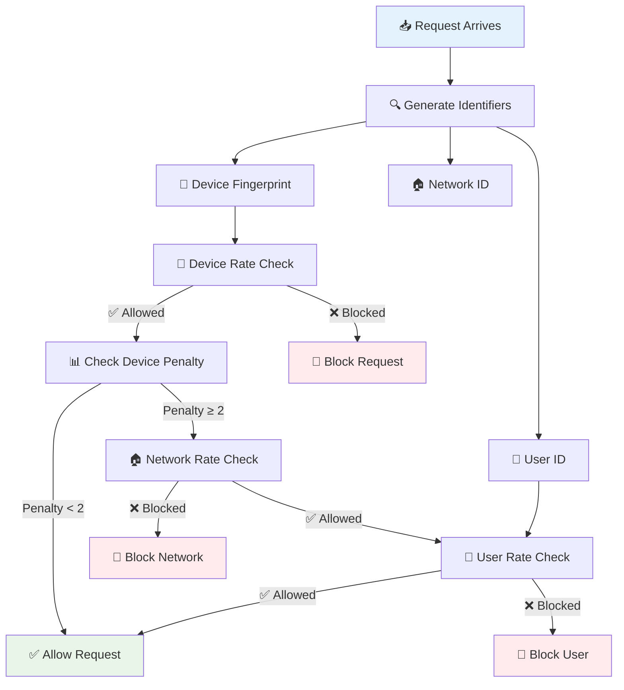

# 🏠 Household Device Separation in Rate Limiting

## Overview 🎯

Our enhanced rate limiting system solves the critical problem where legitimate users in the same household were being blocked when one device triggered rate limits. The new system uses sophisticated device fingerprinting and multi-layered protection to ensure fair access while maintaining robust security.

## The Problem We Solved 🚨

### Before: Household-Wide Penalties

```
Household Network: 192.168.1.100
├── User A's Phone (triggers rate limit) ❌
├── User B's Laptop (gets blocked) ⚠️  ← UNFAIR!
├── User C's Tablet (gets blocked) ⚠️  ← UNFAIR!
└── Smart TV (gets blocked) ⚠️        ← UNFAIR!
```

**Problem**: All devices shared the same IP-based identifier, causing innocent users to suffer for others' activity.

### After: Device-Level Granularity

```
Household Network: 192.168.1.100
├── User A's Phone (device:192.168.1.x:a1b2c3d4) ❌ BLOCKED
├── User B's Laptop (device:192.168.1.x:e5f6g7h8) ✅ ALLOWED
├── User C's Tablet (device:192.168.1.x:i9j0k1l2) ✅ ALLOWED
└── Smart TV (device:192.168.1.x:m3n4o5p6) ✅ ALLOWED
```

**Solution**: Each device gets its own rate limit bucket while maintaining household-level protection against severe abuse.

## How Device Fingerprinting Works 🔍

### Fingerprint Components

Our system creates stable device fingerprints using:

```typescript
interface DeviceFingerprint {
  userAgent: string; // Browser/app signature (truncated)
  acceptLanguage: string; // Primary language preference
  acceptEncoding: string; // Compression preferences
  accept: string; // Content type preferences
}
```

### Example Fingerprints

```
Chrome on Windows:
device:192.168.1.x:a1b2c3d4
├── User-Agent: "Mozilla/5.0 (Windows NT 10.0; Win64; x64) Chrome/X.X"
├── Accept-Language: "en-US"
├── Accept-Encoding: "gzip, deflate, br"
└── Accept: "text/html,application/xhtml+xml"

Safari on iPhone:
device:192.168.1.x:e5f6g7h8
├── User-Agent: "Mozilla/5.0 (iPhone; CPU iPhone OS X_X like Mac OS X) Safari/X.X"
├── Accept-Language: "en-US"
├── Accept-Encoding: "gzip, deflate"
└── Accept: "text/html,application/xhtml+xml"
```

## Multi-Layered Rate Limiting Strategy 🛡️

### Layer 1: Device-Level Protection (Primary)

- **Scope**: Individual devices
- **Identifier**: `device:192.168.1.x:a1b2c3d4`
- **Purpose**: Allow multiple devices per household
- **Limits**: Standard API limits (100 req/min)

### Layer 2: Network-Level Protection (Escalation)

- **Scope**: Entire household/network
- **Identifier**: `network:192.168.1.x`
- **Trigger**: Only when device shows suspicious behavior (penalty ≥ 2)
- **Purpose**: Prevent household-wide attacks
- **Limits**: Much higher (500 req/min network-wide)

### Layer 3: User-Level Protection (Authenticated)

- **Scope**: Individual authenticated users
- **Identifier**: `user:12345` or device fallback
- **Purpose**: Protect against account-specific abuse
- **Limits**: Per-endpoint specific limits

## Implementation Flow 🔄



## Identifier Types & Use Cases 📋

### Available Identifiers

```typescript
interface RequestIdentifiers {
  ip: string; // "192.168.1.100"
  user: string | null; // "user:12345" or null
  deviceFingerprint: string; // "a1b2c3d4"
  networkId: string; // "192.168.1.x"
  composite: string; // Main identifier used
  perDevice: string; // "device:192.168.1.x:a1b2c3d4"
  perUser: string; // "user:12345" or device fallback
  perNetwork: string; // "network:192.168.1.x"
  perIP: string; // "ip:192.168.1.100"
}
```

### When Each Is Used

| Scenario            | Primary Identifier | Fallback    | Purpose                |
| ------------------- | ------------------ | ----------- | ---------------------- |
| Anonymous browsing  | `perDevice`        | `perIP`     | Device separation      |
| Authenticated user  | `perDevice:user`   | `perDevice` | User + device tracking |
| Suspicious activity | `perNetwork`       | `perIP`     | Household protection   |
| Severe attack       | `perIP`            | None        | Nuclear option         |

## Benefits of This Approach ✨

### For Legitimate Users

- ✅ **Multiple devices work independently** - No cross-device blocking
- ✅ **Fair household access** - Everyone gets their own limits
- ✅ **Stable fingerprints** - Same device = same limits across sessions
- ✅ **Graceful degradation** - System falls back gracefully if fingerprinting fails

### For Security

- 🛡️ **Attack prevention** - Network-level limits prevent household-wide abuse
- 🛡️ **Sophisticated blocking** - Multi-layer approach catches various attack patterns
- 🛡️ **Penalty escalation** - Suspicious devices trigger broader protection
- 🛡️ **Bypass resistance** - Fingerprint spoofing requires significant effort

## Configuration Examples 🔧

### Standard API Endpoint

```typescript
// Device-level: 100 requests/minute per device
// Network-level: 500 requests/minute per household (only if suspicious)
// User-level: 100 requests/minute per authenticated user
```

### Upload Endpoint

```typescript
// Device-level: 5 uploads/minute per device
// Network-level: 25 uploads/minute per household (only if suspicious)
// User-level: 5 uploads/minute per authenticated user
```

### Authentication Endpoint

```typescript
// Device-level: 500 attempts/min per device
// Network-level: 2500 attempts/min per household (only if suspicious)
// No user-level (not authenticated yet)
```

## Monitoring & Debugging 📊

### Log Messages

```
✅ Normal operation:
"Device rate limit check passed for device:192.168.1.x:a1b2c3d4"

⚠️ Suspicious activity:
"Elevated penalty level detected"
├── deviceIdentifier: "device:192.168.1.x:a1b2c3d4"
├── networkIdentifier: "network:192.168.1.x"
├── penaltyLevel: 3
└── endpoint: "/api/posts"

🚫 Network-level blocking:
"Network rate limit exceeded for network:192.168.1.x due to suspicious device activity"
├── devicePenalty: 3
├── networkPenalty: 1
└── endpoint: "/api/posts"
```

### Admin Tools

Use the admin rate limit API to inspect and manage limits:

```bash
# Check device status
GET /api/admin/rate-limit?identifier=device:192.168.1.x:a1b2c3d4

# Reset device limits
DELETE /api/admin/rate-limit?identifier=device:192.168.1.x:a1b2c3d4

# Check network status
GET /api/admin/rate-limit?identifier=network:192.168.1.x
```

## Edge Cases & Considerations ⚠️

### Fingerprint Stability

- **Browser updates**: Minor version changes don't affect fingerprints
- **Language changes**: Only primary language is used
- **Extensions**: Most extensions don't affect core headers

### Privacy Considerations

- **No PII**: Fingerprints contain no personally identifiable information
- **Hashed data**: All fingerprints are MD5 hashed and truncated
- **Temporary storage**: Rate limit data expires automatically

### Network Topology

- **Home networks**: /24 subnet grouping works for most households
- **Corporate networks**: May group entire office - acceptable for security
- **Mobile networks**: Carrier-grade NAT may group many users - fallback to IP

## Migration Notes 📝

### Backward Compatibility

- ✅ Existing rate limit configurations continue to work
- ✅ Database-based limits (OG images) unchanged
- ✅ Admin tools work with new identifiers
- ✅ Gradual rollout possible via feature flags

### Performance Impact

- ⚡ **Minimal overhead**: Fingerprint generation is fast (< 1ms)
- ⚡ **Memory efficient**: Short hashes reduce storage
- ⚡ **Network efficient**: No additional requests required

## Testing the System 🧪

### Simulating Household Scenarios

```bash
# Terminal 1: Device 1 (Chrome)
curl -H "User-Agent: Mozilla/5.0 Chrome/120.0" \
     -H "Accept-Language: en-US" \
     http://localhost:3000/api/test

# Terminal 2: Device 2 (Safari)
curl -H "User-Agent: Mozilla/5.0 Safari/17.0" \
     -H "Accept-Language: en-US" \
     http://localhost:3000/api/test

# Result: Both should work independently! ✅
```

### Triggering Network Protection

```bash
# Rapidly hit limits on one device to trigger network-level protection
for i in {1..150}; do
  curl -H "User-Agent: Mozilla/5.0 Chrome/120.0" \
       http://localhost:3000/api/test
done

# Then test from another device - should still work until network limit hit
```

---

## Summary 🎉

The new household device separation system provides:

- 🏠 **Fair household access** - Multiple devices work independently
- 🛡️ **Robust security** - Multi-layered protection against attacks
- ⚡ **High performance** - Minimal overhead and fast fingerprinting
- 🔧 **Easy management** - Comprehensive admin tools and monitoring
- 📊 **Detailed insights** - Rich logging and debugging information

This ensures that User A's rate limit violations no longer impact User B's legitimate usage, while maintaining strong protection against coordinated attacks and abuse! 🧙‍♂️✨
