This page bridges the gap between user-friendly explanations and technical implementation details. Whether you're curious about the technical aspects or need to understand the system for integration purposes, this guide provides the right level of detail.

<div class="toc">
<h3>📋 On This Page</h3>
<ul>
  <li><a href="#request-lifecycle">🔄 Request Lifecycle</a></li>
  <li><a href="#sliding-window">📊 Sliding Window Algorithm</a></li>
  <li><a href="#penalty-system">⚖️ Progressive Penalty System</a></li>
  <li><a href="#memory-management">💾 Memory Management</a></li>
  <li><a href="#attack-detection">🔍 Attack Detection</a></li>
  <li><a href="#configuration">⚙️ Configuration Details</a></li>
  <li><a href="#integration">🔌 Integration Points</a></li>
</ul>
</div>

## 🔄 Request Lifecycle {#request-lifecycle}

Every request to our application goes through a sophisticated but efficient processing pipeline:

### 🔄 Complete Request Processing Flow

```mermaid
flowchart TD
    A[📥 Incoming Request] --> B{🔍 Extract Identifiers}
    B --> C[🌐 IP Address]
    B --> D[👤 User ID]
    B --> E[🎯 Endpoint Type]

    C --> F[🔗 Composite Key Generation]
    D --> F
    E --> F

    F --> G{📊 Check Rate Limits}

    G -->|Within Limits| H[✅ Allow Request]
    G -->|Exceeded| I{⚖️ Check Penalty Level}

    I -->|Level 0-1| J[⚠️ Gentle Warning]
    I -->|Level 2-3| K[🛑 Moderate Block]
    I -->|Level 4-5| L[🚨 Strong Block]

    H --> M[📈 Update Counters]
    J --> N[📊 Increment Penalty]
    K --> N
    L --> N

    M --> O[🎯 Route to Application]
    N --> P[❌ Return Rate Limit Response]

    O --> Q[📝 Log Success]
    P --> R[📝 Log Block]

    Q --> S[📊 Update Statistics]
    R --> S

    style A fill:#e3f2fd
    style H fill:#e8f5e8
    style P fill:#ffebee
    style S fill:#f3e5f5
```



_Each request follows this comprehensive evaluation process in milliseconds_

### Key Processing Steps

1. **Request Reception**: Middleware intercepts all incoming requests
2. **Identity Extraction**: Determines IP, user, and endpoint type
3. **Rate Limit Check**: Evaluates against current limits and history
4. **Decision Making**: Allow, warn, or block based on sophisticated rules
5. **Response Generation**: Returns appropriate response with helpful information
6. **Statistics Update**: Maintains real-time metrics for monitoring

## 📊 Sliding Window Algorithm {#sliding-window}

Our rate limiting uses a sliding window algorithm that provides smooth, fair limiting without the harsh reset boundaries of fixed windows:

### 📊 Sliding Window vs Fixed Window


_Sliding windows provide smoother rate limiting without harsh reset boundaries_

### Algorithm Benefits

#### **Smooth Traffic Distribution**

- No sudden resets that cause traffic spikes
- Even distribution of requests over time
- Better user experience with predictable limits

#### **Accurate Rate Measurement**

- True requests-per-minute calculation
- No gaming of reset boundaries
- Fair enforcement across all time periods

#### **Memory Efficient**

- Only stores essential timestamp data
- Automatic cleanup of expired entries
- Scales efficiently with user base

### 🧮 Sliding Window Implementation


_Real-time calculation tracks requests across the sliding time window_

## ⚖️ Progressive Penalty System {#penalty-system}

Our intelligent penalty system learns from behavior patterns and responds proportionally:

### 🎯 Penalty Calculation Engine


_State-based penalty system with automatic recovery paths_

### Penalty Calculation

**Exponential Backoff Formula:**

```
penalty_window = base_window × (2 ^ penalty_level)
```

**With Jitter (prevents thundering herd):**

```
actual_window = penalty_window × (0.8 + 0.4 × random())
```

**Maximum Cap:**

```
final_window = min(actual_window, 3600 seconds)
```

## 💾 Memory Management {#memory-management}

Efficient memory usage ensures the system scales without performance degradation:

### 💾 Memory Management Architecture

```mermaid
graph TB
    subgraph "Data Structures"
        A[🗂️ Rate Limit Map]
        B[⏰ Timestamp Arrays]
        C[⚖️ Penalty Tracking]
        D[📊 Statistics Cache]
    end

    subgraph "Cleanup Processes"
        E[🧹 Expired Entry Cleanup]
        F[📈 Penalty Decay]
        G[📊 Statistics Aggregation]
        H[🔄 Memory Optimization]
    end

    subgraph "Memory Monitoring"
        I[📊 Usage Tracking]
        J[⚠️ Threshold Alerts]
        K[🚨 Emergency Cleanup]
        L[📈 Growth Prediction]
    end

    A --> E
    B --> E
    C --> F
    D --> G

    E --> I
    F --> I
    G --> I
    H --> I

    I --> J
    J --> K
    I --> L

    style A fill:#e1f5fe
    style E fill:#fff3e0
    style I fill:#e8f5e8
```



_Automated memory management prevents unbounded growth while maintaining performance_

### Cleanup Strategies

#### **Time-Based Cleanup**

- Runs every 5 minutes automatically
- Removes entries older than window size
- Cleans up completed penalty periods

#### **Memory-Pressure Cleanup**

- Triggers when memory usage exceeds thresholds
- Prioritizes cleanup of least recently used entries
- Maintains essential security data

#### **Penalty Decay**

- Good behavior gradually reduces penalty levels
- Time-based automatic penalty reduction
- Rewards consistent good behavior

## 🔍 Attack Detection {#attack-detection}

Sophisticated pattern recognition identifies and responds to various attack types:

### 🔍 Attack Detection Matrix

```mermaid
graph TD
    subgraph "Pattern Recognition"
        A[📊 Request Volume Analysis]
        B[⏰ Timing Pattern Analysis]
        C[🎯 Endpoint Targeting]
        D[🌐 Geographic Clustering]
    end

    subgraph "Attack Types"
        E[🌊 DDoS Attacks]
        F[🔨 Brute Force]
        G[🔍 Enumeration]
        H[🤖 Bot Networks]
    end

    subgraph "Response Levels"
        I[📊 Monitoring]
        J[⚠️ Rate Limiting]
        K[🛑 Blocking]
        L[🚨 Security Alert]
    end

    A --> E
    B --> F
    C --> G
    D --> H

    E --> I
    F --> J
    G --> K
    H --> L

    style E fill:#ffcdd2
    style F fill:#ffab91
    style G fill:#ffcc80
    style H fill:#fff3e0
```



_Multi-layered attack detection with graduated response levels_

### Detection Algorithms

#### **Volume-Based Detection**

- Sudden spikes in request volume
- Sustained high-volume traffic
- Unusual request patterns

#### **Behavioral Analysis**

- Repetitive request patterns
- Systematic endpoint scanning
- Unusual user agent patterns

#### **Geographic Analysis**

- Coordinated attacks from multiple locations
- Traffic from known threat regions
- Unusual geographic request patterns

## ⚙️ Configuration Details {#configuration}

The system uses a hierarchical configuration approach:

### ⚙️ Configuration Hierarchy

```mermaid
graph TB
    subgraph "Configuration Layers"
        A[🏛️ Global Defaults]
        B[🎯 Endpoint-Specific]
        C[👤 User-Type Overrides]
        D[🚨 Emergency Settings]
    end

    subgraph "Rate Limit Types"
        E[⚙️ General API: 100/min]
        F[🔍 Search: 200/min]
        G[📤 Upload: 5/min]
        H[🔐 Auth: 500/min]
        I[⚡ Admin: 50/min]
    end

    subgraph "Penalty Settings"
        J[📊 Base Window: 60s]
        K[⚖️ Max Level: 5]
        L[🔄 Decay Rate: 24h]
        M[🎯 Jitter: 20%]
    end

    A --> E
    A --> F
    A --> G
    A --> H
    A --> I

    B --> J
    B --> K
    B --> L
    B --> M

    style A fill:#e1f5fe
    style E fill:#e8f5e8
    style J fill:#fff3e0
```



_Flexible configuration system allows fine-tuning for different scenarios_

### Configuration Categories

#### **Rate Limits**

```typescript
interface RateLimitConfig {
  general: { requests: 100; window: 60 };
  search: { requests: 200; window: 60 };
  upload: { requests: 5; window: 60 };
  auth: { requests: 500; window: 60 };
  admin: { requests: 50; window: 60 };
}
```

#### **Penalty System**

```typescript
interface PenaltyConfig {
  maxLevel: 5;
  baseWindow: 60;
  decayHours: 24;
  jitterPercent: 20;
}
```

#### **Attack Detection**

```typescript
interface AttackConfig {
  volumeThreshold: 1000;
  patternWindow: 300;
  blockDuration: 3600;
  alertThreshold: 100;
}
```

## 🔌 Integration Points {#integration}

The rate limiting system integrates seamlessly with existing infrastructure:

### 🔌 System Integration Architecture

```mermaid
graph TB
    subgraph "Application Layer"
        A[🌐 Next.js App]
        B[🔌 API Routes]
        C[🔐 Auth System]
        D[📤 File Upload]
    end

    subgraph "Middleware Layer"
        E[🛡️ Rate Limiter]
        F[🔍 Request Identifier]
        G[📊 Statistics Collector]
        H[🚨 Security Monitor]
    end

    subgraph "Storage Layer"
        I[💾 Memory Store]
        J[📝 Log Files]
        K[📊 Metrics DB]
        L[🔒 Security Logs]
    end

    subgraph "External Systems"
        M[📧 Email Service]
        N[📱 SMS Gateway]
        O[📊 Monitoring Tools]
        P[🚨 Alert Systems]
    end

    A --> E
    B --> E
    C --> E
    D --> E

    E --> F
    E --> G
    E --> H

    F --> I
    G --> J
    H --> K
    H --> L

    G --> M
    H --> N
    K --> O
    L --> P

    style E fill:#e3f2fd
    style I fill:#fff3e0
    style M fill:#e8f5e8
```



_Comprehensive integration with application infrastructure and external services_

### Integration Benefits

#### **Seamless Operation**

- Zero-configuration default setup
- Automatic middleware integration
- Transparent to application code

#### **Comprehensive Monitoring**

- Real-time metrics collection
- Automated alerting and notifications
- Integration with existing monitoring tools

#### **Flexible Deployment**

- Works with single-server setups
- Scales with application growth
- Cloud-native architecture ready

<style>


.toc {
  background: #f6f8fa;
  border: 1px solid #e1e4e8;
  border-radius: 6px;
  padding: 1rem;
  margin: 1.5rem 0;
}

.toc h3 {
  margin-top: 0;
  margin-bottom: 0.5rem;
}

.toc ul {
  margin-bottom: 0;
}
</style>
