```mermaid
flowchart TD
    A[👋 Welcome] --> B{What's your role?}

    B -->|👤 End User| C[Start with Overview]
    B -->|🔧 Developer| D[Read How It Works]
    B -->|⚡ Administrator| E[Check Admin Guide]
    B -->|🚨 Having Issues| F[Go to Troubleshooting]

    C --> C1[📖 System Overview]
    C1 --> C2[👤 User Guide]
    C2 --> C3[🔧 Troubleshooting if needed]

    D --> D1[⚙️ How It Works]
    D1 --> D2[👤 User Guide]
    D2 --> D3[🔧 Troubleshooting]
    D3 --> D4[⚡ Admin Guide if needed]

    E --> E1[⚡ Admin Guide]
    E1 --> E2[⚙️ How It Works]
    E2 --> E3[🔧 Troubleshooting]

    F --> F1[🔧 Troubleshooting]
    F1 --> F2[📖 Overview for context]
    F2 --> F3[👤 User Guide for best practices]

    style C1 fill:#e8f5e8
    style D1 fill:#e1f5fe
    style E1 fill:#fff3e0
    style F1 fill:#ffebee
```

Welcome to the comprehensive documentation for our rate limiting and security system. This documentation provides everything you need to understand, use, and manage the system effectively.

```mermaid
graph TB
    subgraph "User Experience Layer"
        A[👤 Web Users]
        B[📱 Mobile Users]
        C[🔌 API Clients]
        D[🤖 Automated Systems]
    end

    subgraph "Protection Layer"
        E[🛡️ Rate Limiting Middleware]
        F[🔍 Request Analysis]
        G[⚖️ Decision Engine]
        H[📊 Response Generator]
    end

    subgraph "Intelligence Layer"
        I[🧠 Pattern Recognition]
        J[🎯 Threat Detection]
        K[📈 Behavior Analysis]
        L[🔄 Adaptive Learning]
    end

    subgraph "Management Layer"
        M[📊 Monitoring Dashboard]
        N[⚙️ Configuration Panel]
        O[🚨 Alert System]
        P[📝 Audit Logs]
    end

    A --> E
    B --> E
    C --> E
    D --> E

    E --> F
    F --> G
    G --> H

    F --> I
    G --> J
    H --> K
    I --> L

    M --> N
    N --> O
    O --> P

    style E fill:#e3f2fd
    style I fill:#f1f8e9
    style M fill:#fff3e0
```

<div class="diagram-container">
<div class="diagram-title">🛡️ System Overview</div>



<div class="diagram-description">Multi-layered protection system with intelligent threat detection and comprehensive management tools</div>
</div>

## 🎯 Quick Navigation

<div class="nav-cards">
  <div class="nav-card">
    <div class="nav-card-icon">📖</div>
    <h3><a href="{{ site.baseurl }}/rate-limiting/overview/">System Overview</a></h3>
    <p>Understand how the rate limiting system works and why it protects your application. Perfect for getting the big picture.</p>
    <div class="nav-card-tags">
      <span class="tag">Beginner-friendly</span>
      <span class="tag">Concepts</span>
    </div>
  </div>
  
  <div class="nav-card">
    <div class="nav-card-icon">⚙️</div>
    <h3><a href="{{ site.baseurl }}/rate-limiting/how-it-works/">How It Works</a></h3>
    <p>Technical deep-dive into algorithms, architecture, and implementation details. Bridges user-friendly and technical content.</p>
    <div class="nav-card-tags">
      <span class="tag">Technical</span>
      <span class="tag">Architecture</span>
    </div>
  </div>
  
  <div class="nav-card">
    <div class="nav-card-icon">👤</div>
    <h3><a href="{{ site.baseurl }}/rate-limiting/user-guide/">User Guide</a></h3>
    <p>Practical advice for working effectively with rate limits. Includes best practices and optimization strategies.</p>
    <div class="nav-card-tags">
      <span class="tag">Practical</span>
      <span class="tag">Best Practices</span>
    </div>
  </div>
  
  <div class="nav-card">
    <div class="nav-card-icon">🔧</div>
    <h3><a href="{{ site.baseurl }}/rate-limiting/troubleshooting/">Troubleshooting</a></h3>
    <p>Comprehensive guide to diagnosing and resolving rate limiting issues. Step-by-step problem solving.</p>
    <div class="nav-card-tags">
      <span class="tag">Problem Solving</span>
      <span class="tag">Diagnostics</span>
    </div>
  </div>
  
  <div class="nav-card">
    <div class="nav-card-icon">⚡</div>
    <h3><a href="{{ site.baseurl }}/rate-limiting/admin-guide/">Admin Guide</a></h3>
    <p>Administrative tools and procedures for managing the rate limiting system. Monitoring, configuration, and emergency procedures.</p>
    <div class="nav-card-tags">
      <span class="tag">Administrative</span>
      <span class="tag">Management</span>
    </div>
  </div>
</div>

## 🏗️ System Architecture

Our rate limiting system uses a multi-layered approach to provide comprehensive protection:

```mermaid
graph LR
    subgraph "Layer 1: Traffic Management"
        A[📊 Request Routing]
        B[🌐 Load Balancing]
        C[📈 Traffic Shaping]
    end

    subgraph "Layer 2: Rate Limiting"
        D[🔍 Identity Resolution]
        E[📊 Limit Enforcement]
        F[⚖️ Penalty System]
    end

    subgraph "Layer 3: Security"
        G[🚨 Attack Detection]
        H[🛡️ Threat Mitigation]
        I[🔒 Security Blocks]
    end

    subgraph "Layer 4: Intelligence"
        J[🧠 Pattern Learning]
        K[🎯 Behavior Analysis]
        L[🔄 Adaptive Response]
    end

    A --> D
    B --> E
    C --> F

    D --> G
    E --> H
    F --> I

    G --> J
    H --> K
    I --> L

    style A fill:#e1f5fe
    style D fill:#f1f8e9
    style G fill:#fff3e0
    style J fill:#f3e5f5
```

<div class="diagram-container">
<div class="diagram-title">🏗️ Protection Layers</div>



<div class="diagram-description">Four distinct protection layers work together to provide comprehensive security and performance</div>
</div>

## 📊 Usage Patterns

Understanding different usage patterns helps you optimize your experience:

```mermaid
pie title User Activity Distribution
    "🔍 Search & Browse" : 45
    "⚙️ General API Usage" : 30
    "📤 File Operations" : 15
    "🔐 Authentication" : 8
    "⚡ Admin Actions" : 2
```

<div class="diagram-container">
<div class="diagram-title">📊 User Activity Patterns</div>



<div class="diagram-description">Most user activity falls into search and general API usage, with specialized functions having lower but important usage</div>
</div>

### Activity Breakdown

- **🔍 Search & Browse (45%)**: High-limit activities for interactive exploration
- **⚙️ General API Usage (30%)**: Standard application interactions
- **📤 File Operations (15%)**: Resource-intensive operations with careful limits
- **🔐 Authentication (8%)**: Security-focused with special protections
- **⚡ Admin Actions (2%)**: Controlled access for system management

## 🎯 Rate Limit Types

Different types of operations have different rate limiting approaches:

<div class="diagram-container">
<div class="diagram-title">🎯 Rate Limiting Strategy Matrix</div>


<div class="diagram-description">Different operations require different rate limiting strategies based on their resource impact and security risk profile</div>
</div>

## 🔄 Request Lifecycle

Every request goes through a comprehensive evaluation process:

<div class="diagram-container">
<div class="diagram-title">🔄 Request Processing Timeline</div>


<div class="diagram-description">Each request follows this timeline, typically completing in under 10 milliseconds</div>
</div>

## 🚨 Protection Levels

Our system provides graduated protection based on threat levels:

<div class="diagram-container">
<div class="diagram-title">🚨 Threat Response Matrix</div>

```mermaid
gitgraph
    commit id: "Normal Traffic"
    branch gentle-warning
    commit id: "Soft Warning"
    commit id: "User Guidance"

    checkout main
    branch moderate-limit
    commit id: "Rate Limit"
    commit id: "Brief Pause"

    checkout main
    branch strong-protection
    commit id: "Security Block"
    commit id: "Investigation"

    checkout main
    branch emergency-response
    commit id: "Attack Detected"
    commit id: "Emergency Mode"

    checkout main
    merge gentle-warning
    merge moderate-limit
    merge strong-protection
    merge emergency-response
    commit id: "System Recovery"
```

<div class="diagram-description">Progressive response system escalates protection measures based on threat severity while maintaining paths to recovery</div>
</div>

## 🎓 Getting Started

Choose your path based on your role and needs:

<div class="diagram-container">
<div class="diagram-title">🎓 Learning Path Recommendations</div>



<div class="diagram-description">Recommended learning paths tailored to different roles and immediate needs</div>
</div>

### 👤 **For End Users**

1. **Start here**: [System Overview](overview/) - Understand the basics
2. **Then read**: [User Guide](user-guide/) - Learn best practices
3. **If needed**: [Troubleshooting](troubleshooting/) - Solve problems

### 🔧 **For Developers**

1. **Start here**: [How It Works](how-it-works/) - Technical deep dive
2. **Then read**: [User Guide](user-guide/) - Integration best practices
3. **Reference**: [Troubleshooting](troubleshooting/) - API integration issues

### ⚡ **For Administrators**

1. **Start here**: [Admin Guide](admin-guide/) - Management tools
2. **Understand**: [How It Works](how-it-works/) - System internals
3. **Reference**: [Troubleshooting](troubleshooting/) - Issue resolution

## 📈 System Benefits

Our rate limiting system provides multiple layers of value:

<div class="diagram-container">
<div class="diagram-title">📈 Value Proposition</div>


<div class="diagram-description">Comprehensive benefits across performance, security, reliability, and user experience dimensions</div>
</div>

## 🔗 Quick Links

### 📚 **Documentation Sections**

- [📖 System Overview](overview/) - High-level system explanation
- [⚙️ How It Works](how-it-works/) - Technical implementation details
- [👤 User Guide](user-guide/) - Practical usage guidance
- [🔧 Troubleshooting](troubleshooting/) - Problem resolution
- [⚡ Admin Guide](admin-guide/) - Administrative procedures

### 🆘 **Need Help?**

- **General questions**: Check the [User Guide](user-guide/)
- **Technical issues**: See [Troubleshooting](troubleshooting/)
- **System management**: Review [Admin Guide](admin-guide/)
- **Understanding concepts**: Read [System Overview](overview/)

### 🚀 **Quick Actions**

- **First time here?** → Start with [System Overview](overview/)
- **Having rate limit issues?** → Go to [Troubleshooting](troubleshooting/)
- **Need to optimize usage?** → Check [User Guide](user-guide/)
- **System administrator?** → Review [Admin Guide](admin-guide/)

---

## 💡 About This Documentation

This documentation is designed to serve users at all technical levels, from casual users to system administrators. Each section builds upon the previous ones while remaining accessible as standalone references.

**Navigation Tips:**

- Use the top navigation bar to jump between sections
- Each page includes a table of contents for quick navigation
- Previous/Next buttons help you follow recommended reading paths
- All diagrams are interactive and can be expanded for better viewing

**Last Updated**: {{ site.time | date: "%B %d, %Y" }}

<style>
.nav-cards {
  display: grid;
  grid-template-columns: repeat(auto-fit, minmax(300px, 1fr));
  gap: 1.5rem;
  margin: 2rem 0;
}

.nav-card {
  background: #f8f9fa;
  border: 1px solid #e1e4e8;
  border-radius: 8px;
  padding: 1.5rem;
  transition: all 0.2s ease;
}

.nav-card:hover {
  transform: translateY(-2px);
  box-shadow: 0 4px 12px rgba(0,0,0,0.1);
  border-color: #0366d6;
}

.nav-card-icon {
  font-size: 2rem;
  margin-bottom: 1rem;
}

.nav-card h3 {
  margin: 0 0 0.5rem 0;
  color: #24292e;
}

.nav-card h3 a {
  text-decoration: none;
  color: inherit;
}

.nav-card h3 a:hover {
  color: #0366d6;
}

.nav-card p {
  color: #586069;
  margin-bottom: 1rem;
  line-height: 1.5;
}

.nav-card-tags {
  display: flex;
  gap: 0.5rem;
  flex-wrap: wrap;
}

.tag {
  background: #0366d6;
  color: white;
  padding: 0.25rem 0.5rem;
  border-radius: 12px;
  font-size: 0.75rem;
  font-weight: 500;
}

@media (max-width: 768px) {
  .nav-cards {
    grid-template-columns: 1fr;
  }
}

.diagram-container {
  background: #f8f9fa;
  border: 1px solid #e1e4e8;
  border-radius: 8px;
  padding: 1rem;
  margin: 2rem 0;
}

.diagram-title {
  font-weight: bold;
  margin-bottom: 1rem;
  text-align: center;
  color: #24292e;
}

.diagram-description {
  font-size: 0.9rem;
  color: #586069;
  text-align: center;
  margin-top: 1rem;
  font-style: italic;
}
</style>
