Our application uses a sophisticated but user-friendly protection system to keep everyone safe and ensure the best possible experience. This page explains what happens behind the scenes and why it matters to you.

<h3>📋 On This Page</h3>
<ul>
  <li><a href="#the-big-picture">🏗️ The Big Picture</a></li>
  <li><a href="#protection-zones">🎛️ Protection Zones</a></li>
  <li><a href="#smart-learning">🧠 Smart Learning System</a></li>
  <li><a href="#monitoring">📊 What We Monitor</a></li>
  <li><a href="#fairness">🎯 Fairness Principles</a></li>
  <li><a href="#limits-reset">🔄 How Limits Reset</a></li>
  <li><a href="#protection-activates">🚨 When Protection Activates</a></li>
</ul>

## 🏗️ The Big Picture {#the-big-picture}

Imagine our website as a busy restaurant. Just like a restaurant needs systems to handle busy periods without chaos, our website needs systems to handle lots of users without problems.

```mermaid
graph TB
    subgraph "User Layer"
        U1[👤 Regular Users]
        U2[👤 Power Users]
        U3[👤 Admin Users]
    end

    subgraph "Protection Layer"
        MW[🛡️ Middleware<br/>Rate Limiter]
        ID[🔍 Request<br/>Identifier]
        RL[⚙️ Rate Limit<br/>Engine]
    end

    subgraph "Application Layer"
        API[🔌 API Endpoints]
        AUTH[🔐 Authentication]
        UPLOAD[📤 File Upload]
        SEARCH[🔍 Search]
        ADMIN[⚡ Admin Panel]
    end

    subgraph "Data Layer"
        MEM[💾 Memory Store]
        LOGS[📝 Security Logs]
        STATS[📊 Statistics]
    end

    U1 --> MW
    U2 --> MW
    U3 --> MW

    MW --> ID
    MW --> RL

    ID --> MEM
    RL --> MEM
    RL --> LOGS
    RL --> STATS

    MW --> API
    MW --> AUTH
    MW --> UPLOAD
    MW --> SEARCH
    MW --> ADMIN

    style MW fill:#e3f2fd
    style RL fill:#f1f8e9
    style MEM fill:#fff3e0
    style LOGS fill:#ffebee
```

🢠System Architecture Overview

Multi-layered protection system that processes all requests before they reach your application

### Our Protection Layers

1. **Traffic Management** - Like a host managing restaurant seating
2. **Fair Access Control** - Ensuring everyone gets their turn
3. **Attack Prevention** - Stopping troublemakers at the door
4. **Smart Recovery** - Learning from patterns to improve service

## 🎛️ Protection Zones {#protection-zones}

Just like different areas of a restaurant have different rules, our website has different protection levels:

```mermaid
pie title Rate Limit Distribution by Zone
    "🔍 Search/Browse" : 200
    "🛠️ General API" : 100
    "⚡ Admin Actions" : 50
    "🔐 Authentication" : 10
    "📤 File Uploads" : 5
```

ğŸ›ï¸ Protection Zones & Limits

Different zones have different limits based on their resource requirements and security needs

### Zone Details

#### 🔐 **Login & Authentication**

- **What it protects**: Your account security
- **Why it matters**: Prevents hackers from trying to guess passwords
- **Your experience**: Secure login with minimal delays
- **Limits**: 10 attempts per 15 minutes

#### 📤 **File Uploads**

- **What it protects**: Server storage and performance
- **Why it matters**: Prevents system overload from too many large files
- **Your experience**: Smooth uploads with reasonable limits
- **Limits**: 5 uploads per minute

#### 🔍 **Search & Browsing**

- **What it protects**: Database performance
- **Why it matters**: Keeps search results fast for everyone
- **Your experience**: Quick, responsive searches
- **Limits**: 200 searches per minute

#### ⚙️ **Admin Functions**

- **What it protects**: Critical system operations
- **Why it matters**: Prevents accidental system damage
- **Your experience**: Reliable admin tools (if you're an admin)
- **Limits**: 50 actions per minute

## 🧠 Smart Learning System {#smart-learning}

Our protection system gets smarter over time using a progressive penalty system:

```mermaid
graph LR
    subgraph "Penalty Levels"
        L0[Level 0<br/>😊 Clean Record<br/>Normal Access]
        L1[Level 1<br/>⚠️ First Warning<br/>1-2 min wait]
        L2[Level 2<br/>😐 Pattern Emerging<br/>2-4 min wait]
        L3[Level 3<br/>😟 Concerning<br/>4-8 min wait]
        L4[Level 4<br/>😠 Serious Issue<br/>8-15 min wait]
        L5[Level 5<br/>🚫 Maximum<br/>15-60 min wait]
    end

    L0 -->|Violation| L1
    L1 -->|Repeated| L2
    L2 -->|Continued| L3
    L3 -->|Persistent| L4
    L4 -->|Severe| L5

    L5 -.->|Good Behavior| L4
    L4 -.->|Time + Good Behavior| L3
    L3 -.->|Improvement| L2
    L2 -.->|Normal Use| L1
    L1 -.->|Clean Period| L0

    style L0 fill:#e8f5e8
    style L1 fill:#fff3e0
    style L2 fill:#ffecb3
    style L3 fill:#ffcc80
    style L4 fill:#ffab91
    style L5 fill:#ffcdd2
```

📈 Progressive Penalty System

The system learns from behavior patterns and adjusts responses accordingly

### Good Behavior Rewards

- **Regular users**: Fewer restrictions over time
- **Trusted patterns**: Faster access to features
- **Consistent usage**: Smoother experience

### Problem Detection

- **Unusual patterns**: Temporary extra caution
- **Repeated issues**: Progressive restrictions
- **Attack attempts**: Immediate protection

## 📊 What We Monitor {#monitoring}

```mermaid
graph TD
    subgraph "Real-time Metrics"
        A[👥 Active Users]
        B[🚫 Active Blocks]
        C[⚠️ High Penalties]
        D[📊 Request Volume]
    end

    subgraph "Security Monitoring"
        E[🔐 Login Attempts]
        F[📤 Upload Activity]
        G[🔍 Search Patterns]
        H[❌ Error Rates]
    end

    subgraph "Performance Tracking"
        I[🖥️ Server Load]
        J[💾 Memory Usage]
        K[⚡ Response Times]
        L[🔄 Reset Cycles]
    end

    subgraph "Alert System"
        M[🚨 Attack Detection]
        N[📈 Unusual Spikes]
        O[🔧 System Issues]
    end

    A --> M
    B --> M
    C --> M
    E --> N
    F --> N
    I --> O
    J --> O
    K --> O

    style A fill:#e1f5fe
    style B fill:#ffebee
    style C fill:#fff3e0
    style M fill:#f3e5f5
```

📡 Monitoring Dashboard

Comprehensive monitoring ensures early detection of issues and optimal system performance

### For Your Safety

- **Login attempts**: Protecting your account
- **Upload activity**: Preventing abuse
- **Search patterns**: Maintaining performance
- **Error rates**: Identifying problems early

### For System Health

- **Server load**: Keeping things fast
- **Database performance**: Ensuring reliability
- **Memory usage**: Preventing crashes
- **Response times**: Maintaining speed

## 🎯 Fairness Principles {#fairness}

```mermaid
mindmap
  root((🎯 Fairness))
    (Equal Access)
      Same limits for all
      No special treatment
      Consistent rules
    (Reasonable Limits)
      Normal use unaffected
      Power users accommodated
      Clear boundaries
    (Progressive Response)
      Gentle first warnings
      Escalating consequences
      Learning opportunities
    (Quick Recovery)
      Time-based healing
      Good behavior rewards
      Fresh start policy
```

⚖️ Fairness Framework

Our fairness framework ensures equal treatment while accommodating different usage patterns

### Equal Access

Everyone gets the same basic limits, regardless of who they are.

### Reasonable Limits

Limits are set high enough that normal use is never affected.

### Progressive Responses

First-time issues get gentle handling; repeated problems get firmer responses.

### Quick Recovery

Good behavior quickly reduces any restrictions.

## 🔄 How Limits Reset {#limits-reset}

⏰ Reset Timeline

Different protection zones have different reset schedules optimized for their specific use cases

### Time-Based Recovery

Most limits reset automatically after a short time:

- **Basic actions**: 1 minute
- **Uploads**: 1 minute
- **Authentication**: 15 minutes
- **Search activities**: 1 minute

### Behavior-Based Recovery

Your recent behavior affects how quickly limits reset:

- **Good history**: Faster recovery
- **Recent problems**: Slower recovery
- **First-time issues**: Quick forgiveness

## 🚨 When Protection Activates {#protection-activates}

```mermaid
sequenceDiagram
    participant User
    participant System
    participant RateLimit
    participant Response

    User->>System: Makes Request
    System->>RateLimit: Check Limits

    alt Within Limits
        RateLimit->>System: ✅ Allow
        System->>Response: Process Request
        Response->>User: Success
    else Exceeds Limits (First Time)
        RateLimit->>System: ⚠️ Gentle Block
        System->>Response: Brief Wait Message
        Response->>User: "Please slow down"
    else Repeated Violations
        RateLimit->>System: 🛑 Progressive Block
        System->>Response: Longer Wait + Guidance
        Response->>User: "Wait X minutes + Tips"
    else Attack Pattern
        RateLimit->>System: 🚨 Security Block
        System->>Response: Security Message
        Response->>User: "Suspicious activity detected"
    end

    Note over User,Response: All blocks are temporary and self-healing
```

🛡️ Protection Activation Flow

The system responds proportionally to different types of limit violations

### What Triggers It

- **Too many actions too quickly**: Like clicking submit 20 times in a row
- **Unusual patterns**: Like trying to upload 100 files at once
- **Suspicious behavior**: Like trying thousands of login combinations

### What Happens

1. **Gentle slowdown**: A brief pause before your next action
2. **Temporary limit**: A short waiting period
3. **Progressive increase**: Longer waits for repeated issues
4. **Attack response**: Strong protection for serious threats

### What You'll See

- **Friendly messages**: Clear explanations of what happened
- **Wait times**: How long until you can try again
- **Helpful tips**: How to avoid the issue in the future

## 🎉 Benefits for You

### Reliability

- **Consistent performance**: Site stays fast even when busy
- **Fewer crashes**: Protection prevents system overload
- **Better uptime**: Less downtime due to technical issues

### Security

- **Account protection**: Your login credentials stay safe
- **Data integrity**: Your information remains secure
- **Privacy protection**: Prevents unauthorized access attempts

### Fair Experience

- **Equal access**: No one can monopolize system resources
- **Predictable performance**: Consistent experience regardless of load
- **Quality service**: Better experience for everyone

