This guide helps you understand how to work effectively with our rate limiting system. Whether you're a casual user, power user, or developer, you'll find practical advice for getting the most out of our platform.

<div class="toc">
<h3>📋 On This Page</h3>
<ul>
  <li><a href="#understanding-your-limits">📊 Understanding Your Limits</a></li>
  <li><a href="#user-types">👥 Different User Types</a></li>
  <li><a href="#activity-patterns">🎯 Activity-Specific Guidance</a></li>
  <li><a href="#best-practices">✅ Best Practices</a></li>
  <li><a href="#warning-signs">⚠️ Warning Signs</a></li>
  <li><a href="#recovery-tips">🔄 Recovery Tips</a></li>
  <li><a href="#optimization">⚡ Optimization Strategies</a></li>
</ul>
</div>

## 📊 Understanding Your Limits {#understanding-your-limits}

Think of rate limits like a personal budget for different activities. Just as you might have separate budgets for groceries, entertainment, and savings, our system has different "budgets" for different types of actions.

<div class="diagram-container">
<div class="diagram-title">💳 Your Rate Limit "Budget"</div>


<div class="diagram-description">Different activities have different limits based on their resource requirements</div>
</div>

### Your Daily Limits Breakdown

#### 🔍 **Searching & Browsing (200/minute)**

- **What it covers**: Search queries, filtering, browsing content
- **Why it's high**: We want you to explore freely
- **Typical usage**: Even power users rarely hit this limit
- **Reset time**: 1 minute

#### ⚙️ **General Actions (100/minute)**

- **What it covers**: Most API calls, form submissions, data requests
- **Why this amount**: Handles normal interactive use comfortably
- **Typical usage**: Covers most user activities
- **Reset time**: 1 minute

#### 📤 **File Uploads (5/minute)**

- **What it covers**: Uploading documents, images, any files
- **Why it's lower**: File uploads use more server resources
- **Typical usage**: Plenty for normal file management
- **Reset time**: 1 minute

#### 🔐 **Authentication (10/15 minutes)**

- **What it covers**: Login attempts, password resets
- **Why it's different**: Security-focused with longer reset time
- **Typical usage**: Allows for typos and forgotten passwords
- **Reset time**: 15 minutes

## 👥 Different User Types {#user-types}

Our system recognizes different usage patterns and adapts accordingly:

<div class="diagram-container">
<div class="diagram-title">👥 User Journey & Experience</div>


<div class="diagram-description">The system adapts to different user patterns while maintaining fairness</div>
</div>

### 👤 **Casual Users**

- **Typical usage**: Light browsing, occasional uploads
- **Experience**: Rarely encounter any limits
- **Benefits**: Smooth, uninterrupted experience
- **Tips**: No special considerations needed

### 🏢 **Regular Users**

- **Typical usage**: Daily active use, moderate file uploads
- **Experience**: Occasional soft warnings during heavy use
- **Benefits**: System learns your patterns
- **Tips**: Spread intensive activities over time

### ⚡ **Power Users**

- **Typical usage**: Heavy API use, bulk operations, frequent uploads
- **Experience**: Regular interaction with rate limits
- **Benefits**: System accommodates your workflow
- **Tips**: Learn to batch operations and pace activities

### 🔧 **Developers/Integrators**

- **Typical usage**: API testing, automated scripts, data imports
- **Experience**: Need to design around rate limits
- **Benefits**: Predictable, documented limits
- **Tips**: Implement retry logic and respect rate limit headers

## 🎯 Activity-Specific Guidance {#activity-patterns}

Different activities have different optimal approaches:

<div class="diagram-container">
<div class="diagram-title">🎯 Activity Optimization Strategies</div>


<div class="diagram-description">Tailored strategies for different types of activities maximize efficiency</div>
</div>

### 🔍 **Search & Browse Activities**

**Best Practices:**

- Use specific search terms to get better results faster
- Take advantage of filters to narrow results
- Browse at a natural pace - the system accommodates interactive use

**Warning Signs:**

- Getting "slow down" messages during search
- Search results taking longer to load
- Filters not responding immediately

**Recovery Tips:**

- Take a brief pause between searches
- Use more specific search terms
- Clear browser cache if searches seem slow

### 📤 **File Upload Activities**

**Best Practices:**

- Group similar files together
- Upload in small batches (3-5 files at a time)
- Wait 30 seconds between large batches
- Use appropriate file formats and sizes

**Warning Signs:**

- Upload progress bars moving slowly
- Getting "too many uploads" messages
- Files failing to upload completely

**Recovery Tips:**

- Wait 1 minute before trying again
- Reduce batch size to 1-2 files
- Check file sizes and formats
- Ensure stable internet connection

### ⚙️ **General API Usage**

**Best Practices:**

- Spread requests over time rather than bursts
- Use efficient API endpoints
- Cache responses when appropriate
- Implement exponential backoff in scripts

**Warning Signs:**

- API responses getting slower
- Receiving 429 status codes
- Getting rate limit headers in responses

**Recovery Tips:**

- Implement retry logic with delays
- Reduce request frequency
- Use batch endpoints where available
- Monitor rate limit headers

### 🔐 **Authentication Activities**

**Best Practices:**

- Use a password manager to avoid typos
- Enable two-factor authentication
- Don't repeatedly try failed passwords
- Use "remember me" options appropriately

**Warning Signs:**

- Getting locked out after failed attempts
- Receiving security warnings
- Login taking longer than usual

**Recovery Tips:**

- Wait 15 minutes before retrying
- Use password reset if unsure
- Contact support if account locked
- Review account security settings

## ✅ Best Practices {#best-practices}

Follow these guidelines to optimize your experience:

<div class="diagram-container">
<div class="diagram-title">✅ Best Practices Framework</div>


<div class="diagram-description">Comprehensive best practices across timing, efficiency, recovery, and security dimensions</div>
</div>

### ⏰ **Timing Strategies**

#### **Natural Pacing**

- Work at a human pace rather than machine speed
- Take breaks between intensive activities
- Spread large operations across multiple sessions

#### **Peak Avoidance**

- Avoid heavy usage during peak hours if possible
- Schedule bulk operations during off-peak times
- Be patient during high-traffic periods

#### **Progressive Scaling**

- Start with small operations and scale up
- Test limits gradually rather than hitting them hard
- Build up to intensive usage patterns over time

### 🎯 **Efficiency Techniques**

#### **Smart API Usage**

- Use the most efficient endpoints for your needs
- Combine multiple operations where possible
- Cache responses to avoid repeated requests

#### **Batch Operations**

- Group similar operations together
- Use bulk endpoints when available
- Process items in optimal batch sizes

#### **Resource Optimization**

- Optimize file sizes before uploading
- Use appropriate file formats
- Compress data when possible

### 🔄 **Recovery Strategies**

#### **Graceful Handling**

- Implement exponential backoff in scripts
- Respect rate limit headers in API responses
- Plan for rate limit scenarios

#### **Quick Recovery**

- Wait for natural resets rather than forcing
- Reduce activity temporarily when warned
- Learn from rate limit patterns

## ⚠️ Warning Signs {#warning-signs}

Recognize these early indicators to avoid hitting hard limits:

```mermaid
graph LR
    A[🟢 Normal] --> B[🟡 Early Warning]
    B --> C[🟠 Approaching Limit]
    C --> D[🔴 Limit Reached]

    B --> B1[Slower responses<br/>Gentle messages<br/>Usage notifications]
    C --> C1[Clear warnings<br/>Countdown timers<br/>Reduced functionality]
    D --> D1[Blocked actions<br/>Wait requirements<br/>Error messages]

    style A fill:#e8f5e8
    style B fill:#fff3e0
    style C fill:#ffcc80
    style D fill:#ffcdd2
```

<div class="diagram-container">
<div class="diagram-title">⚠️ Warning Signs Progression</div>



<div class="diagram-description">Progressive warning system gives you time to adjust before hitting hard limits</div>
</div>

### 🟡 **Early Warning Signs**

- Responses taking slightly longer than usual
- Gentle "slow down" suggestions in the UI
- Usage notifications appearing more frequently

**Action**: Reduce pace slightly, continue normally

### 🟠 **Approaching Limit Signs**

- Clear warning messages about approaching limits
- Countdown timers showing time until reset
- Some features temporarily disabled

**Action**: Take a break, wait for reset, plan better approach

### 🔴 **Limit Reached Signs**

- Actions completely blocked
- Required wait times before continuing
- Error messages explaining the situation

**Action**: Wait for reset, review usage patterns, implement better pacing

## 🔄 Recovery Tips {#recovery-tips}

When you do hit limits, here's how to recover quickly and effectively:

<div class="diagram-container">
<div class="diagram-title">🔄 Recovery Process</div>


<div class="diagram-description">Systematic recovery process helps you learn and improve</div>
</div>

### 🕐 **Immediate Steps**

1. **Don't panic** - Rate limits are temporary and normal
2. **Read the message** - It contains helpful information
3. **Note the wait time** - Plan your next steps accordingly
4. **Take a break** - Use the time productively

### 🔍 **Analysis Phase**

1. **Review what triggered the limit** - Was it too many requests too quickly?
2. **Check your usage pattern** - Were you doing something unusual?
3. **Consider alternatives** - Is there a more efficient approach?
4. **Plan improvements** - How can you avoid this in the future?

### 🎯 **Improvement Strategies**

1. **Pace yourself** - Slow down your activity rate
2. **Batch operations** - Group similar actions together
3. **Use breaks** - Take natural pauses between intensive activities
4. **Monitor usage** - Pay attention to system feedback

## ⚡ Optimization Strategies {#optimization}

Advanced techniques for power users and developers:

```mermaid
graph TB
    subgraph "Request Optimization"
        A[🎯 Efficient Endpoints]
        B[📦 Batch Operations]
        C[💾 Response Caching]
        D[🔄 Request Deduplication]
    end

    subgraph "Timing Optimization"
        E[⏰ Exponential Backoff]
        F[🎲 Jitter Addition]
        G[📊 Rate Monitoring]
        H[🕐 Peak Avoidance]
    end

    subgraph "Error Handling"
        I[🔄 Retry Logic]
        J[📈 Progressive Scaling]
        K[⚠️ Graceful Degradation]
        L[🚨 Circuit Breakers]
    end

    subgraph "Monitoring"
        M[📊 Usage Analytics]
        N[📈 Trend Analysis]
        O[🎯 Performance Metrics]
        P[🔔 Alert Systems]
    end

    A --> E
    B --> F
    C --> G
    D --> H

    E --> I
    F --> J
    G --> K
    H --> L

    I --> M
    J --> N
    K --> O
    L --> P

    style A fill:#e1f5fe
    style E fill:#fff3e0
    style I fill:#e8f5e8
    style M fill:#f3e5f5
```

<div class="diagram-container">
<div class="diagram-title">⚡ Advanced Optimization Techniques</div>



<div class="diagram-description">Multi-layered optimization approach for maximum efficiency</div>
</div>

### 🎯 **Request Optimization**

#### **Efficient Endpoint Usage**

```javascript
// Good: Use specific endpoints
GET /api/users/123/posts

// Avoid: Generic endpoints with filters
GET /api/posts?userId=123
```

#### **Batch Operations**

```javascript
// Good: Batch multiple operations
POST /api/bulk-upload
{ files: [file1, file2, file3] }

// Avoid: Individual requests
POST /api/upload (repeat 3 times)
```

#### **Response Caching**

```javascript
// Implement intelligent caching
const cache = new Map();
if (cache.has(key) && !isExpired(cache.get(key))) {
  return cache.get(key);
}
```

### ⏰ **Timing Optimization**

#### **Exponential Backoff**

```javascript
const delay = Math.min(1000 * Math.pow(2, attempt), 30000);
await sleep(delay);
```

#### **Jitter Addition**

```javascript
const jitter = delay * 0.1 * Math.random();
await sleep(delay + jitter);
```

#### **Rate Monitoring**

```javascript
// Monitor rate limit headers
const remaining = response.headers['x-ratelimit-remaining'];
const resetTime = response.headers['x-ratelimit-reset'];
```

### 🔄 **Error Handling**

#### **Retry Logic**

```javascript
async function withRetry(fn, maxAttempts = 3) {
  for (let attempt = 1; attempt <= maxAttempts; attempt++) {
    try {
      return await fn();
    } catch (error) {
      if (error.status === 429 && attempt < maxAttempts) {
        await exponentialBackoff(attempt);
        continue;
      }
      throw error;
    }
  }
}
```

#### **Circuit Breaker Pattern**

```javascript
class CircuitBreaker {
  constructor(threshold = 5, timeout = 60000) {
    this.failureCount = 0;
    this.threshold = threshold;
    this.timeout = timeout;
    this.state = 'CLOSED';
  }

  async call(fn) {
    if (this.state === 'OPEN') {
      if (Date.now() - this.lastFailure > this.timeout) {
        this.state = 'HALF_OPEN';
      } else {
        throw new Error('Circuit breaker is OPEN');
      }
    }

    try {
      const result = await fn();
      this.onSuccess();
      return result;
    } catch (error) {
      this.onFailure();
      throw error;
    }
  }
}
```

<style>
.diagram-container {
  background: #f8f9fa;
  border: 1px solid #e1e4e8;
  border-radius: 8px;
  padding: 1rem;
  margin: 2rem 0;
}

.diagram-title {
  font-weight: bold;
  margin-bottom: 1rem;
  text-align: center;
  color: #24292e;
}

.diagram-description {
  font-size: 0.9rem;
  color: #586069;
  text-align: center;
  margin-top: 1rem;
  font-style: italic;
}

.toc {
  background: #f6f8fa;
  border: 1px solid #e1e4e8;
  border-radius: 6px;
  padding: 1rem;
  margin: 1.5rem 0;
}

.toc h3 {
  margin-top: 0;
  margin-bottom: 0.5rem;
}

.toc ul {
  margin-bottom: 0;
}
</style>
