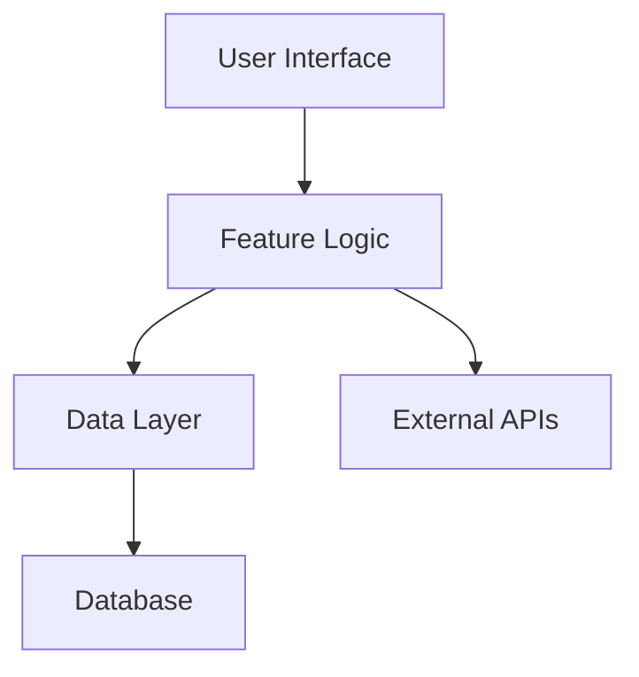

# 📋 Feature Documentation Template

Use this template when documenting new features for the Idling.app project.

## 📝 Template Instructions

1. **Copy this template** to your feature documentation location
2. **Replace placeholders** with your specific information
3. **Delete this instruction section** before publishing
4. **Follow the structure** provided below

---

# [Feature Name]

Brief description of the feature and its purpose.

## 🎯 Overview

### Purpose

Explain why this feature was created and what problem it solves.

### Key Benefits

- **Benefit 1**: Description of the first key benefit
- **Benefit 2**: Description of the second key benefit
- **Benefit 3**: Description of the third key benefit

## 👥 User Stories

### Primary Use Cases

**As a [user type], I want to [action] so that [benefit].**

Example scenarios:

- **Scenario 1**: Detailed description of the first use case
- **Scenario 2**: Detailed description of the second use case
- **Scenario 3**: Detailed description of the third use case

### Edge Cases

Document important edge cases and how they're handled:

- **Edge Case 1**: Description and handling approach
- **Edge Case 2**: Description and handling approach

## 🔧 Technical Specification

### Architecture Overview



### Components

#### Frontend Components

- **Component 1**: `ComponentName` - Description and purpose
- **Component 2**: `ComponentName` - Description and purpose
- **Component 3**: `ComponentName` - Description and purpose

#### Backend Services

- **Service 1**: `ServiceName` - Description and purpose
- **Service 2**: `ServiceName` - Description and purpose

### Data Models

```typescript
interface FeatureData {
  id: string;
  name: string;
  description: string;
  createdAt: Date;
  updatedAt: Date;
}
```

### Database Schema

```sql
CREATE TABLE feature_table (
  id UUID PRIMARY KEY DEFAULT gen_random_uuid(),
  name VARCHAR(255) NOT NULL,
  description TEXT,
  created_at TIMESTAMP DEFAULT NOW(),
  updated_at TIMESTAMP DEFAULT NOW()
);
```

## 🔌 API Documentation

### Endpoints

#### GET /api/feature

**Description**: Retrieve feature data

**Request**:

```bash
curl -X GET "https://api.idling.app/api/feature" \
  -H "Authorization: Bearer YOUR_TOKEN"
```

**Response**:

```json
{
  "success": true,
  "data": {
    "id": "uuid",
    "name": "Feature Name",
    "description": "Feature description"
  }
}
```

#### POST /api/feature

**Description**: Create new feature data

**Request**:

```bash
curl -X POST "https://api.idling.app/api/feature" \
  -H "Authorization: Bearer YOUR_TOKEN" \
  -H "Content-Type: application/json" \
  -d '{
    "name": "New Feature",
    "description": "Feature description"
  }'
```

**Response**:

```json
{
  "success": true,
  "data": {
    "id": "uuid",
    "name": "New Feature",
    "description": "Feature description"
  }
}
```

### Authentication

This feature requires:

- **Authentication**: Valid JWT token
- **Authorization**: `feature:read` and `feature:write` permissions

### Rate Limiting

- **Read operations**: 100 requests per minute
- **Write operations**: 20 requests per minute

## 🧪 Testing Strategy

### Unit Tests

```typescript
describe('FeatureService', () => {
  test('should create feature successfully', async () => {
    const featureData = {
      name: 'Test Feature',
      description: 'Test description'
    };

    const result = await featureService.create(featureData);

    expect(result.success).toBe(true);
    expect(result.data.name).toBe('Test Feature');
  });
});
```

### Integration Tests

```typescript
describe('Feature API', () => {
  test('POST /api/feature should create feature', async () => {
    const response = await request(app)
      .post('/api/feature')
      .send({
        name: 'Integration Test Feature',
        description: 'Test description'
      })
      .expect(201);

    expect(response.body.success).toBe(true);
  });
});
```

### E2E Tests

```typescript
test('user can create and view feature', async ({ page }) => {
  await page.goto('/features');
  await page.click('[data-testid="create-feature-button"]');
  await page.fill('[data-testid="feature-name"]', 'E2E Test Feature');
  await page.fill('[data-testid="feature-description"]', 'E2E description');
  await page.click('[data-testid="submit-button"]');

  await expect(page.locator('[data-testid="feature-list"]')).toContainText(
    'E2E Test Feature'
  );
});
```

### Test Coverage

- **Unit Tests**: 95% coverage minimum
- **Integration Tests**: All API endpoints covered
- **E2E Tests**: Critical user paths covered

## 🚀 Deployment Notes

### Prerequisites

- Database migrations applied
- Environment variables configured
- Feature flags enabled (if applicable)

### Release Steps

1. **Pre-deployment**:

   - [ ] Run full test suite
   - [ ] Verify database migrations
   - [ ] Check environment configuration

2. **Deployment**:

   - [ ] Deploy backend services
   - [ ] Deploy frontend changes
   - [ ] Run smoke tests

3. **Post-deployment**:
   - [ ] Monitor error rates
   - [ ] Verify feature functionality
   - [ ] Update documentation

### Rollback Plan

If issues arise:

1. Disable feature flag (if applicable)
2. Revert to previous deployment
3. Investigate and fix issues
4. Redeploy with fixes

## 📊 Monitoring and Analytics

### Key Metrics

- **Usage Metrics**: Feature adoption rate, user engagement
- **Performance Metrics**: Response times, error rates
- **Business Metrics**: Conversion rates, user satisfaction

### Alerts

- **Error Rate**: Alert if error rate > 1%
- **Response Time**: Alert if p95 > 500ms
- **Usage**: Alert if usage drops > 50%

## 🔗 Related Documentation

- **[API Documentation](../docs/api/)** - Complete API reference
- **[Component Library](../dev/components/)** - UI components used
- **[Testing Guide](../dev/testing/)** - Testing best practices
- **[Deployment Guide](../docs/deployment/)** - Deployment procedures

## 📝 Changelog

### Version 1.0.0 (Initial Release)

- Initial feature implementation
- Basic CRUD operations
- User interface components
- API endpoints
- Test coverage

---

**Last Updated**: {{ site.time | date: "%B %d, %Y" }}
**Author**: [Your Name]
**Reviewers**: [Reviewer Names]
