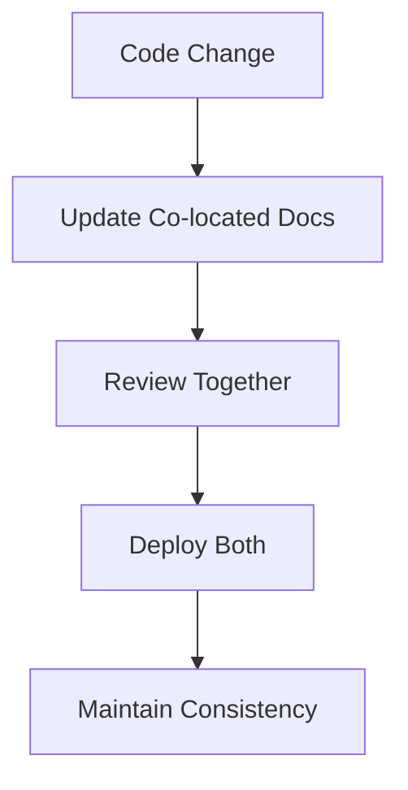

# 📚 Documentation Architecture

## Overview

Idling.app uses a **co-located documentation approach** where documentation lives as close as possible to the code it describes. This architectural decision improves maintainability, reduces documentation drift, and enhances the developer experience.

## 🎯 Co-location Philosophy

### Core Principles

1. **Proximity**: Documentation should live next to the code it documents
2. **Discoverability**: Developers should find docs where they expect them
3. **Maintainability**: Changes to code should prompt documentation updates
4. **Ownership**: Code owners naturally become documentation owners

### Benefits

- **Reduced Context Switching**: Developers don't need to navigate to separate documentation repositories
- **Improved Accuracy**: Documentation is more likely to stay current when it's co-located
- **Better Code Reviews**: Documentation changes are reviewed alongside code changes
- **Faster Onboarding**: New developers find relevant documentation immediately

## 🏗️ Directory Structure

```
idling.app__UI/
├── docs/                      # Generated documentation (build output)
│   ├── _config.yml
│   ├── _layouts/
│   ├── _sass/
│   └── assets/
├── src/                       # Co-located technical documentation
│   ├── app/api/              # API endpoint documentation
│   │   ├── README.md         # API overview
│   │   ├── admin/README.md   # Admin API docs
│   │   └── [endpoint]/README.md
│   ├── components/           # Component documentation
│   │   ├── index.md          # Component library overview
│   │   └── [component]/index.md
│   ├── lib/                  # Library and utility documentation
│   │   ├── index.md          # Library overview
│   │   ├── services/         # Service documentation
│   │   └── utils/            # Utility documentation
│   └── templates/            # Documentation templates
├── community/                # Community and contribution guidelines
│   ├── index.md
│   ├── contributing/
│   └── standards/
├── docs/                     # General project documentation
│   ├── index.md
│   ├── getting-started/
│   ├── architecture/
│   └── deployment/
├── commits/                  # Project management documentation
├── updates/
└── README.md                 # Main project documentation
```

## 📝 Documentation Types and Locations

### 1. Code-Level Documentation

**Location**: Next to the code files  
**Format**: `README.md` or `index.md`  
**Examples**:

- `src/app/api/admin/README.md` - Admin API documentation
- `src/components/rich-input-system/index.md` - Component documentation
- `src/lib/services/RateLimitService.md` - Service documentation

### 2. Feature Documentation

**Location**: In the feature's primary directory  
**Format**: `index.md` or dedicated files  
**Examples**:

- `src/components/navbar/index.md` - Navigation component
- `src/lib/auth-patterns.md` - Authentication patterns

### 3. Community Documentation

**Location**: `community/` directory  
**Format**: Jekyll-compatible markdown  
**Examples**:

- `community/contributing/index.md` - Contribution guidelines
- `community/standards/index.md` - Development standards

### 4. Project Documentation

**Location**: `docs/` directory or root level  
**Format**: Jekyll-compatible markdown  
**Examples**:

- `docs/getting-started/index.md` - Getting started guide
- `docs/architecture/index.md` - System architecture
- `commits/index.md` - Commit guidelines

## 🔧 Implementation Guidelines

### File Naming Conventions

```
# For directories with multiple files
[feature]/index.md

# For single-file documentation
[feature].md

# For API endpoints
[endpoint]/README.md
```

### Jekyll Front Matter

All documentation should include Jekyll front matter:

```yaml
---
layout: default
title: 'Your Title'
description: 'Brief description'
permalink: /your-path/
parent: Parent Section (optional)
nav_order: 1 (optional)
---
```

### Cross-Reference Patterns

#### Relative Links (Preferred)

```markdown
# Within same directory

[Component](./component-name/)

# Parent directory

[Overview](../index.md)

# Sibling directories

[Related Feature](../sibling-feature/)
```

#### Absolute Links (For Jekyll)

```markdown
# For Jekyll navigation

[API Documentation](/api/)
[Components](/components/)
```

## 🔍 Search and Discovery

### Search Strategy

1. **File-based Search**: Use IDE/editor search capabilities
2. **Content Search**: Grep/ripgrep for content within documentation
3. **Jekyll Search**: Site-wide search through Jekyll plugins
4. **Link Validation**: Automated link checking for broken references

### Indexing Approach

```bash
# Generate documentation index
find . -name "*.md" -type f | grep -E "(README|index)" | sort

# Search documentation content
grep -r "search term" --include="*.md" .

# Find broken links
grep -r "\[.*\](" --include="*.md" . | grep -v "http"
```

## 📊 Maintenance Workflows

### Documentation Updates

1. **Code Changes**: Update co-located documentation in same PR
2. **Feature Additions**: Create documentation in feature directory
3. **API Changes**: Update endpoint README files
4. **Architecture Changes**: Update system documentation

### Link Validation

```bash
# Check for broken internal links
find . -name "*.md" -exec grep -l "\[.*\](" {} \; | \
  xargs grep -o "\[.*\]([^)]*)" | \
  grep -v "http" | \
  # Validate each link exists
```

### Content Auditing

Regular audits should check:

- [ ] All code directories have appropriate documentation
- [ ] Links between documentation files work correctly
- [ ] Documentation is up-to-date with code changes
- [ ] Jekyll front matter is consistent

## 🎨 Visual Documentation

### Diagrams and Charts

Use Mermaid for technical diagrams:



### Screenshots and Examples

- Include visual examples for UI components
- Provide code examples with expected outputs
- Show before/after comparisons for changes

## 🚀 Migration Strategy

### From Centralized to Co-located

1. **Identify Documentation**: Catalog existing centralized docs
2. **Map to Code**: Determine appropriate co-located positions
3. **Move Files**: Relocate documentation to co-located positions
4. **Update Links**: Fix all cross-references
5. **Validate**: Ensure all links work correctly

### Link Update Process

```bash
# Example: Moving API docs from docs/api/ to src/app/api/
# Update all references:
find . -name "*.md" -exec sed -i 's|docs/api/|src/app/api/|g' {} \;
```

## 🔧 Tools and Automation

### Recommended Tools

- **Link Checking**: `markdown-link-check` or custom scripts
- **Content Search**: `ripgrep` for fast content search
- **Documentation Generation**: JSDoc for code documentation
- **Jekyll Plugins**: For enhanced search and navigation

### Automation Scripts

```bash
#!/bin/bash
# docs-check.sh - Validate documentation structure

# Check for missing documentation
find src -type d -name "components" -exec test -f {}/index.md \; || echo "Missing component docs"

# Validate links
find . -name "*.md" -exec markdown-link-check {} \;

# Generate documentation index
find . -name "*.md" -type f | sort > .docs-index
```

## 📈 Success Metrics

### Quantitative Metrics

- **Documentation Coverage**: Percentage of code directories with documentation
- **Link Health**: Percentage of working internal links
- **Update Frequency**: Documentation updates per code change
- **Search Success**: Successful documentation searches

### Qualitative Metrics

- **Developer Satisfaction**: Ease of finding relevant documentation
- **Onboarding Time**: Time for new developers to find needed information
- **Maintenance Burden**: Effort required to keep documentation current
- **Consistency**: Uniformity across documentation

## 🔗 Related Resources

- [Docusaurus Documentation](https://docusaurus.io/docs)
- [Markdown Guide](https://www.markdownguide.org/)
- [Documentation Best Practices](https://www.writethedocs.org/guide/)
- [Co-location Benefits](https://martinfowler.com/bliki/DocumentationAsCode.html)

---

_This documentation architecture is continuously evolved based on team feedback and industry best practices. Last updated: {{ site.time | date: "%B %d, %Y" }}_
