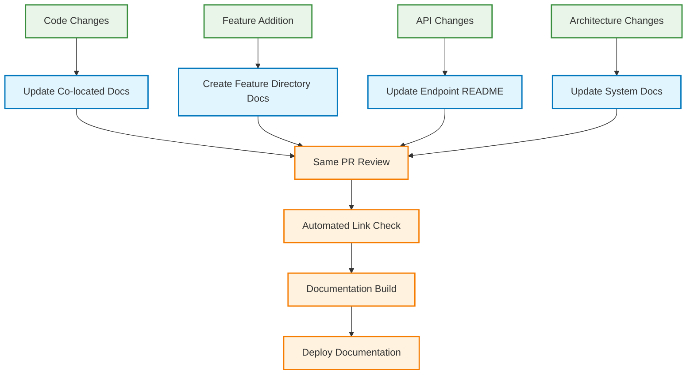
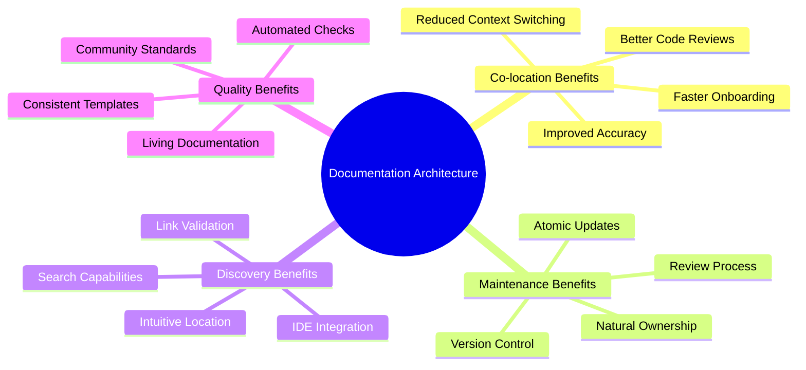

# 📚 Documentation Architecture

## Overview

Idling.app uses a **co-located documentation approach** where documentation lives as close as possible to the code it describes. This architectural decision improves maintainability, reduces documentation drift, and enhances the developer experience.

## 🎯 Co-location Philosophy

### Core Principles

1. **Proximity**: Documentation should live next to the code it documents
2. **Discoverability**: Developers should find docs where they expect them
3. **Maintainability**: Changes to code should prompt documentation updates
4. **Ownership**: Code owners naturally become documentation owners

### Benefits

- **Reduced Context Switching**: Developers don't need to navigate to separate documentation repositories
- **Improved Accuracy**: Documentation is more likely to stay current when it's co-located
- **Better Code Reviews**: Documentation changes are reviewed alongside code changes
- **Faster Onboarding**: New developers find relevant documentation immediately

## 🏗️ Directory Structure

```mermaid
graph TD
    A[idling.app__UI/] --> B[src/]
    A --> C[docs/]
    A --> D[community/]
    A --> E[commits/]
    A --> F[README.md]

    B --> G[app/api/]
    B --> H[components/]
    B --> I[lib/]
    B --> J[templates/]

    G --> K[README.md<br/>API Overview]
    G --> L[admin/README.md<br/>Admin API docs]
    G --> M[[endpoint]/README.md<br/>Endpoint docs]

    H --> N[index.md<br/>Component library]
    H --> O[[component]/index.md<br/>Component docs]

    I --> P[index.md<br/>Library overview]
    I --> Q[services/<br/>Service docs]
    I --> R[utils/<br/>Utility docs]

    J --> S[Documentation<br/>Templates]

    C --> T[Generated<br/>Documentation]
    D --> U[Community<br/>Guidelines]
    E --> V[Project<br/>Management]

    classDef colocated fill:#e1f5fe,stroke:#0277bd,stroke-width:2px
    classDef generated fill:#f3e5f5,stroke:#7b1fa2,stroke-width:2px
    classDef community fill:#e8f5e8,stroke:#388e3c,stroke-width:2px

    class G,H,I,J,K,L,M,N,O,P,Q,R,S colocated
    class C,T generated
    class D,E,U,V community
```

## 📝 Documentation Types and Locations

### 1. Code-Level Documentation

**Location**: Next to the code files  
**Format**: `README.md` or `index.md`  
**Examples**:

- `src/app/api/admin/README.md` - Admin API documentation
- `src/app/components/rich-input-system/` - Component documentation
- `src/lib/services/RateLimitService.md` - Service documentation

### 2. Feature Documentation

**Location**: In the feature's primary directory  
**Format**: `index.md` or dedicated files  
**Examples**:

- `src/app/components/navbar/` - Navigation component
- `src/lib/auth-patterns.md` - Authentication patterns

### 3. Community Documentation

**Location**: `community/` directory  
**Format**: Jekyll-compatible markdown  
**Examples**:

- `community/contributing/index.md` - Contribution guidelines
- `community/standards/index.md` - Development standards

### 4. Project Documentation

**Location**: `docs/` directory or root level  
**Format**: Jekyll-compatible markdown  
**Examples**:

- `docs/getting-started/index.md` - Getting started guide
- `docs/architecture/index.md` - System architecture
- `commits/index.md` - Commit guidelines

## 🔧 Implementation Guidelines

### File Naming Conventions

```
# For directories with multiple files
[feature]/index.md

# For single-file documentation
[feature].md

# For API endpoints
[endpoint]/README.md
```

### Jekyll Front Matter

All documentation should include Jekyll front matter:

```yaml
---
layout: default
title: 'Your Title'
description: 'Brief description'
permalink: /your-path/
parent: Parent Section (optional)
nav_order: 1 (optional)
---
```

### Cross-Reference Patterns

```mermaid
graph LR
    A[Current Doc] --> B[Relative Links]
    A --> C[Absolute Links]

    B --> D[./component-name/<br/>Within Directory]
    B --> E[../index.md<br/>Parent Directory]
    B --> F[../sibling-feature/<br/>Sibling Directory]

    C --> G[/api/<br/>Jekyll Navigation]
    C --> H[/components/<br/>Jekyll Navigation]

    classDef preferred fill:#e8f5e8,stroke:#388e3c,stroke-width:2px
    classDef jekyll fill:#fff3e0,stroke:#f57c00,stroke-width:2px

    class B,D,E,F preferred
    class C,G,H jekyll
```

#### Relative Links (Preferred)

```markdown
# Within same directory

[Component](./component-name/)

# Parent directory

[Overview](../index.md)

# Sibling directories

[Related Feature](../sibling-feature/)
```

#### Absolute Links (For Jekyll)

```markdown
# For Jekyll navigation

[API Documentation](/api/)
[Components](/components/)
```

## 🔍 Search and Discovery

### Search Strategy

```mermaid
flowchart TD
    A[Documentation Search] --> B[File-based Search]
    A --> C[Content Search]
    A --> D[Jekyll Search]
    A --> E[Link Validation]

    B --> F[IDE/Editor Search]
    B --> G[find . -name "*.md"]

    C --> H[grep/ripgrep]
    C --> I[Content Indexing]

    D --> J[Site-wide Search]
    D --> K[Jekyll Plugins]

    E --> L[Automated Link Checking]
    E --> M[CI/CD Integration]

    classDef search fill:#e3f2fd,stroke:#1976d2,stroke-width:2px
    classDef validation fill:#fce4ec,stroke:#c2185b,stroke-width:2px

    class A,B,C,D,F,G,H,I,J,K search
    class E,L,M validation
```

1. **File-based Search**: Use IDE/editor search capabilities
2. **Content Search**: Grep/ripgrep for content within documentation
3. **Jekyll Search**: Site-wide search through Jekyll plugins
4. **Link Validation**: Automated link checking for broken references

### Indexing Approach

```bash
# Generate documentation index
find . -name "*.md" -type f | grep -E "(README|index)" | sort

# Search documentation content
grep -r "search term" --include="*.md" .

# Find broken links
grep -r "\[.*\](" --include="*.md" . | grep -v "http"
```

## 📊 Maintenance Workflows

### Documentation Updates



1. **Code Changes**: Update co-located documentation in same PR
2. **Feature Additions**: Create documentation in feature directory
3. **API Changes**: Update endpoint README files
4. **Architecture Changes**: Update system documentation

### Link Validation

```bash
# Check for broken internal links
find . -name "*.md" -exec grep -l "\[.*\](" {} \; | \
  xargs grep -o "\[.*\]([^)]*)" | \
  grep -v "http" | \
  while read line; do
    # Extract link path and validate
    echo "Checking: $line"
  done
```

## 🚀 Benefits of This Architecture



## 📋 Implementation Checklist

- [ ] **File Structure**: Organize docs using co-location principles
- [ ] **Templates**: Use standardized documentation templates
- [ ] **Front Matter**: Include proper Jekyll front matter
- [ ] **Links**: Use relative links for internal references
- [ ] **Search**: Implement content search and indexing
- [ ] **Validation**: Set up automated link checking
- [ ] **Maintenance**: Establish documentation update workflows

---

_This documentation architecture ensures that knowledge stays close to code, making it easier to maintain, discover, and trust._
