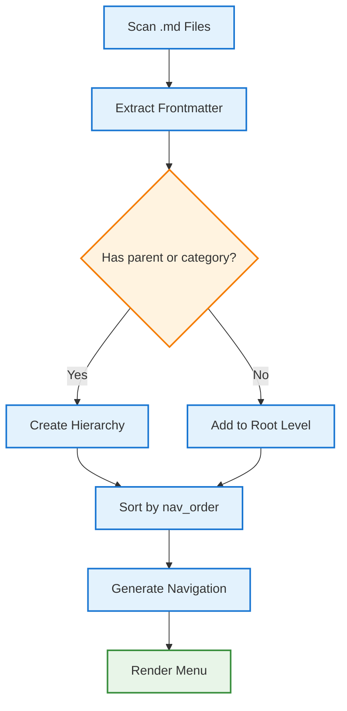
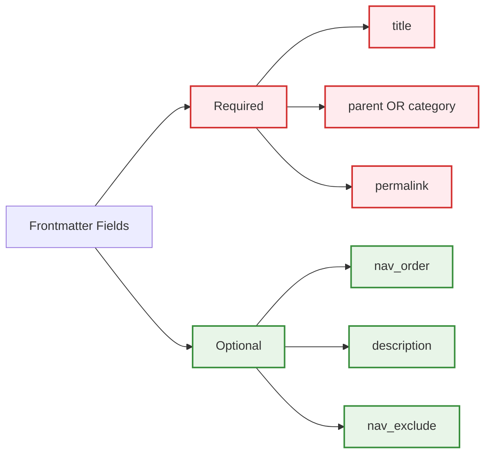
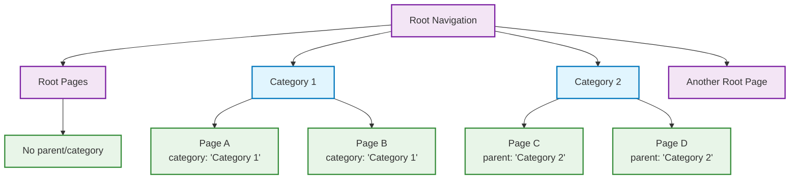
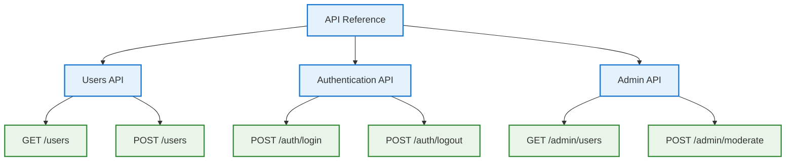
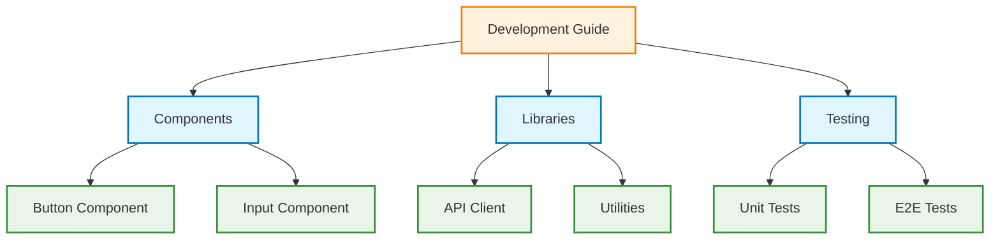
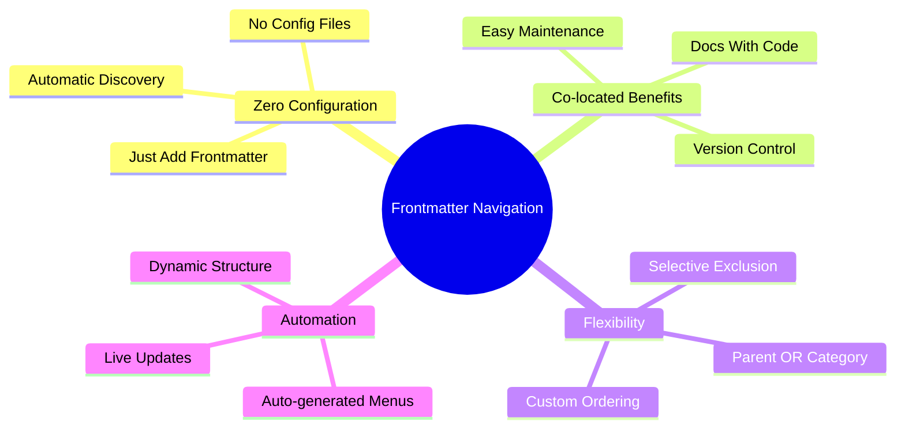
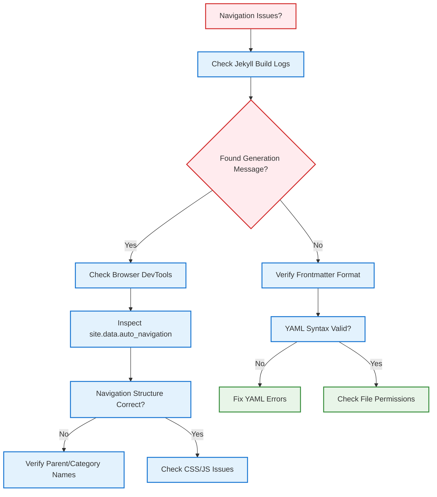
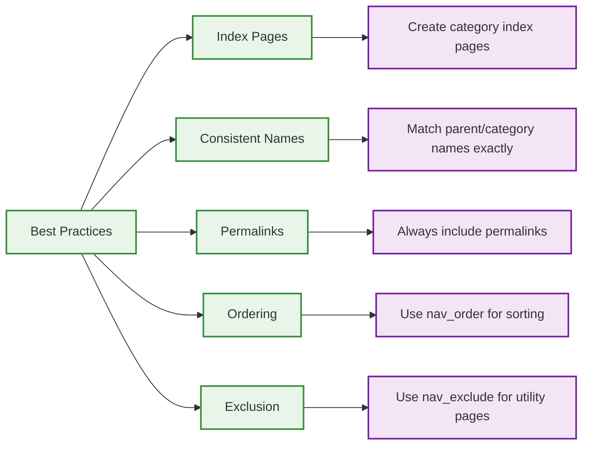

# 🧙‍♂️ Frontmatter Navigation Guide

This project uses a **pure frontmatter-driven navigation system** that automatically generates navigation from your markdown files. No complex configuration needed!

## 🎯 How It Works



The system scans all `.md` files in your project and builds navigation based on two simple frontmatter fields:

- `parent` - Creates parent-child relationships
- `category` - Groups pages into categories

## 📝 Basic Usage

### Root-Level Pages

```yaml
---
title: 'Getting Started'
description: 'Setup and installation guide'
permalink: /getting-started/
---
```

### Category Pages

```yaml
---
title: 'Component Documentation'
description: 'React component library'
category: 'Development'
permalink: /development/components/
nav_order: 1
---
```

### Child Pages (Using Parent)

```yaml
---
title: 'Button Component'
description: 'Reusable button component'
parent: 'Development'
permalink: /development/components/button/
nav_order: 2
---
```

### Child Pages (Using Category)

```yaml
---
title: 'Installation Guide'
description: 'How to install the project'
category: 'Getting Started'
permalink: /getting-started/installation/
nav_order: 1
---
```

## 🔧 Frontmatter Fields



### Required Fields (at least one)

- `parent` - Name of the parent category/section
- `category` - Name of the category this page belongs to
- `title` + `permalink` - For root-level pages

### Optional Fields

- `nav_order` - Sort order within category (default: 999)
- `description` - Shown in navigation tooltips
- `nav_exclude: true` - Exclude from navigation entirely

## 🏗️ Navigation Structure



The system creates this hierarchy:

```
Root Pages (no parent/category)
├── Category 1
│   ├── Page A (category: "Category 1")
│   └── Page B (category: "Category 1")
├── Category 2
│   ├── Page C (parent: "Category 2")
│   └── Page D (parent: "Category 2")
└── Another Root Page
```

## 📋 Examples

### API Documentation Structure



```yaml
# src/app/api/index.md
---
title: 'API Reference'
description: 'Complete API documentation'
permalink: /api/
---
# src/app/api/users/index.md
---
title: 'Users API'
description: 'User management endpoints'
category: 'API Reference'
permalink: /api/users/
nav_order: 1
---
# src/app/api/auth/index.md
---
title: 'Authentication API'
description: 'Auth endpoints and flows'
category: 'API Reference'
permalink: /api/auth/
nav_order: 2
---
```

### Development Documentation



```yaml
# development.md
---
title: 'Development Guide'
description: 'Development tools and resources'
permalink: /development/
---
# src/app/components/index.md
---
title: 'Components'
description: 'UI component library'
parent: 'Development Guide'
permalink: /development/components/
nav_order: 1
---
# src/lib/index.md
---
title: 'Libraries'
description: 'Shared utilities and services'
parent: 'Development Guide'
permalink: /development/libraries/
nav_order: 2
---
```

## 🚀 Benefits



✅ **Zero Configuration** - Just add frontmatter  
✅ **Co-located** - Documentation lives with code  
✅ **Automatic** - Navigation updates when you add files  
✅ **Flexible** - Use parent OR category as needed  
✅ **Ordered** - Control sort order with nav_order

## 🔍 Debugging



To see the generated navigation structure, check:

- Jekyll build logs: `Dynamic Navigation: Generated navigation with X sections from Y pages`
- Browser dev tools: `site.data.auto_navigation` in Jekyll templates

## 💡 Tips



1. **Index Pages**: Create index pages for categories (e.g., `/development/index.md`)
2. **Consistent Names**: Use exact same parent/category names across files
3. **Permalinks**: Always include permalinks for predictable URLs
4. **Ordering**: Use nav_order to control sort order within categories
5. **Exclusion**: Use `nav_exclude: true` to hide utility pages from navigation

That's it! 🎉 Just add the frontmatter fields and the navigation builds itself automatically!
