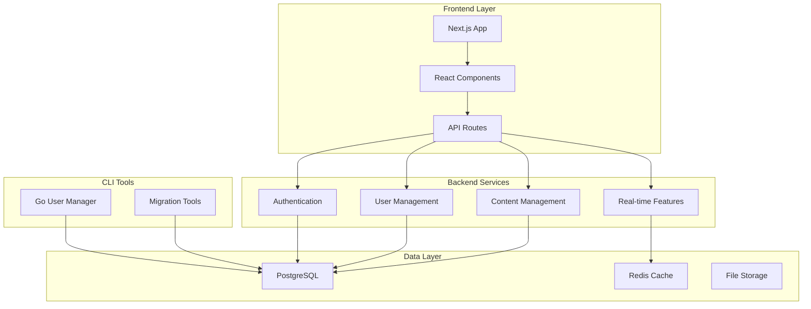

# 🏗️ Architecture Overview

High-level system architecture and design patterns for Idling.app.

## 🎯 System Overview

Idling.app is a modern web application built with Next.js, featuring a microservices-oriented architecture with PostgreSQL database and Go-based CLI tools.

## 🏛️ Core Principles

- **Co-located Documentation**: Documentation lives next to code
- **Type Safety**: Full TypeScript coverage
- **Component-Driven**: Reusable UI components
- **API-First**: RESTful API design
- **Container-Ready**: Docker-based deployment

## 📊 Technology Stack

### Frontend

- **Framework**: Next.js 14 with App Router
- **Language**: TypeScript
- **Styling**: CSS Modules + Tailwind CSS
- **State Management**: React Context + Zustand
- **Authentication**: NextAuth.js

### Backend

- **Runtime**: Node.js 18+
- **Database**: PostgreSQL 15
- **ORM**: Custom SQL with prepared statements
- **Caching**: Redis (planned)
- **File Storage**: Local/S3 (configurable)

### CLI Tools

- **Language**: Go 1.21+
- **UI Framework**: Bubble Tea TUI
- **Database**: PostgreSQL direct connection

## 🔧 Key Components

### Authentication System

- JWT-based authentication
- Role-based access control
- Session management
- OAuth integration support

### User Management

- User profiles and preferences
- Subscription management
- Activity tracking
- Admin tools

### Content System

- Rich text editing
- Media management
- Real-time collaboration
- Version control

## 📚 Architecture Guides

- [🏛️ System Design](/architecture/system/) - Detailed system architecture
- [📊 Architecture Diagrams](/diagrams/) - Visual documentation
- [🔐 Security Architecture](/architecture/security/) - Security patterns
- [📊 Performance Architecture](/architecture/performance/) - Performance optimization

## 🚀 Deployment Architecture

### Development

- Docker Compose for local development
- Hot reload for rapid iteration
- Integrated testing environment

### Production

- Container orchestration (Docker/Kubernetes)
- Load balancing and auto-scaling
- Monitoring and observability
- CI/CD pipeline integration

---

**This documentation is under development. [Contribute to expand this documentation](/community/contributing/).**
