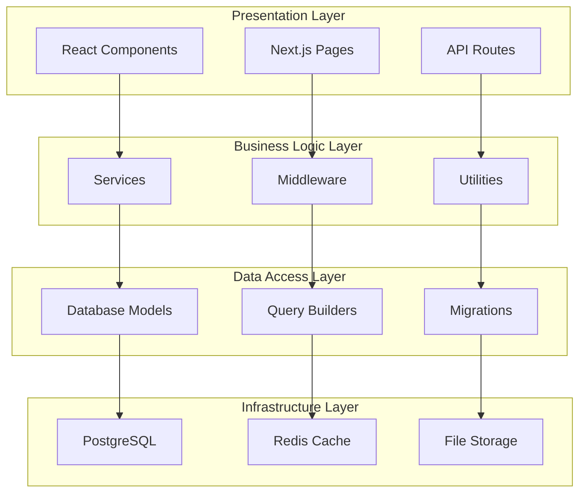

# 🏛️ System Design

Detailed system architecture and design patterns for Idling.app.

## 🎯 Architecture Overview

Idling.app follows a layered architecture pattern with clear separation of concerns.

## 🔧 Core Components

### Frontend Architecture

- **Next.js App Router**: Modern routing and layouts
- **React Server Components**: Server-side rendering
- **Client Components**: Interactive UI elements
- **API Routes**: Backend API endpoints

### Backend Services

- **Authentication Service**: User auth and sessions
- **User Management Service**: Profile and permissions
- **Content Service**: Rich text and media
- **Notification Service**: Real-time updates

### Data Layer

- **PostgreSQL**: Primary database
- **Redis**: Caching and sessions
- **File Storage**: Media and uploads

---

_This is a stub file. [Contribute to expand this documentation](/community/contributing/)._
