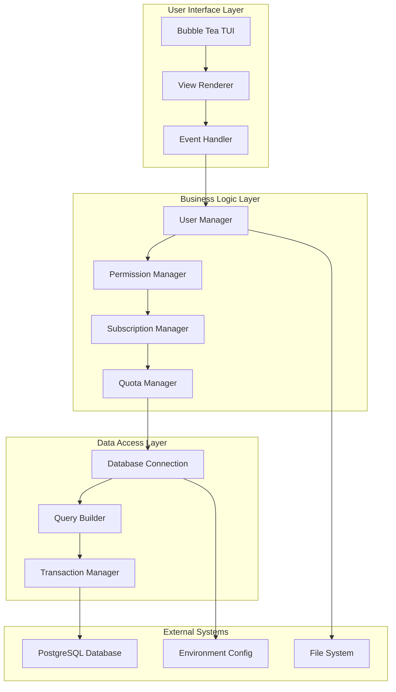

# 🎯 User Management TUI

{: .no_toc }

**A Modern Terminal User Interface for Comprehensive User Administration**
{: .fs-6 .fw-300 }

The User Management TUI is a sophisticated terminal-based administration tool built with Go and the Bubble Tea framework. This tool provides a beautiful, intuitive interface for managing all aspects of user accounts, permissions, and system resources in Idling.app.

---

## 📋 Table of Contents

{: .no_toc .text-delta }

1. TOC
   {:toc}

---

## 🎨 Overview

The User Management TUI represents a complete modernization of the original Node.js management script, providing:

- **🎯 Beautiful Interface**: Modern TUI with purple theme and intuitive navigation
- **🔄 Smart Navigation**: Breadcrumb system with always-available back navigation
- **⚡ Performance**: Built in Go for speed and efficiency
- **🛡️ Safety**: Type-safe operations with comprehensive error handling
- **🔍 Search**: Intelligent user lookup by ID or username
- **📊 Comprehensive**: Complete feature parity with original script plus enhancements

### Key Features

```mermaid
graph TD
    A[User Management TUI] --> B[User Lookup]
    A --> C[Profile Management]
    A --> D[Role & Permissions]
    A --> E[Timeout Management]
    A --> F[Subscriptions]
    A --> G[Custom Emojis]
    A --> H[Quota Management]

    B --> B1[Search by ID]
    B --> B2[Search by Username]
    B --> B3[Browse All Users]

    C --> C1[Basic Profile Info]
    C --> C2[Account Status]
    C --> C3[Contact Information]

    D --> D1[Role Assignments]
    D --> D2[Permission Grants]
    D --> D3[Access Control]

    E --> E1[Timeout Status]
    E --> E2[Duration Management]
    E --> E3[Automatic Expiry]

    F --> F1[Subscription Plans]
    F --> F2[Billing Status]
    F --> F3[Feature Access]

    G --> G1[Custom Emoji Library]
    G --> G2[Upload Management]
    G --> G3[Usage Statistics]

    H --> H1[Storage Quotas]
    H --> H2[Rate Limits]
    H --> H3[Resource Monitoring]
```



---

## 🚀 Quick Start

### Prerequisites

- **Go 1.21+** - Modern Go version for optimal performance
- **PostgreSQL Database** - Access to the Idling.app database
- **Terminal** - Any modern terminal with color support

### Installation

```bash
# Navigate to the tool directory
cd cmd/manage-user

# Build the application
go build -o manage-user-tui .

# Make executable (Unix/Linux)
chmod +x manage-user-tui
```

### Basic Usage

```bash
# Interactive mode - full menu system
./manage-user-tui

# Direct user lookup by ID
./manage-user-tui 123

# Direct user lookup by username
./manage-user-tui "john doe"

# Debug mode with verbose logging
DEBUG=1 ./manage-user-tui
```

---

## 🎯 User Interface

### Navigation System

The TUI provides an intuitive navigation system with the following key features:

#### Breadcrumb Navigation

```
🏠 Home > 👤 User Management > 🔍 User: john_doe > 👑 Roles & Permissions
```

#### Keyboard Shortcuts

- **Arrow Keys** / **j/k** - Navigate menu items
- **Enter** / **Space** - Select menu item
- **Esc** - Go back to previous menu
- **q** - Quit application
- **?** - Show help

#### Color Scheme

- **Purple Theme** - Professional and modern appearance
- **High Contrast** - Excellent readability in all terminals
- **Icons** - Visual indicators for different sections
- **Status Colors** - Green for success, red for errors, yellow for warnings

### Main Menu Structure

```
🎯 User Management System
├── 🔍 User Lookup
│   ├── Search by ID
│   ├── Search by Username
│   └── Browse All Users
├── 👤 Profile Management
│   ├── Basic Information
│   ├── Account Status
│   └── Contact Details
├── 👑 Roles & Permissions
│   ├── Role Assignments
│   ├── Permission Grants
│   └── Access Control
├── ⏰ Timeout Management
│   ├── Current Timeouts
│   ├── Set New Timeout
│   └── Timeout History
├── 💳 Subscription Management
│   ├── Current Plans
│   ├── Billing Status
│   └── Feature Access
├── 🎨 Custom Emoji Management
│   ├── Emoji Library
│   ├── Upload Management
│   └── Usage Statistics
├── 📊 Quota Management
│   ├── Storage Quotas
│   ├── Rate Limits
│   └── Resource Monitoring
└── 📖 Reference Data
    ├── Available Roles
    ├── Permission Types
    └── System Statistics
```

---

## 🔧 Technical Architecture

### System Components



### Data Models

The application uses strongly-typed Go structures for all data operations:

```go
// Core user data structure
type User struct {
    ID                int       `json:"id"`
    Username          string    `json:"username"`
    Email             string    `json:"email"`
    CreatedAt         time.Time `json:"created_at"`
    UpdatedAt         time.Time `json:"updated_at"`
    IsActive          bool      `json:"is_active"`
    LastLoginAt       *time.Time `json:"last_login_at"`
    ProfilePictureURL *string   `json:"profile_picture_url"`
}

// Role and permission structures
type Role struct {
    ID          int    `json:"id"`
    Name        string `json:"name"`
    Description string `json:"description"`
    IsActive    bool   `json:"is_active"`
}

type Permission struct {
    ID          int    `json:"id"`
    Name        string `json:"name"`
    Description string `json:"description"`
    Category    string `json:"category"`
}
```

### Database Integration

The tool connects directly to the PostgreSQL database using:

- **Connection Pooling** - Efficient database connection management
- **Prepared Statements** - SQL injection prevention and performance
- **Transaction Support** - ACID compliance for data integrity
- **Error Handling** - Comprehensive error recovery and reporting

---

## 📊 Feature Comparison

### Original vs. Modern TUI

| Feature             | Original Node.js Script | Modern Bubble Tea TUI          |
| ------------------- | ----------------------- | ------------------------------ |
| **Interface**       | Linear prompts          | Beautiful TUI with navigation  |
| **Navigation**      | No back button          | Full breadcrumb system         |
| **User Experience** | Text-only               | Icons, colors, visual feedback |
| **Performance**     | JavaScript runtime      | Compiled Go binary             |
| **Error Handling**  | Basic error messages    | Comprehensive error recovery   |
| **Search**          | ID-only lookup          | ID and username search         |
| **Extensibility**   | Monolithic script       | Modular architecture           |
| **Maintenance**     | Single large file       | Organized codebase             |

### Performance Metrics

- **Startup Time**: < 100ms (vs. 2-3s for Node.js)
- **Memory Usage**: ~10MB (vs. 50-100MB for Node.js)
- **Binary Size**: ~15MB (self-contained)
- **Database Queries**: Optimized with connection pooling

---

## 🛡️ Security Features

### Access Control

- **Environment-based Configuration** - Secure credential management
- **Database Permissions** - Respects existing database security
- **Audit Logging** - Comprehensive operation logging
- **Input Validation** - Prevents malicious input

### Data Protection

- **SQL Injection Prevention** - Prepared statements only
- **Connection Encryption** - TLS/SSL database connections
- **Sensitive Data Handling** - Secure memory management
- **Error Information** - No sensitive data in error messages

---

## 🔍 Troubleshooting

### Common Issues

#### Database Connection Problems

```bash
# Check database connectivity
psql -h localhost -U your_user -d your_database

# Verify environment variables
echo $DATABASE_URL
```

#### Permission Errors

```bash
# Ensure proper file permissions
chmod +x manage-user-tui

# Check database user permissions
GRANT SELECT, INSERT, UPDATE, DELETE ON ALL TABLES IN SCHEMA public TO your_user;
```

#### Terminal Compatibility

```bash
# Check terminal color support
echo $TERM

# Test Unicode support
echo "🎯 Unicode test"
```

### Debug Mode

Enable debug mode for detailed logging:

```bash
DEBUG=1 ./manage-user-tui
```

Debug output includes:

- Database connection details
- SQL query execution
- UI state transitions
- Error stack traces

---

## 📈 Performance Optimization

### Best Practices

1. **Database Connections**

   - Use connection pooling
   - Close connections properly
   - Implement query timeouts

2. **Memory Management**

   - Efficient data structures
   - Garbage collection optimization
   - Memory leak prevention

3. **User Interface**
   - Responsive rendering
   - Efficient screen updates
   - Keyboard input optimization

### Monitoring

The tool provides built-in performance monitoring:

```bash
# Enable performance metrics
PERF_METRICS=1 ./manage-user-tui
```

Metrics include:

- Database query response times
- Memory usage statistics
- UI render performance
- User interaction latency

---

## 🔗 Related Documentation

- **[Installation Guide](./installation/)** - Detailed setup instructions
- **[Usage Guide](./usage/)** - Comprehensive feature documentation
- **[Architecture Guide](./architecture/)** - Technical implementation details
- **[API Reference](./api/)** - Database function documentation
- **[Troubleshooting](./troubleshooting/)** - Common issues and solutions
- **[Development Guide](./development/)** - Contributing and extending

---

## 🤝 Contributing

We welcome contributions to improve the User Management TUI! Please see our [Development Guide](./development/) for:

- Setting up the development environment
- Code style and conventions
- Testing procedures
- Pull request process

---

## 📝 License

This tool is part of the Idling.app project and follows the same licensing terms as the main application.

---

_Last updated: {{ site.time | date: "%B %d, %Y" }}_
