# SVG to PNG Converter Service - Transform Vector Images to Raster Format

## What this page is about

This page explains our standalone SVG to PNG conversion service that transforms vector graphics into high-quality raster images. Whether you're a developer building an app, a designer needing converted assets, or a business owner wanting to understand our image processing capabilities, this guide will help you understand what this service does and how to use it effectively.

## What Does This Actually Do?

Think of this service like a universal translator for images. Just as you might use Google Translate to convert text from one language to another, our service converts SVG (vector) images into PNG (raster) format.

**In simple terms:**

- **SVG** = Like a recipe for drawing something (mathematical instructions)
- **PNG** = Like a photograph of the finished drawing (actual pixels)

Imagine you have blueprint instructions for building a house (SVG), and you want an actual photograph of what the house looks like (PNG). Our service takes those blueprints and creates the photograph for you.

## Why Do We Need This?

Different situations call for different image formats:

### For Developers 👩‍💻

- **Social media sharing**: Most platforms need PNG/JPG for previews
- **Email campaigns**: Better compatibility across email clients
- **Print materials**: High-resolution PNGs for professional printing
- **Mobile apps**: Optimized raster images for faster loading

### For Designers 🎨

- **Client presentations**: Show how designs will look as final images
- **Asset export**: Convert design systems to implementation-ready files
- **Cross-platform compatibility**: Ensure designs work everywhere

### For Business Users 📊

- **Marketing materials**: Convert branded graphics for various channels
- **Documentation**: Include visual elements in reports and presentations
- **Website optimization**: Right format for the right use case

## How It Works (The Simple Version)


### Step-by-Step Process

1. **You send us SVG content** - Either as text or file upload
2. **We validate it's safe** - Check for security issues and malicious code
3. **We check the format** - Make sure it's a valid SVG structure
4. **We render it** - Draw the SVG on a virtual canvas
5. **We convert to PNG** - Save the canvas as a high-quality PNG image
6. **You get your file** - Download directly or receive as API response

## Visual Flow Diagram

```mermaid
sequenceDiagram
    participant Client
    participant API
    participant Validator
    participant Converter
    participant Canvas

    Client->>API: POST /api/svg-to-png
    API->>Validator: Check SVG safety
    Validator-->>API: ✅ Safe to proceed
    API->>Converter: Initialize conversion
    Converter->>Canvas: Render SVG
    Canvas-->>Converter: Image data
    Converter-->>API: PNG blob + metadata
    API-->>Client: PNG file or JSON response
```



## Different Ways This Gets Used

### 1. Simple Conversion (Most Common)

**What it does:** Convert one SVG to PNG with default settings
**Best for:** Quick conversions, testing, simple graphics

```javascript
// Example API call
fetch('/api/svg-to-png', {
  method: 'POST',
  headers: { 'Content-Type': 'application/json' },
  body: JSON.stringify({
    svgContent: '<svg>...</svg>',
    format: 'binary' // Download the file directly
  })
});
```

### 2. Advanced Conversion (Power Users)

**What it does:** Fine-tune quality, size, and other settings
**Best for:** Professional workflows, specific requirements

```javascript
// Example with advanced options
fetch('/api/svg-to-png', {
  method: 'POST',
  headers: { 'Content-Type': 'application/json' },
  body: JSON.stringify({
    svgContent: '<svg>...</svg>',
    options: {
      scale: 2, // 2x larger output
      quality: 0.9, // High quality (0.1-1.0)
      maxWidth: 1920, // Limit maximum width
      backgroundColor: '#ffffff' // White background
    },
    filename: 'my-logo.png'
  })
});
```

### 3. Batch Processing (Enterprise)

**What it does:** Convert multiple SVGs at once
**Best for:** Bulk operations, automated workflows

```javascript
// Example batch conversion
fetch('/api/svg-to-png', {
  method: 'POST',
  headers: { 'Content-Type': 'application/json' },
  body: JSON.stringify({
    conversions: [
      { id: 'logo', svgContent: '<svg>...</svg>' },
      { id: 'icon', svgContent: '<svg>...</svg>', options: { scale: 0.5 } }
    ]
  })
});
```

## Configuration Options Explained


### Quality Settings

- **Quality (0.1-1.0)**: Higher = better quality, larger file
- **Scale Factor**: Multiply original size (2.0 = double size)
- **Background**: Transparent (default) or solid color

### Size Controls

- **Max Width/Height**: Prevent oversized outputs
- **Maintain Aspect Ratio**: Keep original proportions
- **Custom Dimensions**: Specify exact output size

### Response Formats

- **Binary**: Direct file download (for browsers)
- **JSON**: Metadata + base64 image data (for APIs)
- **Batch**: Multiple conversions in one request

## Performance & Limits


### Current Limits

- **Max SVG Size**: 10MB per file
- **Batch Size**: 10 conversions per request
- **Timeout**: 30 seconds per conversion
- **Concurrent**: 5 simultaneous conversions

### Typical Performance

- **Small icons** (< 50KB): ~100-200ms
- **Medium graphics** (< 500KB): ~300-800ms
- **Large illustrations** (< 5MB): ~1-3 seconds

## When Things Go Wrong

Don't worry if something doesn't work right away! Here are the most common issues and how to fix them:

### "SVG validation failed"

**What it means:** The SVG content has security or format issues
**How to fix:**

1. Remove any `<script>` tags from your SVG
2. Check that your SVG has proper opening/closing tags
3. Try a simpler SVG to test the service first

### "Conversion timed out"

**What it means:** The SVG is too complex or large to process quickly
**How to fix:**

1. Reduce the SVG file size
2. Simplify complex graphics
3. Try converting in smaller batches

### "Invalid content type"

**What it means:** The request format isn't correct
**How to fix:**

1. Make sure you're sending JSON: `Content-Type: application/json`
2. Check your request body is valid JSON
3. Include the required `svgContent` field

### "Batch size exceeded"

**What it means:** You're trying to convert too many files at once
**How to fix:**

1. Split your batch into groups of 10 or fewer
2. Process batches sequentially
3. Consider using the single conversion endpoint

## Getting Help

### For Developers

- **API Documentation**: Full technical specs with examples
- **Code Samples**: Ready-to-use implementations
- **Error Codes**: Complete list of error types and solutions

### For Designers

- **Best Practices**: How to prepare SVGs for conversion
- **Quality Guidelines**: Getting the best results
- **Tool Integration**: Using with design software

### For Everyone Else

- **FAQ**: Common questions and answers
- **Support**: How to get help when stuck
- **Examples**: Real-world use cases and solutions

## Technical Implementation Details

### Security Features

- **Content Validation**: Scans for malicious code
- **Size Limits**: Prevents resource exhaustion
- **Timeout Protection**: Stops runaway processes
- **Input Sanitization**: Cleans potentially dangerous content

### Supported Features

- **Transparency**: Maintains PNG alpha channel
- **High DPI**: Supports retina/high-resolution displays
- **Color Accuracy**: Preserves original color profiles
- **Vector Fidelity**: Maintains crisp edges and curves

### Browser Compatibility

- **Modern Browsers**: Full support (Chrome, Firefox, Safari, Edge)
- **Canvas API**: Requires HTML5 canvas support
- **Client-Side**: Runs in user's browser for privacy
- **No Plugins**: Pure web standards, no Flash/Java needed

## Example Success Stories

### E-commerce Platform

"We use this service to convert our product logos from SVG to PNG for email campaigns. The batch processing feature saves us hours of manual work each week."

### Design Agency

"Our clients send us SVG brand assets, and we need PNG versions for various marketing materials. The quality controls ensure we always get professional results."

### Mobile App Developer

"Perfect for converting icon assets. The scale factor option lets us generate @2x and @3x versions automatically for different device densities."

---

_Last updated: 2024 | Version: 1.0.0 | Service Status: Active_
