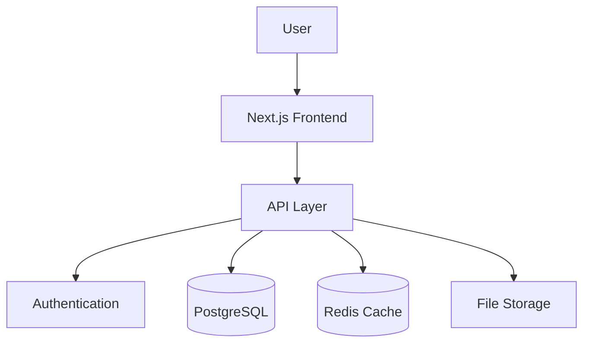

# 🏗️ System Architecture

Comprehensive documentation of the idling.app system architecture, design patterns, and technical implementation details.

## 🏛️ System Design

**[System Design](system/)** - High-level architecture overview:

- Application architecture and component relationships
- Data flow and system interactions
- Scalability and performance considerations
- Technology stack and infrastructure
- Microservices and API design
- Database architecture and data modeling

## 🔐 Security

**[Security Architecture](security/)** - Security patterns and implementation:

- Authentication and authorization systems
- Data encryption and privacy protection
- API security and rate limiting
- Input validation and sanitization
- Security monitoring and incident response
- Compliance and regulatory requirements

## 📊 Performance

**[Performance Architecture](performance/)** - Optimization strategies:

- Caching strategies and implementation
- Database query optimization
- Frontend performance optimization
- CDN and asset delivery
- Monitoring and alerting systems
- Load balancing and scaling

## 🔧 Technical Stack

### Frontend Architecture

- **Framework**: Next.js 14 with App Router
- **Language**: TypeScript for type safety
- **Styling**: CSS Modules with SCSS
- **State Management**: React Context + Zustand
- **UI Components**: Custom component library
- **Testing**: Jest + React Testing Library + Playwright

### Backend Architecture

- **Runtime**: Node.js with Express.js
- **Database**: PostgreSQL with Prisma ORM
- **Authentication**: NextAuth.js with JWT
- **API**: RESTful API with OpenAPI documentation
- **Caching**: Redis for session and data caching
- **File Storage**: AWS S3 or local filesystem

### Infrastructure

- **Containerization**: Docker and Docker Compose
- **Deployment**: GitHub Actions CI/CD
- **Monitoring**: Custom logging and metrics
- **Database**: PostgreSQL with connection pooling
- **Reverse Proxy**: Nginx for production

## 📐 Design Patterns

### Frontend Patterns

- **Component Composition** - Reusable, composable components
- **Render Props** - Flexible component behavior
- **Custom Hooks** - Shared stateful logic
- **Context Providers** - Global state management
- **Error Boundaries** - Graceful error handling

### Backend Patterns

- **Repository Pattern** - Data access abstraction
- **Service Layer** - Business logic separation
- **Middleware Pattern** - Request/response processing
- **Factory Pattern** - Object creation
- **Observer Pattern** - Event handling

## 🔄 Data Flow

### Request Lifecycle

1. **Client Request** - User interaction or API call
2. **Authentication** - Verify user credentials
3. **Authorization** - Check permissions
4. **Validation** - Validate input data
5. **Business Logic** - Process request
6. **Data Access** - Database operations
7. **Response** - Return formatted data

### State Management

- **Global State** - User session, theme, preferences
- **Local State** - Component-specific data
- **Server State** - API data with caching
- **Form State** - Form validation and submission

## 🚀 Scalability Considerations

### Horizontal Scaling

- **Load Balancing** - Distribute traffic across instances
- **Database Sharding** - Partition data across databases
- **Microservices** - Break down into smaller services
- **CDN** - Global content delivery
- **Caching** - Multiple layers of caching

### Performance Optimization

- **Code Splitting** - Lazy load components
- **Image Optimization** - Responsive images and formats
- **Bundle Optimization** - Tree shaking and minification
- **Database Indexing** - Optimize query performance
- **Connection Pooling** - Efficient database connections

## 📊 Monitoring & Observability

### Metrics

- **Performance Metrics** - Response times, throughput
- **Error Rates** - Application and API errors
- **User Metrics** - Active users, engagement
- **Infrastructure Metrics** - CPU, memory, disk usage

### Logging

- **Structured Logging** - JSON format for analysis
- **Log Levels** - Error, warn, info, debug
- **Correlation IDs** - Track requests across services
- **Security Logging** - Authentication and authorization events

## 🔗 Architecture Diagrams

### System Overview

### Component Architecture

## 🚀 Getting Started

1. **[System Design](system/)** - Understand the overall architecture
2. **[Security](security/)** - Learn security implementations
3. **[Performance](performance/)** - Optimize for production

## 📋 Architecture Checklist

### Design Principles

- [ ] Single Responsibility Principle
- [ ] Open/Closed Principle
- [ ] Dependency Inversion
- [ ] Separation of Concerns
- [ ] DRY (Don't Repeat Yourself)

### Quality Attributes

- [ ] Scalability
- [ ] Maintainability
- [ ] Testability
- [ ] Security
- [ ] Performance

## 🔗 Related Sections

- **[API Documentation](../api/)** - API design and implementation
- **[Development](../../dev/)** - Development practices
- **[Deployment](../deployment/)** - Deployment strategies

---

_Architecture documentation is continuously updated. Last updated: {{ site.time | date: "%B %d, %Y" }}_
