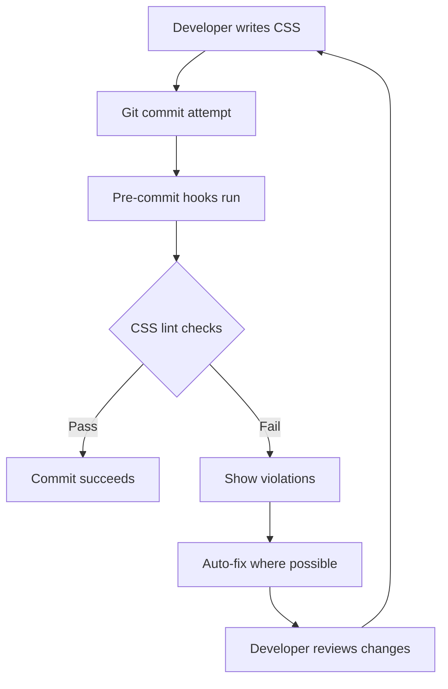
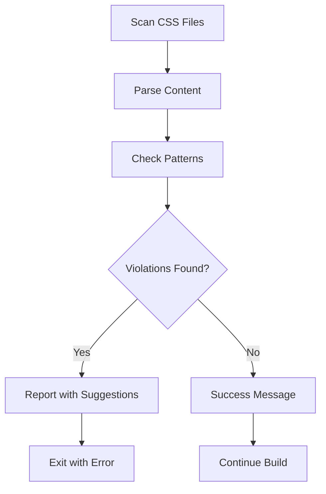
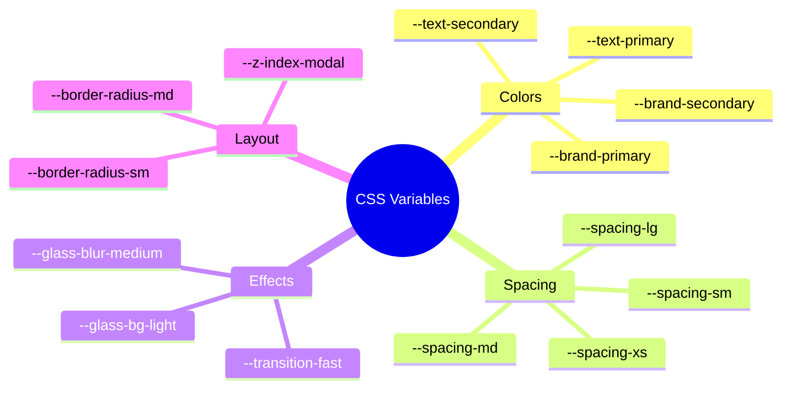

# CSS Linting & Variable Enforcement

## What This Page Is About

This documentation explains our automated CSS linting system that ensures consistent use of design system variables and prevents hardcoded values throughout our codebase.

## What Does This Actually Do?

Think of this like having a helpful colleague who automatically reviews all your CSS code to make sure you're following the team's design guidelines. Just as a style guide ensures all writing follows consistent rules, our CSS linting system ensures all styling follows our design system.

## Why Do We Need This?

### For Developers

- **Consistency**: Ensures all components use the same design tokens
- **Maintainability**: Makes global design changes easier to implement
- **Code Quality**: Prevents drift from design system standards

### For Designers

- **Design Integrity**: Guarantees the implemented design matches specifications
- **Scalability**: Changes to design tokens automatically propagate everywhere

### For Users

- **Better Experience**: Consistent visual experience across the entire application
- **Performance**: Optimized CSS with fewer redundant values

## How It Works (The Simple Version)



### The Process

1. **Detection**: Scans all CSS files for hardcoded values
2. **Validation**: Compares against available design system variables
3. **Reporting**: Shows exactly what needs to be fixed and suggests alternatives
4. **Auto-fixing**: Automatically corrects common issues where safe to do so

## Available Commands

### Basic Linting

```bash
# Lint all CSS files
pnpm lint:css

# Auto-fix CSS issues
pnpm lint:css:fix

# Check CSS variable usage
pnpm lint:css:vars

# Run all validations
pnpm validate
```

### What Gets Checked

#### 🎨 **Colors**

- **Forbidden**: `color: #ff0000`
- **Required**: `color: var(--chili-red)`

#### 📏 **Spacing**

- **Forbidden**: `margin: 16px`
- **Required**: `margin: var(--spacing-md)`

#### 🔲 **Border Radius**

- **Forbidden**: `border-radius: 8px`
- **Required**: `border-radius: var(--border-radius-md)`

#### ⏱️ **Transitions**

- **Forbidden**: `transition: 0.2s ease`
- **Required**: `transition: var(--transition-base)`

## Configuration Files

### `.stylelintrc.js`

Main configuration that enforces our rules:

```javascript
module.exports = {
  extends: ['stylelint-config-standard', 'stylelint-config-css-modules'],
  plugins: ['stylelint-declaration-strict-value'],
  rules: {
    // Enforce CSS variables for colors
    'declaration-strict-value/declaration-strict-value': [
      ['/color/', 'fill', 'stroke', 'background-color'],
      {
        message:
          'Use CSS variables from variables.css instead of hardcoded colors'
      }
    ]
  }
};
```

### Custom Validation Script

`scripts/validate-css-variables.js` provides detailed feedback:



## Design System Variables

### Available Categories



### Quick Reference

| Type             | Variables                                            | Usage                      |
| ---------------- | ---------------------------------------------------- | -------------------------- |
| **Brand Colors** | `--brand-primary`, `--brand-secondary`               | Buttons, accents, branding |
| **Text Colors**  | `--text-primary`, `--text-secondary`, `--text-muted` | All text content           |
| **Backgrounds**  | `--dark-bg-primary`, `--glass-bg-medium`             | Container backgrounds      |
| **Spacing**      | `--spacing-xs` through `--spacing-2xl`               | Margins, padding           |
| **Effects**      | `--glass-blur-*`, `--transition-*`                   | Animations, glass effects  |

## Git Integration

### Pre-commit Hooks

Automatically runs on every commit:

```json
{
  "lint-staged": {
    "*.{css,scss,module.css}": [
      "stylelint --fix --cache",
      "node scripts/validate-css-variables.js"
    ]
  }
}
```

### When Things Go Wrong

#### Common Error Messages

**"Use CSS variables instead of hex colors"**

```css
/* ❌ Wrong */
.button {
  background: #edae49;
}

/* ✅ Correct */
.button {
  background: var(--brand-primary);
}
```

**"Use spacing variables"**

```css
/* ❌ Wrong */
.card {
  padding: 16px;
}

/* ✅ Correct */
.card {
  padding: var(--spacing-md);
}
```

#### Quick Fixes

1. **Run auto-fix**: `pnpm lint:css:fix`
2. **Check available variables**: Look in `src/css/variables.css`
3. **Get suggestions**: Run `pnpm lint:css:vars` for detailed guidance

## Benefits in Action

### Before CSS Linting

```css
/* Inconsistent, hard to maintain */
.button-primary {
  background: #edae49;
  border-radius: 8px;
  transition: 0.2s ease;
}

.card {
  background: #edae4a; /* Slightly different! */
  border-radius: 12px;
  transition: 0.3s ease-in-out;
}
```

### After CSS Linting

```css
/* Consistent, maintainable */
.button-primary {
  background: var(--brand-primary);
  border-radius: var(--border-radius-md);
  transition: var(--transition-base);
}

.card {
  background: var(--brand-primary);
  border-radius: var(--border-radius-lg);
  transition: var(--transition-base);
}
```

## Performance Impact

### Build Time

- **CSS Linting**: ~2-5 seconds
- **Variable Validation**: ~1-2 seconds
- **Auto-fixing**: ~3-7 seconds

### Bundle Size Benefits

- **Reduced CSS**: Fewer unique values mean better compression
- **Consistency**: Browser can optimize repeated variable usage
- **Maintainability**: Easier to tree-shake unused styles

## Getting Help

### For Developers

- Run `pnpm lint:css:vars` for detailed violation reports
- Check `src/css/variables.css` for available variables
- Use IDE extensions for real-time validation

### For Designers

- All design tokens are centralized in `variables.css`
- Changes to variables automatically propagate everywhere
- No need to hunt down hardcoded values

### Troubleshooting

| Issue                   | Solution                                           |
| ----------------------- | -------------------------------------------------- |
| Too many violations     | Run `pnpm lint:css:fix` for auto-fixes             |
| Unknown variable needed | Add to `variables.css` following naming convention |
| Build failing           | Check console output for specific violations       |
| False positives         | Update `.stylelintrc.js` ignore patterns           |

---

**Remember**: This system helps maintain design consistency and code quality. When in doubt, use CSS variables from our design system! 🎨✨
