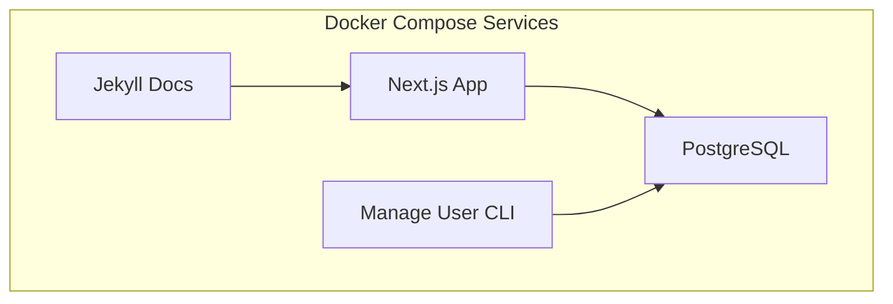

# 🐳 Docker Setup

Complete guide for running Idling.app in containerized environments.

## 🏗️ Docker Architecture



## 🚀 Development Environment

### Standard Development Setup

```bash
# Start all services
docker-compose up -d

# View logs
docker-compose logs -f

# Stop services
docker-compose down
```

### Development with Hot Reload

```bash
# Start with development overrides
docker-compose -f docker-compose.yml -f docker-compose.dev.yml up -d

# Rebuild after changes
docker-compose up --build
```

## 📦 Service Configuration

### Application Container

```dockerfile
# Main application (Next.js)
FROM node:18-alpine
WORKDIR /app
COPY package*.json ./
RUN yarn install
COPY . .
EXPOSE 3000
CMD ["yarn", "dev"]
```

### Database Container

```yaml
# PostgreSQL service
postgres:
  image: postgres:15
  environment:
    POSTGRES_DB: idling
    POSTGRES_USER: postgres
    POSTGRES_PASSWORD: postgres
  ports:
    - '5432:5432'
  volumes:
    - postgres_data:/var/lib/postgresql/data
```

## 🔧 Environment Variables

Create `.env.local` for Docker configuration:

```env
# Database
POSTGRES_HOST=postgres
POSTGRES_PORT=5432
POSTGRES_DB=idling
POSTGRES_USER=postgres
POSTGRES_PASSWORD=postgres

# Application
NEXTAUTH_URL=http://localhost:3000
NEXTAUTH_SECRET=your-secret-key

# Development
NODE_ENV=development
```

## 🛠️ Development Workflows

### Database Operations

```bash
# Run migrations
docker-compose exec app yarn migrate

# Seed database
docker-compose exec app yarn seed

# Database shell
docker-compose exec postgres psql -U postgres -d idling
```

### CLI Tools

```bash
# User management
docker-compose exec app yarn manage-user

# Build CLI tool
docker-compose exec app bash -c "cd cmd/manage-user && ./build.sh"
```

## 🔍 Debugging

### Container Logs

```bash
# All services
docker-compose logs

# Specific service
docker-compose logs app
docker-compose logs postgres

# Follow logs
docker-compose logs -f app
```

### Container Shell Access

```bash
# Access app container
docker-compose exec app sh

# Access database
docker-compose exec postgres psql -U postgres -d idling
```

## 🚀 Production Deployment

### Build Production Images

```bash
# Build optimized images
docker-compose -f docker-compose.prod.yml build

# Start production stack
docker-compose -f docker-compose.prod.yml up -d
```

### Health Checks

```bash
# Check container health
docker-compose ps

# Application health
curl http://localhost:3000/api/health
```

## 🧹 Maintenance

### Cleanup

```bash
# Remove containers and volumes
docker-compose down -v

# Remove images
docker-compose down --rmi all

# Clean build cache
docker system prune -a
```

### Updates

```bash
# Update base images
docker-compose pull

# Rebuild with latest changes
docker-compose up --build
```

## 📊 Monitoring

### Resource Usage

```bash
# Container stats
docker stats

# Disk usage
docker system df
```

### Performance

```bash
# Container resource limits
docker-compose exec app cat /sys/fs/cgroup/memory/memory.limit_in_bytes
```

---

_This is a stub file. [Contribute to expand this documentation](/community/contributing/)._
