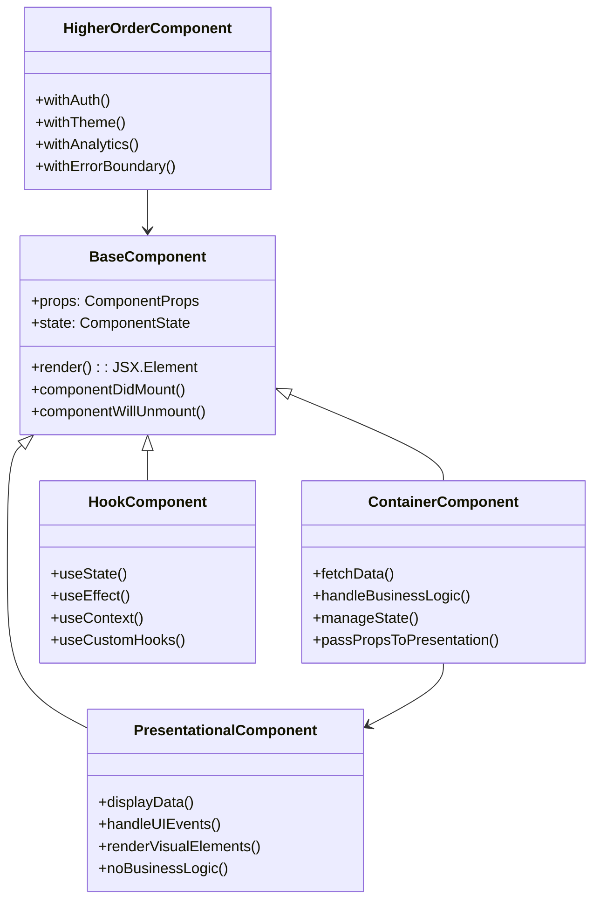
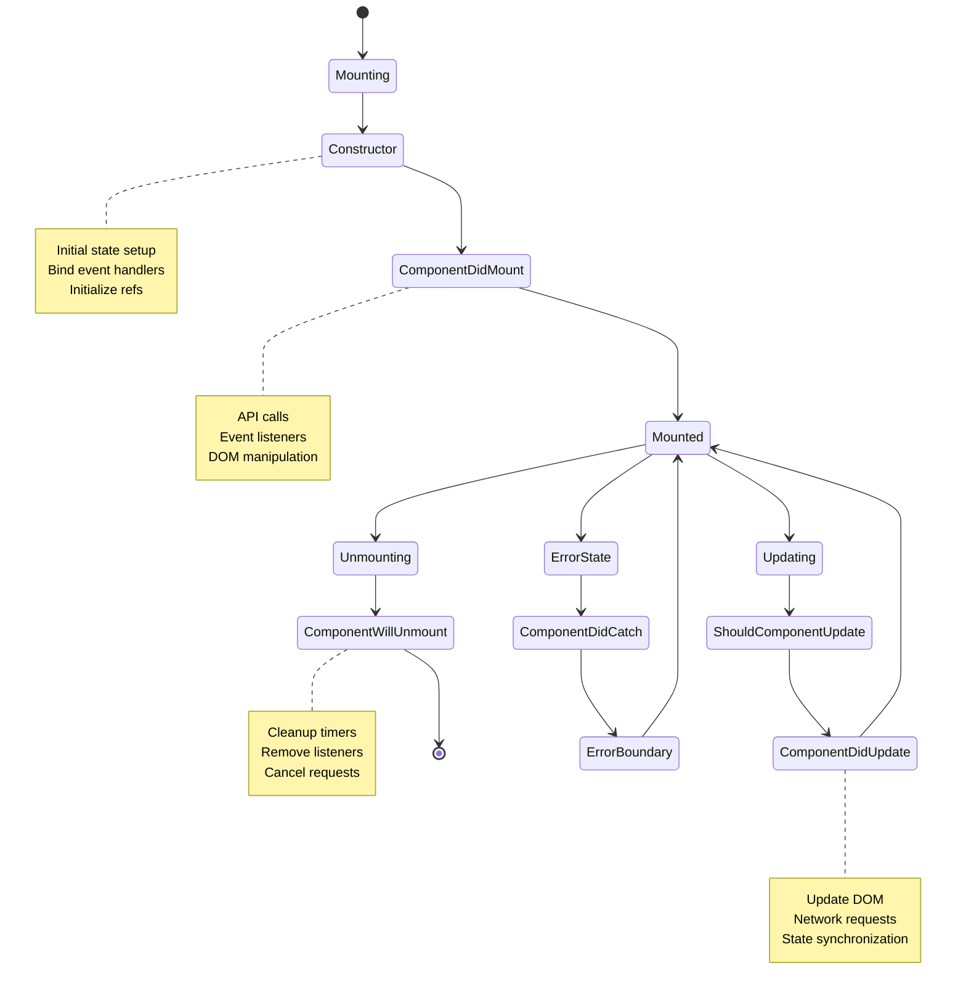

# ⚛️ Component Hierarchy & Architecture

This diagram shows the complete React component architecture for Idling.app, including component relationships, props flow, state management, and architectural patterns.

## 🏗️ **Application Component Tree**

```mermaid
flowchart TD
    subgraph "🚀 App Root"
        A[🌟 App Component]
        A --> B[🔄 Providers Wrapper]
        A --> C[🛡️ Auth Provider]
        A --> D[🎨 Theme Provider]
        A --> E[📊 Analytics Provider]
    end

    subgraph "🗂️ Layout Components"
        B --> F[📐 RootLayout]
        F --> G[🧭 Navigation]
        F --> H[🏠 Main Content]
        F --> I[🦶 Footer]

        G --> J[🔗 NavLink]
        G --> K[👤 UserMenu]
        G --> L[🔔 NotificationBell]
    end

    subgraph "📄 Page Components"
        H --> M[🏠 HomePage]
        H --> N[📊 DashboardPage]
        H --> O[🎮 SessionPage]
        H --> P[⚙️ SettingsPage]
        H --> Q[🛠️ AdminPage]

        M --> R[🎯 HeroSection]
        M --> S[✨ FeatureSection]
        M --> T[📈 StatsSection]
    end

    subgraph "🎮 Session Components"
        N --> U[📊 SessionDashboard]
        O --> V[🎯 SessionCreator]
        O --> W[🎮 ActiveSession]
        O --> X[📈 SessionStats]

        U --> Y[📋 SessionList]
        U --> Z[➕ QuickStart]

        V --> AA[⚙️ SessionConfig]
        V --> BB[😊 EmojiSelector]
        V --> CC[⏰ TimerConfig]

        W --> DD[🎛️ SessionControls]
        W --> EE[📊 LiveStats]
        W --> FF[🎨 VisualFeedback]
    end

    subgraph "😊 Emoji System"
        BB --> GG[🗂️ EmojiCategories]
        BB --> HH[🔍 EmojiSearch]
        BB --> II[⭐ EmojiFavorites]

        GG --> JJ[📋 CategoryList]
        GG --> KK[😊 EmojiGrid]

        HH --> LL[🔎 SearchInput]
        HH --> MM[📊 SearchResults]

        II --> NN[❤️ FavoritesList]
        II --> OO[⭐ FavoriteButton]
    end

    style A fill:#e3f2fd
    style F fill:#c8e6c9
    style U fill:#fff3e0
    style BB fill:#f3e5f5
```

## 🔄 **Props Flow & State Management**

```mermaid
sequenceDiagram
    participant App as 🚀 App
    participant Context as 🌐 Context
    participant Dashboard as 📊 Dashboard
    participant Session as 🎮 Session
    participant Emoji as 😊 Emoji
    participant UI as 🎨 UI Components

    App->>Context: Initialize Global State
    Context->>Context: User Auth State
    Context->>Context: Theme State
    Context->>Context: Session State

    Dashboard->>Context: Request User Data
    Context->>Dashboard: User Sessions
    Dashboard->>Session: Session Props

    Session->>Context: Update Session State
    Context->>Dashboard: Notify State Change
    Dashboard->>UI: Re-render Components

    Session->>Emoji: Open Emoji Selector
    Emoji->>Context: Selected Emoji
    Context->>Session: Update Session Emoji

    UI->>Context: User Interaction
    Context->>App: Global State Update
    App->>UI: Propagate Changes
```

## 🧩 **Component Architecture Patterns**

## 🎯 **Component Responsibility Matrix**

```mermaid
graph TB
    subgraph "🏗️ Structural Components"
        S1[🚀 App - Application Root]
        S2[📐 Layout - Page Structure]
        S3[🧭 Navigation - App Navigation]
        S4[🛡️ ErrorBoundary - Error Handling]
    end

    subgraph "📊 Data Components"
        D1[📈 Dashboard - Data Aggregation]
        D2[📋 SessionList - Session Management]
        D3[👤 UserProfile - User Data]
        D4[📊 Analytics - Metrics Display]
    end

    subgraph "🎮 Interactive Components"
        I1[🎯 SessionCreator - Session Setup]
        I2[🎛️ SessionControls - Session Management]
        I3[😊 EmojiSelector - Emoji Selection]
        I4[⚙️ SettingsPanel - Configuration]
    end

    subgraph "🎨 UI Components"
        U1[🔘 Button - User Actions]
        U2[📝 Input - Data Entry]
        U3[📋 Modal - Overlays]
        U4[🔔 Notification - User Feedback]
    end

    subgraph "🔌 Utility Components"
        T1[🔄 LoadingSpinner - Loading States]
        T2[🚨 ErrorMessage - Error Display]
        T3[📱 ResponsiveWrapper - Device Adaptation]
        T4[🎨 ThemeProvider - Styling Context]
    end

    S1 --> D1
    S1 --> I1
    S2 --> U1
    S3 --> U2

    D1 --> U3
    D2 --> U4
    I1 --> T1
    I2 --> T2

    style S1 fill:#e3f2fd
    style D1 fill:#c8e6c9
    style I1 fill:#fff3e0
    style U1 fill:#f3e5f5
    style T1 fill:#ffcdd2
```

## 🔗 **Component Dependencies Graph**

```mermaid
graph LR
    subgraph "📦 External Dependencies"
        E1[⚛️ React]
        E2[🔄 Next.js]
        E3[🎨 Tailwind CSS]
        E4[📊 Chart.js]
        E5[🔔 React Hot Toast]
    end

    subgraph "🏠 Internal Components"
        I1[🚀 App]
        I2[📊 Dashboard]
        I3[🎮 Session]
        I4[😊 Emoji]
        I5[🎨 UI Library]
    end

    subgraph "🔧 Custom Hooks"
        H1[🎯 useSession]
        H2[👤 useAuth]
        H3[🎨 useTheme]
        H4[📊 useAnalytics]
    end

    subgraph "🌐 Context Providers"
        C1[🔑 AuthContext]
        C2[🎮 SessionContext]
        C3[🎨 ThemeContext]
        C4[📊 AnalyticsContext]
    end

    E1 --> I1
    E2 --> I1
    E3 --> I5
    E4 --> I2
    E5 --> I5

    I1 --> I2
    I1 --> I3
    I1 --> I4
    I1 --> I5

    I2 --> H1
    I2 --> H2
    I3 --> H1
    I3 --> H3
    I4 --> H4

    H1 --> C2
    H2 --> C1
    H3 --> C3
    H4 --> C4

    style E1 fill:#e3f2fd
    style I1 fill:#c8e6c9
    style H1 fill:#fff3e0
    style C1 fill:#f3e5f5
```

## 🎨 **Styling Architecture**

```mermaid
flowchart TB
    subgraph "🎨 Design System"
        DS1[🎯 Design Tokens]
        DS2[🎨 Color Palette]
        DS3[📝 Typography Scale]
        DS4[📏 Spacing System]
        DS5[🔳 Component Variants]
    end

    subgraph "🏗️ CSS Architecture"
        CSS1[🌊 Tailwind Base]
        CSS2[🧩 Component Classes]
        CSS3[🎛️ Utility Classes]
        CSS4[📱 Responsive Breakpoints]
        CSS5[🌙 Dark Mode Support]
    end

    subgraph "⚛️ Component Styling"
        CS1[💅 Styled Components]
        CS2[📦 CSS Modules]
        CS3[🎨 Inline Styles]
        CS4[🔄 Dynamic Styling]
        CS5[🎭 Conditional Classes]
    end

    subgraph "🎯 Theme Management"
        TM1[🌐 Theme Provider]
        TM2[🔧 Theme Configuration]
        TM3[🌙 Light/Dark Modes]
        TM4[🎨 Custom Themes]
        TM5[💾 Theme Persistence]
    end

    DS1 --> CSS1
    DS2 --> CSS2
    DS3 --> CSS3
    DS4 --> CSS4
    DS5 --> CSS5

    CSS1 --> CS1
    CSS2 --> CS2
    CSS3 --> CS3
    CSS4 --> CS4
    CSS5 --> CS5

    CS1 --> TM1
    CS2 --> TM2
    CS3 --> TM3
    CS4 --> TM4
    CS5 --> TM5

    style DS1 fill:#e3f2fd
    style CSS1 fill:#c8e6c9
    style CS1 fill:#fff3e0
    style TM1 fill:#f3e5f5
```

## 🔄 **Component Lifecycle Flow**

## 🧪 **Component Testing Strategy**

```mermaid
flowchart LR
    subgraph "🧪 Testing Levels"
        T1[🔬 Unit Tests]
        T2[🔗 Integration Tests]
        T3[🎭 E2E Tests]
        T4[📸 Visual Tests]
    end

    subgraph "🛠️ Testing Tools"
        TT1[⚛️ React Testing Library]
        TT2[🃏 Jest]
        TT3[🎭 Playwright]
        TT4[📷 Storybook]
    end

    subgraph "🎯 Test Scenarios"
        TS1[🔄 Component Rendering]
        TS2[🎮 User Interactions]
        TS3[📊 State Management]
        TS4[🔌 Props Validation]
        TS5[🚨 Error Handling]
    end

    subgraph "📊 Coverage Metrics"
        CM1[📈 Line Coverage]
        CM2[🌿 Branch Coverage]
        CM3[🔧 Function Coverage]
        CM4[📝 Statement Coverage]
    end

    T1 --> TT1
    T1 --> TT2
    T2 --> TT1
    T2 --> TT2
    T3 --> TT3
    T4 --> TT4

    TT1 --> TS1
    TT1 --> TS2
    TT2 --> TS3
    TT2 --> TS4
    TT3 --> TS5

    TS1 --> CM1
    TS2 --> CM2
    TS3 --> CM3
    TS4 --> CM4

    style T1 fill:#e3f2fd
    style TT1 fill:#c8e6c9
    style TS1 fill:#fff3e0
    style CM1 fill:#f3e5f5
```

## 📊 **Performance Optimization Matrix**

```mermaid
graph TB
    subgraph "⚡ Performance Strategies"
        P1[🧠 React.memo]
        P2[🔄 useMemo]
        P3[📞 useCallback]
        P4[🔀 Code Splitting]
        P5[📦 Bundle Optimization]
    end

    subgraph "🎯 Optimization Targets"
        O1[🔄 Re-render Prevention]
        O2[📊 Expensive Calculations]
        O3[🎮 Event Handlers]
        O4[📦 Bundle Size]
        O5[⏰ Load Time]
    end

    subgraph "📈 Monitoring Tools"
        M1[⚛️ React DevTools]
        M2[🔍 Chrome DevTools]
        M3[📊 Web Vitals]
        M4[🎯 Lighthouse]
        M5[📈 Performance API]
    end

    subgraph "🎯 Performance Metrics"
        PM1[⏰ First Contentful Paint]
        PM2[🎨 Largest Contentful Paint]
        PM3[🔄 Cumulative Layout Shift]
        PM4[⚡ First Input Delay]
        PM5[🎮 Time to Interactive]
    end

    P1 --> O1
    P2 --> O2
    P3 --> O3
    P4 --> O4
    P5 --> O5

    O1 --> M1
    O2 --> M2
    O3 --> M3
    O4 --> M4
    O5 --> M5

    M1 --> PM1
    M2 --> PM2
    M3 --> PM3
    M4 --> PM4
    M5 --> PM5

    style P1 fill:#e3f2fd
    style O1 fill:#c8e6c9
    style M1 fill:#fff3e0
    style PM1 fill:#f3e5f5
```

## 🔍 **Component Architecture Analysis**

### **Architectural Patterns**

- **Container/Presentational**: Clear separation of business logic and UI
- **Higher-Order Components**: Cross-cutting concerns like authentication
- **Render Props**: Flexible component composition patterns
- **Custom Hooks**: Reusable stateful logic extraction

### **State Management Strategy**

- **Local State**: Component-specific state with useState
- **Global State**: Application-wide state with Context API
- **Server State**: Remote data management with React Query
- **Form State**: Specialized form handling with React Hook Form

### **Component Composition**

- **Atomic Design**: Building from atoms to organisms
- **Compound Components**: Related components working together
- **Polymorphic Components**: Flexible component APIs
- **Provider Pattern**: Context-based dependency injection

### **Performance Considerations**

- **Memoization**: Preventing unnecessary re-renders
- **Code Splitting**: Lazy loading for better performance
- **Bundle Optimization**: Tree shaking and dead code elimination
- **Virtual Scrolling**: Efficient rendering of large lists

### **Testing Strategy**

- **Unit Testing**: Individual component behavior
- **Integration Testing**: Component interaction testing
- **Visual Testing**: UI consistency verification
- **Accessibility Testing**: WCAG compliance validation

### **Development Experience**

- **TypeScript Integration**: Type safety and better DX
- **Storybook Documentation**: Component library documentation
- **Hot Reload**: Fast development feedback loop
- **ESLint/Prettier**: Code quality and consistency

This component architecture provides a scalable, maintainable, and performant foundation for the Idling.app React application with comprehensive testing and optimization strategies.
