# 🗄️ Database Schema Entity Relationship Diagram

This diagram shows the complete database schema for Idling.app, including all tables, relationships, foreign keys, and constraints derived from the migration scripts.

```mermaid
erDiagram
    %% Core User Management
    users {
        uuid id PK "Primary Key"
        string email UK "Unique email address"
        string username UK "Unique username"
        string display_name "Display name for UI"
        string avatar_url "Profile picture URL"
        string bio "User biography"
        timestamp email_verified_at "Email verification timestamp"
        timestamp created_at "Account creation time"
        timestamp updated_at "Last profile update"
        boolean is_active "Account status"
        string provider "OAuth provider (twitch, google, etc)"
        string provider_id "External provider user ID"
        json metadata "Additional user metadata"
    }

    %% Authentication & Sessions
    user_sessions {
        uuid id PK "Session identifier"
        uuid user_id FK "References users.id"
        string session_token UK "Unique session token"
        string access_token "OAuth access token"
        string refresh_token "OAuth refresh token"
        timestamp expires_at "Session expiration"
        timestamp created_at "Session start time"
        timestamp last_activity "Last user activity"
        string ip_address "Client IP address"
        string user_agent "Client user agent"
        json session_data "Additional session data"
    }

    %% Emoji Categories System
    emoji_categories {
        int id PK "Category identifier"
        string name UK "Category name (e.g., 'smileys', 'animals')"
        string display_name "Human-readable category name"
        string description "Category description"
        string icon "Category icon/emoji"
        int sort_order "Display order"
        boolean is_active "Category status"
        timestamp created_at "Creation timestamp"
        timestamp updated_at "Last update timestamp"
    }

    %% Emoji Data
    emojis {
        uuid id PK "Emoji identifier"
        int category_id FK "References emoji_categories.id"
        string unicode "Unicode representation"
        string shortcode "Shortcode (e.g., :smile:)"
        string name "Emoji name"
        string description "Emoji description"
        json keywords "Search keywords array"
        string skin_tone "Skin tone variant"
        boolean is_custom "Custom emoji flag"
        string image_url "Custom emoji image URL"
        timestamp created_at "Creation timestamp"
        timestamp updated_at "Last update timestamp"
    }

    %% User Emoji Favorites
    user_emoji_favorites {
        uuid id PK "Favorite identifier"
        uuid user_id FK "References users.id"
        uuid emoji_id FK "References emojis.id"
        timestamp created_at "When favorited"
        int usage_count "How many times used"
        timestamp last_used "Last usage timestamp"
    }

    %% Idle Sessions & Activities
    idle_sessions {
        uuid id PK "Session identifier"
        uuid user_id FK "References users.id"
        string session_name "User-defined session name"
        string status "Session status (active, paused, completed)"
        timestamp start_time "Session start timestamp"
        timestamp end_time "Session end timestamp"
        int total_duration "Total session duration in seconds"
        json session_config "Session configuration settings"
        json activity_log "Activity tracking data"
        timestamp created_at "Creation timestamp"
        timestamp updated_at "Last update timestamp"
    }

    %% Activity Tracking
    user_activities {
        uuid id PK "Activity identifier"
        uuid user_id FK "References users.id"
        uuid session_id FK "References idle_sessions.id"
        string activity_type "Type of activity (click, scroll, etc)"
        string activity_data "Activity details (JSON)"
        timestamp occurred_at "When activity occurred"
        string ip_address "Client IP address"
        string user_agent "Client user agent"
        json metadata "Additional activity metadata"
    }

    %% Notifications System
    notifications {
        uuid id PK "Notification identifier"
        uuid user_id FK "References users.id"
        string type "Notification type"
        string title "Notification title"
        string message "Notification content"
        json data "Additional notification data"
        boolean is_read "Read status"
        timestamp read_at "When marked as read"
        timestamp created_at "Creation timestamp"
        timestamp expires_at "Expiration timestamp"
        string priority "Notification priority (low, medium, high)"
    }

    %% User Preferences
    user_preferences {
        uuid id PK "Preference identifier"
        uuid user_id FK "References users.id"
        string preference_key "Preference name"
        json preference_value "Preference value (JSON)"
        timestamp created_at "Creation timestamp"
        timestamp updated_at "Last update timestamp"
    }

    %% Application Settings
    app_settings {
        uuid id PK "Setting identifier"
        string setting_key UK "Setting name"
        json setting_value "Setting value (JSON)"
        string description "Setting description"
        string category "Setting category"
        boolean is_public "Public visibility"
        timestamp created_at "Creation timestamp"
        timestamp updated_at "Last update timestamp"
    }

    %% Audit Logs
    audit_logs {
        uuid id PK "Log entry identifier"
        uuid user_id FK "References users.id (nullable)"
        string action "Action performed"
        string entity_type "Type of entity affected"
        string entity_id "ID of affected entity"
        json old_values "Previous values (JSON)"
        json new_values "New values (JSON)"
        string ip_address "Client IP address"
        string user_agent "Client user agent"
        timestamp created_at "Action timestamp"
        json metadata "Additional audit metadata"
    }

    %% API Keys & Tokens
    api_keys {
        uuid id PK "API key identifier"
        uuid user_id FK "References users.id"
        string key_name "Human-readable key name"
        string key_hash "Hashed API key"
        string permissions "Comma-separated permissions"
        timestamp expires_at "Key expiration"
        timestamp last_used "Last usage timestamp"
        boolean is_active "Key status"
        timestamp created_at "Creation timestamp"
        timestamp updated_at "Last update timestamp"
    }

    %% Relationships
    users ||--o{ user_sessions : "has_many"
    users ||--o{ user_emoji_favorites : "has_many"
    users ||--o{ idle_sessions : "has_many"
    users ||--o{ user_activities : "has_many"
    users ||--o{ notifications : "has_many"
    users ||--o{ user_preferences : "has_many"
    users ||--o{ audit_logs : "performed_by"
    users ||--o{ api_keys : "owns"

    emoji_categories ||--o{ emojis : "contains"
    emojis ||--o{ user_emoji_favorites : "favorited_by"

    idle_sessions ||--o{ user_activities : "contains"

    %% Indexes and Constraints Notes
    %% - All foreign keys have corresponding indexes
    %% - Email and username have unique constraints
    %% - Session tokens have unique constraints
    %% - Composite indexes on (user_id, created_at) for time-series queries
    %% - Partial indexes on active records only
    %% - GIN indexes on JSON columns for efficient querying
```

## 🔍 **Schema Analysis Summary**

### **Core Entities**

- **Users**: Central user management with OAuth integration
- **Sessions**: Comprehensive session tracking and management
- **Emojis**: Complete emoji system with categories and favorites
- **Activities**: Detailed user activity and idle session tracking

### **Key Relationships**

- **One-to-Many**: Users have multiple sessions, activities, and preferences
- **Many-to-Many**: Users can favorite multiple emojis (through junction table)
- **Hierarchical**: Emoji categories contain multiple emojis

### **Security & Auditing**

- **Audit Logs**: Complete audit trail of all system changes
- **API Keys**: Secure API access with permission management
- **Session Management**: Comprehensive session security and tracking

### **Performance Considerations**

- **Indexed Foreign Keys**: All relationships properly indexed
- **Time-Series Optimization**: Composite indexes on user_id + timestamps
- **JSON Column Indexes**: GIN indexes for efficient JSON querying
- **Partial Indexes**: Active records only for better performance

### **Data Integrity**

- **UUID Primary Keys**: Distributed system friendly identifiers
- **Unique Constraints**: Email, username, and session tokens
- **Cascading Deletes**: Proper cleanup of related records
- **Nullable Foreign Keys**: Flexible relationship modeling

This schema supports a comprehensive idle tracking application with robust user management, emoji integration, activity monitoring, and security features.
