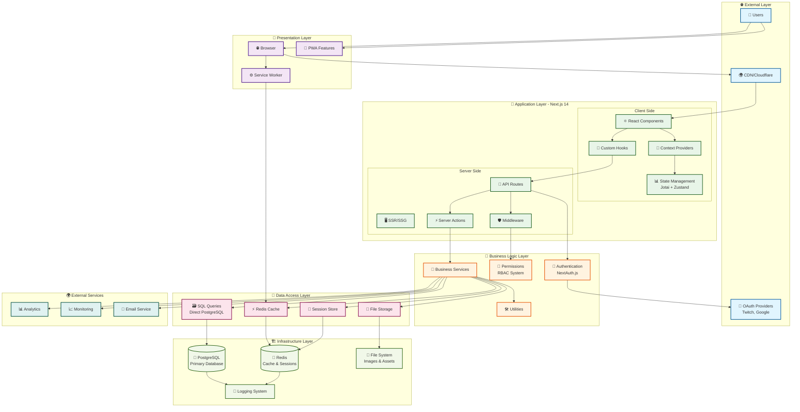

# 🏛️ System Architecture Overview

This diagram shows the complete system architecture of Idling.app, including all layers from user interface to database storage.

## 🏗️ Architecture Principles

### 🎯 Design Patterns

- **Repository Pattern**: Data access abstraction through direct SQL
- **Service Layer**: Business logic encapsulation
- **Factory Pattern**: Service instantiation
- **Observer Pattern**: Event-driven updates
- **Middleware Pattern**: Request/response processing

### 🔄 Data Flow

1. **Request**: User interaction → Browser → CDN → Next.js
2. **Processing**: Middleware → Authentication → Business Logic
3. **Data Access**: Services → ORM → Database
4. **Response**: Data → Serialization → Client → UI Update

### 🚀 Scalability Features

- **Horizontal Scaling**: Load balancing, CDN distribution
- **Caching Strategy**: Multi-layer caching (Browser, CDN, Redis, Application)
- **Database Optimization**: Connection pooling, read replicas
- **Performance Monitoring**: Real-time metrics and alerting

### 🔐 Security Layers

- **Authentication**: OAuth providers, JWT tokens, session management
- **Authorization**: Role-based access control (RBAC)
- **Data Protection**: Input validation, SQL injection prevention
- **Infrastructure**: HTTPS, security headers, rate limiting
