# 🎯 User Journey & UX Flows

This document provides comprehensive user experience flow diagrams for Idling.app, covering all user interactions, navigation paths, and experience optimization strategies.

## 🌟 **Primary User Journey - New User Onboarding**

## 🔄 **Core User Flow - Idle Session Management**

```mermaid
flowchart TD
    A[🏠 Dashboard] --> B{📊 Active Session?}
    B -->|No| C[➕ Create New Session]
    B -->|Yes| D[📋 View Active Session]

    C --> E[⚙️ Configure Session]
    E --> F[🏷️ Name Session]
    F --> G[⏰ Set Duration]
    G --> H[😊 Choose Emoji Theme]
    H --> I[🚀 Start Session]

    I --> J[🎮 Session Active]
    J --> K{🎯 User Action?}
    K -->|⏸️ Pause| L[⏸️ Session Paused]
    K -->|▶️ Continue| J
    K -->|⏹️ Stop| M[⏹️ Session Ended]
    K -->|📊 View Stats| N[📈 Real-time Stats]

    L --> O{🔄 Resume?}
    O -->|Yes| J
    O -->|No| M

    N --> J
    M --> P[🎉 Session Summary]
    P --> Q[💾 Save Results]
    Q --> R[📤 Share Options]
    R --> S[🔄 Create Another?]
    S -->|Yes| C
    S -->|No| A

    D --> T[📊 Session Controls]
    T --> U{🎛️ Action?}
    U -->|⏸️ Pause| L
    U -->|⏹️ Stop| M
    U -->|📊 Stats| N
    U -->|⚙️ Settings| V[⚙️ Modify Session]
    V --> J

    style A fill:#e3f2fd
    style I fill:#c8e6c9
    style J fill:#fff3e0
    style M fill:#ffcdd2
    style P fill:#f3e5f5
```

## 🎨 **Emoji System User Experience**

```mermaid
flowchart LR
    subgraph "😊 Emoji Discovery"
        A[🔍 Browse Categories]
        B[🔎 Search Emojis]
        C[🌟 Popular Emojis]
        D[📚 Recent Usage]
    end

    subgraph "💝 Emoji Interaction"
        E[👁️ Preview Emoji]
        F[❤️ Add to Favorites]
        G[🎯 Use in Session]
        H[📤 Share Emoji]
    end

    subgraph "🎨 Customization"
        I[🎨 Custom Emoji Upload]
        J[🏷️ Create Categories]
        K[⚙️ Emoji Preferences]
        L[🔄 Sync Across Devices]
    end

    subgraph "📊 Emoji Analytics"
        M[📈 Usage Statistics]
        N[🏆 Most Used]
        O[📅 Usage Timeline]
        P[🎯 Recommendations]
    end

    A --> E
    B --> E
    C --> E
    D --> E

    E --> F
    E --> G
    E --> H

    F --> I
    G --> J
    H --> K
    I --> L

    J --> M
    K --> N
    L --> O
    M --> P

    style A fill:#e3f2fd
    style E fill:#c8e6c9
    style I fill:#fff3e0
    style M fill:#f3e5f5
```

## 📱 **Mobile vs Desktop UX Flow**

```mermaid
flowchart TB
    subgraph "📱 Mobile Experience"
        M1[📱 Mobile App Launch]
        M2[🔄 Quick Session Start]
        M3[📊 Simplified Dashboard]
        M4[👆 Touch Gestures]
        M5[📳 Push Notifications]
        M6[🔋 Battery Optimization]
    end

    subgraph "🖥️ Desktop Experience"
        D1[🖥️ Web Browser Launch]
        D2[⚙️ Advanced Configuration]
        D3[📊 Detailed Analytics]
        D4[🖱️ Mouse Interactions]
        D5[🔔 Browser Notifications]
        D6[⚡ Full Feature Access]
    end

    subgraph "🔄 Cross-Platform Sync"
        S1[☁️ Cloud Synchronization]
        S2[📊 Data Consistency]
        S3[⚙️ Settings Sync]
        S4[📱 Device Switching]
    end

    M1 --> M2
    M2 --> M3
    M3 --> M4
    M4 --> M5
    M5 --> M6

    D1 --> D2
    D2 --> D3
    D3 --> D4
    D4 --> D5
    D5 --> D6

    M6 --> S1
    D6 --> S1
    S1 --> S2
    S2 --> S3
    S3 --> S4

    style M1 fill:#e3f2fd
    style D1 fill:#c8e6c9
    style S1 fill:#fff3e0
```

## 🎭 **User Persona Journey Maps**

## 🛠️ **Admin User Experience Flow**

## 🎯 **Application Navigation Flow**

```mermaid
flowchart TD
    subgraph "🏠 Landing Experience"
        A1[🌐 Landing Page]
        A2[📖 Features Section]
        A3[🎯 Call-to-Action]
        A4[📝 Sign Up Button]
    end

    subgraph "🔑 Authentication Flow"
        B1[🔐 Auth Selection]
        B2[🎮 Twitch OAuth]
        B3[🔍 Google OAuth]
        B4[✅ Profile Creation]
    end

    subgraph "🎮 Core Application"
        C1[📊 Dashboard]
        C2[➕ Create Session]
        C3[⚙️ Settings]
        C4[😊 Emoji Management]
    end

    subgraph "🎯 Session Workflow"
        D1[🏷️ Session Setup]
        D2[🚀 Active Session]
        D3[📈 Session Results]
        D4[📤 Share/Export]
    end

    A1 --> A2
    A2 --> A3
    A3 --> A4
    A4 --> B1

    B1 --> B2
    B1 --> B3
    B2 --> B4
    B3 --> B4
    B4 --> C1

    C1 --> C2
    C1 --> C3
    C1 --> C4
    C2 --> D1

    D1 --> D2
    D2 --> D3
    D3 --> D4
    D4 --> C1

    style A1 fill:#e3f2fd
    style B1 fill:#c8e6c9
    style C1 fill:#fff3e0
    style D1 fill:#f3e5f5
```

## 🔄 **User Feedback Loop**

```mermaid
sequenceDiagram
    participant User as 👤 User
    participant App as 📱 Application
    participant Analytics as 📊 Analytics
    participant Product as 🛠️ Product Team
    participant Support as 🎧 Support Team

    User->>App: Use Feature
    App->>Analytics: Track Usage
    User->>App: Provide Feedback
    App->>Product: Collect Feedback

    Analytics->>Product: Usage Patterns
    Product->>Product: Analyze Data
    Product->>App: Implement Changes

    User->>Support: Report Issue
    Support->>User: Provide Help
    Support->>Product: Report Common Issues

    App->>User: Feature Updates
    User->>App: Test New Features
    App->>Analytics: Track Adoption

    Note over User,Support: Continuous Improvement Cycle
```

## 🎨 **UX Optimization Strategies**

## 📊 **UX Design Patterns Implementation**

```mermaid
graph LR
    subgraph "🎨 Visual Design Patterns"
        A1[🌈 Color System]
        A2[📝 Typography Scale]
        A3[📏 Spacing Grid]
        A4[🎭 Component Variants]
    end

    subgraph "🎯 Interaction Patterns"
        E1[🖱️ Click Interactions]
        E2[⌨️ Keyboard Navigation]
        E3[📱 Touch Gestures]
        E4[🔄 Loading States]
    end

    subgraph "📱 Responsive Patterns"
        R1[🖥️ Desktop Layout]
        R2[📱 Mobile Layout]
        R3[🔄 Breakpoint System]
        R4[📐 Flexible Grids]
    end

    subgraph "♿ Accessibility Patterns"
        S1[🔍 Screen Reader Support]
        S2[⌨️ Focus Management]
        S3[🎨 High Contrast Mode]
        S4[📢 ARIA Labels]
    end

    A1 --> E1
    A2 --> E2
    A3 --> E3
    A4 --> E4

    E1 --> R1
    E2 --> R2
    E3 --> R3
    E4 --> R4

    R1 --> S1
    R2 --> S2
    R3 --> S3
    R4 --> S4

    style A1 fill:#e3f2fd
    style E1 fill:#c8e6c9
    style R1 fill:#fff3e0
    style S1 fill:#f3e5f5
```

## 🔍 **UX Analysis Summary**

### **User Journey Optimization**

- **Streamlined Onboarding**: Minimal steps to first value
- **Progressive Disclosure**: Advanced features revealed gradually
- **Contextual Help**: Just-in-time assistance and tooltips
- **Personalized Experience**: Adaptive interface based on usage patterns

### **Cross-Platform Consistency**

- **Unified Design Language**: Consistent visual elements across devices
- **Feature Parity**: Core functionality available on all platforms
- **Seamless Sync**: Real-time synchronization across devices
- **Responsive Design**: Optimized for all screen sizes

### **Accessibility & Inclusion**

- **WCAG Compliance**: Full accessibility standards adherence
- **Multiple Input Methods**: Touch, keyboard, and voice support
- **Internationalization**: Multi-language support and RTL layouts
- **Cognitive Accessibility**: Clear language and simple interactions

### **Performance & Reliability**

- **Fast Load Times**: Under 2 seconds for initial load
- **Smooth Interactions**: 60fps animations and transitions
- **Offline Capability**: Core features work without internet
- **Error Recovery**: Graceful handling of network issues

### **Engagement & Motivation**

- **Gamification Elements**: Progress tracking and achievements
- **Social Features**: Sharing and community aspects
- **Personalization**: Customizable themes and preferences
- **Feedback Loops**: Clear progress indicators and confirmations

This comprehensive UX analysis ensures Idling.app provides an exceptional user experience across all touchpoints while maintaining professional standards and accessibility requirements.
