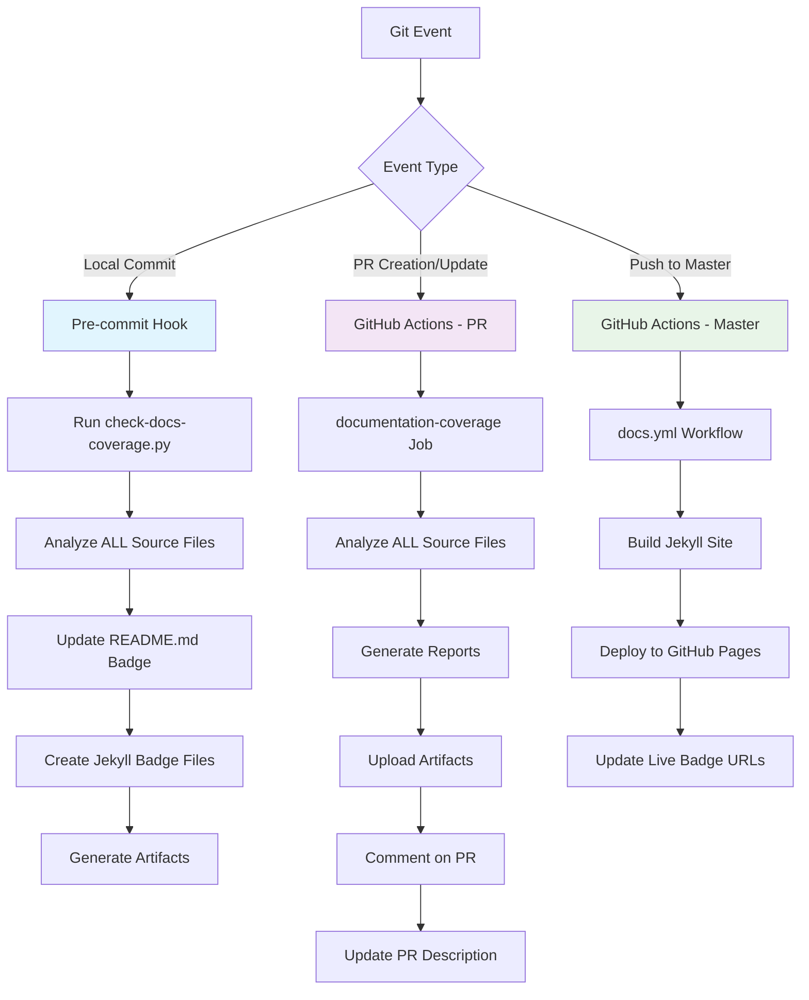
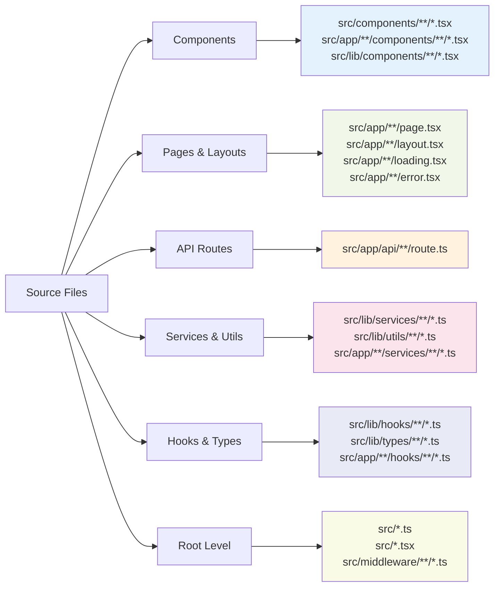
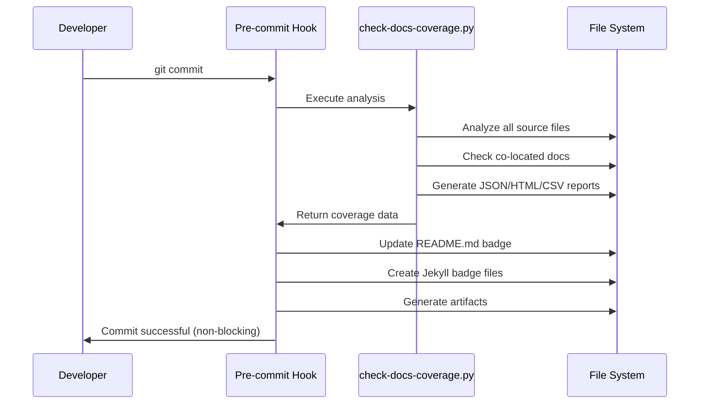
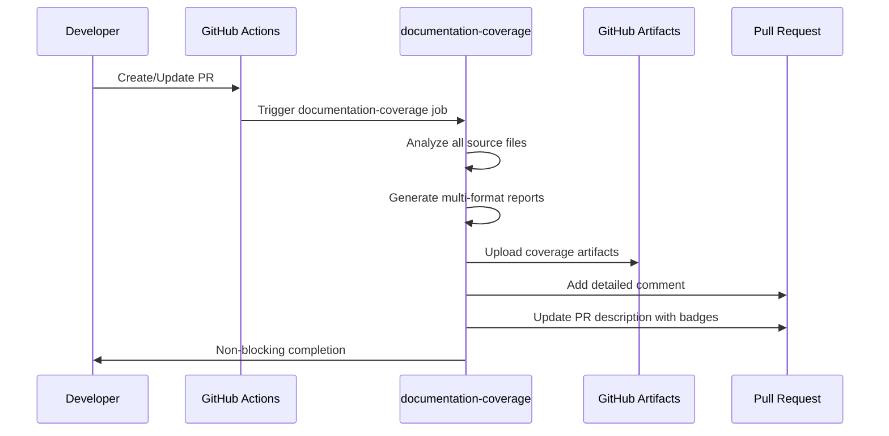
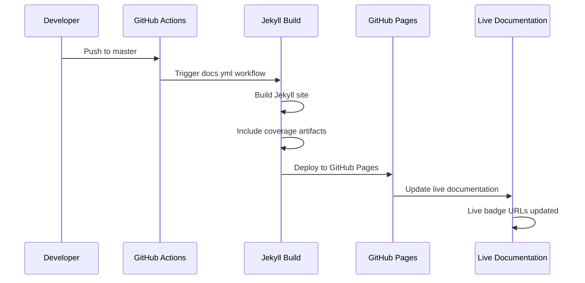
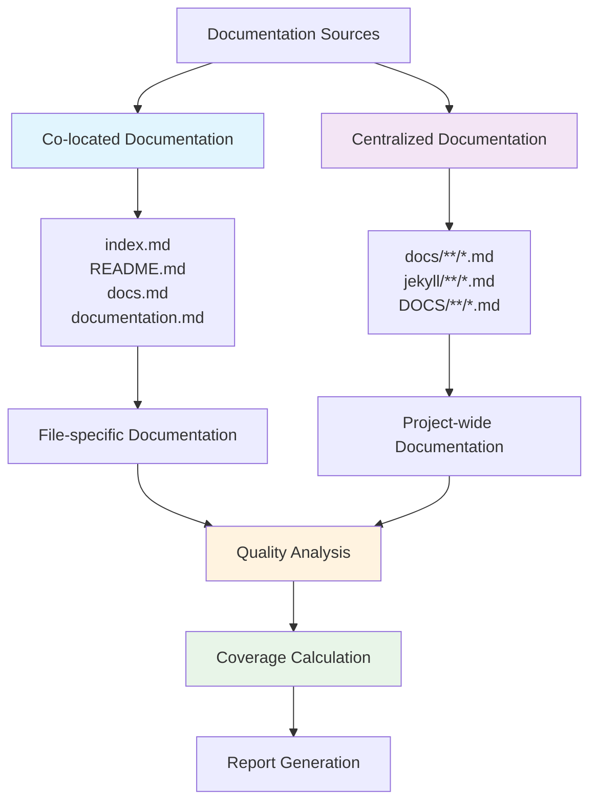
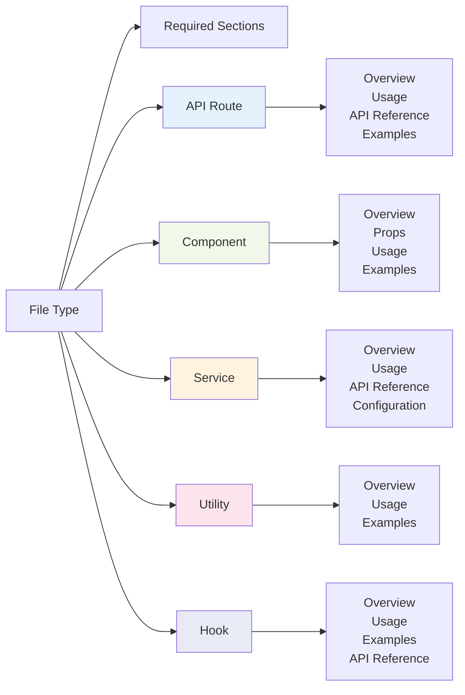

# 📚 Documentation Coverage System

Our automated documentation coverage system ensures comprehensive documentation across all source code files using industry-standard practices and multi-format reporting.

## 🎯 System Overview

The documentation coverage system operates across three main Git events, analyzing all source files and generating detailed reports with downloadable artifacts.



## 🔍 Files Analyzed

Our system comprehensively analyzes all source files across the codebase:



### 📁 Complete File Pattern Analysis

| Category            | Pattern                          | Description                    |
| ------------------- | -------------------------------- | ------------------------------ |
| **Components**      | `src/components/**/*.tsx`        | Standalone reusable components |
|                     | `src/app/**/components/**/*.tsx` | App-specific components        |
|                     | `src/lib/components/**/*.tsx`    | Library components             |
| **Pages & Layouts** | `src/app/**/page.tsx`            | Next.js app pages              |
|                     | `src/app/**/layout.tsx`          | Layout components              |
|                     | `src/app/**/loading.tsx`         | Loading states                 |
|                     | `src/app/**/error.tsx`           | Error boundaries               |
|                     | `src/app/**/not-found.tsx`       | 404 pages                      |
| **API Routes**      | `src/app/api/**/route.ts`        | API route handlers             |
| **Services**        | `src/lib/services/**/*.ts`       | Core service layer             |
|                     | `src/app/**/services/**/*.ts`    | App-specific services          |
| **Utilities**       | `src/lib/utils/**/*.ts`          | Utility functions              |
|                     | `src/app/**/utils/**/*.ts`       | App-specific utilities         |
| **Hooks**           | `src/lib/hooks/**/*.ts`          | Custom React hooks             |
|                     | `src/app/**/hooks/**/*.ts`       | App-specific hooks             |
| **Types**           | `src/lib/types/**/*.ts`          | Type definitions               |
|                     | `src/app/**/types/**/*.ts`       | App-specific types             |
| **Constants**       | `src/app/**/constants/**/*.ts`   | Constants                      |
| **Root Level**      | `src/*.ts`, `src/*.tsx`          | Root-level files               |
| **Middleware**      | `src/middleware/**/*.ts`         | Middleware functions           |

## 🚀 Event-Driven Analysis

### 🔄 Local Commits (Pre-commit Hook)

**Trigger**: Every `git commit`



**Features**:

- ✅ **Real-time badge updates** in README.md
- ✅ **Local artifact generation** in `DOCS/coverage-artifacts/`
- ✅ **Jekyll badge file creation** for documentation site
- ✅ **Non-blocking** - won't fail commits
- ✅ **Comprehensive analysis** of all source files

### 🔀 Pull Requests (GitHub Actions)

**Trigger**: PR opened, synchronized, or reopened



**Features**:

- ✅ **Multi-format reports** (JSON, Markdown, HTML, CSV)
- ✅ **GitHub artifact uploads** with download links
- ✅ **Automated PR comments** with detailed coverage
- ✅ **PR description updates** with badge integration
- ✅ **Non-blocking** - uses warnings instead of failures

### 🚀 Master Branch (GitHub Actions)

**Trigger**: Push to `main`/`master` branch



**Features**:

- ✅ **Live documentation deployment** to GitHub Pages
- ✅ **Updated badge URLs** pointing to live site
- ✅ **Artifact deployment** for public access
- ✅ **Jekyll site integration** with coverage data

## 📊 Documentation Sources

Our system analyzes documentation from multiple sources:



## 🎯 Quality Standards

### 📏 Coverage Thresholds

| Level           | Minimum Coverage | Quality Score |
| --------------- | ---------------- | ------------- |
| **Production**  | 85%              | 0.7           |
| **Development** | 70%              | 0.6           |
| **Warning**     | 50%              | 0.5           |

### 📝 Required Documentation Sections



### 📊 Word Count Requirements

| Priority     | Minimum Words | Description                            |
| ------------ | ------------- | -------------------------------------- |
| **Critical** | 200 words     | Core APIs, main components             |
| **High**     | 150 words     | Important utilities, auth              |
| **Medium**   | 100 words     | Helper functions, secondary components |
| **Low**      | 50 words      | Internal utilities, dev tools          |

## 📥 Available Reports

### 📋 Interactive HTML Report

- **Features**: Visual interface, filtering, search
- **Best for**: Quick review, presentations
- **Download**: Available in artifacts or `/coverage-artifacts/`

### 📊 CSV Report

- **Features**: Structured data, Excel-compatible
- **Best for**: Analysis, tracking, reporting
- **Download**: Available in artifacts or `/coverage-artifacts/`

### 📄 JSON Report

- **Features**: Structured data, API integration
- **Best for**: Automation, custom analysis
- **Download**: Available in GitHub Actions artifacts

### 📝 Markdown Report

- **Features**: Human-readable, GitHub-compatible
- **Best for**: Documentation, PR reviews
- **Download**: Available in GitHub Actions artifacts

## 🔧 Configuration

The system is configured via `scripts/docs-coverage-config.json`:

```json
{
  "documentation_standards": {
    "minimum_coverage_percentage": 85.0,
    "minimum_quality_score": 0.7
  },
  "code_analysis": {
    "file_patterns": {
      "components": "src/components/**/*.tsx",
      "api_routes": "src/app/api/**/route.ts"
    }
  }
}
```

## 🚀 Manual Usage

### Command Line Interface

```bash
# Generate HTML report
python scripts/check-docs-coverage.py --format html

# Generate CSV report
python scripts/check-docs-coverage.py --format csv

# Generate all formats
python scripts/check-docs-coverage.py --format all
```

### Local Development

```bash
# Check coverage before commit
python scripts/check-docs-coverage.py --format console

# Generate report for specific format
python scripts/check-docs-coverage.py --format html --output my-report.html
```

## 📈 Understanding Metrics

### Coverage Percentage

```
Coverage = (Documented Files / Total Files) × 100
```

### Quality Score

```
Quality = Average of all file documentation quality scores
```

### Priority Distribution

Files are categorized by complexity and importance:

- **Critical**: Core APIs, main components
- **High**: Important utilities, authentication
- **Medium**: Helper functions, secondary components
- **Low**: Internal utilities, development tools

## 🔄 Continuous Improvement

### Workflow Integration

1. **Pre-commit**: Immediate feedback on documentation changes
2. **PR Review**: Detailed analysis with downloadable reports
3. **Deployment**: Live documentation with updated metrics

### Best Practices

- ✅ **Write documentation alongside code**
- ✅ **Use co-located documentation files**
- ✅ **Include all required sections**
- ✅ **Meet minimum word count requirements**
- ✅ **Review coverage reports regularly**

---

## 📊 Current Status



[📥 Download Latest Reports](/coverage-artifacts/)

---

_This documentation is automatically updated with each deployment. For technical details, see the [configuration file](https://github.com/Underwood-Inc/idling.app__UI/blob/main/scripts/docs-coverage-config.json)._
