# Admin Users API - What It Does & How It Helps

**Description**: Comprehensive user management endpoint for administrators to view, search, and analyze user accounts with detailed information including roles, subscriptions, and moderation status.

## What this page is about

This page explains the admin users API that powers the administrative user management interface. Whether you're an administrator managing the community, a developer building admin tools, or a system operator monitoring user activity, this guide explains how to access and understand comprehensive user data.

**⚠️ Admin Only**: This endpoint requires administrator privileges and is not accessible to regular users.

## What Does This Actually Do?

Think of this like the "Admin Panel" of a content management system, but specifically for user accounts. Just like how WordPress admins can see all users, their roles, and activity, this API provides administrators with a comprehensive view of all user accounts in the system.

It's like having a detailed database of all community members that shows:

- **Who they are**: Basic profile information
- **How they joined**: Authentication provider details
- **What they can do**: Roles and permissions
- **Their engagement**: Login activity and subscriptions
- **Moderation status**: Timeouts, bans, or warnings

This helps administrators make informed decisions about user management, moderation, and community health.

## Why Do We Need This?

### For Administrators

- **User Management**: View and analyze all user accounts in one place
- **Moderation Decisions**: Access complete user history for fair moderation
- **Community Health**: Monitor user engagement and activity patterns
- **Security Oversight**: Track authentication methods and login patterns

### For Support Teams

- **User Assistance**: Access detailed user information to provide better support
- **Account Issues**: Understand user status and potential problems
- **Permission Questions**: See exactly what roles and access users have
- **Subscription Support**: Help users with billing and subscription issues

### For System Administrators

- **Platform Monitoring**: Track user growth and engagement metrics
- **Security Analysis**: Monitor authentication patterns and potential issues
- **Resource Planning**: Understand subscription and usage patterns
- **Compliance**: Access user data for legal or regulatory requirements

## How It Works (The Simple Version)

```mermaid
sequenceDiagram
    participant Admin as 👮 Administrator
    participant API as 🔄 Admin Users API
    participant Auth as 🔐 Permission Check
    participant DB as 🗄️ Database
    participant Logger as 📝 Audit Logger

    Admin->>API: GET /api/admin/users?page=1&search=john
    API->>Auth: Verify admin permissions
    Auth->>API: ✅ Admin confirmed
    API->>DB: Complex query with joins
    Note over DB: - User profiles<br/>- Auth providers<br/>- Roles & permissions<br/>- Subscriptions<br/>- Timeout status
    DB->>API: Comprehensive user data
    API->>Logger: Log admin access
    API->>Admin: Paginated user list with full details
```



## Visual Flow


## API Details

### Endpoint

```
GET /api/admin/users
```

### Query Parameters

| Parameter | Type    | Required | Default | Description                        |
| --------- | ------- | -------- | ------- | ---------------------------------- |
| `page`    | integer | No       | 1       | Page number for pagination         |
| `limit`   | integer | No       | 20      | Users per page (max: 100)          |
| `search`  | string  | No       | -       | Search by name, email, or provider |

### Request Examples

```bash
# Get first page of users
GET /api/admin/users

# Search for specific users
GET /api/admin/users?search=john&page=1&limit=50

# Get second page with smaller limit
GET /api/admin/users?page=2&limit=10
```

### Response Format

```json
{
  "users": [
    {
      "id": 123,
      "name": "John Doe",
      "email": "john@example.com",
      "image": "https://idling.app/avatars/123.jpg",
      "created_at": "2024-01-15T10:30:00Z",
      "profile_public": true,
      "bio": "Software developer",
      "location": "San Francisco",
      "last_login": "2024-01-20T15:45:00Z",
      "login_count": 45,
      "is_active": true,
      "admin_notes": null,
      "provider_name": "google",
      "provider_email": "john@gmail.com",
      "provider_verified": true,
      "provider_last_used": "2024-01-20T15:45:00Z",
      "role_count": 2,
      "role_names": "user,moderator",
      "has_admin": false,
      "has_moderator": true,
      "subscription_count": 1,
      "active_subscriptions": 1,
      "subscription_names": "premium",
      "has_active_subscription": true,
      "is_timed_out": false,
      "timeout_count": 0,
      "active_timeout_reason": null,
      "timeout_expires": null,
      "active_timeout_id": null
    }
  ],
  "currentPage": 1,
  "totalPages": 25,
  "pagination": {
    "page": 1,
    "limit": 20,
    "total": 487,
    "totalPages": 25,
    "hasNext": true,
    "hasPrev": false
  }
}
```

## User Data Structure

### Basic Profile Information

| Field            | Type         | Description                       |
| ---------------- | ------------ | --------------------------------- |
| `id`             | number       | Unique user database ID           |
| `name`           | string\|null | Display name                      |
| `email`          | string       | Primary email address             |
| `image`          | string\|null | Avatar image URL                  |
| `created_at`     | string       | Account creation timestamp        |
| `profile_public` | boolean      | Public profile visibility setting |
| `bio`            | string       | User biography                    |
| `location`       | string       | User location                     |
| `is_active`      | boolean      | Account active status             |
| `admin_notes`    | string\|null | Admin-only notes about the user   |

### Authentication Information

| Field                | Type         | Description                                  |
| -------------------- | ------------ | -------------------------------------------- |
| `provider_name`      | string\|null | Primary auth provider (google, github, etc.) |
| `provider_email`     | string\|null | Email from auth provider                     |
| `provider_verified`  | boolean      | Provider email verification status           |
| `provider_last_used` | string\|null | Last provider authentication                 |
| `last_login`         | string\|null | Most recent login timestamp                  |
| `login_count`        | number       | Total number of logins                       |

### Role & Permission Summary

| Field           | Type         | Description                        |
| --------------- | ------------ | ---------------------------------- |
| `role_count`    | number       | Total number of roles assigned     |
| `role_names`    | string\|null | Comma-separated list of role names |
| `has_admin`     | boolean      | Whether user has admin role        |
| `has_moderator` | boolean      | Whether user has moderator role    |

### Subscription Information

| Field                     | Type         | Description                              |
| ------------------------- | ------------ | ---------------------------------------- |
| `subscription_count`      | number       | Total subscriptions (active + inactive)  |
| `active_subscriptions`    | number       | Currently active subscriptions           |
| `subscription_names`      | string\|null | Names of subscription types              |
| `has_active_subscription` | boolean      | Whether user has any active subscription |

### Moderation Status

| Field                   | Type         | Description                         |
| ----------------------- | ------------ | ----------------------------------- |
| `is_timed_out`          | boolean      | Whether user is currently timed out |
| `timeout_count`         | number       | Total number of timeouts received   |
| `active_timeout_reason` | string\|null | Reason for current timeout          |
| `timeout_expires`       | string\|null | When current timeout expires        |
| `active_timeout_id`     | number\|null | ID of active timeout record         |

## Different Ways This Gets Used

### Basic User Listing

```javascript
// Get all users with default pagination
const getUsers = async () => {
  const response = await fetch('/api/admin/users', {
    headers: {
      Authorization: 'Bearer admin-token'
    }
  });

  if (response.ok) {
    return await response.json();
  } else {
    throw new Error(`Failed to fetch users: ${response.status}`);
  }
};
```

### User Search

```javascript
// Search for specific users
const searchUsers = async (searchTerm) => {
  const params = new URLSearchParams({
    search: searchTerm,
    limit: '50'
  });

  const response = await fetch(`/api/admin/users?${params}`);
  const data = await response.json();

  return data.users.filter((user) => user.is_active);
};
```

### Paginated User Browser

```javascript
// Build a paginated user management interface
const UserManagement = () => {
  const [users, setUsers] = useState([]);
  const [currentPage, setCurrentPage] = useState(1);
  const [totalPages, setTotalPages] = useState(0);
  const [searchTerm, setSearchTerm] = useState('');

  const loadUsers = async (page = 1, search = '') => {
    const params = new URLSearchParams({
      page: page.toString(),
      limit: '20'
    });

    if (search) params.append('search', search);

    const response = await fetch(`/api/admin/users?${params}`);
    const data = await response.json();

    setUsers(data.users);
    setCurrentPage(data.currentPage);
    setTotalPages(data.totalPages);
  };

  // Load users on mount and when search changes
  useEffect(() => {
    loadUsers(1, searchTerm);
  }, [searchTerm]);

  return (
    <div>
      <input
        type="text"
        value={searchTerm}
        onChange={(e) => setSearchTerm(e.target.value)}
        placeholder="Search users..."
      />

      <UserList users={users} />

      <Pagination
        currentPage={currentPage}
        totalPages={totalPages}
        onPageChange={loadUsers}
      />
    </div>
  );
};
```

### Moderation Dashboard

```javascript
// Find users needing moderation attention
const getModerationCandidates = async () => {
  const response = await fetch('/api/admin/users?limit=100');
  const data = await response.json();

  return data.users.filter(
    (user) =>
      user.is_timed_out ||
      user.timeout_count > 0 ||
      !user.is_active ||
      user.admin_notes
  );
};
```

## Permission Requirements

This endpoint requires strict authentication and authorization:


### Required Permissions

- **Authentication**: Valid JWT session token
- **Role**: Administrator or higher
- **Permission**: `users:manage` capability [[memory:3312440]]
- **Rate Limit**: 100 requests per hour for admin endpoints

## When Things Go Wrong

### Common Issues

**🔐 "Authentication required" (401)**

- Admin session has expired or is invalid
- Re-authenticate with admin credentials
- Verify JWT token is being sent correctly

**🚫 "Insufficient permissions" (403)**

- User account doesn't have admin role
- Missing `users:manage` permission
- Contact system administrator for role assignment

**❌ "Invalid query parameters" (400)**

- `page` must be a positive integer
- `limit` must be between 1 and 100
- `search` must be a valid string (not empty)

**⚡ "Rate limit exceeded" (429)**

- Admin endpoints allow 100 requests per hour
- Wait for rate limit reset or increase admin tier
- Consider implementing client-side caching

### Error Response Examples

```json
// Authentication required
{
  "error": "Unauthorized"
}

// Invalid parameters
{
  "error": "Invalid query parameters",
  "details": [
    {
      "code": "invalid_type",
      "expected": "number",
      "received": "string",
      "path": ["page"],
      "message": "Expected number, received string"
    }
  ]
}

// Server error
{
  "error": "Failed to fetch users",
  "details": "Database connection failed"
}
```

### Getting Help

- **For Admins**: Check your role assignments and session validity
- **For Developers**: Verify API token permissions and request format
- **For System Ops**: Monitor database performance and connection health

## Performance Considerations

### Query Complexity

This endpoint performs complex database operations:


### Performance Metrics

- **Response Time**: 200ms - 2s (depending on user count and search)
- **Database Joins**: 5 lateral joins for comprehensive data
- **Search Performance**: Indexed on name, email, provider fields
- **Memory Usage**: ~2KB per user record
- **Rate Limiting**: 100 requests/hour for admin tier

### Optimization Tips

```javascript
// Cache frequently accessed data
const userCache = new Map();

const getCachedUsers = async (cacheKey) => {
  if (userCache.has(cacheKey)) {
    const cached = userCache.get(cacheKey);
    // Cache for 5 minutes
    if (Date.now() - cached.timestamp < 300000) {
      return cached.data;
    }
  }

  const data = await fetchUsers();
  userCache.set(cacheKey, {
    data,
    timestamp: Date.now()
  });
  return data;
};

// Use specific searches instead of loading all users
const searchSpecificUsers = async (criteria) => {
  // More efficient than loading all users and filtering client-side
  return await fetch(`/api/admin/users?search=${criteria}&limit=25`);
};
```

## Security & Audit

### Security Features

- **Admin-Only Access**: Requires administrator role verification
- **Permission Checking**: Uses database-backed permission system [[memory:3312440]]
- **Input Validation**: All parameters validated with Zod schemas
- **Rate Limiting**: 100 requests per hour for admin endpoints
- **SQL Injection Protection**: Parameterized queries throughout

### Audit Logging

All admin access is automatically logged:

```javascript
// Automatic audit trail
logger.info('Admin users accessed', {
  adminId: session.user.id,
  query: { page, limit, search },
  timestamp: new Date().toISOString(),
  userAgent: request.headers.get('user-agent')
});
```

## Development & Testing

### Local Testing

```bash
# Test basic endpoint (requires admin auth)
curl -H "Authorization: Bearer admin-token" \
     "http://localhost:3000/api/admin/users"

# Test search functionality
curl -H "Authorization: Bearer admin-token" \
     "http://localhost:3000/api/admin/users?search=john&limit=5"

# Test pagination
curl -H "Authorization: Bearer admin-token" \
     "http://localhost:3000/api/admin/users?page=2&limit=10"
```

### Integration Testing

```javascript
// Test admin users API
describe('Admin Users API', () => {
  test('requires admin authentication', async () => {
    const response = await fetch('/api/admin/users');
    expect(response.status).toBe(401);
  });

  test('returns paginated users for admin', async () => {
    const response = await fetch('/api/admin/users', {
      headers: { Authorization: 'Bearer admin-token' }
    });
    const data = await response.json();

    expect(data.users).toBeArray();
    expect(data.pagination).toBeDefined();
    expect(data.totalPages).toBeNumber();
  });

  test('handles search parameters', async () => {
    const response = await fetch('/api/admin/users?search=test&limit=5');
    const data = await response.json();

    expect(data.users.length).toBeLessThanOrEqual(5);
  });
});
```

---

_Last updated: 2024-01-15 | API Version: 1.0 | Source: `/src/app/api/admin/users/route.ts`_
