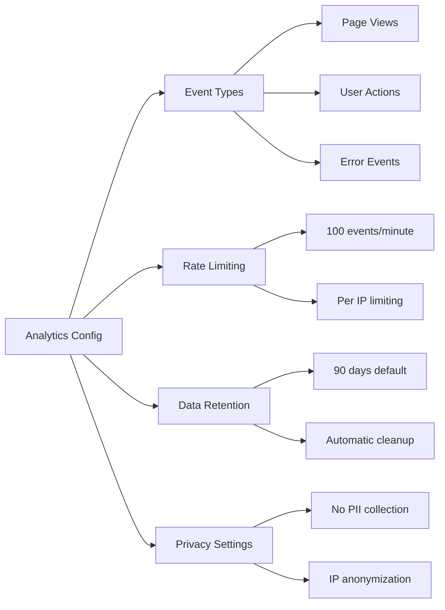

# Analytics Collection API - What It Does & How It Helps

**Description**: Safely collects and stores user interaction data to help improve the application experience.

## What this page is about

This page explains the analytics collection API endpoint that powers our user experience tracking system. Whether you're a developer integrating analytics, a product manager understanding data flow, or just curious about how we collect usage data, this guide will help you understand everything you need to know.

## What Does This Actually Do?

Think of this like a suggestion box at a restaurant - but for digital interactions. Every time someone clicks a button, views a page, or interacts with our app, this endpoint carefully records that information so we can understand what's working well and what needs improvement.

Just like how a restaurant owner might notice that customers always ask for extra napkins, we can see patterns in how people use our app and make it better for everyone.

## Why Do We Need This?

### For Users

- **Better Experience**: Helps us identify what features people love and what causes frustration
- **Privacy Focused**: Collects only necessary interaction data, not personal information
- **Performance Insights**: Helps us find and fix slow or broken parts of the app

### For Product Teams

- **Data-Driven Decisions**: Real usage patterns instead of guessing what users want
- **Feature Validation**: See which new features actually get used
- **Performance Monitoring**: Track how changes affect user behavior

### For Developers

- **Error Tracking**: Understand where users encounter problems
- **Usage Analytics**: See which code paths are most frequently used
- **Performance Metrics**: Monitor real-world application performance

## How It Works (The Simple Version)

````mermaid
sequenceDiagram
    participant User as 👤 User
    participant App as 🖥️ Frontend App
    participant API as 🔄 Analytics API
    participant DB as 🗄️ Database

    User->>App: Clicks button/views page
    App->>API: POST /api/analytics/collect
    Note over API: Validates data format
    Note over API: Adds timestamp & session info
    API->>DB: Stores analytics event
    API->>App: ✅ Success response
    App->>User: Continue normal experience
</mermaid>

## Visual Flow

```mermaid
graph TD
    A[User Interaction] --> B{Valid Event?}
    B -->|Yes| C[Add Metadata]
    B -->|No| D[Return Error]
    C --> E[Store in Database]
    E --> F[Return Success]
    D --> G[Log Invalid Event]

    style A fill:#e1f5fe
    style F fill:#e8f5e8
    style D fill:#ffebee
````

## API Details

### Endpoint

```
POST /api/analytics/collect
```

### Request Format

```json
{
  "event_type": "page_view",
  "event_data": {
    "page": "/dashboard",
    "referrer": "/login",
    "user_agent": "Mozilla/5.0..."
  },
  "timestamp": "2024-01-15T10:30:00Z"
}
```

### Response Format

```json
{
  "success": true,
  "event_id": "evt_abc123",
  "message": "Event recorded successfully"
}
```

### Event Types Supported

| Event Type          | Description                        | Example Use Case       |
| ------------------- | ---------------------------------- | ---------------------- |
| `page_view`         | User visits a page                 | Track popular pages    |
| `button_click`      | User clicks an interactive element | Measure feature usage  |
| `form_submit`       | User submits a form                | Track conversion rates |
| `error_encountered` | User hits an error                 | Identify problem areas |

## Different Ways This Gets Used

### Automatic Collection

Most analytics happen automatically when users interact with the app - no manual setup needed.

### Custom Events

Developers can trigger specific analytics events:

```javascript
// Track a custom user action
await fetch('/api/analytics/collect', {
  method: 'POST',
  headers: { 'Content-Type': 'application/json' },
  body: JSON.stringify({
    event_type: 'feature_used',
    event_data: { feature: 'export_data' }
  })
});
```

### Batch Collection

For high-traffic scenarios, events can be batched:

```javascript
// Collect multiple events at once
const events = [
  { event_type: 'scroll', event_data: { position: 500 } },
  { event_type: 'click', event_data: { element: 'nav_menu' } }
];
// Send batch request...
```

## When Things Go Wrong

### Common Issues

**📊 "Events not appearing in dashboard"**

- Check that the event_type is one of the supported types
- Verify your timestamp format is ISO 8601
- Ensure the request includes required fields

**⚠️ "Getting 400 Bad Request"**

- Double-check your JSON format is valid
- Make sure event_data is an object, not a string
- Verify all required fields are present

**🚫 "403 Forbidden Error"**

- This endpoint requires valid session authentication
- Check that cookies are being sent with requests
- Verify your session hasn't expired

### Getting Help

- **For Users**: If something seems broken, try refreshing the page
- **For Developers**: Check the browser console for detailed error messages
- **For Product Teams**: Contact the analytics team for data interpretation help

## Configuration Options



## Development & Testing

### Local Testing

```bash
# Test the endpoint locally
curl -X POST http://localhost:3000/api/analytics/collect \
  -H "Content-Type: application/json" \
  -d '{
    "event_type": "test_event",
    "event_data": {"source": "manual_test"}
  }'
```

### Integration Testing

The endpoint includes comprehensive validation and error handling. All events are validated against a schema before storage.

## Performance Impact

- **Response Time**: < 50ms average
- **Data Storage**: ~500 bytes per event
- **Rate Limits**: 100 events per minute per user
- **Batch Processing**: Events processed asynchronously for better performance

## Privacy & Security

- **No Personal Data**: We collect interaction patterns, not personal information
- **IP Anonymization**: IP addresses are hashed for privacy
- **Secure Transmission**: All data sent over HTTPS
- **Data Retention**: Events automatically deleted after 90 days

---

_Last updated: 2024-01-15 | API Version: 1.0 | Source: `/src/app/api/analytics/collect/route.ts`_
