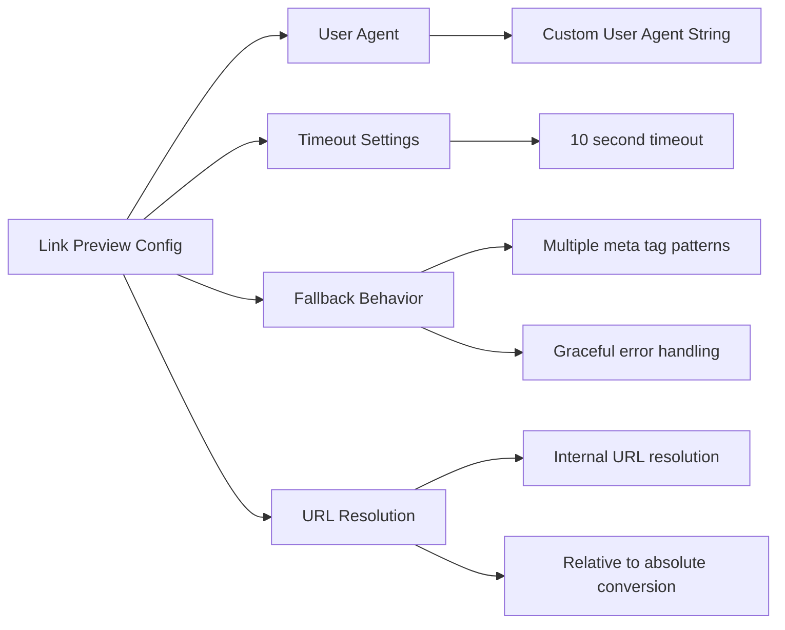

# Link Preview API - What It Does & How It Helps

**Description**: Intelligently extracts and returns metadata (title, description, image) from any web page to create rich link previews.

## What this page is about

This page explains the link preview API that powers rich tooltips and link cards throughout our application. Whether you're a developer building link preview features, a content creator wanting to understand how previews work, or just curious about the magic behind those helpful link cards, this guide breaks it down in plain language.

## What Does This Actually Do?

Think of this like a smart librarian who can instantly tell you what any book (web page) is about just by looking at its cover and first few pages. When you give this API a web address, it visits that page, reads the important information like the title, description, and main image, then gives you a neat summary card.

It's like how social media platforms show you a preview when you paste a link - our API does the same thing, turning plain URLs into informative cards with titles, descriptions, and images.

## Why Do We Need This?

### For Users

- **Rich Link Experience**: See what a link is about before clicking it
- **Visual Context**: Images and descriptions help decide if content is relevant
- **Faster Navigation**: Preview content saves time and improves browsing efficiency
- **Safety**: Know what you're clicking before visiting external sites

### For Content Creators

- **Better Engagement**: Rich previews encourage more clicks on shared content
- **Professional Appearance**: Links look polished and trustworthy
- **Content Discovery**: Helps users find and share interesting content
- **Social Media Optimization**: Ensures content looks good when shared

### For Developers

- **Enhanced UX**: Easy integration of rich link previews in any interface
- **Metadata Extraction**: Automatic parsing of Open Graph, Twitter Cards, and standard meta tags
- **Error Handling**: Robust fallbacks when pages don't load or lack metadata
- **Performance**: Fast caching and optimized metadata extraction

## How It Works (The Simple Version)

````mermaid
sequenceDiagram
    participant User as 👤 User
    participant App as 🖥️ Frontend App
    participant API as 🔄 Link Preview API
    participant Web as 🌐 Target Website

    User->>App: Hovers over link
    App->>API: GET /api/link-preview?url=example.com
    API->>Web: Fetch webpage HTML
    Web->>API: Return HTML content
    Note over API: Extract metadata<br/>(title, description, image)
    API->>App: Return metadata JSON
    App->>User: Show rich preview tooltip
</mermaid>

## Visual Flow

```mermaid
graph TD
    A[URL Input] --> B{URL Valid?}
    B -->|No| C[Return Error]
    B -->|Yes| D{Internal Link?}
    D -->|Yes| E[Resolve to Full URL]
    D -->|No| F[Use Direct URL]
    E --> G[Fetch HTML Content]
    F --> G
    G --> H{Fetch Successful?}
    H -->|No| I[Return Error]
    H -->|Yes| J[Parse HTML]
    J --> K[Extract Title]
    J --> L[Extract Description]
    J --> M[Extract Image]
    K --> N[Return Metadata]
    L --> N
    M --> N

    style A fill:#e1f5fe
    style N fill:#e8f5e8
    style C fill:#ffebee
    style I fill:#ffebee
````

## API Details

### Endpoint

```
GET /api/link-preview?url={target_url}
```

### Request Parameters

| Parameter | Type   | Required | Description                      | Example               |
| --------- | ------ | -------- | -------------------------------- | --------------------- |
| `url`     | string | Yes      | The URL to extract metadata from | `https://example.com` |

### Request Examples

```bash
# External website
GET /api/link-preview?url=https://github.com/microsoft/vscode

# Internal link
GET /api/link-preview?url=/about

# Social media post
GET /api/link-preview?url=https://twitter.com/username/status/123
```

### Response Format

```json
{
  "title": "Visual Studio Code - Code Editing. Redefined",
  "description": "Visual Studio Code is a lightweight but powerful source code editor which runs on your desktop and is available for Windows, macOS and Linux.",
  "image": "https://code.visualstudio.com/assets/images/code-stable.png",
  "url": "https://github.com/microsoft/vscode"
}
```

### Response Fields

| Field         | Type   | Description                                       | Notes                          |
| ------------- | ------ | ------------------------------------------------- | ------------------------------ |
| `title`       | string | Page title extracted from `<title>` tag           | May be empty if not found      |
| `description` | string | Page description from meta tags                   | Uses multiple fallback sources |
| `image`       | string | Main image URL from Open Graph or other meta tags | Converted to absolute URL      |
| `url`         | string | The original URL that was requested               | Useful for tracking            |

## Different Ways This Gets Used

### Automatic Link Previews

Most link previews happen automatically when users hover over links:

```javascript
// Automatically triggered on hover
<Link onMouseEnter={fetchPreview} href="/some-link">
  Hover for preview
</Link>
```

### Manual Preview Generation

Developers can manually fetch previews for any URL:

```javascript
const fetchLinkPreview = async (url) => {
  const response = await fetch(
    `/api/link-preview?url=${encodeURIComponent(url)}`
  );
  const metadata = await response.json();
  return metadata;
};
```

### Batch Preview Processing

For processing multiple links at once:

```javascript
const urls = ['https://site1.com', 'https://site2.com'];
const previews = await Promise.all(urls.map((url) => fetchLinkPreview(url)));
```

## Metadata Sources Supported

The API intelligently extracts metadata from multiple sources in order of preference:

### Open Graph Tags (Preferred)

```html
<meta property="og:title" content="Page Title" />
<meta property="og:description" content="Page description" />
<meta property="og:image" content="https://example.com/image.jpg" />
```

### Twitter Cards

```html
<meta name="twitter:title" content="Page Title" />
<meta name="twitter:description" content="Page description" />
<meta name="twitter:image" content="https://example.com/image.jpg" />
```

### Standard Meta Tags

```html
<title>Page Title</title>
<meta name="description" content="Page description" />
<meta name="image" content="https://example.com/image.jpg" />
```

### Schema.org Microdata

```html
<meta itemprop="name" content="Page Title" />
<meta itemprop="description" content="Page description" />
<meta itemprop="image" content="https://example.com/image.jpg" />
```

## When Things Go Wrong

### Common Issues

**🔗 "Preview not loading for internal links"**

- Internal links (starting with `/`) are automatically resolved to full URLs
- Check that `NEXT_PUBLIC_APP_URL` environment variable is set correctly
- Verify the internal page exists and is accessible

**🌐 "External website preview fails"**

- Some websites block automated requests or require specific user agents
- Check if the target site has robots.txt restrictions
- Verify the URL is publicly accessible (not behind authentication)

**🖼️ "Image not showing in preview"**

- Images must be absolute URLs (automatically converted by API)
- Some sites restrict hotlinking of images
- Check if the image URL returns proper image content-type

**⚠️ "Getting 'URL is required' error"**

- Ensure the `url` parameter is included in the request
- URL must be properly encoded, especially if it contains special characters
- Use `encodeURIComponent()` when building requests in JavaScript

### Error Response Format

```json
{
  "error": "Failed to fetch link preview",
  "details": "HTTP 404: Not Found"
}
```

### Getting Help

- **For Users**: If link previews aren't working, try refreshing the page
- **For Developers**: Check browser console for detailed error messages and network requests
- **For Content Creators**: Ensure your pages have proper Open Graph meta tags for better previews

## Performance Considerations


### Performance Metrics

- **Average Response Time**: 800ms - 1.5s (depending on target site)
- **Cache TTL**: No built-in caching (consider implementing for frequently accessed URLs)
- **Timeout**: 10 seconds for external requests
- **User Agent**: `Mozilla/5.0 (compatible; IdlingApp-LinkPreview/1.0)`

### Optimization Tips

```javascript
// Debounce preview requests to avoid excessive API calls
const debouncedPreview = debounce(fetchLinkPreview, 300);

// Cache results client-side to avoid repeat requests
const previewCache = new Map();
const getCachedPreview = (url) => {
  if (previewCache.has(url)) {
    return previewCache.get(url);
  }
  const preview = fetchLinkPreview(url);
  previewCache.set(url, preview);
  return preview;
};
```

## Security & Privacy

### Request Safety

- **User Agent Identification**: All requests identify as IdlingApp-LinkPreview
- **No Cookies Sent**: Preview requests don't include user session cookies
- **External Request Limits**: Built-in timeout protection prevents hanging requests
- **Error Boundaries**: Failed requests don't expose internal system information

### Privacy Considerations

- **Server-Side Fetching**: Your IP address visits the target site, not the user's
- **No Tracking**: The API doesn't store or log requested URLs
- **Data Temporary**: Metadata is only returned, not permanently stored
- **HTTPS Preferred**: Works with both HTTP and HTTPS, but HTTPS is recommended

## Development & Testing

### Local Testing

```bash
# Test external URL
curl "http://localhost:3000/api/link-preview?url=https://github.com"

# Test internal URL
curl "http://localhost:3000/api/link-preview?url=/about"

# Test error handling
curl "http://localhost:3000/api/link-preview?url=invalid-url"
```

### Integration Testing

```javascript
// Test suite example
describe('Link Preview API', () => {
  test('extracts metadata from valid URL', async () => {
    const response = await fetch('/api/link-preview?url=https://example.com');
    const data = await response.json();

    expect(data.title).toBeDefined();
    expect(data.url).toBe('https://example.com');
  });

  test('handles invalid URLs gracefully', async () => {
    const response = await fetch('/api/link-preview');
    expect(response.status).toBe(400);
  });
});
```

## Configuration Options



### Environment Variables

- `NEXT_PUBLIC_APP_URL`: Base URL for resolving internal links (required)

---

_Last updated: 2024-01-15 | API Version: 1.0 | Source: `/src/app/api/link-preview/route.ts`_
