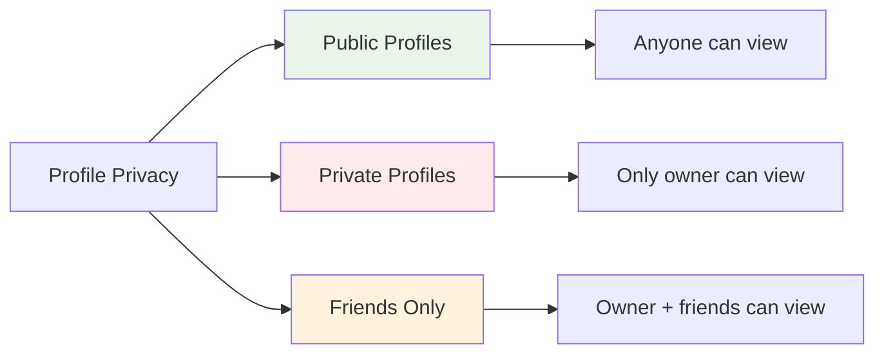
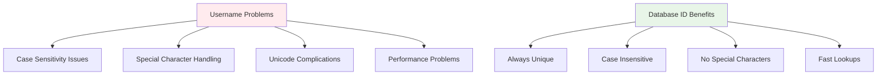

# Profile Management API - What It Does & How It Helps

**Description**: View and update user profiles with privacy protection and secure authentication.

## What this page is about

This page explains the profile management API endpoints that let you view user profiles and update your own profile information. Whether you're building user profile features, implementing social interactions, or just want to understand how profile privacy works, this guide explains everything in accessible terms.

**Important Migration Note**: Despite the `/profile/[username]` URL path, this endpoint now only accepts database IDs (not usernames) for maximum reliability and security.

## What Does This Actually Do?

Think of this like a combination of a social media profile viewer and editor. Just like how you can look at someone's Facebook or LinkedIn profile (if it's public), this API lets you:

1. **View profiles** - See someone's display name, bio, avatar, and other public information
2. **Update your own profile** - Change your bio and other profile details
3. **Respect privacy** - Automatically handle private profiles and permission checking

It's like having a smart bouncer at a club - it knows who can see what and who can change what, automatically protecting private information.

## Why Do We Need This?

### For Users

- **Profile Discovery**: Find and view other users' public profiles
- **Social Connection**: Learn about other community members through their profiles
- **Privacy Control**: Your privacy settings are automatically respected
- **Profile Management**: Easy way to update your bio and profile information

### For Developers

- **User Experience**: Build rich social features with profile integration
- **Privacy Compliance**: Automatic privacy protection without complex logic
- **Security**: Built-in authentication and authorization
- **Consistency**: Reliable database ID-based lookups

### For Community Managers

- **User Engagement**: Profiles help build community connections
- **Content Moderation**: Access to user information for moderation purposes
- **Analytics**: Understanding user engagement and profile completeness

## How It Works (The Simple Version)

````mermaid
sequenceDiagram
    participant User as 👤 User
    participant App as 🖥️ Frontend App
    participant API as 🔄 Profile API
    participant Privacy as 🔒 Privacy Check
    participant DB as 🗄️ Database

    User->>App: Request to view profile
    App->>API: GET /api/profile/[id]
    API->>Privacy: Check privacy settings
    Privacy->>DB: Fetch profile & permissions
    DB->>Privacy: Return profile data
    Privacy->>API: ✅ Allowed / ❌ Blocked

    alt Profile is public or accessible
        API->>App: Return profile data
        App->>User: Show profile
    else Profile is private
        API->>App: Return privacy error
        App->>User: Show "Profile is private"
    end
</mermaid>

## Visual Flow

```mermaid
graph TD
    A[Profile Request] --> B{Valid Database ID?}
    B -->|No| C[Return Invalid ID Error]
    B -->|Yes| D[Privacy Check]
    D --> E{Profile Exists?}
    E -->|No| F[Return Not Found]
    E -->|Yes| G{Privacy Settings}
    G -->|Public| H[Return Full Profile]
    G -->|Private| I{Authorized User?}
    G -->|Friends Only| J{Friend Relationship?}
    I -->|Yes| H
    I -->|No| K[Return Privacy Error]
    J -->|Yes| H
    J -->|No| K

    style A fill:#e1f5fe
    style H fill:#e8f5e8
    style C fill:#ffebee
    style F fill:#ffebee
    style K fill:#fff3e0
````

## API Details

### View Profile Endpoint

```
GET /api/profile/[id]
```

### Update Profile Endpoint

```
PATCH /api/profile/[id]
```

### Path Parameters

| Parameter | Type   | Required | Description                             | Example |
| --------- | ------ | -------- | --------------------------------------- | ------- |
| `id`      | string | Yes      | Database ID of the user (not username!) | `123`   |

### Profile View Response

```json
{
  "id": "123",
  "username": "johndoe",
  "display_name": "John Doe",
  "avatar_url": "https://idling.app/avatars/123.jpg",
  "bio": "Software developer and coffee enthusiast ☕",
  "created_at": "2024-01-15T10:30:00Z",
  "profile_visibility": "public"
}
```

### Profile Update Request

```json
{
  "bio": "Updated bio content - I love coding and coffee! ☕"
}
```

### Profile Update Response

```json
{
  "success": true,
  "profile": {
    "id": "123",
    "username": "johndoe",
    "display_name": "John Doe",
    "bio": "Updated bio content - I love coding and coffee! ☕",
    "avatar_url": "https://idling.app/avatars/123.jpg"
  },
  "message": "Bio updated successfully"
}
```

## Different Ways This Gets Used

### View Any Public Profile

```javascript
// Get profile by database ID
const response = await fetch('/api/profile/123');
const profile = await response.json();

if (profile.error) {
  // Handle private profile or not found
  console.log('Profile not accessible:', profile.error);
} else {
  // Display profile information
  displayProfile(profile);
}
```

### Update Your Own Profile Bio

```javascript
// Update your bio (requires authentication)
const updateBio = async (newBio) => {
  const response = await fetch('/api/profile/123', {
    method: 'PATCH',
    headers: {
      'Content-Type': 'application/json',
      Authorization: 'Bearer your-token'
    },
    body: JSON.stringify({ bio: newBio })
  });

  return await response.json();
};
```

### Check Profile Accessibility

```javascript
// Check if you can view a profile before making the request
const checkProfileAccess = async (userId) => {
  const response = await fetch(`/api/profile/${userId}`);

  if (response.status === 404) {
    return { accessible: false, reason: 'not_found' };
  } else if (response.status === 403) {
    return { accessible: false, reason: 'private' };
  } else if (response.ok) {
    return { accessible: true, profile: await response.json() };
  }

  return { accessible: false, reason: 'error' };
};
```

## Privacy Protection System

The API automatically handles different privacy levels:



### Privacy Levels

| Level            | Who Can View           | Example Response                    |
| ---------------- | ---------------------- | ----------------------------------- |
| **Public**       | Anyone                 | Full profile data                   |
| **Private**      | Only the profile owner | `{ "error": "Profile is private" }` |
| **Friends Only** | Owner + friends        | Profile data or privacy error       |

## When Things Go Wrong

### Common Issues

**🔢 "Invalid profile identifier" error**

- The endpoint only accepts database IDs (like `123`), not usernames
- Use numeric IDs: `/api/profile/123` ✅ not `/api/profile/johndoe` ❌
- This changed after migration 0010 for better reliability

**🔒 "Profile is private" response**

- The user has set their profile to private
- Only the profile owner can view private profiles
- This is normal behavior, not an error

**🚫 "Forbidden" when updating**

- You can only update your own profile, never someone else's
- Make sure you're using your own database ID in the URL
- Verify you're properly authenticated

**📝 "Bio must be 500 characters or less"**

- Bio content has a character limit for performance and UI reasons
- Use `getEffectiveCharacterCount()` to check length including emojis
- Consider breaking long bios into multiple sections

### Error Response Examples

```json
// Invalid ID format
{
  "error": "Invalid profile identifier. Only database IDs are supported."
}

// Private profile
{
  "error": "Profile is private",
  "status": "privacy_protected"
}

// Bio too long
{
  "error": "Bio must be 500 characters or less"
}

// Not authenticated
{
  "error": "Authentication required. Please log in."
}
```

### Getting Help

- **For Users**: If you can't see a profile, it might be set to private - this is normal
- **For Developers**: Check the network tab to see exact error responses and status codes
- **For Integration**: Use database IDs from your user management system, not usernames

## Migration from Username to Database IDs

### What Changed

Before migration 0010:

```javascript
// Old way (no longer works)
fetch('/api/profile/johndoe'); // ❌ Username lookup
```

After migration 0010:

```javascript
// New way (current)
fetch('/api/profile/123'); // ✅ Database ID lookup
```

### Why This Changed



### Migration Guide

If you're updating existing code:

```javascript
// Before: Username-based lookup
const oldWay = async (username) => {
  return fetch(`/api/profile/${username}`);
};

// After: Database ID-based lookup
const newWay = async (userId) => {
  return fetch(`/api/profile/${userId}`);
};

// Get user ID from your user management system:
const user = await getCurrentUser();
const profile = await newWay(user.id); // Use user.id, not user.username
```

## Performance Considerations

### Response Times

- **Profile View**: 50-200ms average
- **Profile Update**: 100-300ms average
- **Privacy Check**: 25-75ms overhead
- **Rate Limiting**: 100 requests per hour per user

### Optimization Tips

```javascript
// Cache profile data to avoid repeated requests
const profileCache = new Map();

const getCachedProfile = async (userId) => {
  if (profileCache.has(userId)) {
    return profileCache.get(userId);
  }

  const profile = await fetch(`/api/profile/${userId}`).then((r) => r.json());
  profileCache.set(userId, profile);
  return profile;
};

// Clear cache when profiles might have changed
const clearProfileCache = (userId) => {
  profileCache.delete(userId);
};
```

## Security & Privacy

### Data Protection

- **Privacy Settings Enforced**: Automatic respect for user privacy preferences
- **Authentication Required**: Profile updates require valid login session
- **Authorization Checked**: Can only edit your own profile
- **Input Validation**: Bio content validated for length and safety

### Rate Limiting

- **View Profiles**: 200 requests per hour
- **Update Profile**: 50 requests per hour
- **Privacy Violations**: Blocked for 1 hour after 10 failed attempts

## Development & Testing

### Local Testing

```bash
# View a public profile
curl "http://localhost:3000/api/profile/123"

# Update your bio (requires authentication)
curl -X PATCH "http://localhost:3000/api/profile/123" \
  -H "Content-Type: application/json" \
  -H "Authorization: Bearer your-token" \
  -d '{"bio": "New bio content"}'

# Test privacy protection
curl "http://localhost:3000/api/profile/456"  # Might return privacy error
```

### Integration Testing

```javascript
// Test profile viewing
describe('Profile API', () => {
  test('returns public profile data', async () => {
    const response = await fetch('/api/profile/123');
    const profile = await response.json();

    expect(profile.id).toBe('123');
    expect(profile.username).toBeDefined();
  });

  test('respects privacy settings', async () => {
    const response = await fetch('/api/profile/private-user-id');
    expect(response.status).toBe(403);
  });

  test('validates bio length on update', async () => {
    const longBio = 'x'.repeat(501);
    const response = await fetch('/api/profile/123', {
      method: 'PATCH',
      body: JSON.stringify({ bio: longBio })
    });
    expect(response.status).toBe(400);
  });
});
```

---

_Last updated: 2024-01-15 | API Version: 2.0 (Post-Migration 0010) | Source: `/src/app/api/profile/[username]/route.ts`_
