# Version API - What It Does & How It Helps

**Description**: Returns the current application version for health checks, debugging, and feature compatibility.

## What this page is about

This page explains the version API endpoint that tells you exactly which version of our application is currently running. Whether you're a developer checking compatibility, a support team member helping with issues, or a system administrator monitoring deployments, this simple but crucial endpoint provides essential version information.

## What Does This Actually Do?

Think of this like checking the "About" section of any software - it tells you exactly which version you're running. Just like how your phone shows "iOS 17.2" or your browser shows "Chrome 120.0", this API tells you which version of our application is currently active.

This is incredibly useful for:

- **Debugging**: "What version were you using when the problem happened?"
- **Support**: Helping users know if they need to update
- **Feature Detection**: Checking if a specific feature is available
- **Health Monitoring**: Automated systems verifying deployments

## Why Do We Need This?

### For Users

- **Support Requests**: Easily identify your version when reporting issues
- **Feature Availability**: Know if you have the latest features
- **Troubleshooting**: Help support teams diagnose version-specific problems
- **Update Awareness**: Understand when you're running an older version

### For Developers

- **Feature Detection**: Check if specific APIs or features are available
- **Compatibility Testing**: Ensure integrations work with current version
- **Debugging**: Identify version-specific bugs and behaviors
- **Development Workflow**: Verify deployments and rollouts

### For System Administrators

- **Deployment Verification**: Confirm successful deployments
- **Health Monitoring**: Include version in system health checks
- **Rollback Detection**: Track when rollbacks occur
- **Environment Consistency**: Ensure all instances run the same version

## How It Works (The Simple Version)

```mermaid
sequenceDiagram
    participant User as 👤 User/System
    participant API as 🔄 Version API
    participant Package as 📦 package.json

    User->>API: GET /api/version
    API->>Package: Read version field
    Package->>API: Return version string
    API->>User: {"version": "0.338.7"}

    Note over User,Package: No authentication required<br/>Always returns current version
```



## Visual Flow


## API Details

### Endpoint

```
GET /api/version
```

### Request

No parameters required - just a simple GET request.

### Response Format

```json
{
  "version": "0.338.7"
}
```

### Response Fields

| Field     | Type   | Description                                   | Example     |
| --------- | ------ | --------------------------------------------- | ----------- |
| `version` | string | Current application version from package.json | `"0.338.7"` |

## Different Ways This Gets Used

### Simple Version Check

```javascript
// Get current application version
const getAppVersion = async () => {
  const response = await fetch('/api/version');
  const data = await response.json();
  return data.version;
};

// Usage
const version = await getAppVersion();
console.log(`Running version: ${version}`);
```

### Feature Compatibility Check

```javascript
// Check if a feature is available based on version
const isFeatureAvailable = async (requiredVersion) => {
  const currentVersion = await getAppVersion();

  // Simple version comparison (for more complex needs, use semver library)
  const current = currentVersion.split('.').map(Number);
  const required = requiredVersion.split('.').map(Number);

  for (let i = 0; i < 3; i++) {
    if (current[i] > required[i]) return true;
    if (current[i] < required[i]) return false;
  }
  return true; // Versions are equal
};

// Usage
if (await isFeatureAvailable('0.300.0')) {
  // Use new API features
} else {
  // Use legacy API
}
```

### Health Check Integration

```javascript
// Include version in system health checks
const getSystemHealth = async () => {
  const [versionResponse, otherChecks] = await Promise.all([
    fetch('/api/version'),
    fetch('/api/health') // Other health endpoints
  ]);

  return {
    version: await versionResponse.json(),
    timestamp: new Date().toISOString()
    // ... other health data
  };
};
```

### Automated Monitoring

```javascript
// Monitor version changes in production
const monitorVersion = async () => {
  const checkVersion = async () => {
    try {
      const response = await fetch('/api/version');
      const { version } = await response.json();

      if (lastKnownVersion && lastKnownVersion !== version) {
        console.log(`Version changed: ${lastKnownVersion} → ${version}`);
        // Trigger alerts, refresh caches, etc.
      }

      lastKnownVersion = version;
    } catch (error) {
      console.error('Version check failed:', error);
    }
  };

  // Check every 5 minutes
  setInterval(checkVersion, 5 * 60 * 1000);
};
```

## Version Format

Our application uses semantic versioning (semver) with this format:


### Version Number Meaning

| Component       | Purpose          | When It Changes                      |
| --------------- | ---------------- | ------------------------------------ |
| **Major (0)**   | Breaking changes | API breaking changes, major rewrites |
| **Minor (338)** | New features     | New API endpoints, new functionality |
| **Patch (7)**   | Bug fixes        | Bug fixes, small improvements        |

## When Things Go Wrong

### Common Issues

**🚫 "API endpoint not responding"**

- Check that the application is running
- Verify the correct URL: `/api/version` (not `/version`)
- This endpoint has no rate limiting, so it should always be available

**📦 "Version shows as undefined or null"**

- This indicates a problem with the package.json file
- Contact system administrators - this is a deployment issue
- The application may not be properly built or deployed

**🌐 "CORS errors when calling from browser"**

- This endpoint includes CORS headers for cross-origin requests
- Check browser console for specific CORS error details
- Ensure you're calling the correct domain

### Error Response Format

```json
{
  "error": "Failed to read version information",
  "details": "package.json not found"
}
```

### Getting Help

- **For Users**: If version endpoint fails, the application may be down - try refreshing
- **For Developers**: Check network tab for HTTP status codes and error messages
- **For Administrators**: Version endpoint failure usually indicates deployment problems

## Performance Considerations

### Speed Metrics

- **Response Time**: < 10ms average (reads from memory)
- **No Rate Limiting**: Can be called as frequently as needed
- **Caching**: Response is not cached (always returns current version)
- **Resource Usage**: Minimal - just reads a JSON property

### Optimization Features


- **No Database Queries**: Version comes directly from package.json
- **No Authentication**: Skips all auth middleware for speed
- **Minimal Processing**: Simple JSON property extraction
- **Universal Enhancement**: Uses no-rate-limit wrapper for maximum availability

## Security & Privacy

### Security Features

- **No Authentication Required**: Public endpoint for system monitoring
- **No Sensitive Data**: Only returns version number
- **Rate Limit Exempt**: Cannot be used for denial-of-service attacks
- **CORS Enabled**: Safe for cross-origin requests

### Privacy Considerations

- **No User Data**: No personal information in version responses
- **No Logging**: Version requests are not logged or tracked
- **Public Information**: Version number is not considered sensitive
- **Anonymous Access**: No way to identify who requested version information

## Development & Testing

### Local Testing

```bash
# Simple version check
curl http://localhost:3000/api/version

# Test with verbose output
curl -v http://localhost:3000/api/version

# Check response headers
curl -I http://localhost:3000/api/version
```

### Integration Testing

```javascript
// Test version endpoint
describe('Version API', () => {
  test('returns valid version format', async () => {
    const response = await fetch('/api/version');
    const data = await response.json();

    expect(response.status).toBe(200);
    expect(data.version).toMatch(/^\d+\.\d+\.\d+$/); // semver format
  });

  test('responds quickly', async () => {
    const start = Date.now();
    await fetch('/api/version');
    const duration = Date.now() - start;

    expect(duration).toBeLessThan(100); // Should be very fast
  });

  test('allows CORS requests', async () => {
    const response = await fetch('/api/version');
    const corsHeader = response.headers.get('Access-Control-Allow-Origin');

    expect(corsHeader).toBeTruthy();
  });
});
```

### Monitoring Integration

```javascript
// Prometheus metrics example
const versionGauge = new Gauge({
  name: 'app_version_info',
  help: 'Application version information',
  labelNames: ['version']
});

// Update metrics with current version
const updateVersionMetrics = async () => {
  const { version } = await fetch('/api/version').then((r) => r.json());
  versionGauge.labels(version).set(1);
};
```

## Configuration

### Environment Variables

No configuration required - version is automatically read from `package.json`.

### Build Configuration

The version number is set during the build process:

```json
// package.json
{
  "version": "0.338.7"
  // ... other package info
}
```

---

_Last updated: 2024-01-15 | API Version: 1.0 | Source: `/src/app/api/version/route.ts`_
