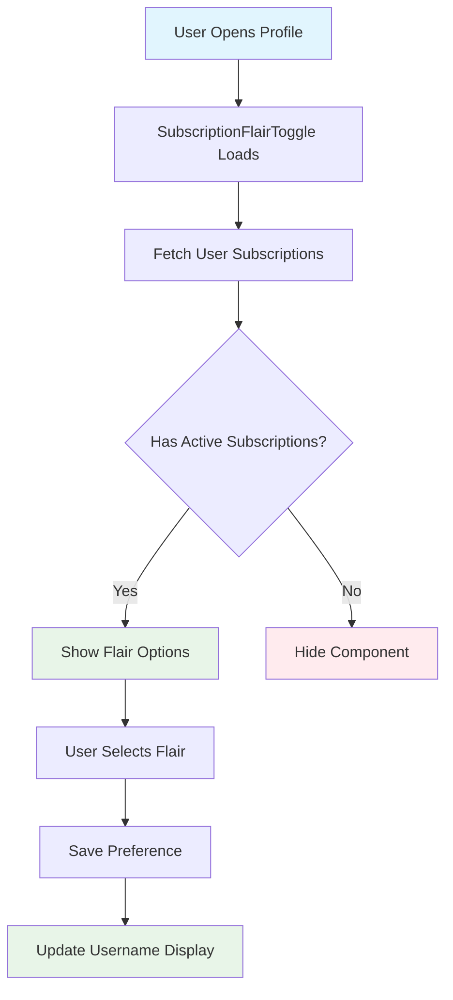
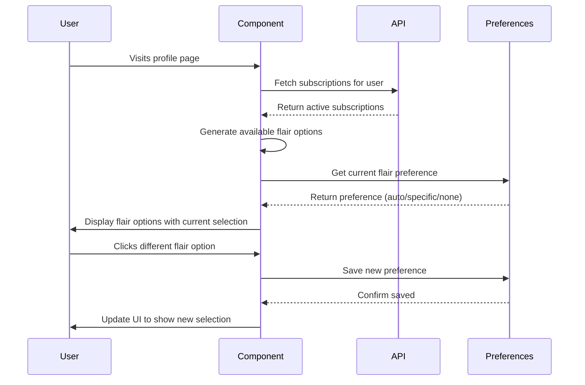
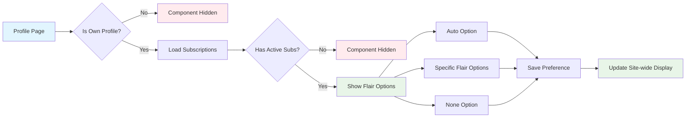

# SubscriptionFlairToggle - Username Flair Selection System 🎨

**What this page is about:** This page explains the SubscriptionFlairToggle component in simple terms, so whether you're a developer, designer, or just curious about how username flair works, you'll understand what it does and why it matters.

_A user interface component that lets people choose which subscription flair appears next to their username across the site._

## What Does This Actually Do? 🤔

Think of this like choosing which badge to wear on your jacket. Just as you might pick your favorite pin from a collection to show off, this system lets users pick which subscription benefit shows up as a visual decoration next to their username.

### The Big Picture



**In simple terms:**

- 📥 **Input**: User's active subscription data and current flair preference
- ⚙️ **Processing**: Displays available flair options based on subscriptions
- 📤 **Output**: Updated username display with chosen flair across the site

## Why Do We Need This? 💡

Here's why this matters to different people:

### For Users

- **Customization**: Choose which subscription benefit to show off
- **Recognition**: Display subscription status to other users
- **Control**: Hide flair entirely if desired ("None" option)

### For Developers

- **Centralized Management**: Single component handles all flair selection logic
- **Cache-Friendly**: Uses 4-hour cached subscription data for performance
- **Accessible**: Proper ARIA attributes and keyboard navigation
- **Responsive**: Works on all screen sizes with proper icon alignment

### For Business

- **Subscription Visibility**: Encourages subscription upgrades by showing benefits
- **User Engagement**: Gives users reason to interact with their profile
- **Premium Feel**: Makes paid subscriptions feel more valuable

## How It Works (The Simple Version) 🔧

### Step-by-Step Process



### What Happens Behind the Scenes

1. **Component Mounts**: Loads on user's own profile page only
2. **Data Fetching**: Gets user's active subscriptions from cached API
3. **Option Generation**: Creates buttons for each available flair type
4. **Current State**: Highlights the currently selected preference
5. **User Interaction**: Handles clicks and saves preferences
6. **Real-time Updates**: Shows changes immediately across the site

## Different Ways This Gets Used 🎯

### Auto Mode (Default)

```jsx
// Shows highest tier subscription automatically
<SubscriptionFlairToggle userId="123" />
// Result: Displays "enterprise-crown" if user has enterprise subscription
```

### Specific Flair Selection

```jsx
// User manually picks "pro-plasma" from their available options
// Component saves this choice and displays it instead of auto-selection
```

### None Option

```jsx
// User chooses to hide all subscription flair
// Username displays with no decorative elements
```

### Available Flair Types

| Flair Type         | Icon | Subscription Requirement | Description                           |
| ------------------ | ---- | ------------------------ | ------------------------------------- |
| `enterprise-crown` | 👑   | Enterprise subscription  | Golden crown with pulsing glow        |
| `premium-galaxy`   | 🌌   | Premium bundle           | Galaxy effect with floating particles |
| `pro-plasma`       | ⚡   | Pro tier                 | Electric plasma glow effect           |
| `active-glow`      | ✨   | Any addon                | Subtle green glow                     |
| `trial-pulse`      | 🔄   | Trial subscription       | Pulsing trial indicator               |

## Visual Flow 📊



## When Things Go Wrong 🔧

### Common Issues and Solutions

#### **Issue**: Component doesn't appear on profile

**Likely Cause**: User has no active subscriptions or not on own profile
**Solution**: Component only shows for users with active subscriptions on their own profile page

#### **Issue**: Icons are misaligned

**Likely Cause**: CSS flexbox centering conflicts with inherited styles
**Solution**: The fix uses `display: flex!important` with proper centering properties:

```css
.subscription-flair-toggle__icon,
.subscription-flair-toggle__check {
  display: flex !important;
  align-items: center;
  justify-content: center;
  text-align: center;
  vertical-align: middle;
}
```

#### **Issue**: Text is unreadable on dark backgrounds

**Likely Cause**: Using wrong CSS variables for dark backgrounds
**Solution**: Use proper dark background text variables:

```css
/* ✅ CORRECT - Light text for dark backgrounds */
color: var(--dark-bg__text-color--primary); /* #ffffff */
color: var(--dark-bg__text-color--secondary); /* #fff8e1 */

/* ❌ WRONG - Dark text for light backgrounds */
color: var(--text-primary); /* #1a202c - invisible on dark! */
```

#### **Issue**: Flair preference not saving

**Likely Cause**: Network error or invalid flair type
**Solution**: Component shows loading state and error handling, check browser network tab

## Getting Help 🆘

### For Users

- Visit your profile page to access flair settings
- Contact support if flair doesn't appear after subscription activation
- Try refreshing the page if options don't load

### For Developers

- Check `src/app/components/subscription-badges/SubscriptionFlairToggle.tsx` for component logic
- Review `src/lib/context/UserPreferencesContext.tsx` for preference management
- Examine `/api/user-subscriptions` endpoint for subscription data

### For Designers

- Flair styles are in `SubscriptionFlairToggle.css`
- Color variables are defined in `src/app/globals.css`
- Icon alignment uses flexbox with `!important` override for stubborn inherited styles

## Configuration Options ⚙️

### Component Props

```typescript
interface SubscriptionFlairToggleProps {
  userId: string; // Required: User ID to fetch subscriptions for
  className?: string; // Optional: Additional CSS classes
}
```

### CSS Custom Properties

```css
/* Component uses these design tokens */
--brand-primary-light: #f9df74; /* Active state highlight */
--dark-bg__text-color--primary: #ffffff; /* Primary text on dark backgrounds */
--dark-bg__text-color--secondary: #fff8e1; /* Secondary text on dark backgrounds */
--dark-bg__text-color--tertiary: #ffe4b5; /* Tertiary text on dark backgrounds */
```

## Performance Impact 📈

### Caching Strategy

- **Subscription Data**: 4-hour cache via `Cache-Control: public, max-age=14400`
- **User Preferences**: Stored in context, persisted to database
- **Component Rendering**: Only renders for profile owner with active subscriptions

### Network Requests

- Initial load: 1 request to `/api/user-subscriptions`
- Preference change: 1 request to save preference
- Subsequent visits: Served from cache (4-hour TTL)

### Bundle Size

- Component: ~5KB gzipped
- Dependencies: UserPreferencesContext, subscription types
- CSS: ~3KB for all flair styles

## Development & Testing 🧪

### Local Development

```bash
# Component location
src/app/components/subscription-badges/SubscriptionFlairToggle.tsx
src/app/components/subscription-badges/SubscriptionFlairToggle.css

# Related files
src/lib/context/UserPreferencesContext.tsx
src/app/api/user-subscriptions/route.ts
```

### Testing Scenarios

1. **No Subscriptions**: Component should not render
2. **Single Subscription**: Shows Auto, specific flair, and None options
3. **Multiple Subscriptions**: Shows all available flair types
4. **Trial User**: Shows trial-pulse option
5. **Icon Alignment**: Verify emojis are centered in circles
6. **Dark Mode**: Verify text contrast on dark backgrounds

### Browser Compatibility

- **Modern Browsers**: Full support (Chrome 90+, Firefox 88+, Safari 14+)
- **CSS Features**: Uses flexbox, CSS custom properties, media queries
- **JavaScript**: Uses React hooks, fetch API, modern ES6+ syntax

---

## Recent Changes 📝

### Icon Alignment Fix (Latest)

- **Problem**: Emoji icons not centered in circular backgrounds
- **Solution**: Added `display: flex!important` with proper centering properties
- **Files Changed**: `SubscriptionFlairToggle.css`

### Text Contrast Fix

- **Problem**: Dark text invisible on dark profile backgrounds
- **Solution**: Switched to `--dark-bg__text-color--*` variables
- **Files Changed**: `SubscriptionFlairToggle.css`

### Caching Implementation

- **Problem**: New API request on every hover/interaction
- **Solution**: Added 4-hour cache headers to subscription endpoint
- **Files Changed**: `src/app/api/user-subscriptions/route.ts`

---

**Last Updated**: Today  
**Component Version**: 2.1.0  
**Requires**: React 18+, Next.js 14+
