# OverlayRenderer Component - What It Does & How It Helps

**Description**: The foundation of our overlay system that renders modals, draggable widgets, and popups using React portals for proper z-index management.

## What this page is about

This page explains the OverlayRenderer component that powers all modal dialogs, draggable widgets, and overlay content in our application. Whether you're a developer building modal features, a designer understanding our overlay system, or curious about how modals appear on top of everything else, this guide breaks down the magic behind our overlay system.

## What Does This Actually Do?

Think of OverlayRenderer like a skilled stage manager at a theater. Just as a stage manager controls which actors appear on stage, when they enter, and how they move around, OverlayRenderer controls which overlays appear on your screen, where they show up, and how they behave.

When you click a button to open a modal, create a floating widget, or trigger a popup, OverlayRenderer:

1. **Creates a portal** - Like opening a door to a special "overlay dimension" on top of your page
2. **Renders the content** - Places your modal, widget, or popup in that dimension
3. **Manages interactions** - Handles dragging, resizing, closing, and keyboard navigation
4. **Maintains order** - Ensures overlays appear in the right stacking order

It's like having a personal assistant that manages all your floating windows and makes sure they don't get lost behind other content.

## Why Do We Need This?

### For Users

- **Proper Modal Behavior**: Modals appear on top of everything else, not trapped behind cards
- **Keyboard Navigation**: Press Escape to close modals naturally
- **Interactive Widgets**: Drag and resize floating elements as needed
- **Clean Interface**: Overlays don't interfere with page scrolling or layout

### For Developers

- **Portal Architecture**: Automatically renders overlays into the correct DOM location
- **Unified System**: Single component handles all overlay types consistently
- **Context Integration**: Works seamlessly with the OverlayContext state management
- **Z-index Management**: No more z-index wars or stacking context issues

### For Designers

- **Consistent Behavior**: All overlays follow the same interaction patterns
- **Proper Layering**: Overlays always appear above page content
- **Responsive Design**: Handles mobile and desktop layouts appropriately
- **Animation Support**: Smooth transitions and animations for overlays

## How It Works (The Simple Version)

```mermaid
sequenceDiagram
    participant User as 👤 User
    participant Button as 🔲 Button/Trigger
    participant Context as 🎭 OverlayContext
    participant Renderer as 🎬 OverlayRenderer
    participant Portal as 🚪 Portal Container
    participant Modal as 📱 Modal Component

    User->>Button: Clicks "Open Modal"
    Button->>Context: addOverlay({type: 'modal', component: MyModal})
    Context->>Renderer: Notifies of new overlay
    Renderer->>Portal: createPortal to #overlay-portal
    Portal->>Modal: Renders modal with backdrop
    Modal->>User: Modal appears on screen

    User->>Modal: Presses Escape key
    Modal->>Context: closeOverlay(id)
    Context->>Renderer: Notifies overlay closed
    Renderer->>Portal: Removes modal from portal
    Portal->>User: Modal disappears
```



## Visual Flow


## Component Architecture

### Core Components


## Overlay Types Supported

### 1. Modal Overlays

```javascript
// Full-screen modal with backdrop
const modalConfig = {
  type: 'modal',
  component: MyModalContent,
  props: { title: 'Edit Profile' }
};
```

**Features:**

- Full-screen backdrop that blocks interaction
- Escape key to close
- Body scroll locking
- Click backdrop to close
- Automatic focus management

### 2. Draggable Widgets

```javascript
// Floating, draggable window
const widgetConfig = {
  type: 'widget',
  component: MyWidget,
  position: { x: 100, y: 100 },
  size: { width: 300, height: 200 },
  isDraggable: true,
  isResizable: true
};
```

**Features:**

- Drag to move around screen
- Resize handles in bottom-right corner
- Boundary constraints (stays on screen)
- Close button in header
- Position and size persistence

### 3. Simple Popups

```javascript
// Basic positioned overlay
const popupConfig = {
  type: 'popup',
  component: MyTooltip,
  zIndex: 1000
};
```

**Features:**

- Simple positioned overlay
- Custom z-index control
- No backdrop or special behavior
- Minimal overhead

## Different Ways This Gets Used

### Opening Modals

```javascript
import { useOverlay } from '@lib/context/OverlayContext';

const MyComponent = () => {
  const { addOverlay } = useOverlay();

  const openEditModal = () => {
    addOverlay({
      id: 'edit-profile',
      type: 'modal',
      component: EditProfileForm,
      props: { userId: '123' }
    });
  };

  return <button onClick={openEditModal}>Edit Profile</button>;
};
```

### Creating Draggable Widgets

```javascript
const MyComponent = () => {
  const { addOverlay } = useOverlay();

  const openCalculator = () => {
    addOverlay({
      id: 'calculator-widget',
      type: 'widget',
      component: Calculator,
      position: { x: 200, y: 150 },
      size: { width: 250, height: 300 },
      isDraggable: true,
      isResizable: true
    });
  };

  return <button onClick={openCalculator}>Open Calculator</button>;
};
```

### Simple Tooltips/Popups

```javascript
const MyComponent = () => {
  const { addOverlay, closeOverlay } = useOverlay();

  const showTooltip = () => {
    const id = 'tooltip-' + Date.now();
    addOverlay({
      id,
      type: 'popup',
      component: () => <div className="tooltip">Helpful information!</div>,
      zIndex: 2000
    });

    // Auto-close after 3 seconds
    setTimeout(() => closeOverlay(id), 3000);
  };

  return <button onMouseEnter={showTooltip}>Hover for tooltip</button>;
};
```

## Portal Architecture

### How Portals Work


### Portal Container Setup

```html
<!-- This container exists at the root level -->
<body>
  <div id="__next">
    <!-- Your app content -->
  </div>
  <div id="overlay-portal"></div>
  <!-- OverlayRenderer renders here -->
</body>
```

### Why Portals Matter

- **Escape Stacking Contexts**: Modals can't get trapped behind cards with `filter` effects
- **Z-index Independence**: Overlays have their own stacking context
- **Event Delegation**: Click events still bubble through React's virtual DOM
- **CSS Isolation**: Overlay styles don't inherit from parent containers

## When Things Go Wrong

### Common Issues

**🚪 "Modal appears but is trapped behind content"**

- Check that `#overlay-portal` container exists in the DOM
- Verify OverlayRenderer is finding the portal container
- Look for CSS `filter` effects on parent elements that create stacking contexts

**⌨️ "Escape key doesn't close modal"**

- Modal component automatically adds escape key handlers
- Check browser console for JavaScript errors that might prevent event listeners
- Verify the modal is actually rendered (not just the backdrop)

**🖱️ "Can't drag widget outside viewport"**

- DraggableWidget has boundary constraints to keep widgets on screen
- This is intentional behavior to prevent "lost" widgets
- Widgets snap to viewport edges when dragged beyond boundaries

**📱 "Widget resize handle not working on mobile"**

- Resize functionality uses mouse events, not touch events
- On mobile, widgets are typically not resizable by design
- Consider disabling resize on mobile devices

### Error Handling

```javascript
// OverlayRenderer gracefully handles missing components
if (!portalContainer || overlays.length === 0) {
  return null; // Safely renders nothing
}

// Overlay components are wrapped in error boundaries
try {
  <Component {...(config.props || {})} />;
} catch (error) {
  console.error('Overlay component error:', error);
  return <div>Error loading overlay content</div>;
}
```

### Getting Help

- **For Users**: If modals seem broken, try refreshing the page to reset overlay state
- **For Developers**: Check browser console for portal-related errors and verify DOM structure
- **For Designers**: Test overlay behavior across different viewport sizes and stacking contexts

## Performance Considerations

### Rendering Optimization


### Performance Features

- **Conditional Rendering**: Only renders when overlays exist
- **Portal Reuse**: Uses single portal container for all overlays
- **Event Delegation**: Efficient mouse/keyboard event handling
- **Cleanup Automation**: Removes event listeners when overlays close

### Memory Management

```javascript
// Automatic cleanup when overlays close
useEffect(() => {
  if (isDragging || isResizing) {
    document.addEventListener('mousemove', handleMouseMove);
    document.addEventListener('mouseup', handleMouseUp);

    return () => {
      // Cleanup prevents memory leaks
      document.removeEventListener('mousemove', handleMouseMove);
      document.removeEventListener('mouseup', handleMouseUp);
    };
  }
}, [isDragging, isResizing]);
```

## Accessibility Features

### Keyboard Navigation

- **Escape Key**: Closes modals automatically
- **Focus Management**: Maintains focus within modals
- **Tab Navigation**: Keyboard users can navigate overlay content

### Screen Reader Support

```html
<!-- Modal automatically adds ARIA attributes -->
<div className="overlay-modal" role="dialog" aria-modal="true">
  <div className="modal-backdrop" aria-hidden="true"></div>
  <div className="modal-content">
    <!-- Your content here -->
  </div>
</div>
```

### Mobile Accessibility

- **Touch Targets**: Adequate size for close buttons and handles
- **Viewport Constraints**: Prevents off-screen content
- **Responsive Sizing**: Adapts to mobile screen sizes

## Development & Testing

### Testing Overlays

```javascript
// Test modal opening/closing
import { render, screen, fireEvent } from '@testing-library/react';
import { OverlayProvider } from '@lib/context/OverlayContext';

const TestComponent = () => {
  const { addOverlay } = useOverlay();
  return (
    <button
      onClick={() =>
        addOverlay({
          id: 'test',
          type: 'modal',
          component: () => <div>Test Modal</div>
        })
      }
    >
      Open Modal
    </button>
  );
};

test('opens and closes modal', () => {
  render(
    <OverlayProvider>
      <TestComponent />
      <OverlayRenderer />
    </OverlayProvider>
  );

  fireEvent.click(screen.getByText('Open Modal'));
  expect(screen.getByText('Test Modal')).toBeInTheDocument();

  fireEvent.keyDown(document, { key: 'Escape' });
  expect(screen.queryByText('Test Modal')).not.toBeInTheDocument();
});
```

### Debug Mode

```javascript
// Enable debug logging for overlay operations
const OverlayRendererWithDebug = () => {
  const { overlays } = useOverlay();

  useEffect(() => {
    console.log('Active overlays:', overlays);
  }, [overlays]);

  return <OverlayRenderer />;
};
```

## Integration Requirements

### Required Setup

1. **Portal Container**: `<div id="overlay-portal"></div>` in your root HTML
2. **OverlayProvider**: Wrap your app in the OverlayContext provider
3. **CSS Styles**: Import the OverlayRenderer.css file
4. **OverlayRenderer**: Include the component in your app layout

### Example Setup

```jsx
// app/layout.tsx
import { OverlayProvider } from '@lib/context/OverlayContext';
import { OverlayRenderer } from '@components/ui/OverlayRenderer';

export default function RootLayout({ children }) {
  return (
    <html>
      <body>
        <OverlayProvider>
          <div id="__next">{children}</div>
          <OverlayRenderer />
        </OverlayProvider>
        <div id="overlay-portal"></div>
      </body>
    </html>
  );
}
```

---

_Last updated: 2024-01-15 | Component Version: 2.0 (Portal-based) | Source: `/src/app/components/ui/OverlayRenderer.tsx`_
