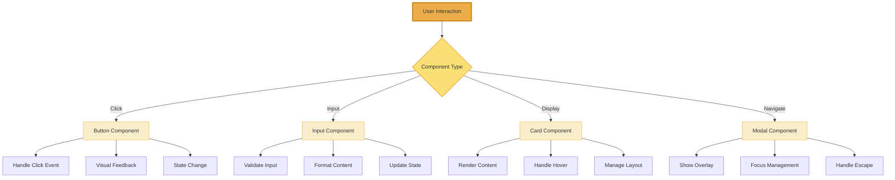
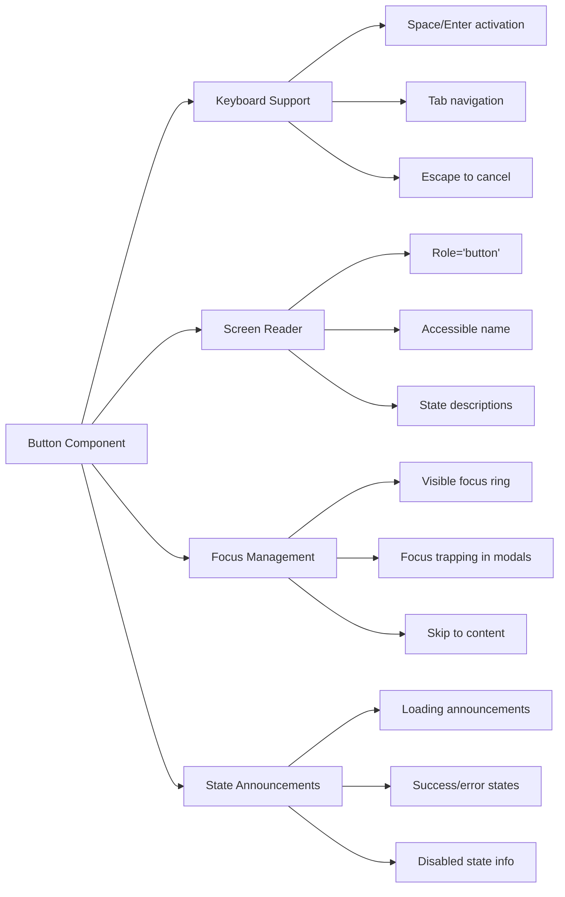

# 🧩 Component Library

Complete documentation for the Idling.app React component library, including design system, usage examples, and implementation details.

## 🎨 Component Gallery

### Visual Component Overview

<div class="component-card">

#### Core UI Components Visual Reference

**Button Component Variants:**

```
┌──────────────────────────────────────────────────────────────────┐
│ Primary     │ Secondary   │ Outline     │ Ghost       │ Danger    │
│ [Primary]   │ [Secondary] │ ┌─────────┐ │ [ Ghost ]   │ [Danger]  │
│ (Solid BG)  │ (Light BG)  │ │ Outline │ │ (No BG)     │ (Red BG)  │
│             │             │ └─────────┘ │             │           │
└──────────────────────────────────────────────────────────────────┘
```

**Input Component States:**

```
┌──────────────────────────────────────────────────────────────────┐
│ Default:     [  Type your message...                          ] │
│ Focused:     [  Type your message...                          ]│ │
│ With Icon:   [🔍 Search for content...                        ] │
│ Error:       [  Invalid input                                 ]⚠ │
│ Disabled:    [  Disabled field                               ]░ │
└──────────────────────────────────────────────────────────────────┘
```

**Card Component Layouts:**

```
┌─ Basic Card ──────────────┐  ┌─ Interactive Card ────────────┐
│                           │  │  ┌─────┐                     │
│  Card Title               │  │  │ IMG │  Card with Image    │
│  Card content goes here.  │  │  └─────┘  and hover effects  │
│                           │  │                              │
└───────────────────────────┘  └──────────────────────────────┘
```

</div>

### Component Interaction Flow



## 🎨 Design System

### Color Palette

```css
/* Primary Colors */
--primary-50: #f0f9ff;
--primary-100: #e0f2fe;
--primary-500: #0ea5e9;
--primary-600: #0284c7;
--primary-900: #0c4a6e;

/* Neutral Colors */
--neutral-50: #f8fafc;
--neutral-100: #f1f5f9;
--neutral-500: #64748b;
--neutral-900: #0f172a;

/* Semantic Colors */
--success: #10b981;
--warning: #f59e0b;
--error: #ef4444;
--info: #3b82f6;
```

### Typography

```css
/* Font Families */
--font-sans: 'Inter', system-ui, sans-serif;
--font-mono: 'Fira Code', monospace;

/* Font Sizes */
--text-xs: 0.75rem;
--text-sm: 0.875rem;
--text-base: 1rem;
--text-lg: 1.125rem;
--text-xl: 1.25rem;
--text-2xl: 1.5rem;
--text-3xl: 1.875rem;
--text-4xl: 2.25rem;
```

### Spacing

```css
/* Spacing Scale */
--space-1: 0.25rem;
--space-2: 0.5rem;
--space-3: 0.75rem;
--space-4: 1rem;
--space-6: 1.5rem;
--space-8: 2rem;
--space-12: 3rem;
--space-16: 4rem;
```

## 🔧 Core Components

### Button Component

<div class="component-card">

#### Visual Button Renderings

**Size Variations:**

```
┌─ Small ─┐  ┌── Medium ──┐  ┌─── Large ───┐  ┌──── XL ─────┐
│  [SM]   │  │   [MD]     │  │    [LG]     │  │     [XL]    │
└─────────┘  └────────────┘  └─────────────┘  └─────────────┘
```

**Variant Showcase:**

```
Primary:     [  Submit Form  ]  ← Main CTA, solid brand color
Secondary:   [  Save Draft   ]  ← Secondary action, muted
Outline:     ┌─ Cancel ──────┐  ← Subtle, border only
             └───────────────┘
Ghost:       [ + New Item ]     ← Minimal, no background
Destructive: [  Delete All  ]  ← Dangerous, red styling
```

**State Transitions:**

```
Default → Hover → Active → Focus
  [BTN] → [BTN] → [BTN] → [BTN]
          ↑glow   ↓push   ↑ring

Loading State:
  [●●● Loading...]  ← Spinner + disabled

Disabled State:
  [░░ Disabled ░░]  ← Grayed out + no interaction
```

</div>

#### Component Interaction Flow

```mermaid
stateDiagram-v2
    [*] --> Default
    Default --> Hover: Mouse enter
    Default --> Focus: Tab/Click
    Default --> Loading: Action triggered
    Default --> Disabled: Prop change

    Hover --> Default: Mouse leave
    Hover --> Active: Mouse down
    Hover --> Focus: Tab while hovering

    Active --> Hover: Mouse up
    Active --> Clicked: Mouse up + valid

    Focus --> Default: Blur
    Focus --> Active: Space/Enter
    Focus --> Hover: Mouse enter

    Clicked --> Loading: Async action
    Clicked --> Default: Sync action

    Loading --> Default: Action complete
    Loading --> Error: Action failed

    Disabled --> Default: Re-enabled

    Error --> Default: Reset
```

#### Props Interface

```typescript
interface ButtonProps {
  variant?: 'primary' | 'secondary' | 'outline' | 'ghost' | 'destructive';
  size?: 'sm' | 'md' | 'lg' | 'xl';
  disabled?: boolean;
  loading?: boolean;
  leftIcon?: React.ReactNode;
  rightIcon?: React.ReactNode;
  onClick?: (event: React.MouseEvent<HTMLButtonElement>) => void;
  children: React.ReactNode;
  className?: string;
  type?: 'button' | 'submit' | 'reset';
  loadingText?: string;
  ariaLabel?: string;
}
```

<div class="component-example">

#### Usage Examples

```tsx
import { Button } from '@/components/ui/Button';
import { PlusIcon, SaveIcon, TrashIcon } from '@/icons';

// Basic button
<Button variant="primary" size="md">
  Click me
</Button>

// Button with icons
<Button variant="secondary" leftIcon={<PlusIcon />}>
  Add Item
</Button>

<Button variant="primary" rightIcon={<SaveIcon />}>
  Save Changes
</Button>

// Loading button with custom text
<Button variant="primary" loading loadingText="Saving...">
  Save Document
</Button>

// Disabled button
<Button variant="outline" disabled>
  Disabled Action
</Button>

// Destructive action
<Button variant="destructive" leftIcon={<TrashIcon />}>
  Delete Forever
</Button>

// Form submission
<Button type="submit" variant="primary" size="lg">
  Submit Form
</Button>
```

</div>

#### Accessibility Features



#### Variants

- **Primary**: Main call-to-action buttons with solid brand color background
- **Secondary**: Secondary actions with muted background styling
- **Outline**: Subtle actions with transparent background and border
- **Ghost**: Minimal actions without background, text-only styling
- **Destructive**: Dangerous actions (delete, etc.) with warning colors

### Input Component

Comprehensive input component with validation and accessibility features.

#### Props Interface

```typescript
interface InputProps {
  type?: 'text' | 'email' | 'password' | 'number' | 'tel' | 'url';
  placeholder?: string;
  value?: string;
  defaultValue?: string;
  onChange?: (event: React.ChangeEvent<HTMLInputElement>) => void;
  onBlur?: (event: React.FocusEvent<HTMLInputElement>) => void;
  onFocus?: (event: React.FocusEvent<HTMLInputElement>) => void;
  disabled?: boolean;
  required?: boolean;
  error?: string;
  label?: string;
  helperText?: string;
  leftIcon?: React.ReactNode;
  rightIcon?: React.ReactNode;
  className?: string;
  size?: 'sm' | 'md' | 'lg';
}
```

#### Usage Examples

```tsx
import { Input } from '@/components/ui/Input';

// Basic input
<Input
  label="Email"
  type="email"
  placeholder="Enter your email"
  required
/>

// Input with error
<Input
  label="Password"
  type="password"
  error="Password must be at least 8 characters"
/>

// Input with icon
<Input
  label="Search"
  leftIcon={<SearchIcon />}
  placeholder="Search posts..."
/>
```

### Card Component

Flexible card component for content organization.

#### Props Interface

```typescript
interface CardProps {
  children: React.ReactNode;
  className?: string;
  padding?: 'none' | 'sm' | 'md' | 'lg';
  shadow?: 'none' | 'sm' | 'md' | 'lg';
  border?: boolean;
  hover?: boolean;
}
```

#### Usage Examples

```tsx
import { Card } from '@/components/ui/Card';

// Basic card
<Card>
  <h3>Card Title</h3>
  <p>Card content goes here.</p>
</Card>

// Card with hover effect
<Card hover shadow="md">
  <h3>Interactive Card</h3>
  <p>This card has hover effects.</p>
</Card>
```

## 📝 Rich Input System

Advanced text editing component with rich formatting capabilities.

### Features

- **Rich text editing** - Bold, italic, underline, links
- **Markdown support** - Live markdown preview
- **Emoji picker** - Integrated emoji selection
- **Mention system** - @username mentions
- **File uploads** - Drag and drop file support
- **Auto-save** - Automatic content saving
- **Accessibility** - Full keyboard navigation

### Props Interface

```typescript
interface RichInputProps {
  value?: string;
  onChange?: (value: string) => void;
  placeholder?: string;
  disabled?: boolean;
  maxLength?: number;
  allowedFormats?: ('bold' | 'italic' | 'link' | 'code')[];
  enableEmoji?: boolean;
  enableMentions?: boolean;
  enableFileUpload?: boolean;
  autoSave?: boolean;
  autoSaveInterval?: number;
  className?: string;
  onSave?: (content: string) => void;
  onFileUpload?: (files: File[]) => Promise<string[]>;
}
```

### Usage Examples

```tsx
import { RichInput } from '@/components/rich-input-system';

// Basic rich input
<RichInput
  placeholder="What's on your mind?"
  onChange={(value) => setContent(value)}
/>

// Rich input with all features
<RichInput
  value={content}
  onChange={setContent}
  enableEmoji
  enableMentions
  enableFileUpload
  autoSave
  onSave={handleSave}
  onFileUpload={handleFileUpload}
  maxLength={5000}
/>
```

### Toolbar Options

```typescript
const toolbarConfig = {
  bold: true,
  italic: true,
  underline: true,
  link: true,
  code: true,
  emoji: true,
  mention: true,
  upload: true
};
```

## 🔍 Filter Bar Component

Advanced filtering interface for search and data exploration.

### Features

- **Multiple filter types** - Text, select, date, range
- **Filter combinations** - AND/OR logic
- **Saved filters** - User-defined filter presets
- **Real-time filtering** - Live results as you type
- **Export filters** - Share filter configurations
- **Responsive design** - Mobile-friendly interface

### Props Interface

```typescript
interface FilterBarProps {
  filters: FilterConfig[];
  values: FilterValues;
  onChange: (values: FilterValues) => void;
  onApply?: (values: FilterValues) => void;
  onReset?: () => void;
  onSave?: (name: string, values: FilterValues) => void;
  savedFilters?: SavedFilter[];
  loading?: boolean;
  className?: string;
}

interface FilterConfig {
  key: string;
  label: string;
  type: 'text' | 'select' | 'date' | 'range' | 'multiselect';
  options?: FilterOption[];
  placeholder?: string;
  required?: boolean;
}
```

### Usage Examples

```tsx
import { FilterBar } from '@/components/filter-bar';

const filterConfig = [
  {
    key: 'search',
    label: 'Search',
    type: 'text',
    placeholder: 'Search posts...'
  },
  {
    key: 'category',
    label: 'Category',
    type: 'select',
    options: [
      { value: 'tech', label: 'Technology' },
      { value: 'design', label: 'Design' }
    ]
  },
  {
    key: 'date',
    label: 'Date Range',
    type: 'date'
  }
];

<FilterBar
  filters={filterConfig}
  values={filterValues}
  onChange={setFilterValues}
  onApply={handleApplyFilters}
  savedFilters={userSavedFilters}
/>;
```

## 🧭 Floating Toolbar Component

Context-sensitive toolbar that appears when needed.

### Features

- **Context-aware** - Shows relevant actions based on selection
- **Positioning** - Smart positioning to avoid viewport edges
- **Animations** - Smooth show/hide transitions
- **Customizable** - Configurable actions and appearance
- **Keyboard navigation** - Full keyboard support

### Props Interface

```typescript
interface FloatingToolbarProps {
  visible: boolean;
  position: { x: number; y: number };
  actions: ToolbarAction[];
  onAction: (actionId: string) => void;
  className?: string;
  theme?: 'light' | 'dark';
  size?: 'sm' | 'md' | 'lg';
}

interface ToolbarAction {
  id: string;
  label: string;
  icon?: React.ReactNode;
  disabled?: boolean;
  shortcut?: string;
  group?: string;
}
```

### Usage Examples

```tsx
import { FloatingToolbar } from '@/components/floating-toolbar';

const toolbarActions = [
  { id: 'bold', label: 'Bold', icon: <BoldIcon />, shortcut: 'Ctrl+B' },
  { id: 'italic', label: 'Italic', icon: <ItalicIcon />, shortcut: 'Ctrl+I' },
  { id: 'link', label: 'Link', icon: <LinkIcon />, shortcut: 'Ctrl+K' }
];

<FloatingToolbar
  visible={showToolbar}
  position={toolbarPosition}
  actions={toolbarActions}
  onAction={handleToolbarAction}
  theme="dark"
/>;
```

## 📋 Form Components

Comprehensive form building components with validation.

### Form Component

```typescript
interface FormProps {
  onSubmit: (data: FormData) => void;
  validation?: ValidationSchema;
  children: React.ReactNode;
  className?: string;
}
```

### FormField Component

```typescript
interface FormFieldProps {
  name: string;
  label?: string;
  required?: boolean;
  error?: string;
  helperText?: string;
  children: React.ReactNode;
}
```

### Usage Examples

```tsx
import { Form, FormField, Input, Button } from '@/components/ui';

<Form onSubmit={handleSubmit} validation={validationSchema}>
  <FormField name="email" label="Email" required>
    <Input type="email" />
  </FormField>

  <FormField name="password" label="Password" required>
    <Input type="password" />
  </FormField>

  <Button type="submit">Submit</Button>
</Form>;
```

## 🎯 Modal Components

Flexible modal system for overlays and dialogs.

### Modal Component

```typescript
interface ModalProps {
  isOpen: boolean;
  onClose: () => void;
  title?: string;
  size?: 'sm' | 'md' | 'lg' | 'xl' | 'full';
  closeOnOverlayClick?: boolean;
  closeOnEsc?: boolean;
  children: React.ReactNode;
}
```

### Usage Examples

```tsx
import { Modal, Button } from '@/components/ui';

<Modal
  isOpen={isModalOpen}
  onClose={() => setIsModalOpen(false)}
  title="Confirm Action"
  size="md"
>
  <p>Are you sure you want to delete this item?</p>
  <div className="flex gap-2 mt-4">
    <Button variant="destructive" onClick={handleDelete}>
      Delete
    </Button>
    <Button variant="outline" onClick={() => setIsModalOpen(false)}>
      Cancel
    </Button>
  </div>
</Modal>;
```

## 📊 Data Display Components

### Table Component

```typescript
interface TableProps<T> {
  data: T[];
  columns: TableColumn<T>[];
  loading?: boolean;
  pagination?: PaginationConfig;
  sorting?: SortingConfig;
  selection?: SelectionConfig;
  onRowClick?: (row: T) => void;
}
```

### Badge Component

```typescript
interface BadgeProps {
  variant?: 'default' | 'success' | 'warning' | 'error' | 'info';
  size?: 'sm' | 'md' | 'lg';
  children: React.ReactNode;
}
```

### Avatar Component

```typescript
interface AvatarProps {
  src?: string;
  alt?: string;
  size?: 'xs' | 'sm' | 'md' | 'lg' | 'xl';
  fallback?: string;
  online?: boolean;
}
```

## 🎨 Styling Guidelines

### CSS-in-JS with Tailwind

All components use Tailwind CSS for styling with CSS-in-JS for dynamic styles:

```tsx
import { cn } from '@/lib/utils';

const Button = ({ variant, size, className, ...props }) => {
  return (
    <button
      className={cn(
        'inline-flex items-center justify-center rounded-md font-medium transition-colors',
        {
          'bg-primary-500 text-white hover:bg-primary-600':
            variant === 'primary',
          'bg-secondary-500 text-white hover:bg-secondary-600':
            variant === 'secondary',
          'h-8 px-3 text-sm': size === 'sm',
          'h-10 px-4 text-base': size === 'md',
          'h-12 px-6 text-lg': size === 'lg'
        },
        className
      )}
      {...props}
    />
  );
};
```

### Component Variants

Use consistent variant patterns across components:

```typescript
type ComponentVariant =
  | 'primary'
  | 'secondary'
  | 'outline'
  | 'ghost'
  | 'destructive';
type ComponentSize = 'sm' | 'md' | 'lg' | 'xl';
```

## ♿ Accessibility

All components follow WCAG 2.1 AA guidelines:

### Keyboard Navigation

- **Tab navigation** - All interactive elements are keyboard accessible
- **Arrow keys** - Navigate within component groups
- **Enter/Space** - Activate buttons and controls
- **Escape** - Close modals and dropdowns

### Screen Reader Support

- **ARIA labels** - Descriptive labels for all elements
- **ARIA roles** - Proper semantic roles
- **ARIA states** - Dynamic state announcements
- **Focus management** - Proper focus handling

### Color Contrast

- **Text contrast** - Minimum 4.5:1 ratio for normal text
- **UI contrast** - Minimum 3:1 ratio for UI elements
- **Color independence** - Information not conveyed by color alone

## 🧪 Testing

### Unit Tests

```typescript
import { render, screen, fireEvent } from '@testing-library/react';
import { Button } from '@/components/ui/Button';

describe('Button', () => {
  test('renders with correct text', () => {
    render(<Button>Click me</Button>);
    expect(screen.getByText('Click me')).toBeInTheDocument();
  });

  test('calls onClick when clicked', () => {
    const handleClick = jest.fn();
    render(<Button onClick={handleClick}>Click me</Button>);
    fireEvent.click(screen.getByText('Click me'));
    expect(handleClick).toHaveBeenCalledTimes(1);
  });

  test('is disabled when disabled prop is true', () => {
    render(<Button disabled>Click me</Button>);
    expect(screen.getByText('Click me')).toBeDisabled();
  });
});
```

### Visual Testing

```typescript
import { ComponentStory, ComponentMeta } from '@storybook/react';
import { Button } from '@/components/ui/Button';

export default {
  title: 'UI/Button',
  component: Button,
  parameters: {
    docs: {
      description: {
        component: 'Flexible button component with multiple variants and states.'
      }
    }
  }
} as ComponentMeta<typeof Button>;

const Template: ComponentStory<typeof Button> = (args) => <Button {...args} />;

export const Primary = Template.bind({});
Primary.args = {
  variant: 'primary',
  children: 'Primary Button'
};

export const Secondary = Template.bind({});
Secondary.args = {
  variant: 'secondary',
  children: 'Secondary Button'
};
```

## 📦 Installation & Setup

### Install Dependencies

```bash
npm install @idling/ui-components
# or
yarn add @idling/ui-components
```

### Import Components

```tsx
import { Button, Input, Card } from '@idling/ui-components';
import '@idling/ui-components/styles.css';
```

### Provider Setup

```tsx
import { ThemeProvider } from '@idling/ui-components';

function App() {
  return (
    <ThemeProvider theme="light">
      <YourApp />
    </ThemeProvider>
  );
}
```

## 🔗 Related Documentation

- **[Design System](../design-system/)** - Complete design system documentation
- **[Storybook](https://storybook.idling.app)** - Interactive component explorer
- **[Testing Guide](../testing/)** - Component testing strategies
- **[API Documentation](../../docs/api/)** - API integration examples

---

**Last Updated**: January 28, 2025

> **Component Library**: All components are built with TypeScript, tested with Jest, and documented with Storybook. They follow accessibility standards and design system guidelines.
