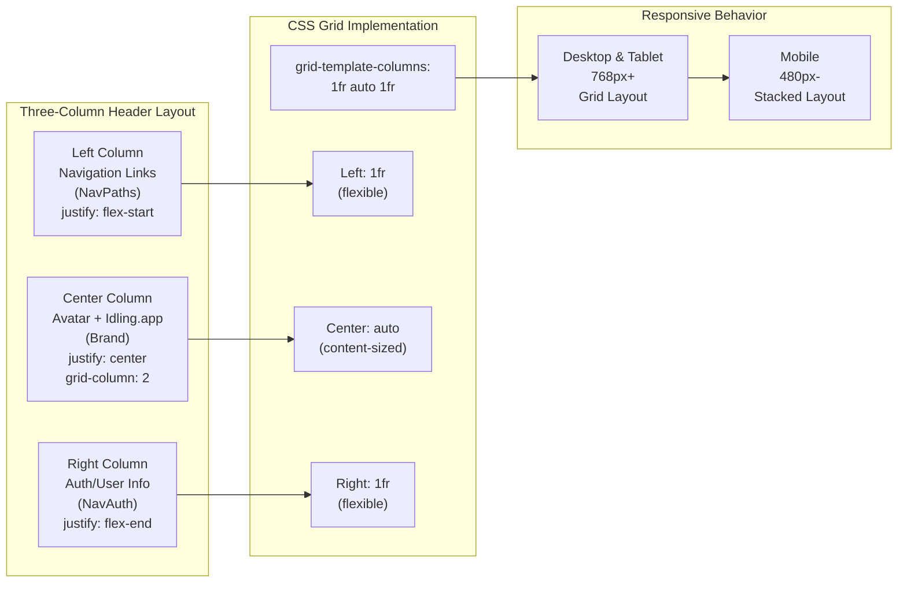
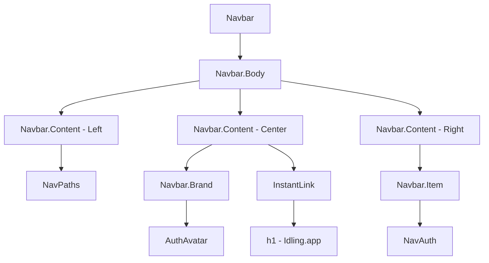

# Navbar Component System

## Overview

The Navbar component system provides a sophisticated three-column layout that ensures perfect centering of the brand (avatar + "Idling.app" text) while providing flexible space for navigation links and authentication controls. This system was specifically designed to solve the challenge of maintaining true center alignment regardless of content length in the side columns.

## 🎯 Key Features

- **Perfect Center Alignment** - Brand section always centered using CSS Grid
- **Three-Column Flex System** - Left navigation, center brand, right authentication
- **Responsive Design** - Adapts gracefully from desktop to mobile
- **Modular Architecture** - Composable components for flexibility
- **Accessibility First** - Full keyboard navigation and screen reader support
- **Performance Optimized** - Minimal DOM manipulation and efficient styling

## 🏗️ Architecture Overview

The navbar uses a hybrid approach combining CSS Grid for the main layout with Flexbox for individual column content alignment:



## 🧩 Component Structure

The navbar system consists of several modular components working together:

### Core Components

```typescript
// Main Navbar wrapper
<Navbar>
  <Navbar.Body>
    <Navbar.Content justify="flex-start">
      // Left column content
    </Navbar.Content>

    <Navbar.Content justify="center">
      <Navbar.Brand />
      // Center brand content
    </Navbar.Content>

    <Navbar.Content justify="flex-end">
      // Right column content
    </Navbar.Content>
  </Navbar.Body>
</Navbar>
```

### Component Hierarchy



## 📱 Responsive Design Strategy

The navbar adapts across three main breakpoints:

### Desktop & Large Tablets (768px+)

- **Layout**: CSS Grid three-column system
- **Spacing**: `grid-template-columns: 1fr auto 1fr`
- **Alignment**: Perfect center alignment maintained
- **Gap**: `1rem` between columns

### Small Tablets & Large Mobile (480px - 768px)

- **Layout**: Maintains grid system with reduced spacing
- **Spacing**: Compressed gaps (`0.5rem`)
- **Content**: Some text may be abbreviated
- **Navigation**: All elements remain visible

### Mobile Phones (< 480px)

- **Layout**: Switches to vertical stack (`flex-direction: column`)
- **Order**: Brand first, navigation second, auth third
- **Alignment**: All sections centered
- **Spacing**: Minimal gaps for space efficiency

## 🎨 CSS Implementation

### Grid Layout Foundation

```css
.nav__content {
  display: grid;
  grid-template-columns: 1fr auto 1fr;
  width: 100%;
  align-items: center;
  margin: 1rem 0;
  gap: 1rem;
}
```

### Column-Specific Styling

```css
/* Left column - Navigation links */
.nav__links--as-flex-end {
  display: flex;
  justify-content: flex-start;
  align-items: center;
  gap: 0.5rem;
}

/* Center column - Brand */
.nav__brand {
  display: flex;
  flex-direction: column;
  justify-content: center;
  align-items: center;
  grid-column: 2; /* Ensures center positioning */
}

/* Right column - Authentication */
.nav--as-flex-end {
  display: flex;
  justify-content: flex-end;
  align-items: center;
  gap: 0.5rem;
}
```

### Responsive Breakpoints

```css
/* Tablet adjustments */
@media (max-width: 768px) {
  .nav__content {
    grid-template-columns: 1fr auto 1fr;
    gap: 0.5rem;
  }
}

/* Mobile stack layout */
@media (max-width: 480px) {
  .nav__content {
    display: flex;
    flex-direction: column;
    gap: 0.5rem;
  }

  .nav__brand {
    order: 1;
  }
  .nav__links--as-flex-end {
    order: 2;
  }
  .nav--as-flex-end {
    order: 3;
  }
}
```

## 🔧 NavbarContent Component

The `NavbarContent` component provides flexible justify-content options:

### Available Justify Options

```typescript
type JustifyOptions =
  | 'center'
  | 'end'
  | 'flex-end'
  | 'flex-start'
  | 'left'
  | 'normal'
  | 'right'
  | 'space-around'
  | 'space-between'
  | 'space-evenly'
  | 'start'
  | 'stretch'
  | 'inherit'
  | 'initial'
  | 'revert'
  | 'revert-layer';
```

### CSS Class Generation

```css
.navbar__content--jc-center {
  justify-content: center;
}
.navbar__content--jc-flex-start {
  justify-content: flex-start;
}
.navbar__content--jc-flex-end {
  justify-content: flex-end;
}
.navbar__content--jc-space-between {
  justify-content: space-between;
}
/* ... and all other justify-content values */
```

## 🎭 Brand Section Details

The center brand section combines two key elements:

### Navbar.Brand (Avatar)

- **Authenticated Users**: Shows user's profile avatar
- **Unauthenticated Users**: Shows default avatar with user icon
- **Loading State**: Animated placeholder during session loading
- **Hover Effects**: Subtle scale and shadow animations

### Idling.app Title

- **Typography**: Large, prominent heading
- **Link**: Navigates to home page
- **Hover**: Color transition and underline effects
- **Accessibility**: Proper heading structure and link labeling

## 🧪 Testing Coverage

The navbar system includes comprehensive test coverage:

### Unit Tests

- ✅ **Navbar.tsx** - Component rendering and props
- ✅ **NavbarContent.tsx** - Justify-content class generation
- ✅ **NavbarBrand.tsx** - Avatar states and authentication
- ✅ **NavbarBody.tsx** - Container functionality
- ✅ **NavbarItem.tsx** - Item rendering and accessibility

### Integration Tests

- ✅ **Nav.tsx** - Complete navigation assembly
- ✅ **Header.tsx** - Full header component integration

### Test Results

```bash
✓ 16 navbar component tests passing
✓ 3 nav component tests passing
✓ 4 header component tests passing
✓ 23 total tests covering navbar system
```

## 🚀 Performance Considerations

### CSS Grid vs Flexbox Choice

- **Grid**: Used for main three-column layout (better for 2D layouts)
- **Flexbox**: Used within columns for content alignment (better for 1D layouts)
- **Hybrid Approach**: Leverages strengths of both layout systems

### Responsive Strategy

- **Mobile-First**: Base styles optimized for mobile
- **Progressive Enhancement**: Desktop features added via media queries
- **Minimal Reflows**: Layout changes minimize DOM manipulation

### Animation Performance

- **Transform-Based**: Uses `transform` for hover effects (GPU accelerated)
- **Transition Properties**: Specific properties animated, not `all`
- **Reduced Motion**: Respects user's motion preferences

## 🔗 Related Components

### Direct Dependencies

- **[AuthAvatar](/components/auth-avatar/)** - User profile avatar display
- **NavPaths** - Navigation link management
- **NavAuth** - Authentication controls and user info

### Integration Points

- **[Header](/components/header/)** - Parent container component
- **InstantLink** - Optimized navigation links
- **Font Picker** - Typography customization

## 📋 Implementation Checklist

When implementing the navbar system:

- [ ] **CSS Grid Support** - Ensure `grid-template-columns: 1fr auto 1fr`
- [ ] **Responsive Breakpoints** - Test all three breakpoint behaviors
- [ ] **Brand Centering** - Verify center column uses `grid-column: 2`
- [ ] **Justify Classes** - Include all `navbar__content--jc-*` classes
- [ ] **Accessibility** - Test keyboard navigation and screen readers
- [ ] **Performance** - Verify smooth animations and transitions

## 🐛 Common Issues & Solutions

### Brand Not Perfectly Centered

**Problem**: Brand appears off-center when side content is unequal
**Solution**: Ensure `grid-column: 2` is applied to center column

### Mobile Layout Breaking

**Problem**: Grid layout doesn't work well on small screens
**Solution**: Switch to `flex-direction: column` below 480px

### Justify Classes Missing

**Problem**: NavbarContent justify prop not working
**Solution**: Ensure all `navbar__content--jc-*` classes are defined

## 📚 Further Reading

- **[CSS Grid Layout Guide](https://developer.mozilla.org/en-US/docs/Web/CSS/CSS_Grid_Layout)**
- **[Flexbox Guide](https://developer.mozilla.org/en-US/docs/Web/CSS/CSS_Flexible_Box_Layout)**
- **[Responsive Design Principles](https://web.dev/responsive-web-design-basics/)**

---

_This documentation covers the complete navbar system implementation. For specific component APIs, see individual component documentation pages._

**Last Updated**: January 28, 2025
