# Rich Input System - Business Requirements Document

## 🎨 Component Visual Overview

### Live Component Examples

<div class="component-card">

#### Basic Rich Input

```jsx
<RichInput
  placeholder="What's on your mind? Try typing #hashtag or @mention..."
  value={content}
  onChange={setContent}
  enableHashtags={true}
  enableMentions={true}
/>
```

**Visual Rendering:**

```
┌─────────────────────────────────────────────────────────────────┐
│ What's on your mind? Try typing #hashtag or @mention...         │
│                                                                 │
│ Check out this #javascript tutorial by @johndev! 🚀            │
│ https://example.com/tutorial                                    │
│                                                                 │
│ [#javascript] [📤@johndev] [🔗 https://example.com/tutorial]   │
└─────────────────────────────────────────────────────────────────┘
```

#### Enhanced Rich Input with Floating Toolbar

```jsx
<RichInput
  placeholder="Create your post..."
  multiline={true}
  enableHashtags={true}
  enableMentions={true}
  enableEmojis={true}
  showFloatingToolbar={true}
/>
```

**Visual Rendering:**

```
┌─────────────────────────────────────────────────────────────────┐
│ Create your post...                                    [#@😊]   │
│                                                                 │
│ Working on a new #react component for our dashboard! 💻        │
│ Big thanks to @sarah for the design mockups 🎨                │
│                                                                 │
│ [#react] [📤@sarah] [💻] [🎨]                                   │
└─────────────────────────────────────────────────────────────────┘
```

</div>

### Component States Visualization


### Interactive Elements Breakdown


</div>

## Executive Summary

The Rich Input System is a sophisticated text editing component that transforms basic text input into an intelligent, interactive writing experience. It automatically detects and enhances user content with visual pills for hashtags, user mentions, emojis, and URLs while providing real-time suggestions and auto-completion features.

**Key Business Value:**

- **Enhanced User Experience**: Users can create rich, interactive content without learning complex syntax
- **Improved Content Discoverability**: Automatic hashtag and mention detection enables better content categorization and user connections
- **Increased Engagement**: Visual feedback and suggestions encourage users to create more structured, searchable content
- **Reduced Friction**: Auto-conversion of URLs and intelligent suggestions minimize manual formatting work

## System Overview


## Business Context

### Current Usage in Application

The Rich Input System is currently deployed across multiple critical user interfaces:

1. **Post Creation Forms** - Main content creation interface
2. **Reply Forms** - Comment and response creation
3. **Filter Inputs** - Smart search and filtering interfaces
4. **Edit Forms** - Content modification interfaces

### User Personas

#### Primary Users

- **Content Creators**: Users writing posts, replies, and comments
- **Community Members**: Users engaging with hashtags and mentions
- **Casual Users**: Users who benefit from simplified text formatting

#### Secondary Users

- **Moderators**: Users who need to quickly filter and search content
- **Administrators**: Users managing content and user interactions

## Functional Requirements

### 1. Core Text Input Capabilities

#### 1.1 Basic Text Entry

- **Requirement**: Users must be able to enter plain text in both single-line and multi-line modes
- **Acceptance Criteria**:
  - Support for standard keyboard input
  - Copy/paste functionality
  - Undo/redo operations
  - Character count tracking with limits (255 chars for titles, 1000 for content)

#### 1.2 View Modes

- **Requirement**: Users must be able to switch between "Preview" and "Raw" modes
- **Preview Mode**: Shows enhanced content with visual pills and formatting
- **Raw Mode**: Shows plain text for direct editing of syntax
- **Acceptance Criteria**:
  - Seamless switching between modes without data loss
  - Raw mode shows actual syntax (e.g., `@[username|userId|author]`)
  - Preview mode shows user-friendly display (e.g., `@username`)

### 2. Intelligent Content Enhancement

#### 2.1 Hashtag Detection and Enhancement


**Business Rules**:

- Hashtags must start with `#` followed by alphanumeric characters, hyphens, or underscores
- Hashtags are case-insensitive for matching but preserve original case for display
- Maximum hashtag length: 50 characters
- Real-time suggestions appear after typing 2+ characters
- Existing hashtags are prioritized in suggestions

**Acceptance Criteria**:

- Automatic detection of `#word` patterns during typing
- Visual pill rendering with distinctive styling
- Click-to-filter functionality in appropriate contexts
- Search suggestions with usage counts
- Prevention of duplicate hashtag pills in single input

#### 2.2 User Mention Detection and Enhancement

**Business Rules**:

- Mentions use format `@[username|userId|filterType]` internally
- Display format shows only `@username` to users
- Support for both "author" and "mentions" filter types
- Real-time user search with profile pictures
- Validation against active user database

**Acceptance Criteria**:

- Automatic detection of `@username` patterns
- User search overlay with profile pictures and display names
- Distinction between author mentions and general mentions
- Prevention of mentioning non-existent users
- Visual indication of mention type (author vs. general)

#### 2.3 URL Auto-conversion


**Supported URL Behaviors**:

- **Link**: Standard clickable link (default)
- **Embed**: Rich preview/embedding for supported platforms
- **Preview**: Thumbnail and metadata display
- **Download**: Direct download link formatting

**Business Rules**:

- Auto-conversion triggers on space/enter after valid URL
- Supported domains: YouTube, Twitter, GitHub, common image hosts
- Users can modify behavior via inline controls
- URL validation prevents malicious/invalid links
- Fallback to basic link for unsupported domains

#### 2.4 Emoji Support

**Business Rules**:

- Support for Unicode emojis and custom emoji sets
- Trigger character `:` followed by emoji name
- Real-time emoji search and suggestions
- Category-based emoji organization
- Accessibility support with alt text

**Acceptance Criteria**:

- Emoji picker overlay with search functionality
- Category tabs (smileys, objects, nature, etc.)
- Keyboard navigation support
- Recent/frequently used emoji tracking
- Proper rendering across different devices/browsers

#### 2.5 Image Paste Support

**Business Rules**:

- Direct paste from clipboard for image files
- Supported formats: PNG, JPG, GIF, WebP
- Maximum file size: 10MB per image
- Automatic upload to temporary storage
- Conversion to permanent storage on form submission

**Acceptance Criteria**:

- Drag and drop image support
- Paste from clipboard functionality
- Progress indication during upload
- Error handling for unsupported formats/sizes
- Preview generation for pasted images

### 3. Interactive Features

#### 3.1 Floating Toolbar

<div class="component-card">

#### Floating Toolbar Component Rendering

**Visual Appearance:**

```
┌─────────────────────────────────────────────────────────────────┐
│ Type your message here...                            [# @ 😊 🖼]│
│                                                                 │
│ Amazing #sunset photos from today! 📸                          │
│                                                                 │
└─────────────────────────────────────────────────────────────────┘
```

**Interaction Flow:**

```
User clicks [#] → Shows hashtag search panel
User clicks [@] → Shows user search panel
User clicks [😊] → Shows emoji picker
User clicks [🖼] → Shows image upload options
```

</div>


#### Toolbar Button States


**Business Rules**:

- Toolbar appears on input focus
- Position: Top-right corner of input area
- Remains visible during user interaction
- Disappears on blur with 150ms delay
- Responsive positioning on mobile devices

**Acceptance Criteria**:

- Smooth show/hide animations
- Proper z-index layering
- Touch-friendly button sizes on mobile
- Keyboard accessibility
- Integration with search overlays

#### 3.2 Search Overlay System

<div class="component-card">

#### Search Overlay Component Renderings

**Hashtag Search Overlay:**

```
┌─────────────────────────────────────────────────────────────────┐
│ Working on a #rea|                                              │
│                 ┌─────────────────────────┐                    │
│                 │ 🔍 Hashtag Search        │                    │
│                 │ ________________________ │                    │
│                 │ #react (2,847 posts) ✨ │                    │
│                 │ #reactjs (1,205 posts)  │                    │
│                 │ #real (892 posts)       │                    │
│                 │ #readme (156 posts)     │                    │
│                 │ ________________________ │                    │
│                 │ ↑↓ Navigate • Enter Select │                   │
│                 └─────────────────────────┘                    │
└─────────────────────────────────────────────────────────────────┘
```

**User Mention Search Overlay:**

```
┌─────────────────────────────────────────────────────────────────┐
│ Thanks to @sar|                                                 │
│             ┌─────────────────────────────┐                    │
│             │ 👤 User Search              │                    │
│             │ ____________________________ │                    │
│             │ 👨‍💻 sarah_dev              │                    │
│             │    Software Engineer         │                    │
│             │ 👩‍🎨 sarah_designer         │                    │
│             │    UI/UX Designer           │                    │
│             │ 👨‍💼 samuel_pm             │                    │
│             │    Product Manager          │                    │
│             │ ____________________________ │                    │
│             │ ↑↓ Navigate • Enter Select   │                    │
│             └─────────────────────────────┘                    │
└─────────────────────────────────────────────────────────────────┘
```

**Emoji Picker Overlay:**

```
┌─────────────────────────────────────────────────────────────────┐
│ Great work :thu|                                                │
│              ┌─────────────────────────────┐                   │
│              │ 😊 Emoji Picker             │                   │
│              │ [😀][😃][😄][😁][😆][😅]  │                   │
│              │ [😂][🤣][😊][😇][🙂][🙃]  │                   │
│              │ [👍][👎][👌][✌️][🤞][🤟]   │                   │
│              │ [🔥][💯][✨][🎉][🚀][💻]   │                   │
│              │ ___________________________  │                   │
│              │ :thumbs_up: 👍              │                   │
│              │ :fire: 🔥                   │                   │
│              │ :rocket: 🚀                 │                   │
│              └─────────────────────────────┘                   │
└─────────────────────────────────────────────────────────────────┘
```

</div>

#### Search Overlay Interaction Flow


#### Search Result Types

```mermaid
graph TD
    A[Search Trigger] --> B{Trigger Type}

    B -->|#| C[Hashtag Search]
    B -->|@| D[User Search]
    B -->|:| E[Emoji Search]

    C --> C1[Popular Tags]
    C --> C2[Recent Tags]
    C --> C3[Suggested Tags]
    C --> C4[Create New Tag]

    D --> D1[Team Members]
    D --> D2[Frequent Mentions]
    D --> D3[Active Users]
    D --> D4[Search All Users]

    E --> E1[Recent Emojis]
    E --> E2[Category Browse]
    E --> E3[Search by Name]
    E --> E4[Custom Emojis]

    style A fill:#edae49,stroke:#c68214,stroke-width:2px
    style B fill:#f9df74,stroke:#edae49,stroke-width:2px
    style C fill:#f9edcc,stroke:#edae49,stroke-width:1px
    style D fill:#f9edcc,stroke:#edae49,stroke-width:1px
    style E fill:#f9edcc,stroke:#edae49,stroke-width:1px
```

**Business Rules**:

- Triggered by typing `#`, `@`, or `:` characters
- Minimum 2 characters required for search
- Maximum 10 suggestions displayed initially
- Pagination for additional results
- Real-time search with 300ms debounce

**Acceptance Criteria**:

- Contextual positioning relative to cursor
- Keyboard navigation (arrow keys, enter, escape)
- Mouse/touch interaction support
- Loading states and error handling
- Proper overlay dismissal on outside clicks

### 4. Form Integration

#### 4.1 Submission Forms

**Primary Use Cases**:

- **Post Creation**: Title and content fields with full rich input features
- **Reply Creation**: Content field with automatic mention of parent author
- **Post Editing**: Pre-populated fields with existing rich content
- **Comment Forms**: Streamlined interface for quick responses

**Business Rules**:

- Character limits enforced in real-time
- Content validation before submission
- Temporary image processing during submission
- Automatic tag extraction from title and content
- Form state preservation during navigation

#### 4.2 Filter and Search Forms

**Primary Use Cases**:

- **Smart Filter Input**: Convert user input to structured filters
- **Search Interface**: Enhanced search with hashtag and mention support
- **Custom Filter Creation**: Guided filter building with suggestions

**Business Rules**:

- Real-time filter construction from input
- Visual representation of active filters
- Filter combination and removal capabilities
- Search history and suggestions
- Export/import filter configurations

## User Experience Requirements

### 1. Performance Standards


**Critical Performance Metrics**:

- **Typing Latency**: Maximum 50ms delay between keypress and visual feedback
- **Search Response**: Maximum 300ms for suggestion results
- **Memory Usage**: Maximum 50MB per rich input instance
- **Rendering Performance**: 60fps during animations and interactions

### 2. Accessibility Requirements

**WCAG 2.1 AA Compliance**:

- **Keyboard Navigation**: Full functionality without mouse
- **Screen Reader Support**: Proper ARIA labels and descriptions
- **High Contrast**: Readable in high contrast modes
- **Focus Management**: Clear focus indicators and logical tab order
- **Alternative Input**: Support for voice input and switch navigation

**Specific Accessibility Features**:

- Alt text for all visual elements
- Keyboard shortcuts for common actions
- Voice announcements for state changes
- Reduced motion options for animations
- Customizable font sizes and contrast

### 3. Mobile Experience

**Responsive Design Requirements**:

- **Touch Targets**: Minimum 44px for all interactive elements
- **Gesture Support**: Swipe, pinch, and long-press interactions
- **Virtual Keyboard**: Proper keyboard type suggestions
- **Orientation**: Support for portrait and landscape modes
- **Performance**: Optimized for mobile processors and memory

**Mobile-Specific Features**:

- Haptic feedback for interactions
- Context menus for pill management
- Simplified toolbar for smaller screens
- Voice input integration
- Camera integration for image capture

## Technical Architecture

### 1. Component Structure

<div class="component-card">

#### Component Hierarchy Visualization

**React Component Tree:**

```
RichInputProvider
├── RichInputAdapter
│   ├── RichInputEngine
│   │   ├── ContentParser
│   │   ├── CursorManager
│   │   └── StateManager
│   ├── FloatingToolbar
│   │   ├── HashtagButton
│   │   ├── MentionButton
│   │   ├── EmojiButton
│   │   └── ImageButton
│   ├── SearchOverlay
│   │   ├── HashtagSearch
│   │   ├── UserSearch
│   │   └── EmojiPicker
│   └── PillRenderer
│       ├── HashtagPill
│       ├── MentionPill
│       ├── URLPill
│       └── EmojiPill
```

</div>


#### Component Props Interface Details


### 2. Data Flow Architecture

<div class="component-card">

#### Complete Data Flow Process

**Input Processing Pipeline:**

```
User Input → Validation → Parsing → Enhancement → Rendering → Display
     ↓            ↓          ↓           ↓            ↓          ↓
  Keypress    Format      Token      Visual       DOM      User Sees
  Detection   Check     Creation     Pills      Update    Rich Content
```

**State Management Flow:**

```
Component State ←→ Global Context ←→ Local Storage
       ↓                  ↓              ↓
   Input Value     User Preferences  Recent Searches
   Cursor Pos      Search History    Draft Content
   View Mode       Custom Settings   Filter State
```

</div>



```mermaid
flowchart TD
    A[🎯 User Input Event] --> B{Input Classification}

    B -->|💬 Text Content| C[Rich Input Engine]
    B -->|🔍 Trigger Char #@:| D[Search Overlay System]
    B -->|🛠️ Toolbar Action| E[Floating Toolbar]
    B -->|📷 Image/File| F[Media Handler]

    C --> G[Content Parser Engine]
    D --> H[Search Service Layer]
    E --> I[Insertion Service]
    F --> J[Upload Service]

    G --> G1[Hashtag Parser]
    G --> G2[Mention Parser]
    G --> G3[URL Parser]
    G --> G4[Emoji Parser]

    H --> H1[Hashtag Search API]
    H --> H2[User Search API]
    H --> H3[Emoji Database]

    I --> I1[Content Insertion]
    I --> I2[Cursor Management]
    I --> I3[State Update]

    J --> J1[File Validation]
    J --> J2[Upload Progress]
    J --> J3[Media Integration]

    G1 --> K[Token Generation]
    G2 --> K
    G3 --> K
    G4 --> K

    H1 --> L[Suggestion Display]
    H2 --> L
    H3 --> L

    I1 --> M[Content Update]
    I2 --> M
    I3 --> M

    J1 --> N[Media Embedding]
    J2 --> N
    J3 --> N

    K --> O[Visual Pill Rendering]
    L --> P[Overlay Rendering]
    M --> Q[State Synchronization]
    N --> R[Rich Media Display]

    O --> S[🎨 Enhanced UI Display]
    P --> S
    Q --> S
    R --> S

    S --> T[📱 User Experience]

    style A fill:#edae49,stroke:#c68214,stroke-width:3px
    style B fill:#f9df74,stroke:#edae49,stroke-width:2px
    style S fill:#f9df74,stroke:#edae49,stroke-width:2px
    style T fill:#edae49,stroke:#c68214,stroke-width:3px
```

#### Event Handling Architecture


#### State Management Architecture


### 3. State Management

**Component State**:

- Input value and cursor position
- Parser configurations and enabled features
- Search overlay state and results
- Toolbar interaction state
- Focus and interaction management

**Global State Integration**:

- User preferences (emoji panel behavior, pagination mode)
- Filter state for search interfaces
- Form validation and submission state
- User authentication and permissions

## Business Rules and Constraints

### 1. Content Validation Rules

**Character Limits**:

- Title fields: 255 characters maximum
- Content fields: 1,000 characters maximum
- Hashtags: 50 characters maximum
- Individual mentions: No specific limit (validated against user database)

**Content Restrictions**:

- No malicious URLs or scripts
- Profanity filtering for public content
- Spam prevention for excessive hashtags/mentions
- Image content moderation for inappropriate material

### 2. Performance Constraints

**Resource Limits**:

- Maximum 10 concurrent search requests per user
- Search result caching for 5 minutes
- Image upload queue limit of 5 files
- Memory cleanup after 30 minutes of inactivity

**Rate Limiting**:

- Search API: 100 requests per minute per user
- Image upload: 20 files per hour per user
- Content submission: 50 posts per hour per user

### 3. Security Requirements

**Input Sanitization**:

- XSS prevention for all user input
- SQL injection protection for search queries
- File type validation for image uploads
- URL validation to prevent malicious links

**Data Protection**:

- User mention data anonymization options
- Content encryption for sensitive information
- Audit logging for administrative actions
- GDPR compliance for user data handling

## Success Metrics

### 1. User Engagement Metrics


**Key Performance Indicators**:

- **Rich Content Adoption**: 75% of posts contain hashtags, mentions, or enhanced URLs
- **Feature Usage**: Average 3.2 enhanced elements per post
- **User Retention**: 15% increase in daily active users
- **Content Discoverability**: 40% increase in hashtag-based navigation

### 2. Technical Performance Metrics

**Response Time Targets**:

- 95th percentile typing response: <50ms
- 95th percentile search response: <300ms
- 99th percentile image upload: <5s
- Average memory usage: <30MB per instance

**Reliability Targets**:

- 99.9% uptime for rich input functionality
- <0.1% error rate for content processing
- 99.5% success rate for image uploads
- <1% data loss during form submissions

### 3. Business Impact Metrics

**Content Quality Improvements**:

- 60% increase in searchable content
- 35% increase in user-to-user connections via mentions
- 50% reduction in malformed URLs
- 25% increase in content engagement rates

**User Satisfaction**:

- 4.5/5 average rating for text editing experience
- 80% user preference for rich input over basic text
- 90% feature discoverability rate
- <5% user-reported issues per month

## Implementation Phases

### Phase 1: Core Functionality (Completed)

- ✅ Basic rich input engine
- ✅ Hashtag and mention detection
- ✅ URL auto-conversion
- ✅ Form integration
- ✅ Basic search overlays

### Phase 2: Enhanced Features (Current)

- 🔄 Floating toolbar implementation
- 🔄 Advanced emoji support
- 🔄 Image paste functionality
- 🔄 Mobile optimization
- 🔄 Accessibility improvements

### Phase 3: Advanced Capabilities (Planned)

- 📋 Advanced content templates
- 📋 Collaborative editing features
- 📋 Advanced formatting options
- 📋 Plugin architecture
- 📋 Analytics integration

### Phase 4: Enterprise Features (Future)

- 📋 Advanced security controls
- 📋 Custom domain configurations
- 📋 API for third-party integrations
- 📋 Advanced content moderation
- 📋 Multi-language support

## Risk Assessment and Mitigation

### 1. Technical Risks

**Performance Degradation**:

- **Risk**: Large content or many concurrent users causing slowdowns
- **Mitigation**: Implement content chunking, lazy loading, and performance monitoring
- **Contingency**: Fallback to basic text input if performance thresholds exceeded

**Browser Compatibility**:

- **Risk**: Features not working on older browsers or mobile devices
- **Mitigation**: Progressive enhancement and feature detection
- **Contingency**: Graceful degradation to basic functionality

### 2. User Experience Risks

**Learning Curve**:

- **Risk**: Users finding the rich features confusing or overwhelming
- **Mitigation**: Contextual help, onboarding tutorials, and progressive disclosure
- **Contingency**: Option to disable advanced features per user preference

**Content Migration**:

- **Risk**: Existing content not displaying properly with new rich input
- **Mitigation**: Backward compatibility and content migration scripts
- **Contingency**: Dual rendering system during transition period

### 3. Business Risks

**Feature Adoption**:

- **Risk**: Users not adopting rich input features, reducing business value
- **Mitigation**: User education, incentives for rich content creation
- **Contingency**: A/B testing to optimize feature presentation

**Maintenance Overhead**:

- **Risk**: Complex system requiring significant ongoing maintenance
- **Mitigation**: Comprehensive testing, documentation, and monitoring
- **Contingency**: Simplified feature set if maintenance becomes unsustainable

## Conclusion

The Rich Input System represents a significant enhancement to user content creation capabilities, providing intelligent text processing, visual enhancements, and seamless integration across the application. By transforming basic text input into an interactive, feature-rich experience, the system delivers measurable improvements in user engagement, content quality, and overall platform value.

The modular architecture ensures scalability and maintainability while the comprehensive feature set addresses diverse user needs from casual content creation to advanced filtering and search capabilities. With proper implementation of the outlined requirements, the Rich Input System will serve as a foundational component for enhanced user interaction and content management.

---

**Document Version**: 1.0  
**Last Updated**: January 28, 2025  
**Next Review**: April 28, 2025  
**Stakeholders**: Product Team, Engineering Team, UX Team, QA Team
