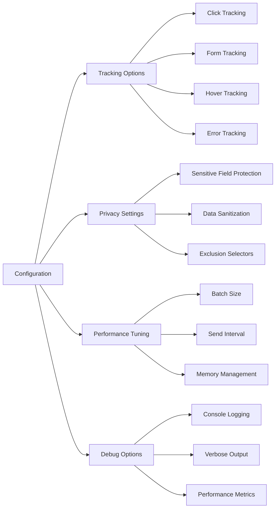

# Automated Analytics Tracking - What It Does & How It Helps

## What this page is about

This page explains our automated analytics tracking system that watches how people interact with your app - without you having to set anything up manually. Think of it as having a helpful assistant who quietly observes and takes notes about what users do, so you can make your app better.

## What Does This Actually Do?

Imagine you own a store and want to know which products people look at, which aisles they walk down, and where they might get confused. Our analytics system does exactly that for your web app!

**In simple terms**: It automatically watches for clicks, form interactions, mouse movements, and errors - then organizes this information into useful reports you can view in your dashboard.

**The magic part**: Once installed, it works completely automatically. No need to add tracking code to every button or form - it figures everything out by itself! ✨

## Why Do We Need This?

### For App Owners & Product Teams

- **Understand user behavior**: See which features people actually use vs. ignore
- **Find problem areas**: Discover where users get stuck or frustrated
- **Make data-driven decisions**: Use real usage data instead of guessing
- **Improve conversion**: See what helps users complete important actions

### For Developers

- **Zero maintenance**: No manual tracking code to write or maintain
- **Privacy-focused**: Automatically excludes sensitive data like passwords
- **Performance optimized**: Uses efficient event batching and memory management
- **Error tracking**: Automatically captures JavaScript errors and failed promises

### For Business Teams

- **ROI measurement**: See which features drive the most engagement
- **User journey mapping**: Understand the path users take through your app
- **Geographic insights**: Know where your users are coming from
- **Device preferences**: Understand what devices people use most

## Visual Flow


## How It Works (The Simple Version)

### Step 1: Automatic Startup

When someone visits your app, a small script automatically starts running in the background. Think of it like a security camera that turns on when someone enters a building.

### Step 2: Smart Watching

The system watches for different types of interactions:

- **Clicks**: Where do people click? How often? Are they clicking the same thing multiple times (rage clicks)?
- **Forms**: Which fields do people fill out? Where do they get stuck?
- **Hovers**: What do people look at even if they don't click?
- **Errors**: When something goes wrong, what caused it?

### Step 3: Intelligent Analysis

The system doesn't just record everything - it's smart about what matters:

- Automatically categorizes clicks (buttons vs links vs navigation)
- Filters out sensitive information like passwords
- Detects unusual patterns like rage clicking
- Groups related actions together

### Step 4: Data Storage & Reporting

All this information gets organized and stored securely, then presented in easy-to-understand charts and reports in your analytics dashboard.

## Different Ways This Gets Used

### 1. Basic Usage (Default Setup)

**What happens**: System automatically tracks all interactions
**Best for**: Most apps that want comprehensive analytics
**Configuration**: None needed - works out of the box


### 2. Privacy-Focused Mode

**What happens**: Tracks interactions but excludes detailed form data
**Best for**: Apps handling sensitive information
**Configuration**: Enhanced privacy settings enabled

### 3. Performance-Optimized Mode

**What happens**: Reduces tracking frequency for high-traffic apps
**Best for**: Apps with millions of daily interactions
**Configuration**: Adjusted batching intervals and sampling rates

### 4. Development Mode

**What happens**: Includes detailed debugging information
**Best for**: During development and testing phases
**Configuration**: Debug mode enabled with console logging

## Configuration Options



### Key Settings You Can Adjust

**Tracking Granularity**:

- `enableClickTracking`: Turn click tracking on/off
- `enableFormTracking`: Monitor form interactions
- `enableHoverTracking`: Track mouse hover behavior
- `enableErrorTracking`: Capture JavaScript errors

**Privacy Protection**:

- `sensitiveFields`: Automatically exclude password fields, SSNs, etc.
- `sanitizeValues`: Clean data before storing
- `excludeSelectors`: Skip certain elements entirely

**Performance Optimization**:

- `batchSize`: How many events to group together
- `batchInterval`: How often to send data
- `maxRetries`: How many times to retry failed sends

## When Things Go Wrong

### "Analytics dashboard shows no data"

**What this means**: The tracking system might not be running, or data isn't reaching the database.

**What to check**:

1. Open your browser's developer tools (F12)
2. Look in the Console tab for any red error messages
3. Check the Network tab to see if analytics requests are being sent

**How to fix it**:

- If you see "AnalyticsTracker not found" - the system didn't initialize properly
- If you see network errors - there might be a connection issue
- If you see no activity at all - the tracking might be disabled

### "Too much data being tracked"

**What this means**: The system is capturing more information than you need.

**How to fix it**:

- Adjust the `batchSize` to send data less frequently
- Disable specific tracking types you don't need
- Use `excludeSelectors` to skip certain page elements

### "Sensitive data appearing in reports"

**What this means**: The privacy filters need adjustment.

**How to fix it**:

- Add field names to the `sensitiveFields` array
- Enable `sanitizeValues` for automatic data cleaning
- Use `excludeSelectors` to skip entire forms or sections

### "Performance issues on mobile"

**What this means**: The tracking is using too much device resources.

**How to fix it**:

- Increase `batchInterval` to send data less often
- Reduce `batchSize` to smaller chunks
- Disable `enableHoverTracking` on mobile devices

## Getting Help

### For Non-Technical Users

- **Analytics Dashboard**: View your data through the user-friendly web interface
- **Contact Support**: Reach out to your development team with specific questions
- **Documentation**: This page covers most common questions

### For Developers

- **Source Code**: Check `src/lib/analytics/AnalyticsTracker.ts` for implementation details
- **API Documentation**: Review `src/app/api/analytics/` for endpoint details
- **Configuration**: Modify `src/lib/analytics/auto-init.ts` for custom settings

### For System Administrators

- **Database**: Analytics data is stored in the main application database
- **Performance**: Monitor the `/api/analytics/track` endpoint for load
- **Privacy**: Review data retention policies and GDPR compliance

## Development & Testing

### Running in Development Mode

The system automatically detects development environments and provides additional debugging information:

```typescript
// Development mode features
- Console logging of all tracked events
- Verbose error messages
- Performance timing information
- Real-time event validation
```

### Testing Analytics Tracking

To verify the system is working:

1. **Manual Testing**: Click around your app and check the browser console for tracking events
2. **Dashboard Verification**: View the analytics dashboard to confirm data is appearing
3. **API Testing**: Check the `/api/analytics/track` endpoint directly
4. **Database Verification**: Query the analytics tables to confirm data storage

### Integration Testing

The system includes built-in health checks:

- Automatic retry logic for failed requests
- Graceful degradation when analytics service is unavailable
- No impact on app functionality if tracking fails

## Performance Impact

### Real Numbers

Based on testing with typical web applications:


### Optimization Features

- **Event Batching**: Groups multiple actions into single API calls
- **Passive Listeners**: Doesn't block user interactions
- **Memory Management**: Automatic cleanup of old event data
- **Intelligent Sampling**: Reduces tracking frequency for high-activity users

## Technical Implementation

### File Structure

```
src/lib/analytics/
├── AnalyticsTracker.ts     # Main tracking engine (v2.0.0)
├── auto-init.ts            # Automatic initialization
└── types.ts                # TypeScript interfaces
```

### Key Components

**AnalyticsTracker Class**:

- Manages all tracking functionality
- Handles event batching and API communication
- Provides configuration options and privacy controls

**Auto-initialization Script**:

- Loads automatically when the app starts
- Applies sensible defaults for most use cases
- Requires zero manual setup

**Type Definitions**:

- Comprehensive TypeScript interfaces
- Ensures type safety across the system
- Documents expected data structures

### API Endpoints

- `POST /api/analytics/track` - Receives tracking data
- `GET /api/analytics/dashboard` - Provides dashboard data
- `GET /api/analytics/export` - Data export functionality

## Privacy & Security

### Data Protection

The system automatically protects sensitive information:

- **Password fields**: Never tracked
- **Credit card numbers**: Automatically detected and excluded
- **Social security numbers**: Filtered out
- **Personal identifiers**: Sanitized before storage

### GDPR Compliance

- **Consent management**: Respects user privacy preferences
- **Data retention**: Configurable retention periods
- **Right to deletion**: Supports data removal requests
- **Anonymization**: Option to anonymize user data

### Security Features

- **Input validation**: All tracked data is validated
- **SQL injection protection**: Uses parameterized queries
- **XSS prevention**: Sanitizes all user input
- **Rate limiting**: Prevents abuse of tracking endpoints

---

_Last updated: January 2025 | Version: 2.0.0 | Source: `src/lib/analytics/AnalyticsTracker.ts`_
