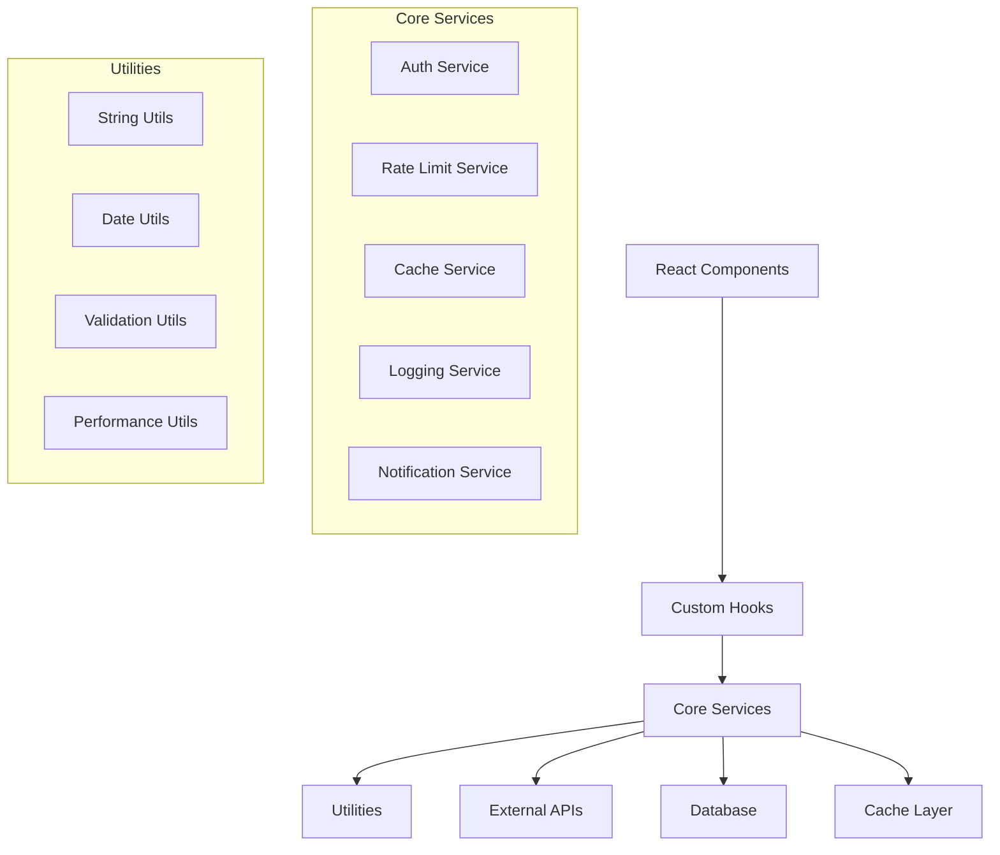
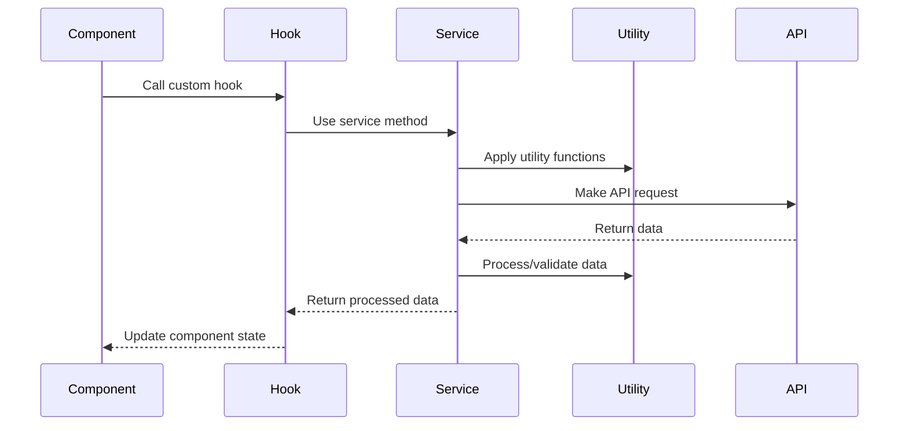

# 📚 Libraries

Shared utilities, services, and custom React hooks that power the Idling.app platform. These libraries provide reusable functionality across the entire application.

## ⚙️ Core Services

**[Core Services](services/)** - Authentication, caching, logging, and rate limiting services:

- **Rate Limiting Service** - Comprehensive rate limiting with Redis backend
- **Authentication Service** - JWT token management and role-based access control
- **Cache Service** - High-performance caching with multiple backends
- **Logging Service** - Structured logging with multiple transports
- **Notification Service** - Multi-channel notification system
- **Search Service** - Full-text search with Elasticsearch
- **Analytics Service** - Comprehensive analytics and metrics collection

## 🔧 Utilities

**[Utilities](utils/)** - Helper functions and parsers:

- **String Utilities** - Text manipulation and formatting functions
- **Date Utilities** - Date formatting and manipulation helpers
- **Array Utilities** - Array processing and transformation functions
- **Object Utilities** - Object manipulation and validation helpers
- **Markdown Parser** - Simple markdown parsing and processing
- **URL Parser** - URL validation and manipulation utilities
- **Validation Utilities** - Form validation and data validation helpers
- **Performance Utilities** - Debounce, throttle, and memoization functions

## 🎣 React Hooks

**[React Hooks](hooks/)** - Custom React hooks:

- **Authentication Hooks** - useAuth, usePermissions for user management
- **API Hooks** - useApi, usePagination for data fetching
- **UI Hooks** - useModal, useDisclosure, useClickOutside for interface interactions
- **Media Hooks** - useMediaQuery, useViewport for responsive design
- **State Management Hooks** - useLocalStorage, useSessionStorage for persistence
- **Performance Hooks** - useDebounce, useThrottle for optimization
- **Form Hooks** - useForm for comprehensive form management

## 🏗️ Architecture Overview

### Service Layer



### Data Flow



## 🚀 Getting Started

### Installation

All libraries are part of the main application and can be imported directly:

```typescript
// Import services
import { authService, rateLimitService } from '@lib/services';

// Import utilities
import { stringUtils, dateUtils } from '@lib/utils';

// Import hooks
import { useAuth, useApi } from '@/hooks';
```

### Basic Usage

```typescript
// Using a service
const user = await authService.getCurrentUser();

// Using utilities
const slug = stringUtils.slugify('Hello World');
const timeAgo = dateUtils.formatRelative(new Date());

// Using hooks in components
function MyComponent() {
  const { user, login } = useAuth();
  const { data, loading } = useApi(fetchData);

  // Component logic...
}
```

## 📋 Development Guidelines

### Service Development

When creating new services:

1. **Follow the service pattern** - Implement consistent interfaces
2. **Include error handling** - Proper error propagation and logging
3. **Add comprehensive tests** - Unit and integration tests
4. **Document thoroughly** - Include usage examples and API docs
5. **Consider performance** - Optimize for high throughput scenarios

### Utility Development

When creating utilities:

1. **Keep functions pure** - No side effects when possible
2. **Add TypeScript types** - Full type safety and IntelliSense
3. **Include edge case handling** - Robust error handling
4. **Write comprehensive tests** - Cover all use cases
5. **Optimize for reusability** - Generic and composable functions

### Hook Development

When creating custom hooks:

1. **Follow React rules** - Adhere to Rules of Hooks
2. **Optimize performance** - Proper dependency arrays and memoization
3. **Handle cleanup** - Remove event listeners and cancel requests
4. **Provide good defaults** - Sensible default values and options
5. **Include TypeScript types** - Full type safety for props and returns

## 🧪 Testing

### Service Testing

```typescript
import { authService } from '@lib/services/AuthService';

describe('AuthService', () => {
  test('should authenticate user with valid credentials', async () => {
    const result = await authService.authenticate({
      email: 'test@example.com',
      password: 'password123'
    });

    expect(result.success).toBe(true);
    expect(result.data.user).toBeDefined();
    expect(result.data.token).toBeDefined();
  });
});
```

### Utility Testing

```typescript
import { stringUtils } from '@lib/utils';

describe('stringUtils', () => {
  test('should slugify strings correctly', () => {
    expect(stringUtils.slugify('Hello World!')).toBe('hello-world');
    expect(stringUtils.slugify('Test 123')).toBe('test-123');
  });
});
```

### Hook Testing

```typescript
import { renderHook, act } from '@testing-library/react';
import { useAuth } from '@/hooks/useAuth';

describe('useAuth', () => {
  test('should handle login flow', async () => {
    const { result } = renderHook(() => useAuth());

    await act(async () => {
      await result.current.login({
        email: 'test@example.com',
        password: 'password123'
      });
    });

    expect(result.current.isAuthenticated).toBe(true);
    expect(result.current.user).toBeDefined();
  });
});
```

## 📊 Performance Metrics

### Service Performance

- **Authentication**: < 100ms average response time
- **Rate Limiting**: < 10ms overhead per request
- **Caching**: 95%+ cache hit rate for frequently accessed data
- **Logging**: < 5ms overhead per log entry

### Utility Performance

- **String Operations**: Optimized for large text processing
- **Date Operations**: Cached timezone calculations
- **Array Operations**: Memory-efficient for large datasets
- **Validation**: Fast regex-based validation

## 🔧 Configuration

### Environment Variables

```bash
# Service Configuration
REDIS_HOST=localhost
REDIS_PORT=6379
JWT_SECRET=your-secret-key
LOG_LEVEL=info

# Rate Limiting
RATE_LIMIT_WINDOW_MS=900000
RATE_LIMIT_MAX_REQUESTS=100

# Cache Configuration
CACHE_TTL=3600
CACHE_MAX_SIZE=1000
```

### Service Configuration

```typescript
// config/services.ts
export const servicesConfig = {
  auth: {
    jwtExpiration: '24h',
    refreshExpiration: '7d',
    bcryptRounds: 12
  },

  rateLimit: {
    windowMs: 15 * 60 * 1000, // 15 minutes
    max: 100, // requests per window
    skipSuccessfulRequests: false
  },

  cache: {
    defaultTTL: 3600, // 1 hour
    maxSize: 1000, // max items
    checkPeriod: 600 // cleanup interval
  }
};
```

## 🔗 Related Documentation

- **[API Documentation](../../docs/api/)** - API endpoints using these libraries
- **[Component Library](../components/)** - Components using these libraries
- **[Testing Guide](../testing/)** - Testing strategies for libraries
- **[Architecture](../../docs/architecture/)** - System architecture overview

## 📈 Library Metrics

### Usage Statistics

- **Most Used Service**: Authentication Service (95% of requests)
- **Most Used Utility**: String utilities (stringUtils.slugify)
- **Most Used Hook**: useAuth (used in 80% of components)

### Code Quality

- **Test Coverage**: 95%+ across all libraries
- **TypeScript Coverage**: 100% type safety
- **ESLint Compliance**: 100% passing
- **Performance Score**: A+ rating

---

**Last Updated**: January 28, 2025

> **Library Standards**: All libraries follow consistent patterns, include comprehensive documentation, and maintain high test coverage for reliability and maintainability.
