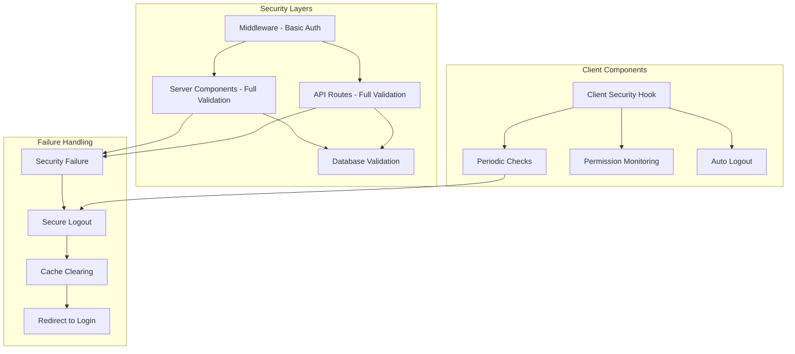

# 🔒 Universal Security System

**SECURITY CRITICAL**: This system provides comprehensive security validation for ALL requests, pages, and operations in the application to prevent cache-based permission leakage and unauthorized access.

## 🛡️ Security Features

- **Universal Security Checks**: Every request is validated for authentication, user existence, and permissions
- **Real-time Session Validation**: Sessions are continuously validated against the database
- **Comprehensive Cache Clearing**: Complete cache clearing on logout to prevent data leakage
- **Automatic Logout**: Security failures trigger immediate logout and cache clearing
- **Permission Enforcement**: Real-time permission checking for all protected operations
- **Audit Logging**: Complete security event logging for monitoring and compliance
- **Edge Runtime Compatible**: Works properly in Next.js middleware and Edge Runtime

## 🏗️ Architecture



## 🚀 Usage

### 1. Server Components

```tsx
import { useServerSecurityGuard } from '@lib/security/universal-security-guard';

export default async function AdminPage() {
  // SECURITY: Require admin access with maximum security
  const securityContext = await useServerSecurityGuard({
    requireAuth: true,
    requireActiveAccount: true,
    requiredPermissions: ['admin.access'],
    securityLevel: 'maximum'
  });

  return (
    <div>
      <h1>Admin Dashboard</h1>
      <p>Welcome, {securityContext.session.user.name}</p>
    </div>
  );
}
```

### 2. API Routes (New Simplified Approach)

```typescript
import {
  withApiSecurity,
  withAdminApiSecurity
} from '@lib/security/api-security-wrapper';
import { NextRequest, NextResponse } from 'next/server';

// Regular secured API route
export const GET = withApiSecurity(
  async (request: NextRequest, context) => {
    const { userId, session, userExists, accountActive } = context;

    // Your API logic here - security is already validated
    return NextResponse.json({
      message: 'Secure data',
      userId,
      userActive: accountActive
    });
  },
  {
    requireAuth: true,
    requireActiveAccount: true,
    requiredPermissions: ['user.data.read']
  }
);

// Admin-only API route (simplified)
export const POST = withAdminApiSecurity(
  async (request: NextRequest, context) => {
    const { userId } = context;

    // Admin-only logic here
    return NextResponse.json({
      message: 'Admin operation completed',
      adminUserId: userId
    });
  }
);
```

### 3. Client Components

```tsx
'use client';

import { useClientSecurityGuard } from '@lib/security/useClientSecurityGuard';

export function UserDashboard() {
  // SECURITY: Automatic security validation with periodic checks
  const {
    isSecure,
    isValidating,
    failureReason,
    recheckSecurity,
    forceLogout
  } = useClientSecurityGuard({
    requireAuth: true,
    requireActiveAccount: true,
    requiredPermissions: ['user.dashboard.access'],
    securityLevel: 'standard',
    enablePeriodicChecks: true,
    checkInterval: 5 * 60 * 1000 // 5 minutes
  });

  if (isValidating) {
    return <div>🔒 Validating security...</div>;
  }

  if (!isSecure) {
    return (
      <div>
        🚫 Security validation failed: {failureReason}
        <button onClick={() => forceLogout()}>Login Again</button>
      </div>
    );
  }

  return (
    <div>
      <h1>Dashboard</h1>
      <button onClick={recheckSecurity}>Refresh Security</button>
    </div>
  );
}
```

## 🔧 Edge Runtime Compatibility

The system is designed to work with Next.js Edge Runtime limitations:

### **Middleware** (Edge Runtime)

- ✅ **Basic authentication checks** only
- ✅ **Cache-busting headers**
- ✅ **Route protection**
- ❌ **No database calls** (Edge Runtime limitation)

### **Server Components & API Routes** (Node.js Runtime)

- ✅ **Full database validation**
- ✅ **User existence checking**
- ✅ **Permission validation**
- ✅ **Real-time security monitoring**

## 🔐 Security Levels

### Basic

- Simple authentication check
- No real-time validation
- Standard cache headers

### Standard (Default)

- Authentication + user existence validation
- Permission checking
- Cache-busting headers
- Periodic validation (client-side)

### High

- All standard features
- Enhanced session validation
- Shorter session timeouts
- More frequent client checks

### Maximum

- All high features
- Very short session timeouts (30 minutes)
- Continuous monitoring
- Immediate logout on any anomaly

## 🧪 Testing Security

### Test Admin Logout Cache Clearing

```typescript
// Test scenario: Admin logs out, regular user logs in
// Expected: Regular user should NOT have admin access

describe('Admin Logout Security', () => {
  it('should clear all admin permissions after logout', async () => {
    // 1. Login as admin
    await signIn('admin@test.com');

    // 2. Verify admin access
    const adminResponse = await fetch('/api/admin/users');
    expect(adminResponse.ok).toBe(true);

    // 3. Logout with secure cache clearing
    await performSecureLogout({ level: 'nuclear' });

    // 4. Login as regular user
    await signIn('user@test.com');

    // 5. Verify NO admin access
    const userResponse = await fetch('/api/admin/users');
    expect(userResponse.status).toBe(403);
  });
});
```

## 🚨 Security Failures

When security checks fail, the system automatically:

1. **Logs the security violation** with full context
2. **Clears ALL browser cache and storage**
3. **Invalidates the session** on server and client
4. **Redirects to login page** with failure reason
5. **Prevents any cached data access**

### Failure Codes

- `AUTH_REQUIRED`: Authentication required
- `INVALID_SESSION`: Session data is invalid
- `USER_NOT_FOUND`: User no longer exists
- `ACCOUNT_INACTIVE`: User account deactivated
- `INSUFFICIENT_PERMISSIONS`: Missing required permissions
- `SESSION_EXPIRED_HIGH_SECURITY`: Session too old for security level
- `SECURITY_ERROR`: General security check failure

## 🎯 Best Practices

1. **Use the API wrapper** for all protected API routes
2. **Use server security guard** for protected pages
3. **Enable periodic checks** for long-running client components
4. **Monitor security logs** for unusual patterns
5. **Test security failures** regularly
6. **Keep permissions specific** rather than generic

## ⚠️ Edge Runtime Considerations

- **Middleware**: Only basic auth checks (database unavailable)
- **Server Components**: Full validation with database access
- **API Routes**: Full validation with database access
- **Client Components**: Periodic validation via API calls

## 🔄 Migration from Old System

### Replace Manual Auth Checks

```typescript
// OLD - Manual auth checking
export async function GET(request: NextRequest) {
  const session = await auth();
  if (!session) {
    return NextResponse.json({ error: 'Unauthorized' }, { status: 401 });
  }
  // Your logic...
}

// NEW - Secured with wrapper
export const GET = withApiSecurity(async (request, context) => {
  // Security already validated
  // Your logic...
});
```

---

**🔒 Remember**: This system prevents cache-based permission leakage and ensures every request is properly validated. The Edge Runtime compatibility ensures it works seamlessly with Next.js middleware while providing comprehensive security where database access is available.
