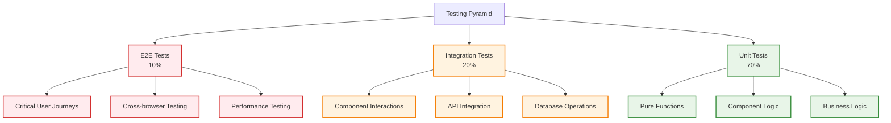
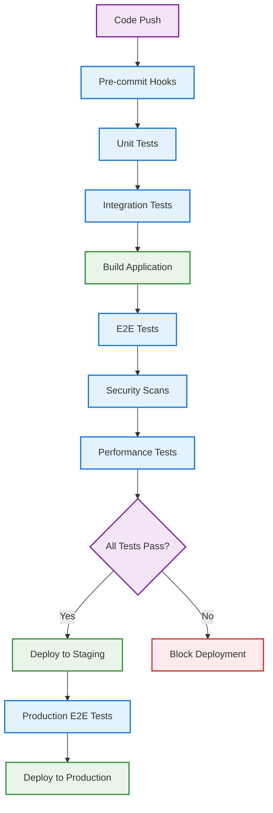
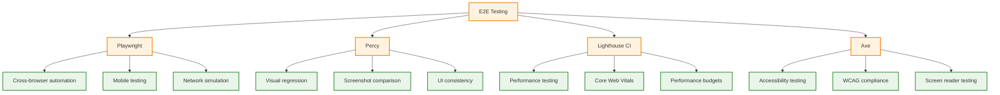
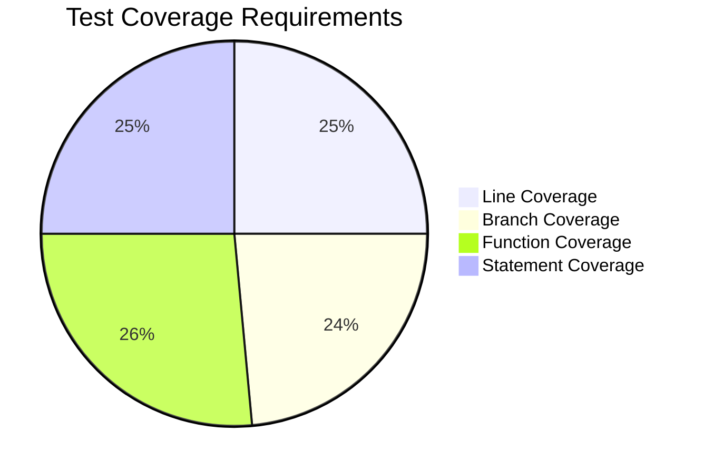
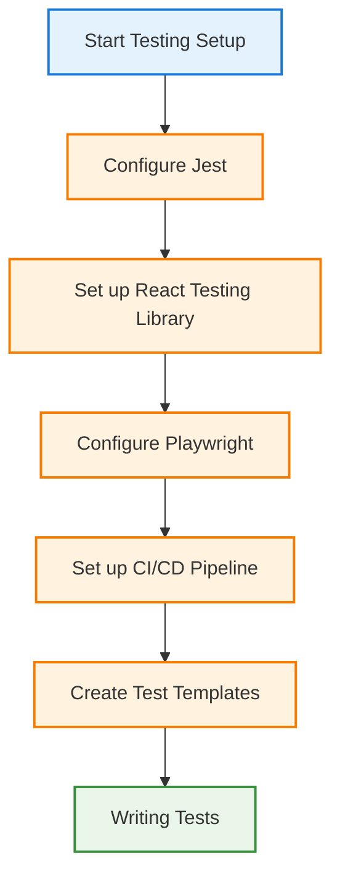
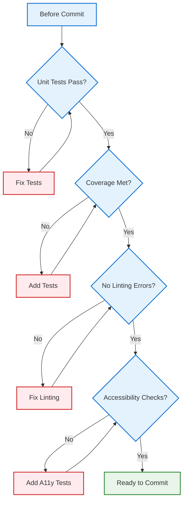
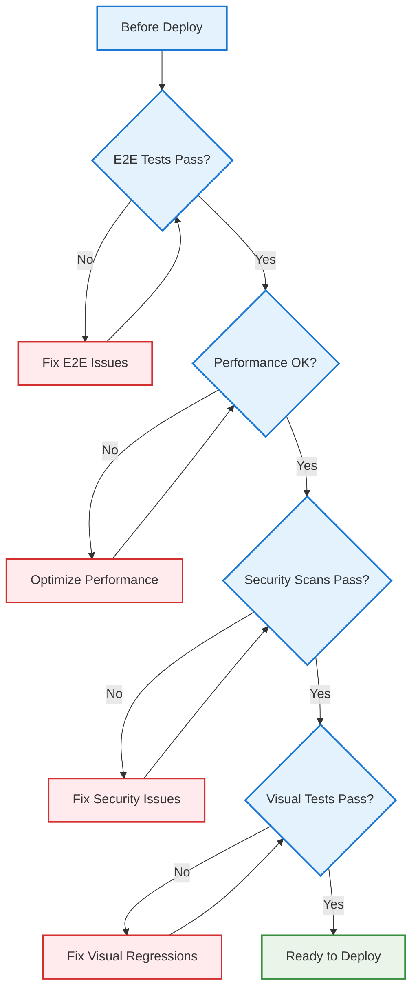

# 🧪 Testing Strategies

Comprehensive testing documentation covering unit tests, integration tests, end-to-end testing, and continuous integration.

## 🎯 Testing Philosophy

### Test Pyramid



1. **Unit Tests** (70%) - Fast, isolated, comprehensive
2. **Integration Tests** (20%) - Component interactions
3. **E2E Tests** (10%) - Critical user journeys

### Quality Standards

- **Coverage**: Minimum 80% code coverage
- **Performance**: Tests complete in under 5 minutes
- **Reliability**: Tests are deterministic and stable
- **Maintainability**: Clear, readable test code

## 🔬 Unit Testing

**[Unit Testing](unit/)** - Component and function testing:

- Jest configuration and setup
- React Testing Library best practices
- Component testing strategies
- Mock implementations
- Test coverage requirements
- Snapshot testing guidelines

## 🌐 E2E Testing

**[End-to-End Testing](e2e/)** - Full application testing:

- Playwright configuration and setup
- User journey testing
- Cross-browser compatibility
- Visual regression testing
- Performance testing
- Mobile testing strategies

## 🔄 CI/CD

**[Continuous Integration](ci-cd/)** - Automated testing pipeline:



- GitHub Actions configuration
- Test automation workflows
- Quality gates and requirements
- Deployment testing
- Performance monitoring
- Security scanning

## 🛠️ Testing Tools

### Unit Testing Stack

```mermaid
graph TD
    A[Unit Testing] --> B[Jest]
    A --> C[React Testing Library]
    A --> D[MSW]
    A --> E[@testing-library/jest-dom]

    B --> B1[Test runner]
    B --> B2[Assertion library]
    B --> B3[Mocking capabilities]

    C --> C1[Component testing]
    C --> C2[DOM interactions]
    C --> C3[User behavior simulation]

    D --> D1[API mocking]
    D --> D2[Network request interception]
    D --> D3[Integration test support]

    E --> E1[Custom Jest matchers]
    E --> E2[DOM assertions]
    E --> E3[Accessibility checks]

    classDef tool fill:#e1f5fe,stroke:#0277bd,stroke-width:2px
    classDef feature fill:#e8f5e8,stroke:#388e3c,stroke-width:2px

    class A,B,C,D,E tool
    class B1,B2,B3,C1,C2,C3,D1,D2,D3,E1,E2,E3 feature
```

- **Jest** - Test runner and assertion library
- **React Testing Library** - Component testing utilities
- **MSW** - API mocking for integration tests
- **@testing-library/jest-dom** - Custom Jest matchers

### E2E Testing Stack



- **Playwright** - Cross-browser automation
- **Percy** - Visual regression testing
- **Lighthouse CI** - Performance testing
- **Axe** - Accessibility testing

## 📊 Test Reports

### Coverage Reports



- Line coverage: 85%+
- Branch coverage: 80%+
- Function coverage: 90%+
- Statement coverage: 85%+

### Performance Metrics

```mermaid
gantt
    title Test Execution Timeline
    dateFormat X
    axisFormat %s

    section Unit Tests
    Jest execution    :0, 30

    section Integration Tests
    Component tests   :30, 90
    API tests        :90, 150

    section E2E Tests
    Critical paths   :150, 300
    Full suite       :300, 600
```



- Unit test execution: < 30 seconds
- E2E test execution: < 5 minutes
- CI pipeline completion: < 10 minutes

## 🚀 Getting Started



1. **[Set up unit tests](unit/)** - Configure Jest and RTL
2. **[Configure E2E tests](e2e/)** - Set up Playwright
3. **[Enable CI/CD](ci-cd/)** - Automate testing pipeline

## 📋 Testing Checklist

### Before Committing



- [ ] All unit tests pass
- [ ] Code coverage meets requirements
- [ ] No linting errors
- [ ] Component tests include accessibility checks

### Before Deploying



- [ ] All E2E tests pass
- [ ] Performance tests meet benchmarks
- [ ] Security scans complete
- [ ] Visual regression tests pass

## 🔗 Related Sections

- **Components** - Component testing examples
- **[Tools](../tools/)** - Development environment setup
- **[Documentation](../../docs/)** - API testing documentation

---

_Testing documentation is continuously updated. Last updated: January 28, 2025_
