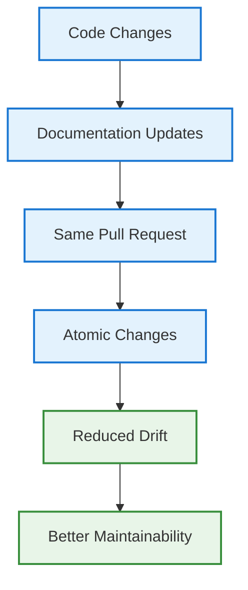
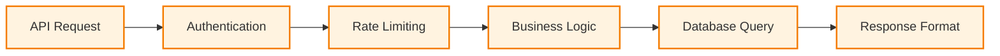
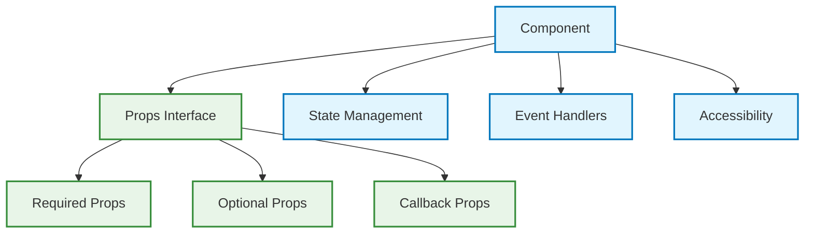
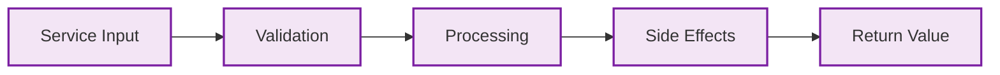
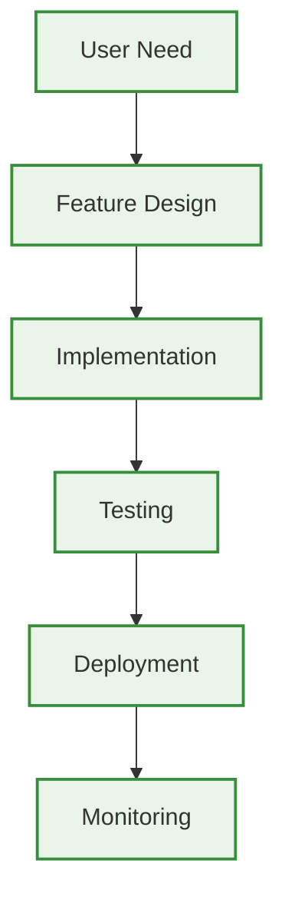
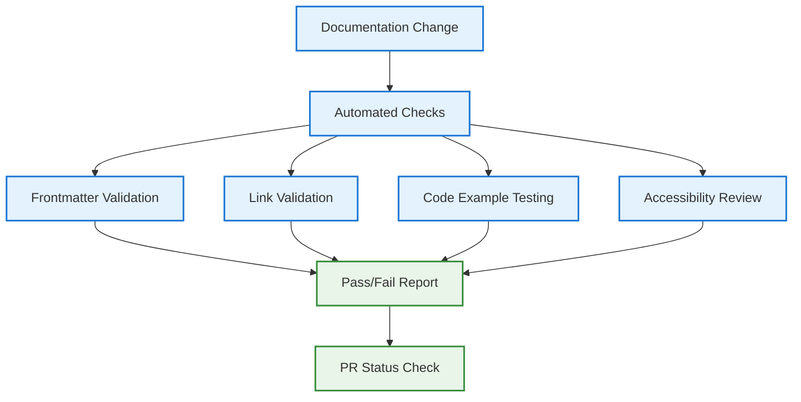

# 📚 Co-Located Documentation Standards

Comprehensive standards for creating scalable, maintainable documentation that lives alongside your code.

## 🎯 Core Philosophy

Think of documentation like a well-organized library - every book has its place, every shelf has its purpose, and finding information should be intuitive. Our co-located approach puts documentation exactly where developers expect to find it: next to the code it describes.



## 🏗️ Documentation Architecture

### Directory Structure Standards

```
src/
├── app/
│   ├── api/
│   │   ├── index.md                    # API Overview
│   │   ├── [endpoint]/
│   │   │   └── index.md                # Endpoint documentation
│   │   └── [feature]/
│   │       ├── index.md                # Feature API overview
│   │       └── [endpoint]/
│   │           └── index.md            # Specific endpoint docs
│   └── [feature]/
│       ├── index.md                    # Feature overview
│       ├── components/
│       │   └── [Component]/
│       │       └── index.md            # Component documentation
│       └── hooks/
│           └── [hook]/
│               └── index.md            # Hook documentation
├── lib/
│   ├── index.md                        # Library overview
│   ├── [service]/
│   │   └── index.md                    # Service documentation
│   └── utils/
│       └── [utility]/
│           └── index.md                # Utility documentation
└── templates/
    ├── index.md                        # Template overview
    └── [template-name].mdx             # Template files
```

### File Naming Standards

#### ✅ Correct Patterns

- `index.md` - Main documentation file for a directory
- `[specific-name].md` - Specific documentation topics
- `[component-name].mdx` - Template files (with JSX features)

#### ❌ Avoid These Patterns

- `README.md` - Use `index.md` instead
- `docs.md` - Be more specific about content
- Mixed case - Use kebab-case consistently

## 📋 Documentation Types & Templates

### 1. API Documentation

**Location**: `src/app/api/[endpoint]/index.md`
**Template**: [API Template](./api-template.mdx)



**Required Sections**:

- What This API Does (with analogies)
- Authentication & Authorization
- Request/Response Examples
- Error Handling
- Rate Limiting
- Integration Examples

### 2. Component Documentation

**Location**: `src/app/[feature]/components/[Component]/index.md`
**Template**: [Component Template](./component-template.mdx)



**Required Sections**:

- Component Purpose & Usage
- Props Interface Documentation
- Usage Examples
- Accessibility Guidelines
- Styling & Theming
- Testing Examples

### 3. Library/Service Documentation

**Location**: `src/lib/[service]/index.md`
**Template**: [Service Template](./service-template.mdx)



**Required Sections**:

- Service Purpose & Use Cases
- Configuration Options
- Method Documentation
- Error Handling
- Performance Considerations
- Integration Examples

### 4. Feature Documentation

**Location**: `src/app/[feature]/index.md`
**Template**: [Feature Template](./feature-template.mdx)



**Required Sections**:

- Feature Overview & Benefits
- User Stories & Use Cases
- Technical Implementation
- Configuration & Setup
- Monitoring & Analytics
- Troubleshooting Guide

## 🎨 Frontmatter Standards

### Standard Frontmatter Template

```yaml
---
title: '[Component/Feature] - What It Does & How It Helps'
description: 'One-sentence explanation anyone can understand'
tags: ['component', 'ui', 'accessibility']
sidebar_position: 1
---
```

### Frontmatter Field Guidelines

#### Required Fields

- `title`: Clear, descriptive title following the pattern "[Thing] - What It Does"
- `description`: Single sentence explaining the purpose for any audience

#### Optional Fields

- `tags`: Array of relevant tags for categorization
- `sidebar_position`: Numeric position for navigation ordering
- `hide_table_of_contents`: Boolean to hide TOC if content is simple

#### Field Formatting Rules

- Use sentence case for titles
- Keep descriptions under 140 characters
- Use consistent tag naming conventions
- Number sidebar positions in increments of 10

## 📝 Content Standards

### Writing Style Guidelines

#### Accessible Technical Writing

```markdown
# ✅ Good Example

Think of rate limiting like a bouncer at a popular club. Just as a bouncer controls how many people can enter at once to prevent overcrowding, rate limiting controls how many requests can be processed to prevent system overload.

# ❌ Poor Example

Rate limiting implements token bucket algorithm to throttle request throughput based on configurable parameters.
```

#### Section Organization

Every documentation file should follow this structure:

1. **Opening Hook** - What this solves, why it matters
2. **Visual Overview** - Mermaid diagram showing the big picture
3. **How It Works** - Step-by-step explanation with analogies
4. **Practical Examples** - Real code examples with explanations
5. **Configuration** - Settings and customization options
6. **Troubleshooting** - Common issues and solutions
7. **Next Steps** - Related documentation and resources

### Code Example Standards

#### Include Context

```typescript
// ✅ Good - Shows imports and context
import { RateLimiter } from '@/lib/rate-limiter';

// Create rate limiter for API endpoints
const apiLimiter = new RateLimiter({
  windowMs: 15 * 60 * 1000, // 15 minutes
  max: 100 // limit each IP to 100 requests per windowMs
});

// Use in API route
export async function GET(request: Request) {
  const result = await apiLimiter.check(request);
  if (!result.success) {
    return new Response('Rate limit exceeded', { status: 429 });
  }
  // ... rest of handler
}
```

#### Provide Multiple Examples

```typescript
// Basic usage
const limiter = new RateLimiter({ max: 100 });

// Advanced configuration
const limiter = new RateLimiter({
  windowMs: 15 * 60 * 1000,
  max: 100,
  standardHeaders: true,
  legacyHeaders: false,
  skipSuccessfulRequests: true
});

// Custom skip logic
const limiter = new RateLimiter({
  max: 100,
  skip: (request) => request.ip === '127.0.0.1'
});
```

## 🔧 Automation Tools

### Documentation Linting

We provide automated tools to ensure documentation quality:

```bash
# Check documentation completeness
yarn doc:check

# Fix formatting issues
yarn doc:format

# Validate links and references
yarn doc:validate

# Generate documentation coverage report
yarn doc:coverage
```

### Template Usage Scripts

```bash
# Create new component documentation
yarn doc:new-component ComponentName

# Create new API documentation
yarn doc:new-api endpoint-name

# Create new feature documentation
yarn doc:new-feature feature-name

# Create new service documentation
yarn doc:new-service service-name
```

## 📊 Quality Metrics

### Documentation Completeness Checklist

For each documentation file, ensure:

- [ ] Title follows naming convention
- [ ] Description is clear and accessible
- [ ] At least one mermaid diagram included
- [ ] Code examples are tested and working
- [ ] All technical terms explained
- [ ] Troubleshooting section included
- [ ] Cross-references to related docs
- [ ] Updated within 30 days of code changes

### Automated Quality Checks



## 🚀 Migration Strategy

### For Existing Documentation

1. **Audit Current State**

   ```bash
   # Find all documentation files
   find . -name "*.md" -type f | grep -v node_modules > docs-inventory.txt

   # Identify inconsistencies
   yarn doc:audit
   ```

2. **Standardize File Names**

   ```bash
   # Convert README.md to index.md
   find . -name "README.md" -not -path "./node_modules/*" -exec sh -c 'mv "$0" "${0%README.md}index.md"' {} \;
   ```

3. **Update Frontmatter**

   ```bash
   # Add missing frontmatter
   yarn doc:fix-frontmatter
   ```

4. **Validate and Fix**

   ```bash
   # Check for issues
   yarn doc:validate

   # Fix common issues
   yarn doc:fix
   ```

## 🎯 Best Practices Summary

### Do's ✅

- Keep documentation next to the code it describes
- Use clear, accessible language with analogies
- Include visual diagrams for complex concepts
- Provide working code examples
- Update documentation in the same PR as code changes
- Use consistent file naming and structure

### Don'ts ❌

- Create centralized documentation that duplicates code-level docs
- Use technical jargon without explanation
- Leave documentation as "stub" files
- Mix different file naming conventions
- Skip mermaid diagrams for complex workflows
- Forget to update documentation when code changes

## 🆘 Getting Help

- **Documentation Questions**: Check existing templates and examples
- **Technical Writing Help**: Follow our accessibility guidelines
- **Tool Issues**: Run diagnostics with `yarn doc:doctor`
- **Template Requests**: Create an issue with your specific needs

---

_Great documentation makes complex systems understandable to everyone, not just the people who built them._ 🧙‍♂️✨
