# [Component/Service Name] - What It Does & How It Helps 🚀

**What this page is about:** This page explains [component/service name] in simple terms, so whether you're a developer, designer, or just curious about how things work, you'll understand what it does and why it matters.

_A friendly explanation that anyone can understand, regardless of technical background._

## What Does This Actually Do? 🤔

Think of [component/service name] like [everyday analogy]. Just as [analogy explanation], this system [simple explanation of what it does].

### The Big Picture

```mermaid
graph TD
    A[User Request] --> B[Our System]
    B --> C{Is Everything OK?}
    C -->|Yes| D[✅ Success Response]
    C -->|No| E[❌ Error Response]

    style A fill:#e1f5fe
    style D fill:#e8f5e8
    style E fill:#ffebee
```



**In simple terms:**

- 📥 **Input**: What comes in (user requests, data, etc.)
- ⚙️ **Processing**: What our system does with it
- 📤 **Output**: What users get back

## Why Do We Need This? 💡

Here's why this matters to different people:

### For Everyday Users

- **Better Experience**: [How it improves user experience]
- **Faster Loading**: [How it makes things faster]
- **More Reliable**: [How it prevents problems]

### For Developers

- **Easier to Build**: [How it simplifies development]
- **Less Bugs**: [How it prevents issues]
- **Better Performance**: [Technical benefits]

### For Business

- **Cost Savings**: [How it saves money/resources]
- **User Satisfaction**: [How it improves metrics]
- **Scalability**: [How it handles growth]

## How It Works (The Simple Version) 🔧

Let's break this down step by step:

```mermaid
sequenceDiagram
    participant User as 👤 User
    participant System as 🖥️ Our System
    participant Service as ⚙️ [Service Name]
    participant Database as 🗄️ Storage

    User->>System: I want to do something
    System->>Service: Check if this is OK
    Service->>Database: Look up information
    Database->>Service: Here's what I found
    Service->>System: ✅ All good! or ❌ Problem!
    System->>User: Here's your result
```



### Step by Step:

1. **🚪 Entry Point**: When someone uses our app, their request comes here first
2. **🔍 Checking**: We examine the request to make sure it's valid and safe
3. **📊 Decision Making**: Based on what we find, we decide what to do next
4. **📋 Action**: We either process the request or politely decline with helpful information
5. **📤 Response**: The user gets a clear answer about what happened

## Different Ways This Gets Used 🎯

### Basic Usage (Most Common)

```javascript
// This is what developers write - don't worry about the code details!
// The important part is that it's simple to use
export const GET = withProtection(handleRequest);
```

**What this means in plain English:**

- We wrap our regular function with protection
- The protection automatically handles security and limits
- Developers don't need to worry about the complex stuff

### Advanced Usage (For Special Cases)

```javascript
// Sometimes we need custom rules for specific situations
export const GET = withProtection(handleRequest, {
  skipProtection: true // Only for special internal tools
});
```

**When we use this:**

- Internal administration tools
- Emergency bypass situations
- Testing and development

## The Smart Protection System 🛡️

Our system uses multiple layers of protection, like a building with several security checkpoints:

```mermaid
graph TB
    subgraph "🏠 Your Device"
        A[Your Request]
    end

    subgraph "🚪 First Check"
        B[Device Check]
        B1[Is this device behaving normally?]
    end

    subgraph "🏢 Network Check"
        C[Network Check]
        C1[Is the whole network OK?]
    end

    subgraph "👤 User Check"
        D[User Check]
        D1[Does this user have permission?]
    end

    subgraph "✅ Final Decision"
        E[Allow or Block]
    end

    A --> B
    B --> B1
    B1 -->|✅ Good| C
    B1 -->|❌ Suspicious| F[⏰ Please Wait]
    C --> C1
    C1 -->|✅ Good| D
    C1 -->|❌ Problem| F
    D --> D1
    D1 -->|✅ Authorized| E
    D1 -->|❌ Not Allowed| F
    E --> G[🎉 Success!]

    style A fill:#e3f2fd
    style G fill:#e8f5e8
    style F fill:#fff3e0
```



### Layer 1: Device Protection 📱

**What it does:** Checks if your specific device is making reasonable requests
**Why it matters:** Prevents one device from overwhelming the system
**User impact:** Most users never notice this working

### Layer 2: Network Protection 🌐

**What it does:** Monitors your internet connection (like your home WiFi)
**Why it matters:** Protects against someone trying to attack from multiple devices
**User impact:** Keeps the service fast for everyone in your household

### Layer 3: User Protection 👤

**What it does:** Tracks limits for your specific user account
**Why it matters:** Ensures fair usage and prevents abuse
**User impact:** You get your fair share of resources

## Configuration Options 🎛️

Different types of requests get different treatment:


### What These Numbers Mean:

- **Higher numbers = more generous**: Things you do frequently get higher limits
- **Lower numbers = more restrictive**: Resource-heavy operations get lower limits
- **Time windows**: These limits reset every minute (except daily limits)

## When Things Go Wrong 🚨

Sometimes our protection system needs to step in. Here's what happens:

### Gentle Reminders (Level 1-2)

```json
{
  "message": "You're doing great! Just slow down a tiny bit.",
  "wait_time": "1 minute",
  "reason": "Too many requests too quickly"
}
```

### Stronger Limits (Level 3-4)

```json
{
  "message": "Please take a short break and try again soon.",
  "wait_time": "15 minutes",
  "reason": "Unusual activity detected"
}
```

### Maximum Protection (Level 5+)

```json
{
  "message": "Security systems activated. Please contact support if you need help.",
  "wait_time": "1 hour",
  "reason": "Potential security threat"
}
```

## Success Stories 📈

Here's what happens when everything works well:

```mermaid
graph LR
    A[Request Arrives] --> B{Security Check}
    B -->|✅ Passed| C[Process Request]
    C --> D[Send Response]
    D --> E[✨ Happy User]

    style A fill:#e1f5fe
    style B fill:#fff3e0
    style C fill:#f3e5f5
    style D fill:#e8f5e8
    style E fill:#e8f5e8
```



### What You'll See:

- **Fast responses**: Usually under 100 milliseconds
- **Helpful headers**: Information about your current limits
- **Smooth experience**: No interruptions during normal use

## Development & Testing 🔧

### For Developers

**Getting Started:**

```bash
# Skip all limits during development
BYPASS_RATE_LIMIT=true yarn dev
```

**Testing Protection:**

```bash
# Test what happens when limits are exceeded
curl -X POST /api/test-rate-limit
```

### For Testers

**What to Test:**

- [ ] Normal usage works smoothly
- [ ] Excessive requests get blocked politely
- [ ] Users get helpful error messages
- [ ] Protection doesn't interfere with legitimate use

## Troubleshooting 🔍

### Common Issues & Solutions

#### "Rate limit exceeded" message

**What it means:** You've made too many requests too quickly
**What to do:** Wait a moment and try again
**Prevention:** Spread out your requests over time

#### "Unusual activity detected"

**What it means:** Our security system noticed something suspicious
**What to do:** Take a short break, then try again
**Prevention:** Use the app normally, avoid automated scripts

#### "Access temporarily restricted"

**What it means:** Maximum protection is active
**What to do:** Contact support for assistance
**Prevention:** Follow usage guidelines and terms of service

## Related Systems 🔗

This system works together with other parts of our app:


### Key Connections:

- **[User Permissions System](../auth/permissions.md)** - Controls what users can do
- **[Quota Management](../services/quota-system.md)** - Manages daily and monthly limits
- **[API Documentation](../../app/api/index.md)** - How to use our APIs properly
- **[Security Guidelines](../security/overview.md)** - Best practices for staying safe

## Performance Impact 📊

### How Fast Is It?

- **Average overhead**: Less than 5 milliseconds per request
- **Memory usage**: Minimal - cleans up automatically
- **Network impact**: Zero additional requests needed

### Optimization Features:

- **Smart caching**: Remembers recent decisions
- **Automatic cleanup**: Removes old data to stay efficient
- **Edge runtime compatible**: Works in modern cloud environments

## Getting Help 🤝

### For Users

- **Getting blocked unexpectedly?** Check our usage guidelines
- **Need higher limits?** Contact support about premium options
- **Found a bug?** Report it through our feedback system

### For Developers

- **Integration questions?** Check our API documentation
- **Custom configurations?** See the advanced examples
- **Performance issues?** Review our optimization guide

### For Administrators

- **User complaints?** Check the admin monitoring dashboard
- **System performance?** Review the analytics reports
- **Security concerns?** Access the security logs

---

**📁 Source Code:** `src/lib/[folder]/[filename].ts`  
**📅 Last Updated:** [Current Date]  
**🔄 Version:** Based on actual implementation  
**✅ Accuracy:** All examples are from real code, no fictional content
