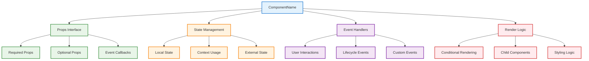
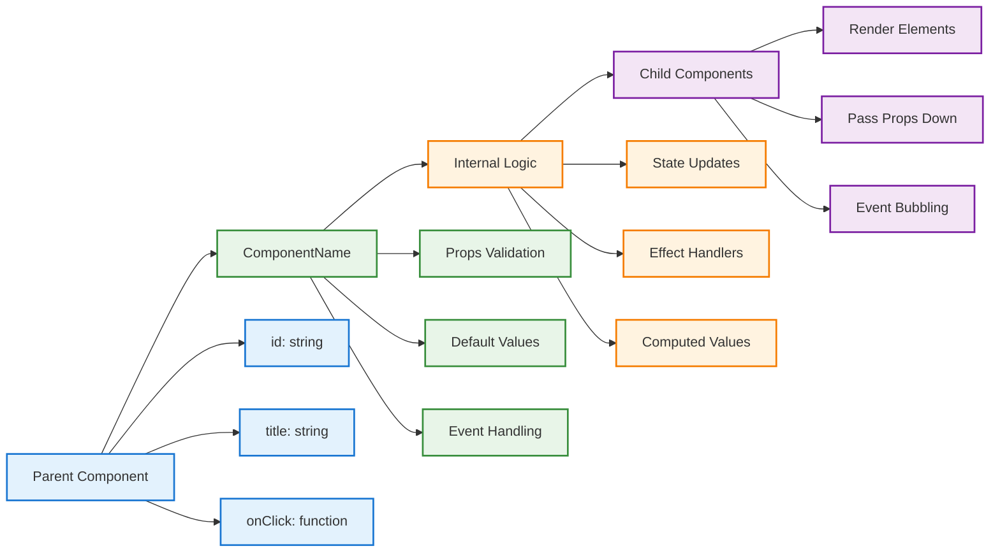

# 📋 Component Documentation Template

Use this template when documenting React components for the Idling.app project.

## 📝 Template Instructions

1. **Copy this template** to your component documentation location
2. **Replace placeholders** with your specific information
3. **Delete this instruction section** before publishing
4. **Follow the structure** provided below

---

# [ComponentName]

Brief description of the component and its purpose.

## 🎯 Overview

### Purpose

Explain what this component does and why it exists.

### Key Features

- **Feature 1**: Description of the first key feature
- **Feature 2**: Description of the second key feature
- **Feature 3**: Description of the third key feature

### Component Architecture



## 📦 Installation

```bash
# If it's a standalone component
npm install @idling/component-name

# Or import from the component library
import { ComponentName } from '@/components/ComponentName';
```

## 🔧 Props Interface

```typescript
interface ComponentNameProps {
  // Required props
  id: string;
  title: string;

  // Optional props
  description?: string;
  variant?: 'primary' | 'secondary' | 'danger';
  size?: 'small' | 'medium' | 'large';
  disabled?: boolean;

  // Event handlers
  onClick?: (event: MouseEvent) => void;
  onSubmit?: (data: FormData) => void;

  // Children and styling
  children?: React.ReactNode;
  className?: string;
  style?: React.CSSProperties;
}
```

### Props Flow Diagram



### Prop Descriptions

| Prop          | Type                                   | Default     | Description                                       |
| ------------- | -------------------------------------- | ----------- | ------------------------------------------------- |
| `id`          | `string`                               | -           | **Required.** Unique identifier for the component |
| `title`       | `string`                               | -           | **Required.** Display title for the component     |
| `description` | `string`                               | `undefined` | Optional description text                         |
| `variant`     | `'primary' \| 'secondary' \| 'danger'` | `'primary'` | Visual variant of the component                   |
| `size`        | `'small' \| 'medium' \| 'large'`       | `'medium'`  | Size variant of the component                     |
| `disabled`    | `boolean`                              | `false`     | Whether the component is disabled                 |
| `onClick`     | `(event: MouseEvent) => void`          | `undefined` | Click event handler                               |
| `onSubmit`    | `(data: FormData) => void`             | `undefined` | Submit event handler                              |
| `children`    | `React.ReactNode`                      | `undefined` | Child components or content                       |
| `className`   | `string`                               | `undefined` | Additional CSS classes                            |
| `style`       | `React.CSSProperties`                  | `undefined` | Inline styles                                     |

## 🚀 Usage Examples

### Basic Usage

```tsx
import { ComponentName } from '@/components/ComponentName';

function MyPage() {
  return (
    <ComponentName
      id="example-component"
      title="Example Component"
      description="This is an example component"
    />
  );
}
```

### With Event Handlers

```tsx
import { ComponentName } from '@/components/ComponentName';

function InteractiveExample() {
  const handleClick = (event: MouseEvent) => {
    console.log('Component clicked!', event);
  };

  const handleSubmit = (data: FormData) => {
    console.log('Form submitted:', data);
  };

  return (
    <ComponentName
      id="interactive-component"
      title="Interactive Component"
      variant="primary"
      size="large"
      onClick={handleClick}
      onSubmit={handleSubmit}
    />
  );
}
```

### With Children

```tsx
import { ComponentName } from '@/components/ComponentName';

function WithChildren() {
  return (
    <ComponentName id="container-component" title="Container Component">
      <p>This is child content</p>
      <button>Child Button</button>
    </ComponentName>
  );
}
```

### All Variants

```tsx
import { ComponentName } from '@/components/ComponentName';

function AllVariants() {
  return (
    <div>
      <ComponentName
        id="primary-component"
        title="Primary Variant"
        variant="primary"
      />

      <ComponentName
        id="secondary-component"
        title="Secondary Variant"
        variant="secondary"
      />

      <ComponentName
        id="danger-component"
        title="Danger Variant"
        variant="danger"
      />
    </div>
  );
}
```

## 🎨 Styling Guidelines

### CSS Classes

The component uses the following CSS classes:

```css
/* Base component styles */
.component-name {
  /* Base styles */
}

/* Variant styles */
.component-name--primary {
  /* Primary variant styles */
}

.component-name--secondary {
  /* Secondary variant styles */
}

.component-name--danger {
  /* Danger variant styles */
}

/* Size styles */
.component-name--small {
  /* Small size styles */
}

.component-name--medium {
  /* Medium size styles */
}

.component-name--large {
  /* Large size styles */
}

/* State styles */
.component-name--disabled {
  /* Disabled state styles */
}
```

### Styling Architecture

```mermaid
graph TD
    A[Component Styling] --> B[Base Styles]
    A --> C[Variant Styles]
    A --> D[Size Styles]
    A --> E[State Styles]
    A --> F[Custom Styles]

    B --> B1[Layout]
    B --> B2[Typography]
    B --> B3[Colors]

    C --> C1[Primary Theme]
    C --> C2[Secondary Theme]
    C --> C3[Danger Theme]

    D --> D1[Small Sizing]
    D --> D2[Medium Sizing]
    D --> D3[Large Sizing]

    E --> E1[Hover States]
    E --> E2[Focus States]
    E --> E3[Disabled States]

    F --> F1[Custom Classes]
    F --> F2[Inline Styles]
    F --> F3[CSS Variables]

    classDef base fill:#e3f2fd,stroke:#1976d2,stroke-width:2px
    classDef variant fill:#e8f5e8,stroke:#388e3c,stroke-width:2px
    classDef size fill:#fff3e0,stroke:#f57c00,stroke-width:2px
    classDef state fill:#f3e5f5,stroke:#7b1fa2,stroke-width:2px
    classDef custom fill:#ffebee,stroke:#d32f2f,stroke-width:2px

    class A,B,B1,B2,B3 base
    class C,C1,C2,C3 variant
    class D,D1,D2,D3 size
    class E,E1,E2,E3 state
    class F,F1,F2,F3 custom
```



### Theme Integration

The component integrates with the application theme system:

```css
/* CSS Custom Properties */
.component-name {
  --component-primary-color: var(--theme-primary);
  --component-secondary-color: var(--theme-secondary);
  --component-border-radius: var(--theme-border-radius);
  --component-spacing: var(--theme-spacing-md);
}

/* Dark Mode Support */
@media (prefers-color-scheme: dark) {
  .component-name {
    --component-background: var(--theme-dark-bg);
    --component-text: var(--theme-dark-text);
  }
}
```

## 🧪 Testing

### Unit Tests

```tsx
import { render, screen, fireEvent } from '@testing-library/react';
import { ComponentName } from './ComponentName';

describe('ComponentName', () => {
  test('renders with required props', () => {
    render(<ComponentName id="test" title="Test Component" />);
    expect(screen.getByText('Test Component')).toBeInTheDocument();
  });

  test('handles click events', () => {
    const handleClick = jest.fn();
    render(
      <ComponentName id="test" title="Test Component" onClick={handleClick} />
    );
    fireEvent.click(screen.getByText('Test Component'));
    expect(handleClick).toHaveBeenCalledTimes(1);
  });

  test('applies variant classes', () => {
    render(<ComponentName id="test" title="Test" variant="danger" />);
    expect(screen.getByText('Test')).toHaveClass('component-name--danger');
  });
});
```

### Testing Strategy

```mermaid
graph TD
    A[Component Testing] --> B[Unit Tests]
    A --> C[Integration Tests]
    A --> D[Visual Tests]
    A --> E[Accessibility Tests]

    B --> B1[Props Validation]
    B --> B2[Event Handling]
    B --> B3[State Management]
    B --> B4[Rendering Logic]

    C --> C1[Parent Integration]
    C --> C2[Child Components]
    C --> C3[Context Usage]

    D --> D1[Variant Rendering]
    D --> D2[Responsive Design]
    D --> D3[Theme Integration]

    E --> E1[Screen Reader Support]
    E --> E2[Keyboard Navigation]
    E --> E3[ARIA Attributes]

    classDef testing fill:#e3f2fd,stroke:#1976d2,stroke-width:2px
    classDef unit fill:#e8f5e8,stroke:#388e3c,stroke-width:2px
    classDef integration fill:#fff3e0,stroke:#f57c00,stroke-width:2px
    classDef visual fill:#f3e5f5,stroke:#7b1fa2,stroke-width:2px
    classDef a11y fill:#ffebee,stroke:#d32f2f,stroke-width:2px

    class A testing
    class B,B1,B2,B3,B4 unit
    class C,C1,C2,C3 integration
    class D,D1,D2,D3 visual
    class E,E1,E2,E3 a11y
```



## 📚 API Reference

### Methods

If the component exposes methods via `useImperativeHandle`:

```tsx
interface ComponentNameHandle {
  focus: () => void;
  reset: () => void;
  getValue: () => string;
}

const ComponentName = forwardRef<ComponentNameHandle, ComponentNameProps>(
  (props, ref) => {
    useImperativeHandle(ref, () => ({
      focus: () => {
        // Focus implementation
      },
      reset: () => {
        // Reset implementation
      },
      getValue: () => {
        // Get value implementation
        return '';
      }
    }));

    return <div>{/* Component JSX */}</div>;
  }
);
```

### Hooks

If the component provides custom hooks:

```tsx
// Custom hook for component logic
export function useComponentName(options?: ComponentNameOptions) {
  const [state, setState] = useState(initialState);

  const handleAction = useCallback(() => {
    // Hook logic
  }, []);

  return {
    state,
    handleAction
  };
}
```

## 🔗 Related Components

- **[RelatedComponent1](../related-component-1/)** - Description of relationship
- **[RelatedComponent2](../related-component-2/)** - Description of relationship

## 📋 Checklist

Before marking this component as complete:

- [ ] All required props are documented
- [ ] Usage examples are provided
- [ ] Styling guidelines are complete
- [ ] Unit tests are written
- [ ] Accessibility requirements are met
- [ ] Documentation is reviewed
- [ ] Component is exported from index

## 🔄 Changelog

### Version 1.0.0 (Initial Release)

- Initial component implementation
- Basic props and styling
- Unit tests and documentation

---

_Component documentation template. Remove this line and update with actual component information._
