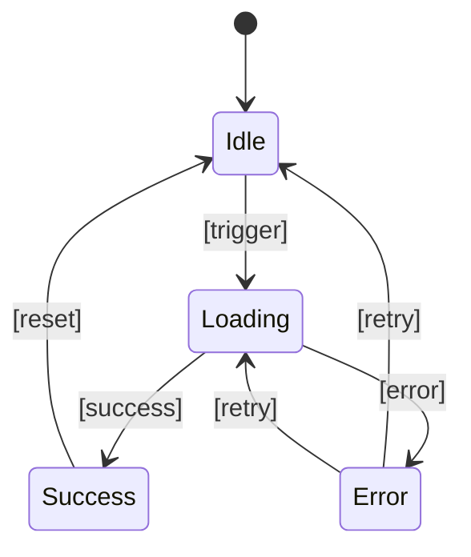
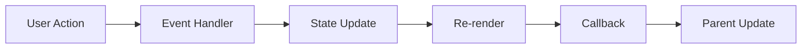

# [Component Name] - [Brief Purpose]

> **Template Instructions**: Replace all `[PLACEHOLDER]` content with your specific information. Delete this instruction block before publishing.

[Brief description of what the component does and why it exists. Focus on the user's perspective and primary use cases.]

## 🎯 Overview

### Purpose

[Explain the specific problem this component solves and why it was created. Include context about when and why to use this component.]

### Key Features

- **[Feature 1]** - [Description of the first key feature]
- **[Feature 2]** - [Description of the second key feature]
- **[Feature 3]** - [Description of the third key feature]
- **[Feature 4]** - [Description of additional features]

### Component Location

```
src/app/components/[component-path]/
├── index.ts                     # Main export
├── [ComponentName].tsx          # Component implementation
├── [ComponentName].module.css   # Component styles
├── [ComponentName].test.tsx     # Unit tests
├── [ComponentName].stories.tsx  # Storybook stories
├── types.ts                     # TypeScript definitions
└── hooks/                       # Related hooks (if any)
    └── use[ComponentName].ts
```

## 🚀 Quick Start

### Basic Usage

```tsx
import { [ComponentName] } from '@/components/[component-path]';

function ExampleComponent() {
  return (
    <[ComponentName]
      [prop1]="[value1]"
      [prop2]={[value2]}
      [onEvent]={[handler]}
    >
      [Content if applicable]
    </[ComponentName]>
  );
}
```

### With State Management

```tsx
import { [ComponentName] } from '@/components/[component-path]';
import { useState } from 'react';

function StatefulExample() {
  const [state, setState] = useState([initialValue]);

  const handleChange = ([parameters]) => {
    setState([newValue]);
    // Additional logic
  };

  return (
    <[ComponentName]
      [value]={state}
      [onChange]={handleChange}
      [additionalProps]
    />
  );
}
```

## 📋 Props Interface

### TypeScript Interface

```typescript
interface [ComponentName]Props {
  /** [Description of prop1] */
  [prop1]?: [Type1];

  /** [Description of prop2] */
  [prop2]: [Type2];

  /** [Description of callback prop] */
  [onEvent]?: ([parameters]: [ParameterTypes]) => void;

  /** [Description of children prop if applicable] */
  children?: React.ReactNode;

  /** Additional CSS classes */
  className?: string;

  /** Accessibility label */
  ariaLabel?: string;
}
```

### Props Reference

| Prop        | Type       | Required | Default          | Description               |
| ----------- | ---------- | -------- | ---------------- | ------------------------- |
| `[prop1]`   | `[Type1]`  | No       | `[defaultValue]` | [Description of prop1]    |
| `[prop2]`   | `[Type2]`  | **Yes**  | -                | [Description of prop2]    |
| `[onEvent]` | `function` | No       | `undefined`      | [Description of callback] |
| `className` | `string`   | No       | `''`             | Additional CSS classes    |
| `ariaLabel` | `string`   | No       | `''`             | Accessibility label       |

## 🎨 Visual Examples

### Component Variants

```tsx
// Primary variant
<[ComponentName] variant="primary" size="md">
  Primary Example
</[ComponentName]>

// Secondary variant
<[ComponentName] variant="secondary" size="lg">
  Secondary Example
</[ComponentName]>

// Disabled state
<[ComponentName] disabled>
  Disabled Example
</[ComponentName]>
```

### State Demonstrations

```tsx
// Loading state
<[ComponentName] loading loadingText="Processing...">
  Loading Example
</[ComponentName]>

// Error state
<[ComponentName] error="Something went wrong">
  Error Example
</[ComponentName]>

// Success state
<[ComponentName] success>
  Success Example
</[ComponentName]>
```

## 🔧 Advanced Usage

### With Custom Hooks

```tsx
import { [ComponentName], use[ComponentName] } from '@/components/[component-path]';

function AdvancedExample() {
  const {
    [state1],
    [state2],
    [action1],
    [action2]
  } = use[ComponentName]({
    [option1]: [value1],
    [option2]: [value2]
  });

  return (
    <[ComponentName]
      [state1]={[state1]}
      [state2]={[state2]}
      [onAction1]={[action1]}
      [onAction2]={[action2]}
    />
  );
}
```

### Integration Examples

```tsx
// With forms
import { useForm } from 'react-hook-form';

function FormIntegration() {
  const { register, handleSubmit } = useForm();

  return (
    <form onSubmit={handleSubmit([onSubmit])}>
      <[ComponentName]
        {...register('[fieldName]')}
        [validation]={[rules]}
      />
    </form>
  );
}
```

## 🎛️ Component Behavior

### State Management



### Event Flow



## 🧪 Testing

### Unit Tests

```typescript
import { render, screen, fireEvent } from '@testing-library/react';
import { [ComponentName] } from './[ComponentName]';

describe('[ComponentName]', () => {
  it('renders with default props', () => {
    render(<[ComponentName] />);
    expect(screen.getByRole('[role]')).toBeInTheDocument();
  });

  it('handles [event] correctly', () => {
    const [handler] = jest.fn();
    render(<[ComponentName] [onEvent]={[handler]} />);

    fireEvent.[event](screen.getByRole('[role]'));
    expect([handler]).toHaveBeenCalledWith([expectedArgs]);
  });

  it('applies custom className', () => {
    const customClass = 'custom-class';
    render(<[ComponentName] className={customClass} />);
    expect(screen.getByRole('[role]')).toHaveClass(customClass);
  });
});
```

### Integration Tests

```typescript
import { render, screen } from '@testing-library/react';
import { [ComponentName] } from './[ComponentName]';

describe('[ComponentName] Integration', () => {
  it('integrates with [related component]', () => {
    render(
      <[ParentComponent]>
        <[ComponentName] [props] />
      </[ParentComponent]>
    );

    expect(screen.getByRole('[role]')).toBeInTheDocument();
  });
});
```

## ♿ Accessibility

### ARIA Support

The component provides full accessibility support:

- **Role**: `[role]` - [Description of role]
- **Labels**: Proper labeling with `aria-label` and `aria-labelledby`
- **States**: `aria-disabled`, `aria-expanded`, `aria-selected`
- **Descriptions**: `aria-describedby` for additional context

### Keyboard Navigation

| Key           | Action                 |
| ------------- | ---------------------- |
| `Tab`         | Focus next element     |
| `Shift + Tab` | Focus previous element |
| `Enter`       | [Enter action]         |
| `Space`       | [Space action]         |
| `Escape`      | [Escape action]        |
| `Arrow Keys`  | [Arrow key actions]    |

### Screen Reader Support

```tsx
<[ComponentName]
  ariaLabel="[Descriptive label]"
  ariaDescribedBy="[description-id]"
  role="[appropriate-role]"
>
  [Content]
</[ComponentName]>
```

## 🎨 Theming & Styling

### CSS Variables

```css
/* Component-specific variables */
--[component-name]-bg: [default-bg];
--[component-name]-text: [default-text];
--[component-name]-border: [default-border];
--[component-name]-radius: [default-radius];
--[component-name]-shadow: [default-shadow];
```

### Custom Styling

```tsx
// Using className
<[ComponentName] className="custom-[component-name]" />

// Using inline styles
<[ComponentName] style={{ [property]: '[value]' }} />
```

### CSS Module Classes

```css
/* [ComponentName].module.css */
.[component-name] {
  /* Base styles */
}

.[component-name]--variant-primary {
  /* Primary variant styles */
}

.[component-name]--size-large {
  /* Large size styles */
}

.[component-name]--disabled {
  /* Disabled state styles */
}
```

## 🔄 Related Components

### Component Ecosystem

- **[Related Component 1]** - [Brief description and relationship]
- **[Related Component 2]** - [Brief description and relationship]
- **[Related Hook]** - [Brief description and relationship]

### Usage Together

```tsx
// Components working together
<[ParentComponent]>
  <[ComponentName] [props] />
  <[RelatedComponent] [props] />
</[ParentComponent]>
```

## 📚 Examples

### Real-World Usage

```tsx
// Example from actual application
function PostEditor() {
  const [content, setContent] = useState('');
  const [isLoading, setIsLoading] = useState(false);

  const handleSubmit = async () => {
    setIsLoading(true);
    try {
      await createPost(content);
    } finally {
      setIsLoading(false);
    }
  };

  return (
    <[ComponentName]
      value={content}
      onChange={setContent}
      loading={isLoading}
      onSubmit={handleSubmit}
      placeholder="Write your post..."
    />
  );
}
```

### Common Patterns

```tsx
// Pattern 1: [Pattern name]
<[ComponentName] [pattern-props] />

// Pattern 2: [Pattern name]
<[ComponentName] [pattern-props] />
```

## 🚀 Performance

### Optimization Features

- **[Optimization 1]** - [Description of optimization]
- **[Optimization 2]** - [Description of optimization]
- **[Optimization 3]** - [Description of optimization]

### Performance Considerations

```tsx
// ✅ Good: Memoized component
const MemoizedComponent = React.memo([ComponentName]);

// ✅ Good: Memoized callbacks
const handleClick = useCallback(() => {
  // Handle click
}, [dependencies]);

// ❌ Avoid: Inline objects
<[ComponentName] style={{ margin: '10px' }} />

// ✅ Better: Defined objects
const styles = { margin: '10px' };
<[ComponentName] style={styles} />
```

## 🐛 Troubleshooting

### Common Issues

#### Issue: [Common problem]

**Symptoms**: [What the user sees]
**Solution**: [How to fix it]

```tsx
// ❌ Problem
<[ComponentName] [problematic-usage] />

// ✅ Solution
<[ComponentName] [correct-usage] />
```

#### Issue: [Another common problem]

**Symptoms**: [What the user sees]
**Solution**: [How to fix it]

### Debug Mode

```tsx
// Enable debug logging
<[ComponentName] debug />

// Access debug information
const debug = use[ComponentName]Debug();
console.log(debug.state);
```

## 📖 API Reference

### Methods (for imperative components)

```typescript
interface [ComponentName]Ref {
  /** [Description of method] */
  [method1]: ([parameters]) => [ReturnType];

  /** [Description of method] */
  [method2]: ([parameters]) => [ReturnType];

  /** Focus the component */
  focus: () => void;

  /** Reset component state */
  reset: () => void;
}
```

### Events

```typescript
interface [ComponentName]Events {
  /** [Description of event] */
  [onEvent1]: ([parameters]) => void;

  /** [Description of event] */
  [onEvent2]: ([parameters]) => void;
}
```

## 🔗 Related Resources

### Documentation Links

- [Parent Component Documentation](../[parent-component]/)
- [Related Hook Documentation](../hooks/use[component-name]/)
- [Design System Guidelines](/design-system/)

### External Resources

- [React Documentation](https://reactjs.org/docs)
- [TypeScript Documentation](https://www.typescriptlang.org/docs)
- [Accessibility Guidelines](https://www.w3.org/WAI/WCAG21/quickref/)

### Development Resources

- [Testing Guide](/development/testing/)
- [Performance Guide](/development/performance/)
- [Style Guide](/development/style-guide/)

---

## 📝 Changelog

### Version [X.X.X] - [Date]

- **Added**: [New features]
- **Changed**: [Breaking changes]
- **Fixed**: [Bug fixes]
- **Deprecated**: [Deprecated features]

### Version [X.X.X] - [Date]

- **Added**: [New features]
- **Changed**: [Changes]
- **Fixed**: [Bug fixes]

---

**Last Updated**: [Date]  
**Component Version**: [Version]  
**Documentation Version**: [Version]

> **Next Steps**: [What to do after reading this documentation]

_This component is part of the Idling.app UI component library. For implementation details, see the [Development Guide](/development/)._
