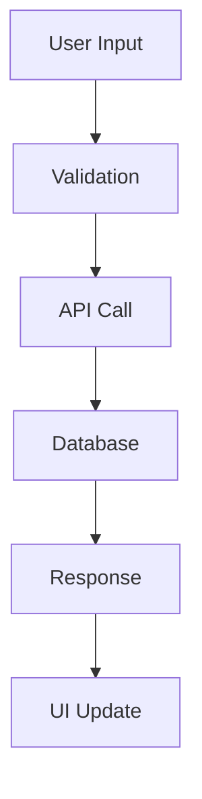
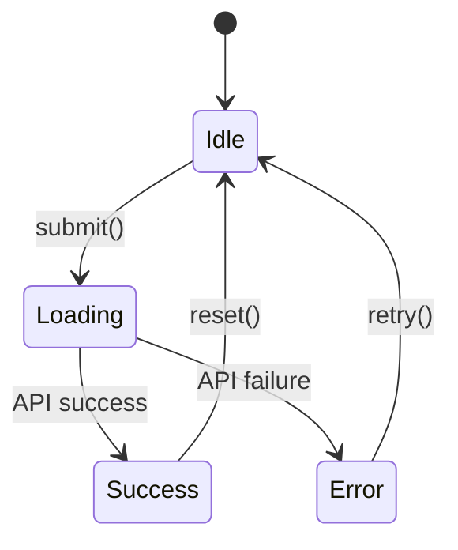

# 📋 Documentation Templates & Standards

Professional documentation templates for the Idling.app project, ensuring consistency, completeness, and high quality across all documentation types.

## 🎯 Documentation Philosophy

Our documentation follows these core principles:

- **📚 Comprehensive** - Cover all aspects: purpose, usage, examples, API, testing
- **🎨 Visual** - Include diagrams, examples, and visual representations
- **🔍 Searchable** - Well-structured with proper tags and categorization
- **♿ Accessible** - Clear language, proper headings, and inclusive examples
- **🔄 Maintainable** - Easy to update and keep current with code changes

## 📂 Template Categories

### 🔌 API Documentation Templates

For documenting REST API endpoints, GraphQL schemas, and service interfaces.

**Use For:**

- REST API endpoints (`/api/users`, `/api/posts`)
- GraphQL mutations and queries
- Service layer interfaces
- Database procedures

**Template:** [`api-endpoint-template.md`](./api-endpoint-template.md)

### 🧩 Component Documentation Templates

For React components, hooks, and UI elements.

**Use For:**

- React components (`Button`, `Modal`, `RichInput`)
- Custom hooks (`useAuth`, `useSubmissions`)
- UI utilities and design system elements
- Form components and validation

**Template:** [`component-template.md`](./component-template.md)

### 🚀 Feature Documentation Templates

For user-facing features and functionality.

**Use For:**

- User features (authentication, posting, profiles)
- Admin features (user management, analytics)
- System features (caching, notifications)
- Integration features (OAuth, webhooks)

**Template:** [`feature-template.md`](./feature-template.md)

### 🏗️ Architecture Documentation Templates

For system design, patterns, and technical decisions.

**Use For:**

- System architecture overviews
- Database schema documentation
- Design pattern implementations
- Technical decision records (ADRs)

**Template:** [`architecture-template.md`](./architecture-template.md)

### 🔧 Utility Documentation Templates

For helper functions, utilities, and libraries.

**Use For:**

- Utility functions (`formatDate`, `validateEmail`)
- Helper classes (`Logger`, `ApiClient`)
- Configuration utilities
- Development tools

**Template:** [`utility-template.md`](./utility-template.md)

## 📝 Documentation Standards

### Required Sections

Every documentation file must include:

1. **Frontmatter** - YAML metadata for navigation and SEO
2. **Overview** - Clear purpose and context
3. **Usage Examples** - Real-world implementation examples
4. **API Reference** - Complete interface documentation
5. **Testing** - Test examples and patterns
6. **Related Resources** - Links to connected documentation

### Frontmatter Standards

```yaml
---
title: 'Component/Feature Name'
description: 'Brief description (under 160 characters for SEO)'
permalink: /path/to/documentation/
parent: 'Parent Category'
categories: [category1, category2]
tags: [tag1, tag2, tag3]
date: 2025-01-28
toc: true
---
```

### Code Example Standards

```typescript
// ✅ GOOD: Complete, executable examples
import { Button } from '@/components/ui/Button';
import { useState } from 'react';

function ExampleComponent() {
  const [loading, setLoading] = useState(false);

  const handleClick = async () => {
    setLoading(true);
    try {
      await saveData();
    } finally {
      setLoading(false);
    }
  };

  return (
    <Button
      variant="primary"
      loading={loading}
      onClick={handleClick}
    >
      Save Changes
    </Button>
  );
}

// ❌ BAD: Incomplete, non-executable examples
<Button>Click me</Button>
```

### TypeScript Interface Standards

```typescript
// ✅ GOOD: Complete interface with JSDoc
interface ButtonProps {
  /** Button visual style variant */
  variant?: 'primary' | 'secondary' | 'outline' | 'ghost' | 'destructive';
  /** Button size */
  size?: 'sm' | 'md' | 'lg' | 'xl';
  /** Whether button is disabled */
  disabled?: boolean;
  /** Loading state with spinner */
  loading?: boolean;
  /** Click handler */
  onClick?: (event: React.MouseEvent<HTMLButtonElement>) => void;
  /** Button content */
  children: React.ReactNode;
  /** Additional CSS classes */
  className?: string;
}

// ❌ BAD: Incomplete interface without documentation
interface ButtonProps {
  variant?: string;
  onClick?: Function;
  children: any;
}
```

## 🎨 Visual Documentation Standards

### Mermaid Diagrams

Use Mermaid for architectural diagrams:



### Code Flow Examples

```
User Action → Component → Hook → API → Database
     ↓           ↓        ↓      ↓        ↓
  onClick  → handleClick → useSubmissions → POST /api/posts → INSERT
```

### Component State Diagrams



## 🔍 Quality Checklist

Before publishing documentation, verify:

### Content Quality

- [ ] Purpose and context clearly explained
- [ ] All code examples are tested and working
- [ ] TypeScript interfaces are complete
- [ ] Error handling is documented
- [ ] Performance considerations mentioned
- [ ] Accessibility features explained

### Structure Quality

- [ ] Proper heading hierarchy (H1 → H2 → H3)
- [ ] Table of contents for long documents
- [ ] Code blocks have proper syntax highlighting
- [ ] Links are working and properly formatted
- [ ] Images have alt text and captions

### SEO & Navigation

- [ ] Frontmatter includes all required fields
- [ ] Title is descriptive and under 60 characters
- [ ] Description is under 160 characters
- [ ] Categories and tags are relevant
- [ ] Permalink follows URL structure

## 🤝 Contributing to Documentation

### Creating New Documentation

1. **Choose Template** - Select appropriate template from this directory
2. **Copy Template** - Copy to your documentation location
3. **Replace Placeholders** - Update all `[PLACEHOLDER]` content
4. **Add Examples** - Include real, tested code examples
5. **Review Quality** - Use quality checklist above
6. **Submit PR** - Include documentation in code changes

### Updating Existing Documentation

1. **Review Current** - Check existing documentation quality
2. **Identify Gaps** - Note missing sections or outdated content
3. **Update Content** - Add missing information and examples
4. **Test Examples** - Ensure all code examples work
5. **Check Links** - Verify all internal and external links

## 📚 Resources

### Documentation Tools

- **Mermaid** - For architectural diagrams
- **TypeDoc** - For TypeScript API documentation
- **Storybook** - For component documentation
- **Jest** - For test examples

### Best Practices

- **Co-location** - Keep documentation with code
- **Atomic Updates** - Update docs with code changes
- **User-Focused** - Write for the person using the code
- **Example-Driven** - Show, don't just tell

### Related Links

- [Writing Style Guide](/community/writing-style-guide/)
- [Code Standards](/development/code-standards/)
- [Contributing Guidelines](/community/contributing/)

---

## 🏆 Documentation Quality Examples

### Excellent Documentation Examples

- [`src/app/api/emojis/index.md`](../../app/api/emojis/index.md) - User-friendly API docs
- [`src/templates/api-template.md`](../api-template.md) - Complete API template

### Documentation to Improve

- Component documentation - Needs examples and API reference
- Feature documentation - Needs implementation details

---

_This documentation template system ensures consistent, high-quality documentation across the entire Idling.app project. Use these templates as your starting point for all new documentation._
