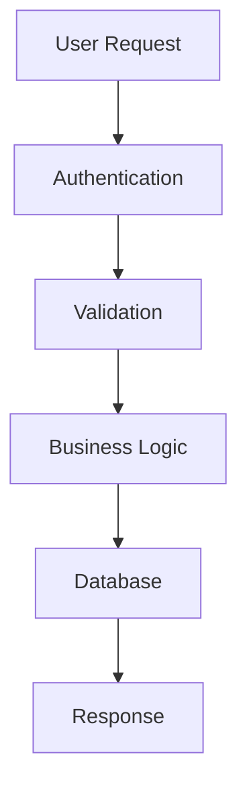

# 📋 Documentation Templates

Standardized templates for creating consistent, high-quality documentation that anyone can understand, regardless of their technical background.

## 🎯 Template Purpose

Our templates ensure:

- **📐 Consistency**: Uniform structure across all documentation
- **🎯 Completeness**: All necessary sections are included
- **🌟 Quality**: Professional and comprehensive documentation
- **⚡ Efficiency**: Faster documentation creation process
- **🤝 Accessibility**: Welcoming to all skill levels

## 📚 Template Categories

### 🔧 **Code & Component Documentation**

Templates for documenting technical implementations:

#### [📦 Component Documentation Template](component-template/)

_For React components, hooks, and UI elements_

- Component overview with analogies
- Props interface with clear explanations
- Usage examples anyone can follow
- Styling guidelines and accessibility notes
- Testing examples and troubleshooting

#### [🧩 Utility Documentation Template](documentation-templates/utility-template/)

_For helper functions, libraries, and utilities_

- Function purpose with everyday examples
- Parameter explanations in plain language
- Usage patterns and common scenarios
- Integration guides and troubleshooting

#### [⚡ Accessible Tech Documentation Template](accessible-tech-doc-template/)

_For comprehensive technical documentation anyone can understand_

- Visual explanations with mermaid diagrams
- Multiple audience perspectives (users, developers, business)
- Step-by-step guides with analogies
- Troubleshooting with empathy

### 🌐 **API & Integration Documentation**

Templates for documenting interfaces and integrations:

#### [🔗 API Endpoint Template](api-template/)

_For REST endpoints, GraphQL, and external APIs_

- Endpoint description with real-world context
- Request/response schemas with examples
- Authentication and security explanations
- Error handling and rate limiting
- Integration examples and SDKs

### 🚀 **Feature & Project Documentation**

Templates for documenting features and projects:

#### [✨ Feature Documentation Template](feature-template/)

_For new features, enhancements, and capabilities_

- Feature overview with user benefits
- User stories and use cases
- Technical specifications
- Testing strategy and deployment notes
- Success metrics and monitoring

#### [🔄 Pull Request Template](pull_request_template/)

_For standardized pull request descriptions_

- Clear change summary
- Type classification and impact
- Testing approach and coverage
- Visual documentation for UI changes
- Breaking change notifications

## 🎨 **Specialized Templates**

### 📖 **Documentation Standards**

- **Writing Guidelines**: Accessible, inclusive documentation standards
- **Visual Standards**: Mermaid diagrams, screenshots, and formatting
- **Review Process**: Quality assurance and accuracy verification

### 🎯 **Quick Reference**

| Template Type       | Use When...                  | Key Features                        |
| ------------------- | ---------------------------- | ----------------------------------- |
| **Component**       | Documenting React components | Props, examples, accessibility      |
| **Utility**         | Documenting helper functions | Parameters, usage patterns          |
| **API**             | Documenting endpoints        | Schemas, auth, error handling       |
| **Feature**         | Documenting new features     | User stories, technical specs       |
| **Accessible Tech** | Complex technical systems    | Visual diagrams, multiple audiences |

## 🔧 How to Use Templates

### 1. **Choose Your Template**

Select based on what you're documenting:

```bash
# For a new React component
cp src/templates/component-template.md docs/components/your-component.md

# For a complex technical system
cp src/templates/accessible-tech-doc-template.mdx docs/systems/your-system.mdx

# For an API endpoint
cp src/templates/api-template.md docs/api/your-endpoint.md
```

### 2. **Customize Content**

Replace placeholder content with your specific information:

- ✅ Update title and description
- ✅ Fill in all required sections
- ✅ Add relevant examples and code snippets
- ✅ Include necessary diagrams or screenshots
- ✅ Write with your audience in mind

### 3. **Review & Publish**

Before publishing, ensure:

- [ ] All sections are completed
- [ ] Code examples are tested and working
- [ ] Links are valid and functional
- [ ] Grammar and spelling are correct
- [ ] Formatting follows our style guide
- [ ] Non-technical readers can understand key concepts

## 📝 Writing Standards

### 🎭 **Tone & Voice**

- **Professional yet approachable**: Clear and authoritative, but welcoming
- **Helpful and encouraging**: Supportive to all skill levels
- **Concise but complete**: Direct without sacrificing clarity
- **Inclusive and accessible**: Understandable regardless of technical background

### 🔍 **Content Requirements**

#### Visual Elements

- Use mermaid diagrams liberally for complex concepts
- Include screenshots for UI-related documentation
- Add flowcharts for process explanations
- Use tables for structured comparisons

#### Code Examples

- Always include working, tested examples
- Provide context and explanations
- Include error handling where appropriate
- Show both basic and advanced usage

#### Cross-References

- Link to related documentation
- Reference source code when helpful
- Connect to troubleshooting guides
- Point to additional resources

## 🎨 Visual Documentation Standards

### Mermaid Diagrams

Always use standard markdown mermaid blocks:



### Code Syntax Highlighting

Use appropriate language tags for all code blocks:

```bash
# Terminal commands
npm install package-name
```

```typescript
// TypeScript examples
interface UserProps {
  id: string;
  name: string;
}
```

```sql
-- SQL examples
SELECT * FROM users WHERE active = true;
```

## 🆘 Getting Help

- **Questions about templates**: Check our documentation guidelines
- **Technical writing help**: Review our style guide
- **Template requests**: Open an issue with your needs
- **Feedback on organization**: We're always improving our structure

---

_Remember: Great documentation makes complex things simple, not simple things complex._ 🧙‍♂️✨
